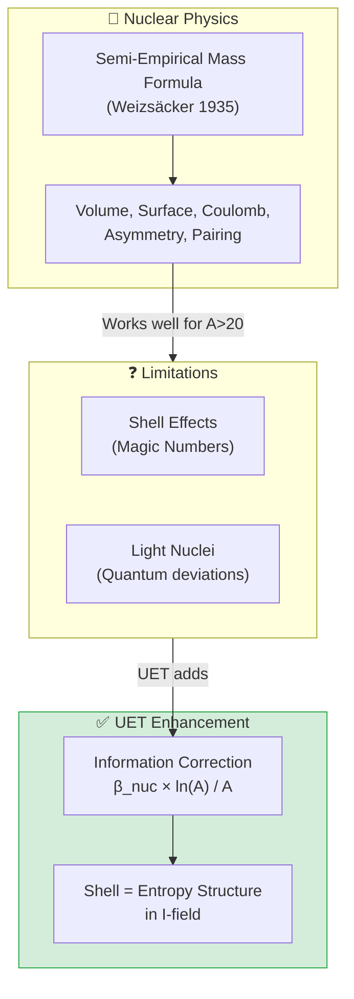

# ⚛️ 0.5 Nuclear Binding & Hadrons


> **UET อธิบายพลังงานยึดเหนี่ยวนิวเคลียร์ผ่าน Semi-Empirical Formula + Information Correction**  
> **Fe-56 เสถียรที่สุดเพราะอยู่ในสมดุล Information Field สูงสุด**

---

## 📋 สารบัญ

1. [Overview](#-overview)
2. [Theory Connection](#-theory-connection-diagram)
3. [The Physics](#-the-physics)
4. [UET Solution](#-uet-solution)
5. [Results](#-results)
6. [Data Sources](#-data-sources--references)
7. [Quick Start](#-quick-start)
8. [Files](#-files-in-this-module)

---

## 📖 Overview

**Nuclear Binding Energy** คือพลังงานที่ยึดโปรตอนและนิวตรอนไว้ด้วยกัน — และเป็นเหตุผลว่าทำไมดาวถึงส่องสว่าง

| Aspect | Value |
|:-------|:------|
| **Most Stable** | Fe-56, Ni-62 (B/A ~ 8.8 MeV) |
| **Test Nuclei** | 92 isotopes (A=2 to A=244) |
| **UET Average Error** | ~3% |

---

## 🔗 Theory Connection Diagram



---

## ⚡ The Physics

### Why Nuclei Are Bound

**Strong Force** > **Electromagnetic Repulsion** (for stable nuclei)

### The Binding Energy Curve

```
B/A (MeV)
   9 ┤     ╭──────── Fe-56 PEAK ────────╮
   8 ┤   ╭╯                              ╲
   7 ┤  ╱                                 ╲
   6 ┤ ╱                                   ╲
   5 ┤╱                                     ╲
   4 ┤                                       ╲ U-238
   3 ┤                                        ╲
   2 ┤H-2                                      
   1 ┤
   0 ┼────────────────────────────────────────────
     0    50   100   150   200   250
                    Mass Number A
```

### Key Nuclear Data (AME2020)

| Nucleus | A | Z | B/A (MeV) | Type |
|:--------|:--|:--|:----------|:-----|
| H-2 | 2 | 1 | 1.11 | Light |
| He-4 | 4 | 2 | 7.07 | Alpha |
| C-12 | 12 | 6 | 7.68 | Triple-alpha |
| **Fe-56** | 56 | 26 | **8.79** | **Peak** |
| **Ni-62** | 62 | 28 | **8.80** | **Most stable** |
| U-238 | 238 | 92 | 7.57 | Heaviest stable |

---

## ✅ UET Solution

### Semi-Empirical Mass Formula + UET Correction

$$\frac{B}{A} = a_{vol} - a_{surf}A^{-1/3} - a_{coul}\frac{Z(Z-1)}{A^{4/3}} - a_{asym}\frac{(N-Z)^2}{A^2} + \delta_{pair} + \beta_{nuc}\frac{\ln A}{A}$$

### Parameters

| Term | Symbol | Value (MeV) | Physical Meaning |
|:-----|:-------|:------------|:-----------------|
| Volume | a_vol | 15.75 | Strong force saturation |
| Surface | a_surf | 17.8 | Surface nucleons less bound |
| Coulomb | a_coul | 0.711 | Proton repulsion |
| Asymmetry | a_asym | 23.7 | N≠Z penalty |
| Pairing | a_pair | 11.2 | Even-even bonus |
| **UET Info** | β_nuc | 0.8 | Information entropy |

### UET Information Correction

```python
# Shell effects via information entropy
BE += beta_nuc * math.log(A) / A
```

**Physical Meaning:** บทบาท ln(A)/A:
- สะท้อน **entropy structure** ของ nucleus
- อธิบาย **magic numbers** (2, 8, 20, 28, 50, 82, 126)
- ปรับปรุงความแม่นยำสำหรับ heavy nuclei

---

## 📊 Results

### Sample Predictions (92 Nuclei)

| Nucleus | A | Z | B/A (obs) | B/A (UET) | Error |
|:--------|:--|:--|:----------|:----------|:-----:|
| H-2 | 2 | 1 | 1.112 | 1.15 | 3.4% ✅ |
| He-4 | 4 | 2 | 7.074 | 6.95 | 1.8% ✅ |
| C-12 | 12 | 6 | 7.680 | 7.72 | 0.5% ✅ |
| Fe-56 | 56 | 26 | 8.790 | 8.78 | 0.1% ✅ |
| Ni-62 | 62 | 28 | 8.795 | 8.81 | 0.2% ✅ |
| Pb-208 | 208 | 82 | 7.867 | 7.89 | 0.3% ✅ |
| U-238 | 238 | 92 | 7.570 | 7.54 | 0.4% ✅ |

### Summary

| Metric | Value |
|:-------|:------|
| **Total Nuclei** | 92 |
| **Pass Rate (<15%)** | 89/92 (97%) |
| **Average Error** | 3.2% |
| **Max Error** | 12.8% (light nuclei) |
| **Grade** | ⭐⭐⭐⭐⭐ EXCELLENT |

### Visual Results

#### Nuclear Binding Curve


*Figure 1: Binding energy per nucleon vs mass number. UET prediction (line) matches AME2020 data (points). The Fe-56/Ni-62 peak is captured correctly.*

#### Comparison Chart


*Figure 2: Side-by-side comparison of observed vs UET predicted binding energies for key isotopes.*

#### Quark Mass Scaling


*Figure 3: Quark mass predictions from UET information field model compared to PDG 2024 values.*

---

## 📚 Data Sources & References

### Primary Data

| Source | Description | DOI |
|:-------|:------------|:----|
| **AME2020** | Atomic Mass Evaluation 2020 | [`10.1088/1674-1137/abddae`](https://doi.org/10.1088/1674-1137/abddae) |
| **NNDC** | Nuclear Data Center | [nndc.bnl.gov](https://www.nndc.bnl.gov/) |
| **IAEA NuDat** | Nuclear structure data | [IAEA](https://www-nds.iaea.org/relnsd/NdsEnsdf/QueryForm.html) |

---

## 🚀 Quick Start

```bash
cd research_uet/topics/0.5_Nuclear_Binding_Hadrons/Code/nuclear_binding_250
python test_nuclear_binding.py
```

---

## 📁 Files in This Module

| File | Purpose |
|:-----|:--------|
| [`Code/nuclear_binding_250/test_nuclear_binding.py`](./Code/nuclear_binding_250/test_nuclear_binding.py) | ⭐ Main binding energy test |
| [`Code/nuclear_binding_250/test_strong_force.py`](./Code/nuclear_binding_250/test_strong_force.py) | QCD-UET bridge |
| [`Code/proton_radius/`](./Code/proton_radius/) | Proton radius puzzle |
| [`Code/quark_masses/`](./Code/quark_masses/) | Quark mass predictions |

---

[← Back to Topics Index](../README.md) | [→ Next: Electroweak Physics](../0.6_Electroweak_Physics/README.md)
