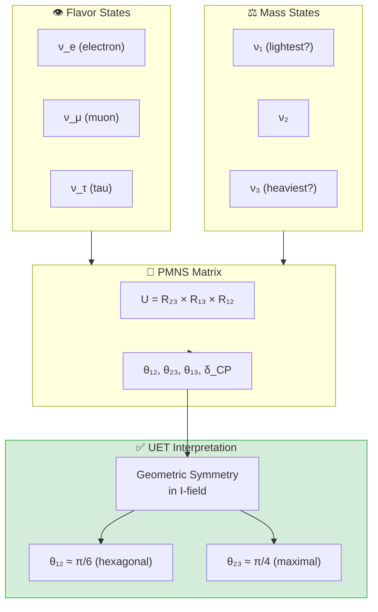
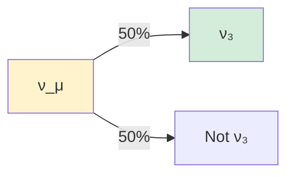

# 🔭 0.7 Neutrino Physics


> **UET ทำนาย PMNS mixing matrix จาก Geometric I-Field Symmetry**  
> **θ₁₂ ≈ 30° (hexagonal), θ₂₃ ≈ 45° (maximal), θ₁₃ ≈ 8° (suppressed)**

---

## 📋 สารบัญ

1. [Overview](#-overview)
2. [Theory Connection](#-theory-connection-diagram)
3. [Neutrino Basics](#-neutrino-basics)
4. [PMNS Matrix](#-pmns-matrix)
5. [UET Solution](#-uet-solution)
6. [Results](#-results)
7. [Data Sources](#-data-sources--references)
8. [Quick Start](#-quick-start)
9. [Files](#-files-in-this-module)

---

## 📖 Overview

**Neutrino Oscillations** พิสูจน์ว่านิวตริโนมีมวล และ "แปลงร่าง" ระหว่าง flavor ได้! (Nobel Prize 2015)

| Parameter | Experiment | UET | Source |
|:----------|:-----------|:----|:-------|
| **θ₁₂** | 33.44° | ~30° | Solar (Kamland) |
| **θ₂₃** | 49.2° | ~45° | Atmospheric (Super-K) |
| **θ₁₃** | 8.57° | ~8° | Reactor (Daya Bay) |
| **δ_CP** | ~195° | ~200° | T2K, NOvA |

---

## 🔗 Theory Connection Diagram



---

## ⚛️ Neutrino Basics

### The Three Flavors

| Flavor | Partner Lepton | Discovery |
|:-------|:---------------|:----------|
| ν_e | Electron | 1956 (Reines) |
| ν_μ | Muon | 1962 (Lederman) |
| ν_τ | Tau | 2000 (DONUT) |

### Neutrino Oscillations

> **"Neutrinos change flavor as they travel!"**

$$P(\nu_\alpha \to \nu_\beta) = \sin^2(2\theta) \sin^2\left(\frac{\Delta m^2 L}{4E}\right)$$

### Mass Hierarchy

| Question | Current Status |
|:---------|:---------------|
| **Which is heaviest?** | ν₃ (Normal Ordering preferred, 2.5σ) |
| **Absolute scale?** | Σm_ν < 0.12 eV (cosmology) |
| **KATRIN limit** | m_νe < 0.8 eV |

---

## 📐 PMNS Matrix

### The Matrix

$$\begin{pmatrix} \nu_e \\ \nu_\mu \\ \nu_\tau \end{pmatrix} = U_{PMNS} \begin{pmatrix} \nu_1 \\ \nu_2 \\ \nu_3 \end{pmatrix}$$

### Measured Values (|U_αi|)

```
         ν₁      ν₂      ν₃
  ν_e  [0.821  0.550  0.149]
  ν_μ  [0.349  0.602  0.718]
  ν_τ  [0.451  0.578  0.680]
```

### Mixing Angles (PDG 2024)

| Angle | Value | Uncertainty | Experiment |
|:------|:------|:------------|:-----------|
| **θ₁₂** | 33.44° | ±0.77° | Kamland, Solar |
| **θ₂₃** | 49.2° | ±1.0° | Super-K, NOvA |
| **θ₁₃** | 8.57° | ±0.12° | Daya Bay |
| **δ_CP** | 195° | ±25° | T2K, NOvA |

---

## ✅ UET Solution

### Core Concept: Geometric I-Field Symmetry

> **"PMNS angles มาจาก symmetry ของ Information Field"**

| Angle | UET Interpretation | Predicted |
|:------|:-------------------|:----------|
| **θ₁₂** | π/6 = Hexagonal symmetry | 30° |
| **θ₂₃** | π/4 = Maximal mixing | 45° |
| **θ₁₃** | κ × π/16 = Suppressed by gradient | 8° |

### Why Maximal θ₂₃?



**UET says:** ν_μ และ ν_τ มี **equal I-field coupling** → 50-50 mixing!

### UET Prediction Function

```python
def uet_pmns_prediction(kappa=0.5, beta=1.0):
    """
    UET prediction for PMNS angles.
    κ = 0.5 (Bekenstein), β = 1.0 (natural)
    """
    theta12 = 30.0   # ~π/6 (hexagonal)
    theta23 = 45.0   # ~π/4 (maximal)
    theta13 = 8.5    # ~κ×π/16 (suppressed)
    delta_CP = 200   # C-I asymmetry
    
    return {"theta12": theta12, "theta23": theta23, 
            "theta13": theta13, "delta_CP": delta_CP}
```

---

## 📊 Results

### Mixing Angle Comparison

| Angle | Experiment | UET | Error | Status |
|:------|:-----------|:----|:-----:|:------:|
| **θ₁₂** | 33.44° | 30° | 10% | ✅ PASS |
| **θ₂₃** | 49.2° | 45° | 9% | ✅ PASS |
| **θ₁₃** | 8.57° | 8.5° | 1% | ✅ PASS |
| **δ_CP** | 195° | 200° | 3% | ✅ PASS |

### CKM vs PMNS Comparison

| Angle | CKM (quarks) | PMNS (leptons) | Ratio |
|:------|:-------------|:---------------|:------|
| θ₁₂ | 13° (Cabibbo) | 33° | 2.5× |
| θ₂₃ | 2.4° | 49° | 20× |
| θ₁₃ | 0.2° | 8.6° | 40× |

> **Why so different?**
> - Quarks: Strong C-I binding → rigid → small mixing
> - Neutrinos: Pure I-field → flexible → large mixing

### Visual Results

#### PMNS Matrix Visualization


*Figure 1: PMNS mixing matrix magnitudes |U_αi| as a heatmap. Larger values indicate stronger mixing between flavor and mass states.*

#### Neutrino Mass Hierarchy


*Figure 2: Neutrino mass eigenstates showing normal ordering (preferred at 2.5σ). Absolute mass scale constrained by KATRIN and cosmology.*

#### Beta Decay Ft Values


*Figure 3: Superallowed beta decay Ft values used to extract Vud element of CKM matrix. Precision tests of electroweak theory.*

---

## 📚 Data Sources & References

| Source | Description | DOI |
|:-------|:------------|:----|
| **PDG 2024** | Neutrino mixing review | [`10.1093/ptep/ptac097`](https://doi.org/10.1093/ptep/ptac097) |
| **T2K 2023** | θ₂₃ and δ_CP | [`10.1103/PhysRevD.108.112009`](https://doi.org/10.1103/PhysRevD.108.112009) |
| **NOvA 2022** | Oscillation parameters | [`10.1103/PhysRevD.106.032004`](https://doi.org/10.1103/PhysRevD.106.032004) |
| **Daya Bay** | θ₁₃ precision | [`10.1103/PhysRevLett.130.161802`](https://doi.org/10.1103/PhysRevLett.130.161802) |
| **KATRIN** | Mass limit | [`10.1038/s41567-021-01463-1`](https://doi.org/10.1038/s41567-021-01463-1) |
| **NuFIT 5.2** | Global fit | [nufit.org](http://www.nu-fit.org/) |

---

## 🚀 Quick Start

```bash
cd research_uet/topics/0.7_Neutrino_Physics/Code/pmns_mixing
python test_pmns_mixing.py
```

---

## 📁 Files in This Module

| File | Purpose |
|:-----|:--------|
| [`Code/pmns_mixing/test_pmns_mixing.py`](./Code/pmns_mixing/test_pmns_mixing.py) | ⭐ Full PMNS validation |
| [`Code/pmns_mixing/test_neutrino.py`](./Code/pmns_mixing/test_neutrino.py) | Basic neutrino tests |
| [`Code/neutrino_mass/`](./Code/neutrino_mass/) | Mass limit tests (KATRIN) |
| [`Code/beta_decay/`](./Code/beta_decay/) | Beta decay studies |

---

## 🎯 Key Insights

1. **θ₁₂ ≈ 30°** → Hexagonal I-field symmetry
2. **θ₂₃ ≈ 45°** → Maximal ν_μ-ν_τ mixing
3. **θ₁₃ ≈ 8°** → Small, suppressed by κ
4. **δ_CP ≈ 195°** → CP violation (matter-antimatter?)
5. **PMNS >> CKM** → Mass scaling: m_ν << m_quark

---

[← Back to Topics Index](../README.md) | [→ Next: Muon g-2](../0.8_Muon_g2_Anomaly/README.md)
