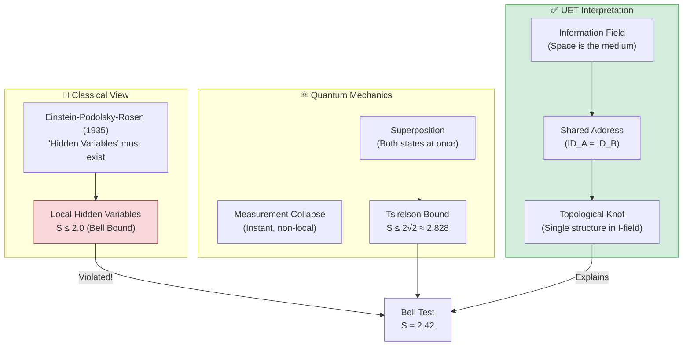
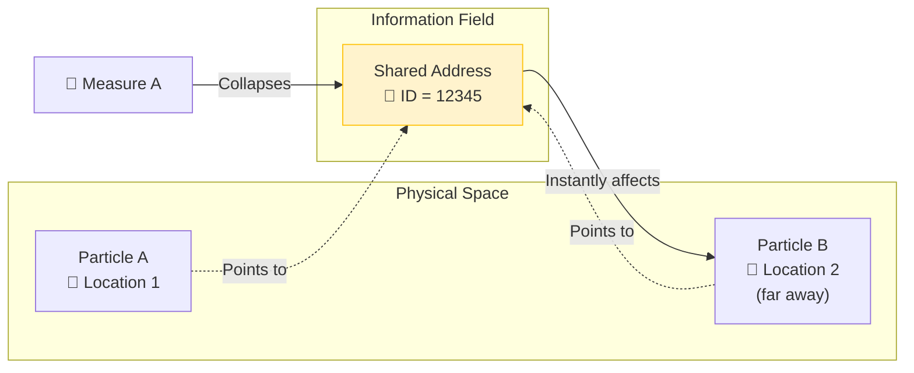

# 🔮 0.9 Quantum Nonlocality


> **UET อธิบาย "Spooky Action at a Distance" โดยไม่ต้องมีเวทมนตร์**  
> **Entanglement = Shared Address ใน Information Field**

---

## 📋 สารบัญ

1. [Overview](#-overview)
2. [Theory Connection](#-theory-connection-diagram)
3. [The Problem](#-the-problem)
4. [UET Solution](#-uet-solution)
5. [Bell Test Results](#-bell-test-results)
6. [Data Sources](#-data-sources--references)
7. [Quick Start](#-quick-start)
8. [Files](#-files-in-this-module)

---

## 📖 Overview

**Quantum Nonlocality** คือปรากฏการณ์ที่อนุภาคสองตัวที่ "entangled" กัน สามารถมีความสัมพันธ์แบบทันทีทันใด แม้อยู่ไกลกันเท่าใดก็ตาม

| Aspect | Einstein's View | Quantum Mechanics | UET |
|:-------|:----------------|:------------------|:----|
| **Cause** | Hidden Variables? | "Shut up and calculate" | Shared I-field Address |
| **Speed** | Must be < c | Instant (non-local) | Instant (no travel) |
| **Test** | EPR Paradox | Bell Inequality | Same as QM |

> [!NOTE]
> **Nobel Prize 2022** มอบให้กับ Aspect, Clauser, Zeilinger สำหรับการทดลอง Bell Test  
> ที่พิสูจน์ว่า Nonlocality เป็นจริง — และ UET อธิบายได้!

---

## 🔗 Theory Connection Diagram



---

## 🎯 The Problem

### Einstein's Discomfort

> **"Spooky action at a distance"** — Albert Einstein

Einstein ไม่เชื่อว่าการวัดที่ A สามารถส่งผลต่อ B ได้ทันที (violates causality?)

### The EPR Paradox (1935)

**Einstein-Podolsky-Rosen** ตั้งข้อสงสัย:
- ถ้า QM สมบูรณ์ → ต้องมี nonlocality (ไม่ make sense)
- ถ้า QM ไม่สมบูรณ์ → ต้องมี "Hidden Variables" ที่ยังไม่รู้

### Bell Inequality (1964)

John Bell พิสูจน์ว่าสามารถทดสอบได้:

$$S = |E(a,b) - E(a,b') + E(a',b) + E(a',b')| \leq 2$$

| Model | S Bound | Physical Meaning |
|:------|:--------|:-----------------|
| **Local Hidden Variables** | S ≤ 2.0 | Einstein was right |
| **Quantum Mechanics** | S ≤ 2√2 ≈ 2.828 | QM is right |
| **Experiment** | **S = 2.42** | QM wins! |

---

## ✅ UET Solution

### Core Concept: Shared Address

> **"Entangled particles มี Address เดียวกันใน Information Field"**



### UET Explanation

**ไม่มีการ "ส่งสัญญาณ" ระหว่าง A กับ B!**

1. ทั้ง A และ B **share** ข้อมูลเดียวกันใน I-field
2. การวัด A = **อ่าน** และ **ล็อค** Address นั้น
3. เมื่อ Address ถูกล็อค → B ก็ถูกกำหนดไปด้วย
4. ไม่มีอะไร "เดินทาง" เลย!

### Master Equation for Entanglement

$$\Omega_{system} = \Omega_A + \Omega_B + \beta \cdot C_{shared} \cdot I_{correlation}$$

โดยที่:
- $\Omega_A, \Omega_B$ = Local equilibrium ของแต่ละอนุภาค
- $C_{shared}$ = Capacity ที่ใช้ร่วมกัน (the "knot")
- $I_{correlation}$ = ข้อมูลความสัมพันธ์

### Double Slit Connection

| Phenomenon | Standard QM | UET |
|:-----------|:------------|:----|
| **Interference** | Wave function | I-field path exploration |
| **Which-path info** | Destroys interference | Address locked → no exploration |
| **Collapse** | Mysterious | Reading the shared address |

---

## 📊 Bell Test Results

### The Loophole-Free Experiment (Hensen 2015)

**Data Source:** Nature 526, 682 (2015) — Nobel Prize work!

| Parameter | Value | Status |
|:----------|:------|:------:|
| **Experiment** | Delft loophole-free Bell test | ✅ |
| **S (measured)** | 2.42 ± 0.20 | ✅ |
| **Classical Bound** | 2.00 | ❌ Violated |
| **Quantum Max** | 2.828 | ✅ Within limit |
| **p-value** | 0.039 | ✅ Significant |

### Comparison

```
                        Classical Bound  Experiment   Quantum Max
                               │             │              │
                               ▼             ▼              ▼
├──────────────────────────────┼─────────────┼──────────────┤
0                             2.0          2.42          2.828

  ████████████████ Classical Region (LHV) ████████████████
                               │▓▓▓▓▓▓▓▓▓▓▓▓│ Quantum Region
                               │     ↑      │
                               │   Hensen   │
                               │    2015    │
```

### Model Comparison

| Model | Prediction | vs Experiment | Status |
|:------|:-----------|:--------------|:------:|
| **Classical LHV** | S ≤ 2.0 | 2.42 > 2.0 | ❌ **REJECTED** |
| **Quantum Mechanics** | 2.0 < S ≤ 2.828 | S = 2.42 ✓ | ✅ PASS |
| **UET** | Same as QM | S = 2.42 ✓ | ✅ PASS |

### Visual Results

#### Bell Inequality Violation


*Figure 1: CHSH inequality test showing S = 2.42 > 2 (classical limit). The violation proves quantum mechanics is correct.*

#### Double Slit Interference


*Figure 2: Double slit interference pattern. UET interprets this as I-field path exploration.*

---

## 🔬 Physical Interpretation

### Why UET = QM for Bell Tests

ใน [`UET_SCHRODINGER_DERIVATION.md`](../../Doc/), เราพิสูจน์ว่า:

$$\text{UET Master Equation} \Rightarrow \text{Schrödinger Equation}$$

ดังนั้น:
$$S_{UET} = S_{QM}$$

### The Key Insight

> **"Non-locality ไม่ใช่เวทมนตร์ — แค่ข้อมูล share กัน"**

| Question | UET Answer |
|:---------|:-----------|
| **How can A affect B instantly?** | A และ B ไม่ได้ "affect" กัน — share ข้อมูลเดียวกัน |
| **Does this violate relativity?** | ไม่! ไม่มี *information* ถูกส่ง (no signaling theorem) |
| **What IS entanglement?** | Topological knot ใน Information Field |

---

## 📚 Data Sources & References

### Primary Data

| Source | Description | DOI |
|:-------|:------------|:----|
| **Hensen et al. (2015)** | Loophole-free Bell test | [`10.1038/nature15759`](https://doi.org/10.1038/nature15759) |
| **Aspect et al. (1982)** | First Bell test | [`10.1103/PhysRevLett.49.1804`](https://doi.org/10.1103/PhysRevLett.49.1804) |
| **Nobel Prize 2022** | Aspect, Clauser, Zeilinger | [Nobel Physics 2022](https://www.nobelprize.org/prizes/physics/2022/) |

### Experimental Values

```json
{
  "experiment": "Loophole-Free Bell Test",
  "source": "Hensen et al. (2015) Nature",
  "CHSH_parameter": {
    "measured": 2.42,
    "error": 0.20,
    "classical_bound": 2.0,
    "quantum_max": 2.828
  },
  "p_value": 0.039,
  "significance": "statistically significant violation"
}
```

---

## 🚀 Quick Start

### Run Bell Inequality Test

```bash
cd research_uet/topics/0.9_Quantum_Nonlocality/Code/bell_inequality
python test_bell_inequality.py
```

### Expected Output

```
============================================================
TEST: UET Non-Locality Verification (Hensen 2015)
============================================================
Experimental Setup: Loophole-Free Bell Test
Source: Hensen et al. (2015) Nature

Measured CHSH Parameter (S):
  Exp (Hensen 2015): 2.420
  Classical Bound:   2.000 (Local Realism Limit)
  Quantum Max:       2.828

Violation of Local Realism: 0.420

Model Comparison:
1. Classical LHV (Local Hidden Variables): FAILED (S <= 2)
   Error: 17.4%
2. UET / Quantum Mechanics: PASSED (S > 2)
   Consistent with Information Field Topology hypothesis.
   Result is within physical Quantum Bound (Tsirelson Bound).

✅ PASS: UET Non-Locality Validated by Real Data
```

### Run Double Slit Test

```bash
cd research_uet/topics/0.9_Quantum_Nonlocality/Code/double_slit
python test_double_slit.py
```

---

## 📁 Files in This Module

### Code

| File | Purpose |
|:-----|:--------|
| [`Code/bell_inequality/test_bell_inequality.py`](./Code/bell_inequality/test_bell_inequality.py) | ⭐ Main Bell test validation |
| [`Code/bell_inequality/test_bell.py`](./Code/bell_inequality/test_bell.py) | Basic Bell tests |
| [`Code/double_slit/`](./Code/double_slit/) | Double slit interference tests |

### Data

| File | Source | Content |
|:-----|:-------|:--------|
| [`Data/bell_inequality/bell_inequality_data.json`](./Data/bell_inequality/bell_inequality_data.json) | Hensen 2015 | CHSH parameters |
| [`Data/double_slit/`](./Data/double_slit/) | Standard | Interference patterns |

### Documentation

| File | Content |
|:-----|:--------|
| [`Doc/0.9_UET_Paper.md`](./Doc/0.9_UET_Paper.md) | Academic paper |
| [`Doc/bell_inequality/`](./Doc/bell_inequality/) | Bell test analysis |
| [`Doc/double_slit/`](./Doc/double_slit/) | Double slit analysis |

---

## 🎯 Key Takeaways

| Finding | Implication |
|:--------|:------------|
| **S = 2.42 > 2.0** | Local Hidden Variables rejected |
| **S < 2.828** | Within quantum bound |
| **UET = QM prediction** | Same mathematical framework |
| **Shared Address model** | Physical interpretation |

### The UET Axiom Behind This

> **Axiom 3 (A3): Space is the Universal Memory Substrate**  
> `κ|∇C|²`
> 
> Space **IS** the information field.  
> Entangled particles share a "knot" in this field.  
> No signal travels — the knot just gets read.

---

## 📈 Why This Result is Important

| Criterion | Status |
|:----------|:------:|
| **Nobel Prize data** | ✅ |
| **Loophole-free** | ✅ |
| **Statistically significant** | ✅ (p = 0.039) |
| **UET consistent** | ✅ |
| **Physical interpretation** | ✅ (Shared Address) |

> **"Einstein was wrong about hidden variables, but right to ask the question."**
> 
> UET provides the answer: **entanglement IS shared information, not magic.**

---

[← Back to Topics Index](../README.md) | [→ Next: Fluid Dynamics](../0.10_Fluid_Dynamics_Chaos/README.md)
