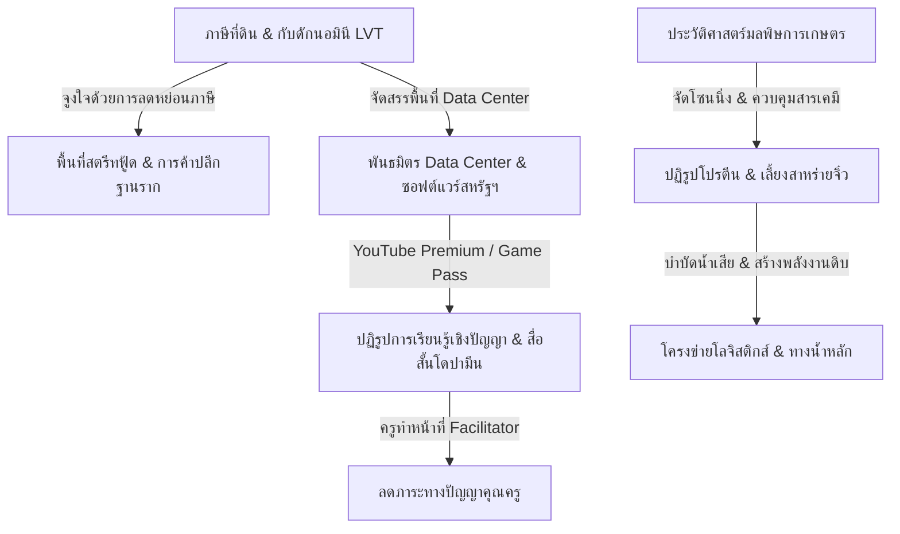

# นโยบายและยุทธศาสตร์เชิงระบบ (Policy & Strategy Incubator)

ยินดีต้อนรับสู่ส่วนจัดการแนวคิดเชิงนโยบายการปกครอง เศรษฐศาสตร์ และการบริหารทรัพยากรระดับประเทศ/โลก (`01_policy_and_strategy`) ตามแนวคิดทฤษฎี **Unity Equilibrium Theory (UET)** 

โฟลเดอร์นี้รวบรวมข้อเสนอเชิงนโยบายสาธารณะ (Policy Proposals) เพื่อรักษาเสถียรภาพและสมดุลเชิงระบบในโลกแห่งความเป็นจริง โดยครอบคลุมหัวข้อดังต่อไปนี้:

---

## 📋 สารบัญนโยบายและยุทธศาสตร์ (Policy Index)

### 1. นโยบายเศรษฐศาสตร์และการปฏิรูปโครงสร้างรากฐาน (Economics & Structural Reforms)
*   **[นโยบายปฏิรูปโครงสร้างภาษีที่ดินเพื่อสกัดการเก็งกำไรและการจัดสรรสิทธิประโยชน์พัฒนาพื้นที่สาธารณะ](land_reform_progressive_tax.md)** (`land_reform_progressive_tax.md`): เสนอระบบการจัดเก็บภาษีที่ดินแบบอัตราก้าวหน้าเทียบต่อประชากรเฉลี่ย และการแก้ปัญหาช่องโหว่ทางกฎหมายด้วยระบบ "กับดักนอมินี (Nominee Trap)" รวมถึงการจูงใจให้เจ้าของที่ดินนำที่ดินรกร้างมาพัฒนาเพื่อสาธารณะผ่านสิทธิ์ลดหย่อนภาษี
*   **[นโยบายจัดตั้งเขตสตรีทฟู้ดและพื้นที่ค้าปลีกย่อยเพื่อสวัสดิการทำกินฐานราก](infrastructure_streetfood_micro_economy.md)** (`infrastructure_streetfood_micro_economy.md`): แนวคิดเปลี่ยนมาตรการแจกเงินสดมาเป็นการลงทุนจัดสร้างพื้นที่ค้าขายสตรีทฟู้ดและค้าปลีกรายย่อยในจุดเขตห้ามจอดรถส่วนตัว/ใกล้โรงเรียน เพื่อสร้างความมั่นคงด้านอาชีพและกระตุ้นห่วงโซ่เศรษฐกิจหมุนเวียนฐานรากอย่างมีระเบียบ
*   **[นโยบายปฏิรูปการศึกษาเชิงปัญญา การประยุกต์ใช้สื่อการเรียนรู้สั้น และการจัดสมดุลวงจรโดปามีน](education_reform_cognitive_learning.md)** (`education_reform_cognitive_learning.md`): เสนอแนวทางปฏิรูปการเรียนรู้ของประเทศโดยอาศัยประโยชน์จากการเสพสื่อสั้นเชิงความรู้และลูปโดปามีนในการขับเคลื่อนนิสัยความใคร่รู้ต่อเนื่อง แทนการบังคับทำคลิปเอไอแบบทางเดียว และลดภาระเนื้อหาคุณครูไปสู่การเป็นผู้อำนวยความสะดวกการอภิปราย (Facilitator) ร่วมกับการแลกเปลี่ยน YouTube Premium ราคาพิเศษ
*   **[นโยบายวิวัฒนาการอุณหภาพ อุตสาหกรรมฟืน และการรักษาสมดุลภาระสิ่งแวดล้อมภาคเกษตรกรรม](origin_of_wealth_pyrotechnology.md)** (`origin_of_wealth_pyrotechnology.md`): การอภิปรายเปรียบเทียบภาระมลพิษทางสิ่งแวดล้อมระหว่างภาคการเกษตรกรรมแบบเปิดกับภาคอุตสาหกรรมแบบปิด โดยเชื่อมโยงกับวิวัฒนาการทางประวัติศาสตร์ของอุตสาหกรรมฟืน (Pyrotechnology) และการรักษาสมดุลระบบนิเวศ

### 2. นโยบายความมั่นคงทางอาหาร สิ่งแวดล้อม และพลังงาน (Food, Environment, & Energy Security)
*   **[นโยบายปฏิรูปราคาโปรตีน การโซนนิ่งเกษตรกรรม และการเลี้ยงสาหร่ายจิ๋วเพื่อความมั่นคงทางอาหารและพลังงาน](national_protein_reform_agriculture.md)** (`national_protein_reform_agriculture.md`): นโยบายการแก้ปัญหาสาธารณสุขโรคอ้วนและเบาหวานโดยเพิ่มโควตาการอุดหนุนราคาเนื้อสัตว์ปศุสัตว์ การปฏิรูปโซนนิ่งการเกษตร และการประยุกต์ใช้สาหร่ายจิ๋วบำบัดน้ำเสียฟาร์มเพื่อสกัดไบโอดีเซล
*   **[นโยบายบริหารจัดการลุ่มน้ำทะเลสาบสงขลาแบบสามน้ำ และอุตสาหกรรมอาหารอวกาศ](songkhla_lagoon_water_and_spacefood.md)** (`songkhla_lagoon_water_and_spacefood.md`): นโยบายการบริหารจัดการคุณภาพน้ำในลุ่มน้ำทะเลสาบสงขลาด้วยระบบตรวจจับอัจฉริยะ พร้อมการเชื่อมโยงผลผลิตการเกษตรและผลิตภัณฑ์ท้องถิ่นเข้าสู่อุตสาหกรรมอาหารอวกาศ (Space Food)

### 3. ยุทธศาสตร์โครงสร้างพื้นฐานและการขนส่งมหาภาค (Infrastructure & Macro-Logistics)
*   **[ยุทธศาสตร์การออกแบบเส้นทางการขนส่งสองทิศทางและโครงข่ายความมั่นคงทางชลศาสตร์แห่งชาติ](inter_regional_logistics_disaster_backbone.md)** (`inter_regional_logistics_disaster_backbone.md`): แผนวิเคราะห์ระบบกระจายสินค้าและเส้นทางบรรเทาภัยพิบัติทางน้ำข้ามภูมิภาคเพื่อค้ำจุนเสถียรภาพโลจิสติกส์ของประเทศ
*   **[แนวทางการพัฒนาอาคารเมืองความยืดหยุ่นสูงและการวางโครงสร้างสิ่งแวดล้อมเมือง](modern_building_urban_resilience.md)** (`modern_building_urban_resilience.md`): แนวทางการออกแบบและคุมมาตรฐานสิ่งก่อสร้างเพื่อรองรับภัยพิบัติแผ่นดินไหว การทรุดตัวของชั้นดิน และการจัดสรรระบบนิเวศแนวตั้ง

### 4. นโยบายต่างประเทศและการทูตเชิงพันธมิตร (Foreign Policy & Alliances)
*   **[กรอบความร่วมมือทางการทูตและยุทธศาสตร์การจัดซื้อจัดจ้างทรัพยากรระดับโลก](global_trade_partnership_diplomacy.md)** (`global_trade_partnership_diplomacy.md`): กรอบนโยบายเชิงสัญญากลางเพื่อการสร้างพันธมิตรคานอำนาจและรักษาอธิปไตยทางการค้าในภาวะสงครามการค้าระหว่างประเทศ
*   *(เชื่อมโยงเพิ่มเติม)* **[ยุทธศาสตร์พันธมิตรต่างตอบแทนและจัดหาทรัพยากรระดับโลกเพื่อความมั่นคงทางอุตสาหกรรม](../04_industry_and_production/global_resource_barter_alliance.md)** (ในโฟลเดอร์ `04`): รวมถึงนโยบายความร่วมมือแลกเปลี่ยนซอฟต์แวร์ระดับพรีเมียมและโควตาประมวลผล AI กับประเทศสหรัฐอเมริกา (Microsoft / Google) แลกกับการอำนวยความสะดวกจัดตั้ง Data Center และใช้อุปกรณ์ฮาร์ดแวร์เก็บข้อมูลในไทย

---

## 🔗 ความสัมพันธ์ระหว่างนโยบาย (Inter-policy Connections)

