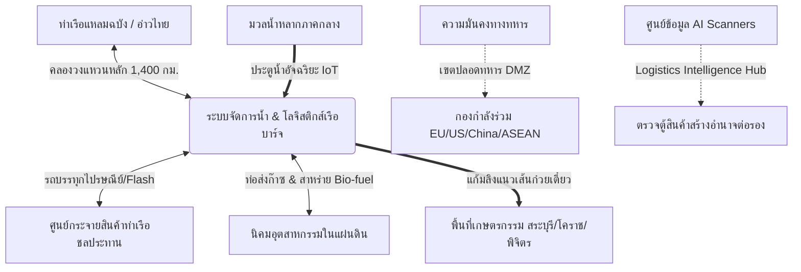

# ยุทธศาสตร์ระเบียงโลจิสติกส์การค้าและระบบบริหารสมดุลอุทกวิทยาข้ามภูมิภาคแบบบูรณาการ (Inter-Regional Logistics & Dynamic Hydrological Balancing Corridor Strategy)

**Date Added:** 2026-05-08  
**Status:** 💡 Idea (ไอเดียตั้งต้น) / 📝 Pending Research (รอการวิจัย)  
**Category:** Policy / Logistics / Disaster Management  

---

## 1. ปัญหาบนโลกจริง (The Real-world Problem)

### 1.1 ความซับซ้อนและต้นทุนแฝงของระบบโลจิสติกส์อาเซียน (Logistical Fragmentation & High-Friction Gateways)
* **ข้อจำกัดของระบบ Landbridge แบบเดิม:** โครงการแลนด์บริดจ์ (Land Bridge) รูปแบบดั้งเดิมที่เน้นการถ่ายสินค้าจากเรือขึ้นรถไฟ และถ่ายลงเรืออีกรอบ (Double-handling) มักเผชิญกับ **ความล่าช้าสะสม (Transit Friction) และต้นทุนแฝงในการยกตู้สินค้าขึ้น-ลง (Handling Cost)** ซึ่งบั่นทอนขีดความสามารถการแข่งขันด้านเวลาเมื่อเทียบกับการเดินเรือผ่านช่องแคบมะละกาโดยตรง
* **การพึ่งพาทางบกและถนนหลวงที่มีต้นทุนสูง:** ปัจจุบันระบบโลจิสติกส์ในประเทศพึ่งพาการขนส่งทางถนน (รถบรรทุก) สูงถึง 80% (คิดเป็นปริมาณสินค้ากว่า 400 ล้านตันต่อปี) ซึ่งมีต้นทุนทางการเงินสูงกว่าทางน้ำ 3-4 เท่า (ค่าเฉลี่ยรถบรรทุกอยู่ที่ 2.0-2.5 บาท/ตัน/กม. เทียบกับเรือที่ 0.5-0.8 บาท/ตัน/กม.) ส่งผลให้ถนนหนทางชำรุดเสียหายบ่อยและสิ้นเปลืองพลังงานน้ำมันดีเซลในการวิ่งระยะไกลข้ามภาค
* **การกระจุกตัวเชิงเดี่ยว (Centralized Logistics Vulnerability):** ห่วงโซ่อุปทานของประเทศและภูมิภาคอาเซียนตอนกลางพึ่งพิงท่าเรือแหลมฉบังและกรุงเทพฯ เป็นส่วนใหญ่ หากเกิดวิกฤตการณ์ทางธรรมชาติหรือความขัดแย้งทางภูมิรัฐศาสตร์ ระบบขนส่งจะเผชิญภาวะชะงักงันฉับพลัน (Single Point of Failure)

### 1.2 วิกฤตภัยพิบัติข้ามภูมิภาคแบบขาดการเชื่อมโยง (Systemic Inter-Regional Hydrological Disasters)
ในปัจจุบัน หน่วยงานรัฐแยกแยะการจัดการภัยพิบัติและโครงสร้างพื้นฐานออกเป็นส่วนงานย่อย (Silo Management) ทำให้ไม่สามารถปรับสมดุลทรัพยากรข้ามภูมิภาคได้อย่างมีประสิทธิภาพ ส่งผลให้เผชิญภัยพิบัติซ้ำซาก:
* **พื้นที่ลุ่มภาคกลาง (ลุ่มเจ้าพระยา):** ประсบปัญหาอุทกภัยรุนแรงในช่วงฤดูมรสุม น้ำเหนือหลากเข้าท่วมพื้นที่นิคมอุตสาหกรรมและเกษตรกรรม ขณะเดียวกันกรุงเทพมหานครและปริมณฑลกำลังเผชิญหน้ากับ **วิกฤตแผ่นดินทรุดตัว (Land Subsidence)** จากการสูบน้ำบาดาลในอดีต ร่วมกับภัยน้ำทะเลหนุนสูง (Astronomical High Tides) ที่ลิ่มน้ำเค็มรุกเข้าทำลายระบบประปาเมืองหลวง
* **พื้นที่ภาคตะวันออกเฉียงเหนือ (แอ่งโคราช-แอ่งสกลนคร) และภาคกลางตอนบน:** ประสบปัญหาภัยแล้งเรื้อรังแทบทุกปีเนื่องจากปริมาณฝนทิ้งช่วง ดินมีลักษณะเป็นดินปนทรายที่มีความซึมผ่านสูง (High Soil Permeability) ไม่สามารถกักเก็บน้ำบนผิวดินได้มีประสิทธิภาพพอ
* **ความสูญเปล่าทางอุทกวิทยา:** น้ำหลากจากภาคกลางมหาศาลถูกปล่อยทิ้งลงสู่อ่าวไทยโดยเปล่าประโยชน์เพื่อป้องกันน้ำท่วมเมือง ขณะที่ภาคอีสานกำลังแห้งแล้งจนพืชผลเสียหายอย่างหนักเนื่องจากไม่มีท่อเชื่อมโยงส่งน้ำข้ามเขตลุ่มน้ำ (Inter-basin Transfer)

---

## 2. ข้อเสนอเชิงนโยบายยุทธศาสตร์ชาติ (Proposed Solution & Policy Strategy)

เพื่อแก้ไขปัญหาระดับมหภาคอย่างบูรณาการ ยุทธศาสตร์นี้เสนอให้พัฒนา **"โครงการระเบียงอัจฉริยะกู้วิกฤตข้ามภูมิภาคแบบวงกลม" (Multipurpose Loop-Canal & Infrastructure Corridor)** โดยการขุดเชื่อมแม่น้ำและสร้างร่องน้ำเดินเรือควบคู่กับระบบชลประทานระดับประเทศ

### 2.1 โครงข่ายคลองวงแหวน 1,400 กิโลเมตร (The 1,400 km Loop-Canal Network)
ยุทธศาสตร์เสนอให้ขุดคลองเป็นแนววงแหวนรอบประเทศระยะทางรวมประมาณ 1,400 กิโลเมตร เพื่อเชื่อมพื้นที่เศรษฐกิจและเกษตรกรรมหลักของประเทศเข้าด้วยกัน:
* **แนวเส้นทาง (The Loop Route):** เชื่อมจากกรุงเทพมหานคร - สมุทรปราการ - ชลบุรี (แหลมฉบัง) - ฉะเชิงเทรา - สระบุรี - นครราชสีมา (โคราช) - พิจิตร - กำแพงเพชร - ราชบุรี และวนกลับมาครบลูป
* **สัดส่วนและขนาดของคลอง (Canal Geometry):**
  * **ความกว้างท้องคลอง (Bottom Width):** 40 - 60 เมตร เพื่อให้เรือเดินเรือสวนกันได้ปลอดภัย
  * **ความลึก (Depth):** 5 - 8 เมตร รองรับการกินน้ำลึกของเรือบาร์จในประเทศ (กินน้ำลึก 3-4 เมตร) ทำให้มีระยะเผื่อใต้ท้องเรือ (Under Keel Clearance) ที่ปลอดภัย
  * **ความกว้างระดับผิวน้ำ (Top Width):** 80 - 120 เมตร โดยมีความลาดชันของตลิ่งและออกแบบการดาดคอนกรีตในจุดที่ดินอ่อนเพื่อป้องกันดินถล่ม
* **การสัญจรทางน้ำและการประสานงานทางบก (Multimodal Synchronization):**
  * เน้นการใช้ **เรือบาร์จ (Barge)** ขนาดบรรทุก 2,000 - 3,000 ตัน หรือประมาณ 100 - 150 TEU ต่อขบวนลากจูง ซึ่งการขนส่ง 1 ขบวนเรือเทียบเท่ากับการลดรถบรรทุกบนถนนได้มากกว่า 100 คัน
  * พัฒนาโมเดลการทำงานร่วมกันระหว่าง **"เรือ"** และ **"รถ"**: เรือบาร์จทำหน้าที่ขนส่งล็อตใหญ่ระหว่างภูมิภาค (เช่น ข้าว ปูนซีเมนต์ มันสำปะหลัง สินค้าตู้คอนเทนเนอร์ไม่เร่งด่วน) ส่วนรถบรรทุกจากกลุ่มโลจิสติกส์ด่วน (เช่น ไปรษณีย์ไทย, Flash Express) จะรับสินค้าจากศูนย์กระจายสินค้าข้างท่าเรือชลประทาน เพื่อส่งต่อไปยังผู้บริโภคหรือพื้นที่นอกแนวคลอง (Last Mile Delivery) โดยเฉพาะพื้นที่ซับซ้อนในภาคเหนือที่เรือไม่สามารถเข้าถึงได้

### 2.2 คลองระบายน้ำและแก้มลิงแนวเส้นก๋วยเตี๋ยว (Dynamic Floodway & "Noodle" Reservoir)
* **ช่วงฤดูมรสุม (Floodway Mode):** คลองวงแหวนทำหน้าที่เป็นช่องทางระบายน้ำหลากขนาดใหญ่ (Floodway) เพื่อผันมวลน้ำส่วนเกินจากภาคกลางและตอนบน เลี่ยงเมืองหลวงออกสู่ทะเลที่ชลบุรีและสมุทรปราการโดยตรง ป้องกันภัยพิบัติน้ำท่วมกรุงเทพฯ และนิคมอุตสาหกรรมในภาคกลาง
* **ช่วงฤดูแล้ง (Noodle Reservoir Mode):** ออกแบบระบบประตูน้ำ IoT ควบคุมระดับน้ำเป็นช่วง ๆ ทำให้คลองกลายเป็น **"อ่างเก็บน้ำแนวเส้นก๋วยเตี๋ยว"** ที่ทอดยาวกักเก็บน้ำจืดไว้ใช้ในภาคการเกษตรและการอุปโภคบริโภคของจังหวัดต่าง ๆ ที่อยู่ลึกในแผ่นดิน (Landlocked) เช่น พิจิตร นครสวรรค์ และนครราชสีมา ตลอดทั้งปี

### 2.3 โมเดลการเงินร่วมลงทุนภาครัฐ-เอกชน (PPP & Financial Architecture)
* **การลงทุนโดยเอกชนเพื่อป้องกันคอรัปชัน (State-Backed PPP):** เปิดโครงการให้กลุ่มทุนเอกชนระดับประเทศที่มีผลประโยชน์ร่วมในห่วงโซ่โลจิสติกส์และอุตสาหกรรม (เช่น บริษัทขนส่งทั่วไป, ไปรษณีย์ไทย, ผู้ประกอบการปศุสัตว์รายใหญ่, ผู้ส่งออกข้าวและมันสำปะหลัง) เข้ามาร่วมลงทุนแบบ PPP โดยเอกชนจะเป็นผู้ควบคุมงบประมาณและการก่อสร้างด้วยตัวเองเพื่อลดช่องทางการทุจริตคอรัปชันและเพิ่มความรวดเร็วในการดำเนินงาน
* **การสนับสนุนทางการเงินของรัฐ (State Bank soft loans & Guarantees):** รัฐบาลจะทำหน้าที่เป็นผู้ค้ำประกัน (Backup) ให้กับธนาคารของรัฐ (เช่น ธนาคารออมสิน) ในการปล่อยสินเชื่อดอกเบี้ยต่ำพิเศษ (Soft Loans) ให้แก่เอกชนที่ร่วมลงทุน หรือระดมทุนผ่านกองทุนโครงสร้างพื้นฐานระดับชาติ (Infrastructure Fund) ที่การันตีผลตอบแทนแก่ประชาชน

### 2.4 ความมั่นคงทางทหารเชิงภูมิรัฐศาสตร์และการตรวจค้นระบบ AI (Geopolitical DMZ & AI Inspection Hub)
* **การประกาศเขตทหารเป็นกลาง (Demilitarized Zone - DMZ):** เพื่อป้องกันความขัดแย้งของมหาอำนาจในการเข้ามาควบคุมสิทธิ์ในการเดินเรือผ่านคลองขนส่งนี้ รัฐบาลไทยจะเสนอข้อตกลงระดับสากลในการกำหนดให้คลองเป็นเขตปลอดทหารและเขตการค้าเสรีที่เป็นกลาง โดยจัดให้มีกองกำลังร่วมลาดตระเวน (Joint Security Consortium) ที่ประกอบด้วยตัวแทนจากสหภาพยุโรป (EU), อาเซียน (ASEAN), สหรัฐฯ (US) และจีน (China) หมุนเวียนกัน เพื่อสร้างความเชื่อมั่นทางการเมืองระหว่างประเทศ
* **ศูนย์ข้อมูลความมั่นคงโลจิสติกส์ (Logistics Intelligence Data Hub):** ติดตั้งระบบสแกนตู้สินค้าอัตโนมัติ (Automated Container Scanners) ร่วมกับ AI ตรวจสอบและประมวลผลข้อมูลสิ่งของในตู้สินค้าทุกตู้แบบเรียลไทม์ เพื่อป้องกันการขนส่งอาวุธผิดกฎหมายหรือสารเคมีอันตราย การมีฐานข้อมูลตู้สินค้าที่เข้าออกอย่างสมบูรณ์จะทำให้ประเทศไทยมี **"อำนาจต่อรองเชิงภูมิรัฐศาสตร์" (Geopolitical Leverage)** เหนือการค้าในภูมิภาคอาเซียนตอนกลาง

---

## 3. มุมมองเชิงระบบตามทฤษฎี UET (UET Perspective)

ภายใต้ทฤษฎี **Unity Equilibrium Theory (UET)** โครงข่ายโลจิสติกส์การค้าและปัญหาภัยพิบัติอุทกวิทยาข้ามภูมิภาค ไม่ใช่ระบบที่ตัดขาดจากกัน แต่เป็นหนึ่งใน **"โครงข่ายการไหลของมวล สารสนเทศ และพลังงานเชิงอุณหพลศาสตร์" (Thermodynamic Flows of Mass, Information, and Energy)**

### 3.1 การควบคุมการกระจายตัวของเอนโทรปีในลุ่มน้ำ ( Basin Entropy Management)
ภัยแล้งและอุทกภัย แท้จริงแล้วคือ **"ภาวะความไม่สมดุลเชิงตำแหน่งของการกระจายมวลน้ำ" (Spatial Mass Imbalance of Water)** ซึ่งถือเป็นสภาวะที่มีเอนโทรปีสูง (High Entropy State) 
เมื่อลุ่มน้ำเจ้าพระยามีน้ำปริมาณมากเกินไปจนเกิดความโกลาหลระบายไม่ทัน ($dS_{\text{central}} > 0$) และลุ่มน้ำตอนในขาดแคลนทรัพยากรตัวกลางทำปฏิกิริยา ($dS_{\text{inland}} > 0$) 
หากเราเชื่อมต่อลุ่มน้ำเข้าหากันด้วยระเบียงส่งน้ำคู่ขนาน และเหนี่ยวนำด้วยข้อมูลข่าวสารจากระบบประมวลผล AI/IoT ส่วนกลาง ($dI_{\text{API}}$) ระบบจะสามารถผันมวลน้ำข้ามขอบเขตเชิงพื้นที่เพื่อปรับลดค่าเอนโทรปีสุทธิรวมของประเทศลงได้:

$$dS_{\text{national}} = dS_{\text{freight}} + dS_{\text{water}} - dI_{\text{API}} \le 0$$

สารสนเทศอัจฉริยะ ($I_{\text{API}}$) จะทำหน้าที่เสมือน **"ตัวลดทอนเอนโทรปีภายนอก" (Negative Entropy Driver)** นำพาโครงข่ายระบบขนส่งและการกระจายน้ำสู่จุดสมดุลแบบคงที่เชิงพลวัต (Active Steady-State Equilibrium) และปกป้องโครงสร้างพื้นฐานระดับชาติจากการล่มสลายจากภัยพิบัติ

---

## 4. สิ่งที่ต้องวิจัยเพิ่มในอนาคต (Future Research Needs)

### 4.1 การวิจัยข้อมูลภูมิประเทศและการยกตัวของน้ำ (Altitude & Hydrological Lock Simulation)
* **การวิจัยระบบประตูน้ำยกระดับ (Navigation Locks):** เนื่องจากจังหวัดในที่ราบสูง เช่น นครราชสีมา (โคราช) มีระดับความสูงเฉลี่ยมากกว่าระดับน้ำทะเลถึง 180-200 เมตร จึงต้องสร้างแบบจำลองวิศวกรรมชลศาสตร์เพื่อออกแบบประตูจัดการน้ำยกระดับและลิฟต์ยกเรือสินค้า (Navigation Locks) ตลอดเส้นทางขึ้นที่ราบสูง
* **แผนที่ธรณีวิทยาแนวก่อสร้างคลอง:** ศึกษารอยเลื่อนของเปลือกโลกและเสถียรภาพของดินแนวก่อสร้างคลอง 1,400 กิโลเมตร เพื่อคำนวณสัดส่วนการดาดคอนกรีตและการป้องกันลิ่มความเค็มรั่วซึมเข้าสู่ชั้นดินเกษตรกรรม

---

## 5. แหล่งอ้างอิงและข้อมูลเสริม (References & Resources)

* **[Southern Waterway Alternative Masterplan](../03_logistics_and_infra/southern_waterway_alternative.md):** แผนที่ร่องน้ำเดินเรือและท่าเรือน้ำลึกเชื่อมต่อกับอ่าวไทยและอันดามัน
* **[UET Topic 0.39 (Bio-Smart Water City Blueprint)](file:///c:/Users/santa/Desktop/uet_harness/docs/topics/):** เอกสารหลักการบริหารจัดการน้ำและเอนโทรปีในลุ่มน้ำระบบปิด
* **รายงานสถิติการขนส่งทางรางและถนนของประเทศไทยประจำปี 2568-2569 (สศช.)**
