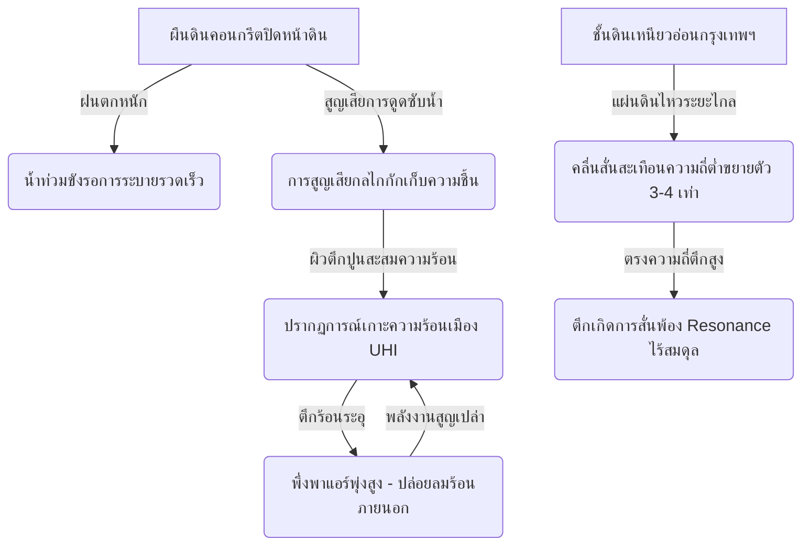

# แนวคิดอาคารภูเขาจำลองเพื่อความยืดหยุ่นของเมืองหลวง (The Mountain Building Concept for Megacity Resilience)

**Date Added:** 2026-05-09  
**Status:** 💡 Idea (ไอเดียตั้งต้น)  
**Category:** Urban Resilience / Geology / Microclimate Engineering / Bio-Synthetic Integration

---

## บทคัดย่อ (Executive Summary)
เมืองใหญ่ในปัจจุบัน เช่น กรุงเทพมหานคร เผชิญกับสภาวะเสียสมดุลเชิงระบบ (Systemic Disequilibrium) อย่างรุนแรงจากการแทนที่ชั้นดินธรรมชาติด้วยผืนคอนกรีต ส่งผลให้เกิดปัญหาน้ำท่วมขังรอการระบาย เกาะความร้อนเมือง (Urban Heat Island - UHI) และการใช้พลังงานเครื่องปรับอากาศอย่างมหาศาล 

ข้อเสนอนี้ขอนำเสนอแนวคิด **"ตึกคือภูเขาจำลอง" (The Mountain Building Concept)** ซึ่งเป็นการดึงภูมิปัญญาแบบดั้งเดิมของสถาปัตยกรรมไทย (เรือนไทยใต้ถุนสูง, หลังคาจั่วระบายน้ำ, ช่องเปิดลมโฟลว์) มาผสานรวมเข้ากับวิศวกรรมอาคารสีเขียวสากลยุคใหม่ เพื่อเปลี่ยนบทบาทของอาคารคอนกรีตทื่อๆ ให้ทำหน้าที่เสมือน "ภูเขาตามธรรมชาติ" ที่สามารถกักเก็บความชื้น ดูดซับความเค้นจากภายนอก หมุนเวียนลม และลดทอนเอนโทรปีความร้อน (Thermal Entropy) ของเมืองหลวงลงอย่างเป็นระบบ โดยทำงานร่วมกับกรอบคิดฟิสิกส์ระบบของ Unity Equilibrium Theory (UET)

---

## 1. The Real-world Problem (ปัญหาบนโลกจริง / Core Pain Points)

การพัฒนาเมืองหลวงแบบดั้งเดิมทำให้ระบบนิเวศเมืองพังทลายลงเนื่องจากปัญหาหลัก 5 ประการที่ส่งผลกระทบต่อเนื่องกันเป็นโดมิโน:



### 1.1 ปัญหาน้ำท่วมและน้ำขังรอการระบาย (Urban Runoff Overflow)
พื้นผิวถนนและทางเท้าคอนกรีตเป็นพื้นผิวที่น้ำซึมผ่านไม่ได้ (Impervious Surfaces) เมื่อเกิดฝนตกหนัก (Rainfall Peak Loads) น้ำทั้งหมดจะไหลบ่าบกสู่ท่อระบายน้ำโดยทันที (Instantaneous Peak Discharges) โดยไม่มีการหน่วงน้ำตามธรรมชาติ ระบบระบายน้ำจึงโอเวอร์โหลดและเกิดปัญหาน้ำท่วมขังเรื้อรัง

### 1.2 การสูญเสียกลไกการกักเก็บความชื้น (Loss of Moisture Retention)
เมื่อเมืองไม่มีหน้าดินและระบบรากพืชคอยอุ้มน้ำไว้ เมืองจะสูญเสียกลไกการคายระเหยน้ำ (Evapotranspiration) ซึ่งเป็นตัวปรับระดับอุณหภูมิและความชื้นตามธรรมชาติ ทำให้อากาศแห้งแล้ง อบอ้าว และเกิดฝุ่นละออง PM2.5 สะสมง่าย

### 1.3 ปรากฏการณ์เกาะความร้อนเมือง (Urban Heat Island - UHI)
โครงสร้างอาคารปูนและกระจกสะสมรังสีความร้อนจากดวงอาทิตย์ในเวลากลางวัน และแผ่รังสีความร้อนออกสู่สิ่งแวดล้อมรอบตึกตลอดคืน ทำให้อุณหภูมิในเขตเมืองสูงกว่าเขตชนบทโดยรอบอย่างนัยสำคัญ

### 1.4 วงจรสิ้นเปลืองพลังงานระดับวิกฤต (Energy Feedback Loop)
ความร้อนที่สะสมในอาคารส่งผลให้ผู้อยู่อาศัยต้องเปิดเครื่องปรับอากาศอย่างหนัก ซึ่งนอกจากจะใช้พลังงานไฟฟ้ามหาศาลแล้ว ระบบระบายความร้อนของแอร์ยังพ่นลมร้อนออกสู่บรรยากาศภายนอกตัวตึก วนกลับมาซ้ำเติมปรากฏการณ์ UHI ให้ทวีความรุนแรงขึ้นเป็นวัฏจักรป้อนกลับแบบบวก (Positive Feedback Loop)

### 1.5 ภัยพิบัติทางธรณีวิทยาและการขยายคลื่นไหวสะเทือน (Geological Wave Amplification)
ชั้นดินเหนียวหนาอ่อนกรุงเทพฯ (Bangkok Clay / Soft Estuarine Clay) ทำหน้าที่เป็นแอมพลิฟายเออร์ธรรมชาติที่จะขยายความแรงของคลื่นไหวสะเทือนที่มีความถี่ต่ำ (Low-Frequency Seismic Waves) จากรอยเลื่อนที่อยู่ห่างไกลออกไปหลายร้อยกิโลเมตร ทำให้ตึกสูงในกรุงเทพฯ สั่นพ้องสะสม (Resonating Oscillation) และมีสภาวะเครียดเชิงโครงสร้างสูง

---

## 2. Proposed Solution & Policy (ข้อเสนอแนะและมาตรการเชิงนโยบาย)

เพื่อแก้ไขปัญหาเหล่านั้นอย่างถอนรากถอนโคน เราเสนอมาตรการ **"อาคารภูเขาจำลองเพื่อความยืดหยุ่นเชิงนิเวศเมือง"** โดยประยุกต์ใช้เอกลักษณ์สถาปัตยกรรมไทย 3 ประการ ผสานนวัตกรรมสากลดังนี้:

### 2.1 นวัตกรรมหลังคาจั่วสไลเดอร์ร่วมสมัย (Gable Slide Water Harvesting Roof)
* **การออกแบบ:** เลิกใช้งานหลังคาแบน (Flat Roof) ที่มักมีปัญหาน้ำขังและรั่วซึมในเขตร้อนชื้น หันมาประยุกต์ใช้ **"หลังคาจั่วโค้งสไลเดอร์เล่นระดับ" (Curved Cascading Gables)** 
* **ฟังก์ชันเชิงวิศวกรรม:** ใช้รูปทรงโค้งและสโลปความเอียงของจั่วเป็นระบบ "ดักและหน่วงน้ำฝน" (Rainwater Catchment & Buffer) บังคับทิศทางน้ำฝนที่ตกลงมาให้ไม่ตกลงสู่พื้นดินโดยตรงแบบกระจาย แต่ไหลรวมกันผ่านท่อลำเลียงที่ซ่อนอยู่ในขอบหลังคาโค้งเพื่อป้อนเข้าสู่ระบบกระจายน้ำทางดิ่งรอบผนังตึก

### 2.2 กำแพงมอสขั้นบันไดรับน้ำและกรองมลพิษ (Cascading Moss Wall Sponge)
* **การออกแบบสถาปัตยกรรมลูกผสม (Hybrid Architecture):** นำลักษณะ "ผืนดินบนเนินเขาที่อุ้มน้ำ" มาประยุกต์บนกำแพงอาคารแนวดิ่ง โดยแบ่งพื้นที่ตามทิศทางการรับแสงของอาคารอย่างสมดุล (BIPV Facade Balancing):
  * **พื้นที่รับแดดจัด (ทิศใต้ / ทิศตะวันตก):** ติดตั้งระบบแผงโซลาร์เซลล์แนวตั้ง (Building Integrated Photovoltaics - BIPV) เพื่อผลิตกระแสไฟฟ้าและทำหน้าที่เป็นระแนงบังแดด (Louvers / Overhangs) สร้างร่มเงาทอดลงสู่พื้นที่ด้านล่าง
  * **พื้นที่ร่มเงา (ทิศเหนือ / ทิศตะวันออก):** ติดตั้งระบบผนังมอสชีวภาพ (Bioreceptive Moss Walls) โดยใช้คอนกรีตความพรุนสูงผสมสารอาหารธรรมชาติ
* **การรีโนเวทอาคารเก่าด้วยอิฐมวลเบา (Retrofitting with Lightweight AAC):** สำหรับอาคารเก่า สามารถประยุกต์ใช้เทคโนโลยีการก่อ **อิฐมวลเบา (Autoclaved Aerated Concrete - AAC)** เสริมเป็นเปลือกนอกของอาคาร (Double Skin Facade) เนื่องจากอิฐมวลเบามีรูพรุนสูง น้ำหนักเบา และกักเก็บความชื้นได้ดีเยี่ยม ทำให้สามารถปลูกมอสบนตึกเก่าได้ทันทีโดยไม่ต้องทุบทำลายโครงสร้างหลักเดิม
* **นวัตกรรมวัสดุศาสตร์ TU Delft / Respyre:** ประยุกต์เทคโนโลยีคอนกรีตชีวภาพ (Bioreceptive Shotcrete) ที่ใช้วัสดุรีไซเคิล 70–85% (หินภูเขาไฟ, เศษแก้ว, เถ้าลอย Fly Ash) เพื่อสร้างโครงสร้างรูพรุนระดับไมโคร (Microporous) และใช้ปูนซีเมนต์สูตรพิเศษลดความเป็นด่าง (Low-Alkali Cement ปรับค่า pH ลงเหลือ 6-7 จากปกติ 12-13) ช่วยให้ไรซอยด์ (Rhizoids - รากเทียม) ของมอสสามารถยึดเกาะผิวตึกได้แน่นหนาโดยไม่ชอนไชทำลายโครงสร้างคอนกรีต
* **พฤกษศาสตร์เขตร้อน (Tropical Bryophyte Engineering):** คัดเลือกสายพันธุ์มอสท้องถิ่นของไทยที่ทนทานต่อรังสี UV และความร้อนสูง โดยเฉพาะ **มอสหางกระรอก (Pincushion Moss - *Leucobryum*)** ซึ่งมีเซลล์เก็บกักน้ำพิเศษ (Hyaline cells) หนาแน่น มีกลไกจำศีลอัจฉริยะ (Dormancy) เมื่อเผชิญสภาวะแห้งแล้งรุนแรงจะคายน้ำออกและเปลี่ยนเป็นสีขาวอมเทาเพื่อสะท้อนรังสีความร้อน และสามารถดูดซับน้ำฝนฟื้นคืนชีพกลับมาเขียวสดได้ทันทีภายในไม่กี่นาที
* **ศักยภาพการหน่วงน้ำฝนระดับมหานคร (Quantitative Stormwater Buffer):** จากสถิติพื้นที่ผิวผนังคอนกรีตแนวตั้งของอาคารสูงในกรุงเทพฯ (ตึกระฟ้ากว่า 200 อาคาร และอาคารสูงเกิน 8 ชั้นกว่า 4,500 อาคาร) มีพื้นที่ผิวรวมกันสูงถึง **53 - 102 ล้านตารางเมตร** (เทียบเท่าสวนลุมพินี 92 - 177 แห่งรวมกัน) เมื่อผนังมอสและคอนกรีตชีวภาพมีอัตราอุ้มน้ำ 5 ลิตรต่อตารางเมตร ผิวตึกเหล่านี้จะแปลงสภาพเป็น **"แก้มลิงแนวตั้ง" (Vertical Flood Retention Basin)** ขนาดยักษ์ 100 ตารางกิโลเมตร ที่สามารถกักเก็บและหน่วงน้ำฝนได้ทันที **265 - 510 ล้านลิตร** ในช่วงเกิดพายุฝนตกหนัก ช่วยลดภาระอัตราการไหลบ่าสูงสุด (Instantaneous Peak Discharges) เข้าสู่ระบบท่อระบายน้ำของมหานครได้อย่างมีนัยสำคัญ พร้อมทำหน้าที่ฟอกอากาศ ดูดซับ PM2.5 และลดอุณหภูมิผิวตึกภายนอกลงสูงสุด 30% ส่งผลให้ประหยัดพลังงานเครื่องปรับอากาศ 20-30%

### 2.3 ระบบอุโมงค์ลมสไตล์ใต้ถุนประยุกต์ (Aerodynamic Voids & Modern Tai Thun)
* **การออกแบบ:** ผสานแนวคิดผังบล็อกเชื่อมต่อกัน (คล้ายผังเมือง Barcelona Block แต่ปรับขนาดตึกให้เป็นสไตล์ไทยประยุกต์) โดยการทำชั้นล่างสุดให้เปิดโปร่งโล่งแบบ **"ใต้ถุนสูงดั้งเดิม" (Modern Tai Thun)** ร่วมกับการทำลายแผ่นพื้นของบางชั้นกลางอาคาร (Intermediate Voids) เพื่อทลายสถาปัตยกรรมกล่องสี่เหลี่ยมทึบตัน
* **ฟังก์ชันเชิงวิศวกรรม:** ใต้ถุนสูงและช่องว่างกลางตึกจะช่วยลดแรงต้านลมของตึกสูง ปรับปรุงทิศทางและเร่งความเร็วลมธรรมชาติผ่านทางเดินภายในตึก (Natural Air Vent/Venturi Effect) เพื่อพัดพาเอาความร้อนอบอ้าวออกจากตัวอาคาร นอกจากนี้ พื้นที่ใต้ถุนสูงโปร่งยังทำหน้าที่เป็นพื้นที่ทางสังคม (Social Commons) สำหรับทำกิจกรรมร่วมกัน และทำหน้าที่สำคัญเป็น "พื้นที่อพยพรองรับน้ำหลากและภัยพิบัติทางธรรมชาติ" ได้ทันที

---

## 3. UET Perspective (มุมมองเชิงระบบตามทฤษฎี UET)

ภายใต้กรอบคิดทฤษฎี Unity Equilibrium Theory (UET) ทุกระบบกายภาพคือโครงข่ายประมวลผลข้อมูลและสมดุลพลังงาน การออกแบบ "ตึกภูเขาจำลอง" นี้มีฟิสิกส์ระบบรองรับอย่างชัดเจน:

```
[พลังงานจลน์แผ่นดินไหว/ลม] ──> [โครงสร้างถักทอสามมิติ] ──> [กระจายความเค้นลงสู่ดินเหนียวอย่างนุ่มนวล]
[พลังงานความร้อนดวงอาทิตย์] ──> [ผนังมอสอุ้มน้ำฝน] ──> [การระเหยคายน้ำดึงอุณหภูมิลง (Entropy Minimization)]
[มวลประชากรหนีภัยฉุกเฉิน] ──> [โครงข่ายสะพานเชื่อมตึก 2D] ──> [กระจายทราฟฟิกป้องกันคอขวด (Diffusive Flux)]
```

### 3.1 การกักเก็บประจุความร้อนและการรักษาสมดุลความร้อน (Thermal Entropy Minimization)
ตึกคอนกรีตมาตรฐานทำหน้าที่สะสมพลังงานความร้อนสูงและปล่อยออกช้าๆ ทำให้เอนโทรปีของระบบเมืองพุ่งสูง ระบบผนังมอสและน้ำหมุนเวียนไหลตกตามแรงโน้มถ่วงจะทำหน้าที่เป็น **"อ่างเก็บเอนโทรปี" (Entropy Sink)** ผ่านกระบวนการเปลี่ยนสถานะของน้ำจากของเหลวกลายเป็นไอ ซึ่งเป็นกระบวนการดูดกลืนความร้อนที่ทรงประสิทธิภาพสูงสุดตามกฎข้อที่สองของอุณหพลศาสตร์ (Thermodynamics) ช่วยให้อาคารรักษาสมดุลความร้อนต่ำ (Low Thermal Stress State) ได้อย่างยั่งยืน

### 3.2 ทอพอโลยีโครงข่ายการไหลเวียนของผู้คน (Topological Evacuation Flux)
ตึกทั่วไปมีเส้นทางการหนีภัยแนวดิ่งแบบ 1 มิติ (ลงสู่พื้นอย่างเดียวผ่านบันไดหนีไฟ) เมื่อเกิดเหตุอัคคีภัยหรือภัยพิบัติ ความหนาแน่นของประชากรจะทำให้เกิดความโกลาหลและคอขวดสะสมประจุข้อมูล (Evacuation Flow Bottlenecks) 

การเสนอโครงข่าย **สะพานเชื่อมลอยฟ้าที่มีตัวหน่วงซับแรงสั่นสะเทือน (Inter-building Sky-Bridges)** จะช่วยยกระดับทอพอโลยีโครงข่ายการไหล (Network Topology) ให้กลายเป็น 2 มิติ (2D Grid-like Evacuation) ทำให้สามารถกระจายฝูงชนเคลื่อนย้ายข้ามอาคารข้างเคียงที่ปลอดภัยได้ทันทีตามทฤษฎีการแพร่กระจายตัวแบบสมดุล (Diffusive Mass Flow)

### 3.3 พลศาสตร์ของไหลและโครงสร้างหน่วงลม (Fluid Dynamic Aeration)
การทำลายความทึบตันของตึกด้วยระบบใต้ถุนสูงร่วมสมัยและอุโมงค์ลม จะช่วยผ่อนคลายความกดดันของสนามแรงลมปะทะอาคาร (Relaxing Localized Aerodynamic Stresses) โดยเปลี่ยนพลังงานจลน์จากกระแสลมพัดปะทะภายนอกตึกให้กลายเป็น "กระแสหมุนเวียนลมภายใน" (Passive Ventilation Energy) ช่วยระบายอากาศภายในอาคารได้โดยไม่ต้องพึ่งพาระบบพัดลมกลเชิงกล (Mechanical Fans)

---

## 4. Engineering & Feasibility Integration (ความเป็นไปได้ทางวิศวกรรมและข้อกฎหมาย)

### 4.1 การออกแบบโครงสร้างถักทอแบบซับซ้อน (3D Woven Truss - Toothpick Model)
* **วิศวกรรมการรับแรง:** การเจาะช่องว่างลมขนาดใหญ่และการมีชายคาหลังคาจั่วโค้งขนาดมหึมาจำเป็นต้องก้าวข้ามระบบโครงสร้าง "เสา-คาน ทื่อๆ" (แบบไม้เสียบลูกชิ้น) ไปสู่ระบบ **"โครงสร้างถักทอเชื่อมประสานแบบสามมิติ" (3D Woven Space Trusses)** ซึ่งคล้ายกับความสลับซับซ้อนของโครงสร้างแบบโครงข่ายถักทอ (Mesh Architecture) แม้ใช้วัสดุที่มีขนาดและน้ำหนักเบาลง แต่ด้วยระดับมุมของการประสานโครงสร้างและตัวเฉลี่ยแรงหน่วงจะช่วยให้ตึกสามารถรับน้ำหนักและแรงบิดจากกระแสลมตึกสูงได้มีประสิทธิภาพสูงสุดโดยไม่พังทลาย

### 4.2 ความสอดคล้องกับข้อกฎหมายระยะถอยร่นของไทย (Setback Law Optimization)
* **กลไกธรรมชาติผสานกฎหมาย:** ข้อกฎหมายผังเมืองของไทยกำหนดให้ตึกสูงต้องมีการร่นระยะถอยร่น (Setback Boundary) และเล่นสเต็ปความสูงแบบลดหลั่นบันไดตามระยะห่างจากแนวถนนสาธารณะ
* **การนำมาใช้งาน:** เราดึงเอาข้อยังคับทางกฎหมายข้อนี้มาเป็นโอกาสทางวิศวกรรม โดยการออกแบบตึกให้เล่นระดับเป็น **"ขั้นบันไดน้ำตกกักความชื้น" (Cascading Stepped Terraces)** ทำให้น้ำฝนที่ไหลมาจากหลังคาจั่วชั้นบนสุด สามารถหลั่งไหลตกหล่นลงมาราวกับน้ำตกธรรมชาติหล่อเลี้ยงผนังมอสและสวนหย่อมทีละชั้นตามแรงโน้มถ่วง (Gravity-fed Cascading Cascade) ได้เอง โดยแทบไม่ต้องพึ่งพาระบบปั๊มน้ำขึ้นสูงที่สิ้นเปลืองไฟฟ้า

```
  [หลังคาโค้งบนสุด]  ──── น้ำฝนตกดักรวม ───┐
                                          ▼
  [ชั้นลดหลั่นระดับ 1] ── ผนังมอสซึมซับและปล่อยตกสู่ ──┐
                                                    ▼
  [ชั้นลดหลั่นระดับ 2] ── ผนังมอสซึมซับและปล่อยตกสู่ ──┐
                                                    ▼
  [ชั้นลดหลั่นระดับ 3 (ฐานติดถนน)] ── กรองน้ำสุดท้ายลงอ่างเก็บใต้ถุนสูง
```

### 4.3 กลยุทธ์การอัปเกรดตึกเก่าในเมืองใหญ่ (Building Retrofitting & Bio-Sourcing Supply Chain)
โมเดลนี้ไม่จำเป็นต้องจำกัดอยู่แค่เพียงตึกที่จะสร้างขึ้นมาใหม่เท่านั้น แต่ยังสามารถอัปเกรด (Retrofit) ตึกเก่าในกรุงเทพฯ และพัฒนาห่วงโซ่อุปทานระดับอุตสาหกรรม (Mass Production Supply Chain) รองรับได้ดังนี้:

#### 1. กระบวนการพ่นสเปรย์ชีวภาพ 3 ขั้นตอน (3-Step Hydroseeding / Bio-Gel Spray)
การเปลี่ยนผนังปูนตึกเก่าให้เป็นกำแพงมอสใช้กระบวนการวิศวกรรมความเร็วสูงโดยไม่ต้องติดตั้งทีละแผ่น:
* **Step 1 - Shotcrete Bioreceptive Coating:** พ่นฉาบปูนซีเมนต์ชีวภาพความพรุนสูงสูตรกรดอ่อน (pH 6-7) เคลือบทับผนังอาคารเดิมด้วยเครื่องพ่นแรงดันสูง
* **Step 2 - Bio-enhancing Moss Gel Spray:** นำสปอร์และเนื้อเยื่อมอสหางกระรอกสดปั่นรวมกับสารโพลีเมอร์ชีวภาพ (Hydrogel Base) และสารอาหารจำเพาะ ฉีดพ่นเคลือบทับผนังปูนชีวภาพทันที สารโพลีเมอร์มีความเหนียวหนืดสูงช่วยยึดเกาะผนังทางดิ่งไม่ให้ไหลย้อยเมื่อโดนฝน และทำหน้าที่เป็น "รก" ป้อนอาหารและอุ้มความชื้น
* **Step 3 - Smart Misting Activation:** ติดตั้งท่อพ่นหมอกชั่วคราวเชื่อมต่อกับน้ำทิ้งจากระบบปรับอากาศ (AC Condensate) เพื่อเลี้ยงความชื้นสัมพัทธ์ >60-70% สปอร์จะแตกตัวเป็นโครงข่ายเส้นใย (Protonema) เติบโตเป็นกำแพงมอสสมบูรณ์ภายใน 12 สัปดาห์

#### 2. การบริหารจัดการโลจิสติกส์โซ่ความเย็น (4-8°C Cold-Chain Logistics & Hibernation Zone)
เพื่อรองรับความต้องการปรับปรุงอาคาร 2 ล้านตารางเมตรต่อปี (ตามเป้าหมาย 10% ของตึก กทม. ใน 5 ปี) จำเป็นต้องบริหารจัดการห่วงโซ่อุปทานอย่างรัดกุมเพื่อป้องกันสปอร์สุกตายจากความร้อน:
* **การผลิตต้นน้ำ (Vertical Moss Labs):** เพาะเลี้ยงเนื้อเยื่อมอสสด 20-40 ตันต่อปี ผ่านระบบถังปฏิกรณ์ชีวภาพ (Photobioreactors) ขนาด 5,000 ลิตร จำนวน 20 ถัง (เดินเครื่องสเกลเดียวกับโรงงานนมเปรี้ยวขนาดกลาง) ผลิตเจลสเปรย์ชีวภาพ 2 ล้านลิตรต่อปี ช่วยกดต้นทุนเนื้อเจลลงเหลือระดับสิบถึงร้อยบาทต่อลิตร
* **โซ่ความเย็นบังคับจำศีล (Cold-Chain Hibernation):** บรรจุเจลสปอร์มอสใส่ถังปิดสนิทและควบคุมอุณหภูมิที่ 4-8 องศาเซลเซียส ทันที เพื่อบังคับให้สปอร์อยู่ในสถานะจำศีล ยืดอายุการเก็บรักษา (Shelf-life) จาก 2-3 วัน เป็น 30-45 วัน
* **เครือข่ายกระจายสินค้าห้องเย็นน้อย (Micro-Cold Hub Distribution & LNG Cold Energy):** พัฒนาเครือข่าย "ห้องเย็นน้อย" (Micro-Cold Storage) ตามจุดยุทธศาสตร์ 4 มุมเมือง เพื่อทำหน้าที่เป็นคลังสินค้าขนาดย่อม (อุณหภูมิ 4-8°C) รองรับสปอร์และเจลชีวภาพ โดยบูรณาการการใช้พลังงานความเย็นเหลือทิ้ง (Cold Energy) จากเรือขนส่ง LNG ขนาดเล็ก (Small-scale LNG Barges) เพื่อลดต้นทุนพลังงานในการทำความเย็นของ Hubs พร้อมใช้ระบบ IoT ควบคุมคุณภาพ ทำให้สามารถส่งวัสดุถึงหน้างานก่อสร้างได้ภายใน 1 ชั่วโมงอย่างมีประสิทธิภาพสูงสุด

#### 3. เทคโนโลยีการผสม ณ จุดพ่นและเซนเซอร์ติดตาม (In-Line Nozzle Mixing & Real-time IoT Tracking)
* **In-Line Nozzle Mixing:** ห้ามใช้รถโม่ปูนขนส่งเจลมอสเด็ดขาดเนื่องจากความเป็นด่างจะทำลายสปอร์ โดยรถโม่ปูนแห้งและรถขนส่งเจลเย็นจะวิ่งแยกเส้นทางกันมาบรรจบที่หน้างาน เครื่องพ่น Hydroseeding จะดูดเจลมอสเย็นผสมเข้ากับปูนชีวภาพที่ปลายหัวฉีด ณ วินาทีที่พ่นออกจากปากกระบอกเท่านั้น ป้องกันไม่ให้มอสสัมผัสความร้อนและด่างปูนนานเกินไป
* **No-Spoil Tracking:** ถังบรรจุเจลทุกใบติดตั้งเซนเซอร์ IoT ตรวจจับอุณหภูมิและความชื้นแบบเรียลไทม์ หากอุณหภูมิพุ่งเกิน 15 องศาเซลเซียส ระบบจะส่งสัญญาณเตือนตัดถังนั้นออกจากกระบวนการพ่นทันที เพื่อรับประกันคุณภาพผนังเขียว 100%

#### 4. การปรับปรุงด้านช่องลมและพลังงานแสงอาทิตย์ (Void Fabrication & Solar Integration)
* **Void Fabrication:** ทุบทำลายแผ่นพื้นของพื้นที่ว่างและห้องเครื่องที่ไม่ได้ใช้งานของอาคารเก่าเพื่อเปิดเป็นช่องอุโมงค์ระบายลมผ่าน (Wind Voids) ลดแรงต้านลมและเร่งการระบายอากาศธรรมชาติ
* **Solar Integration:** ติดตั้งแผงโซลาร์เซลล์แนวตั้ง (BIPV) และฟิล์มโซลาร์ประสิทธิภาพสูงรอบผิวกระจกอาคารเดิม เพื่อสร้างพลังงานสะอาดหมุนเวียนป้อนระบบพ่นหมอกอัจฉริยะ (IoT Humidity Controller) ภายในตัวอาคาร

---

## 5. Future Research Needs & Cross-References (การอ้างอิงหัวข้อ UET และงานวิจัยเพิ่มเติม)

### 5.1 ความเชื่อมโยงเชิงสถาปัตยกรรมข้อมูลกับหัวข้อวิจัย UET (UET Topic Cross-References)

เพื่อให้แนวคิดใน "ไอเดียตู้บ่มฟัก" นี้ได้รับการพัฒนาสู่ทฤษฎีวิทยาศาสตร์ร่วมกันอย่างมีระบบ จะมีการดึงข้อมูลอ้างอิงและเทคโนโลยีจากหัวข้อหลักของ UET มาใช้งานร่วมกันดังนี้:

* [**UET Topic 0.39 - Bio-Smart City**](file:///c:/Users/santa/Desktop/uet_harness/docs/topics/0.39_Bio_Smart_City)
  * *ส่วนประกอบที่อ้างอิง:* การสร้างแบบจำลองสภาพภูมิอากาศย่อยของเมือง (Urban Microclimate Simulations) และระบบจัดสมดุลทรัพยากรน้ำแบบกระจายศูนย์ระดับย่าน เพื่อใช้ออกแบบพิกัดตำแหน่งอ่างกักเก็บน้ำและการเชื่อมต่อท่อส่งน้ำของระบบตึกภูเขา
* [**UET Topic 0.38 - Bio-Synthetic Integration**](file:///c:/Users/santa/Desktop/uet_harness/docs/topics/0.38_Bio_Synthetic_Integration)
  * *ส่วนประกอบที่อ้างอิง:* เทคโนโลยีการคัดเลือกและเชื่อมโยงเนื้อเยื่อพืชชีวภาพสังเคราะห์ (Synthetic Vegetation Engineering) เพื่อผลิตสายพันธุ์มอสและพืชทนความร้อนสูงพิเศษที่สามารถเจริญเติบโตได้บนกำแพงปูนของตึกสูงได้ตลอดทั้งปีโดยไม่ต้องบำรุงรักษาบ่อย
* [**UET Topic 0.37 - Quantum Photovoltaics & Solar Paint**](file:///c:/Users/santa/Desktop/uet_harness/docs/topics/0.37_Quantum_Photovoltaics_Solar_Paint)
  * *ส่วนประกอบที่อ้างอิง:* เทคโนโลยีกระจกหน้าต่างโซลาร์เซลล์แบบโปร่งใสระดับควอนตัม (Transparent Quantum-Dot PV Glass) และสเปรย์สีโซลาร์เซลล์ที่สามารถพ่นเคลือบรอบผิวนอกอาคารสลับกับพื้นที่ผนังมอสเพื่อสร้างตึกแบบพลังงานเป็นบวก (Energy-Positive Buildings)
* [**UET Topic 0.30 - Mega-Flora Biotech**](file:///c:/Users/santa/Desktop/uet_harness/docs/topics/0.30_Mega_Flora_Biotech)
  * *ส่วนประกอบที่อ้างอิง:* เทคโนโลยีสารละลายยึดสมานและกระตุ้นการทรงตัวของชั้นดินลึก (Bio-Grout & Geotechnical Bio-Polymer Grouting) เพื่อปรับปรุงกำลังดินเหนียวอ่อนรอบตึกสูง ป้องกันการทรุดตัวเอียงล้มเชิงมุม (Differential Settlement)

### 5.2 สิ่งที่ต้องทำการวิจัยและทดลองจำลองเพิ่มเติม (Simulations & Mathematical Models)
เพื่อ "Graduated" ข้อมูลโครงการนี้ก้าวไปเป็นวิจัยระดับ Topic หลักของ UET จะต้องมีการทำแบบจำลองทางคณิตศาสตร์และวิศวกรรมขั้นสูงเพิ่มเติมในหัวข้อเหล่านี้:
1. **แบบจำลองอุณหพลศาสตร์ผนังคายน้ำฝน (Thermo-Hydric Moss Wall Dynamics):** คำนวณสมการปริมาณพลังงานความร้อนที่ถูกปลดปล่อยจากการคายน้ำของมอสต่อตารางเมตรของตึกสูง
2. **การจำลองสั่นสะเทือนร่วมของชั้นดินและฐานรากอาคารสูง (SSI - Soil-Structure Interaction Under High Cladding Mass):** วิเคราะห์พฤติกรรมการกระจายแรงและน้ำหนักที่เพิ่มขึ้นจากผืนผนังมอสอุ้มน้ำฝน เพื่อให้มั่นใจว่าจะไม่สร้างแรงเค้นที่ฐานรากเกินขีดจำกัดปลอดภัยในดินกรุงเทพฯ
3. **พลศาสตร์ของไหลเชิงคำนวณทราฟฟิกฝูงชน (Evacuation Dimension Fluid-Dynamics Simulation):** เขียนแบบจำลองการอพยพผู้คนของกลุ่มอาคารที่เชื่อมต่อกันด้วยสะพานลอยฟ้า (Sky-Bridges) ในกรณีเกิดเหตุอัคคีภัยหรือแผ่นดินไหว เพื่อวัดค่าอัตราความเร็วการกระจายตัวเปรียบเทียบกับตึกเดี่ยวสแตนด์อโลนอย่างเป็นสถิติ

---

## 6. References & Resources (ข้อมูลอ้างอิง)
- สมาคมวิศวกรรมสถานแห่งประเทศไทย ในพระบรมราชูปถัมภ์ (วสท.), *มาตรฐานการคำนวณและออกแบบอาคารต้านแรงสั่นสะเทือนจากแผ่นดินไหวในเขตกรุงเทพมหานครและปริมณฑล*
- กรมโยธาธิการและผังเมือง กระทรวงมหาดไทย, *กฎกระทรวงและระเบียบระยะถอยร่นความสูงอาคาร และระยะแนวถนน*
- Singapore Building and Construction Authority (BCA), *Green Mark Certification Standards for Vertical Greening and Sustainable Skylines*.
- *UET Structural Mechanics Hardening Report - Topic 0.38 Integration with Dynamic Structural Stress Relaxation Schemes.*

---

## 7. ยุทธศาสตร์ที่เชื่อมโยง: การฟื้นฟูอาคารร้างชานเมืองและฟาร์มนกนางแอ่น (Cross-Strategy: Suburban Revitalization & Swiftlet Agroforestry)

แนวคิด "อาคารภูเขาจำลอง" ในเขตเมืองหลวงมีหลักการเดียวกับการบริหารจัดการพื้นที่ในเขตชานเมืองและพื้นที่รกร้าง — คือการ **"เปลี่ยนโครงสร้างที่ตายแล้วให้เป็นระบบที่มีชีวิต"** ยุทธศาสตร์ที่เชื่อมโยงกันมีดังนี้:

### 7.1 ฟาร์มนกนางแอ่นในอาคารร้างชานเมือง (Swiftlet Farming in Vacant Suburban Buildings)
*   อาคารร้างในเขตปริมณฑล (สมุทรปราการ, นนทบุรี, ปทุมธานี) สามารถปรับใช้หลักการเดียวกับ **"Cascading Moss Wall"** โดยปลูกต้นไม้ร่มเงาและพืชผู้ผลิตแมลงล้อมรอบ เพื่อสร้างสภาพแวดล้อมที่เหมาะกับนกนางแอ่น
*   หลักการควบคุมความชื้นจากกำแพงมอสชีวภาพในส่วนที่ 2.2 สามารถนำมาใช้เป็นระบบควบคุมความชื้น (Humidity Buffer) ภายในอาคารฟาร์มนกโดยตรง ลดต้นทุนพลังงานในการรักษาสภาวะที่เหมาะสมสำหรับการทำรัง
*   รายละเอียดเพิ่มเติมอยู่ใน **[04_industry_and_production/thailand_resource_industry_map.md (หัวข้อ 2.6.5)](../04_industry_and_production/thailand_resource_industry_map.md)**

### 7.2 วนเกษตรรอบอาคาร (Agroforestry Buffer Around Swiftlet Farms)
*   การปลูกพืชตระกูลวนเกษตร (ต้นไม้ยืนต้น + พืชคลุมดิน) รอบอาคารฟาร์มนกจะสร้างระบบนิเวศน์ที่เอื้อต่อการผลิตแมลง (Insect Prey Habitat) เป็นอาหารธรรมชาติของนก
*   ระบบนิเวศน์นี้ทำหน้าที่เป็น **"กำแพงกรองความร้อน" (Thermal Buffer)** เช่นเดียวกับผนังมอสของอาคารภูเขาจำลอง ลดเอนโทรปีความร้อนในระบบ
*   แนวทางนี้เชื่อมโยงกับ **[04_industry_and_production/thailand_resource_industry_map.md (หัวข้อ 2.6.1)](../04_industry_and_production/thailand_resource_industry_map.md)** เรื่อง Swiftlet Agroforestry Integration ในภาคเหนือ

### 7.3 หลักการ UET ที่เชื่อมโยง (UET Principle Connection)
> **หลักการ Negentropy ร่วม:** ทั้งอาคารภูเขาจำลองและฟาร์มนกนางแอ่นในวนเกษตรต่างทำหน้าที่ลดเอนโทรปีในพื้นที่ตนเอง ($dS_{\text{urban}} < 0$ และ $dS_{\text{suburban}} < 0$) โดยแปลงทรัพยากรที่ "ตาย" (อาคารคอนกรีตร้อนระอุ, ที่ดินร้าง) ให้เป็นระบบที่ "มีชีวิต" และสร้างมูลค่าเชิงเศรษฐกิจอย่างยั่งยืน — เป็นตัวอย่างของ **Systemic Attractor State** ตามกรอบ UET

