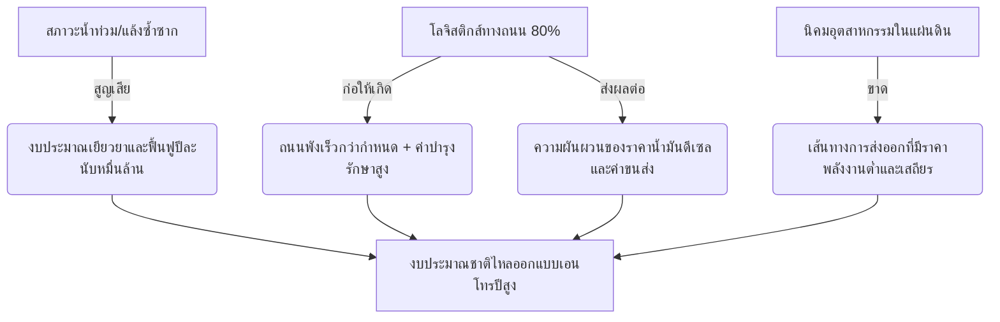
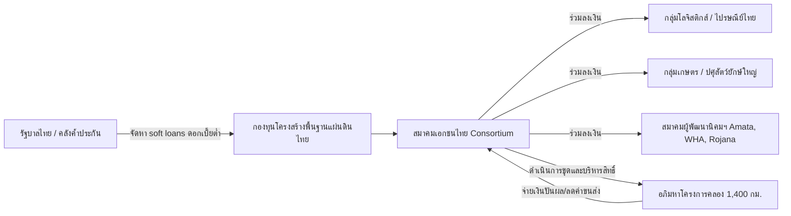

# ยุทธศาสตร์การประเมินความคุ้มค่าและแผนความเป็นไปได้: อภิมหาโครงการคลองส่งน้ำและโลจิสติกส์ในแผ่นดิน 1,400 กิโลเมตร
*(Inland Multi-Purpose Canal & Logistics Spine: 1,400 km Feasibility and Viability Study)*

**Date Added:** 2026-05-09
**Status:** 💡 Idea (ไอเดียตั้งต้น) / 📝 Pending Research (รอการวิจัยเพิ่มเติมเชิงลึก)
**Category:** Logistics / Macro-Economics / Disaster Management / Policy & Strategy

---

## บทสรุปผู้บริหาร (Executive Summary)

โครงการ **"คลองหลักสปีดอัจฉริยะแบบพหุประสงค์" (Inland Multi-Purpose Canal & Logistics Spine)** เป็นข้อเสนอเชิงนโยบายเพื่อปฏิรูปโครงสร้างกายภาพทางเศรษฐกิจของประเทศไทยแบบถาวร ด้วยการขุดคลองส่งน้ำสายหลักขนาดความยาวรวมประมาณ 1,400 กิโลเมตร พาดผ่านแนวดิ่งจากภาคเหนือตอนล่างและภาคกลางตอนบน เชื่อมโยงเข้าสู่ภาคตะวันออก (แหลมฉบัง/EEC) และเชื่อมต่อทางอ้อมกับแนวโครงข่ายคมนาคมคลองสายใต้ (Southern Waterway Alternative)

โครงการนี้ไม่เพียงแต่เป็นเส้นทางเดินเรือบาร์จ (Barge) ขนส่งสินค้าขนาด 2,000–3,000 ตัน (100-150 TEUs) ที่ประหยัดต้นทุนพลังงานกว่ารถบรรทุกถึง 85-90% แต่ยังทำหน้าที่เป็น **"ทางด่วนระบายน้ำหลาก" (Massive Floodway)** และ **"อ่างเก็บน้ำแนวเส้นก๋วยเตี๋ยว" (Linear Hydrological Reservoir)** เพื่อบริหารจัดการสภาวะสุดขั้วทางภูมิอากาศ (น้ำท่วม-น้ำแล้ง) ของประเทศแบบเบ็ดเสร็จ

ด้วยงบลงทุนโดยประมาณ **500,000 ล้าน ถึง 1,000,000 ล้านบาท** นโยบายนี้จะใช้วิธีปฏิวัติรูปแบบการระดมทุนผ่าน **"กลุ่มพันธมิตรเอกชนร่วมลงทุนนำโดยผู้มีส่วนได้ส่วนเสียหลัก" (State-Backed Private Consortium)** หลีกเลี่ยงอุปสรรคระบบราชการและการทุจริต และขับเคลื่อนด้วยแนวคิด **"หนี้สร้างการผลิต" (Productive Debt)** เพื่อเอาชนะเงินเฟ้อและหยุดยั้งภาระค่าซ่อมแซมความเสียหายทางกายภาพของประเทศอย่างถาวร

---

## 1. ปัญหาบนโลกจริงและข้อจำกัดปัจจุบัน (The Real-World Challenges)



*   **ภัยพิบัติวงจรลูปปิด:** ประเทศไทยต้องเสียงบประมาณในการบูรณะและเยียวยาภัยพิบัติน้ำท่วมปีละมหาศาล (ตัวอย่าง: มหาอุทกภัยปี 2554 ก่อความสูญเสียทางเศรษฐกิจกว่า 1.42 ล้านล้านบาท) ขณะเดียวกันในหน้าแล้ง ภาคการเกษตรและอุตสาหกรรมในแผ่นดินลึกไม่มีโครงสร้างกักเก็บน้ำที่ทั่วถึง
*   **ค่าซ่อมทางหลวงที่ไร้จุดจบ:** ปริมาณรถบรรทุกหนักกว่าหลายแสนคันต่อวันที่วิ่งบนโครงข่ายถนนหลวงสายหลักเพื่อนำส่งผลผลิตเกษตร (ข้าว, มันสำปะหลัง, ข้าวโพด) ป้อนสู่นิคมฯ ภาคกลางและท่าเรือแหลมฉบัง ทำให้อายุการใช้งานถนนสั้นลงอย่างรวดเร็ว งบซ่อมแซมถนนหลวงในแต่ละปีพุ่งสูงนับแสนล้านบาท ซึ่งเป็น "หนี้ผู้บริโภคสะสม" ที่ไม่ก่อให้เกิดการเติบโตทางเทคโนโลยี
*   **นิคมอุตสาหกรรมตอนลึกไร้ทางออกน้ำ:** นิคมฯ เช่น พิจิตร, นครสวรรค์, อ่างทอง ประสบปัญหาการแข่งขันเนื่องจากค่าขนส่งสินค้าทางถนนมีราคาแพงและควบคุมเวลาได้ยากในฤดูฝนที่มีปัญหาน้ำท่วมทางหลวง

---

## 2. นวัตกรรมการออกแบบคลองสายหลักพหุประสงค์ (Integrated Technical Specifications)

เพื่อก้าวข้ามข้อจำกัดของคลองแบบเดิม คลองความยาว 1,400 กิโลเมตรนี้จะถูกออกแบบในเชิงวิศวกรรมชลประทานและวิศวกรรมทางเรือให้ผสานเป็นหนึ่งเดียว:

### 2.1 มิติกายภาพของคลอง (Physical Dimensioning)
เพื่อให้เรือบาร์จ (Barge) ขนาดบรรจุ **2,000 - 3,000 ตัน** สองลำวิ่งสวนกันได้โดยมีระยะปลอดภัยภายใต้มาตรฐานการสัญจรทางน้ำสากล:

*   **ความกว้างท้องคลอง (Channel Bed Width):** 40 – 60 เมตร
*   **ความกว้างผิวน้ำ (Surface Width):** 80 – 120 เมตร (ออกแบบความลาดชันตลิ่ง 1:3 หรือ 1:4 เสริมความแข็งแกร่งตลิ่งด้วยพืชคลุมดินร่วมกับแผ่นใยสังเคราะห์คอมโพสิตและแผ่นบล็อกยางพารา)
*   **ความลึกสุทธิ (Water Depth):** 5 – 8 เมตร (ระดับความลึกกินน้ำของเรือบาร์จในแผ่นดินเฉลี่ยอยู่ที่ 3.5 เมตร ทำให้มีระยะใต้ท้องเรือปลอดภัยหรือ *Under Keel Clearance* สูงกว่า 1.5 - 2.5 เมตร เพื่อความปลอดภัยจากการไหลรบกวนตลิ่ง)
*   **ระบบประตูระบายน้ำแบบมีสถานีปั่นไฟฟ้าไมโครไฮโดร (Micro-Hydro Weir Power Generators):** ติดตั้งประตูปิดน้ำอัจฉริยะ (IoT-Controlled Sluice Gates) ทุก ๆ 30-50 กิโลเมตร เพื่อแบ่งเบาความต่างระดับพื้นที่ (Elevation Gradient) และสามารถสลับทิศทางระบายน้ำและปั่นพลังงานไฟฟ้าเลี้ยงระบบเซนเซอร์ตลอดทั้งแนวคลอง

### 2.2 หน้าที่แบบทวิลักษณ์ (Dual-Core Functionality)
1.  **ด้านโลจิสติกส์สีเขียวและโซ่ความเย็น (Green & Cold-Chain Logistics Spine):**
    *   **การขนส่งมวลหนักพลังงานต่ำด้วยเรือลากจูงไฟฟ้า (Electric Tugboats & Low-Energy Mass Transport):** ขนส่งสินค้าปริมาณมากในราคาเฉลี่ยต่อตันต่ำที่สุด เรือบาร์จ 1 ขบวน (ลากจูง 4 ลำพ่วง) สามารถบรรทุกสินค้าได้ถึง 10,000 ตัน โดยนโยบายนี้จะบังคับใช้ **เรือลากจูงพลังงานไฟฟ้าแบตเตอรี่ (Battery-Electric Tugboats)** ชาร์จไฟจากโซลาร์เซลล์ตลอดแนวคลอง แทนเครื่องยนต์ดีเซล ซึ่งสามารถนำไปขอรับการสนับสนุนเงินทุนและคาร์บอนเครดิตผ่านกลไก **JICA JCM (Joint Crediting Mechanism)** ร่วมกับประเทศญี่ปุ่นได้
    *   **การกระจายพลังงานความเย็นและท่อลำเลียงความเย็น (LNG Cold Energy & Micro-Cold Hubs):** บูรณาการเรือขนส่งก๊าซธรรมชาติเหลวขนาดเล็ก (Small-scale LNG Barges) วิ่งล่องตามแนวคลอง เพื่อนำพลังงานความเย็นเหลือทิ้ง (LNG Cold Energy Loop) ไปจ่ายให้กับเครือข่าย "ห้องเย็นน้อย" (Micro-Cold Storage) ที่ตั้งอยู่ตามจุด Inland Ports ริมคลอง ช่วยลดต้นทุนพลังงานให้แก่ระบบโลจิสติกส์สินค้าเกษตรและวัสดุชีวภาพ (เช่น สปอร์มอสส์และผลิตภัณฑ์รังนก) ได้อย่างมหาศาล
2.  **ด้านการคุมสมดุลน้ำ (Hydrological Balancing):**
    *   **ฤดูน้ำหลาก (Active Floodway Bypass):** ทำหน้าที่เป็นคลองเบี่ยงน้ำหลากจากลุ่มแม่น้ำยม-น่าน-เจ้าพระยา-ป่าสัก ตัดยอดน้ำทะลักเข้าสู่อ่างกักเก็บชั่วคราวและระบายสู่ทะเลตะวันออก ลดมวลน้ำที่จะไปกดทับกรุงเทพฯ และปทุมธานี
    *   **ฤดูน้ำแล้ง (Linear Water Reservoir):** ใช้ประตูน้ำ IoT กักเก็บน้ำไว้ในแต่ละเซกเมนต์ (Segmented Storage) ยาวรวมกว่า 1,400 กม. ทำหน้าที่เป็น "อ่างเก็บน้ำแก้มลิงแนวราบพาดผ่านประเทศ" เพื่อแจกจ่ายน้ำดิบให้เกษตรกรและอุตสาหกรรมในจังหวัดลึก ๆ เพาะปลูกได้ 3 รอบต่อปี

---

## 3. รูปแบบการลงทุนและโครงสร้างทางการเงินแบบพหุภาคี (PPP Stakeholder-Led Consortium)

ข้อจำกัดใหญ่ที่สุดของอภิมหาโครงการในอดีตคือ งบประมาณรัฐไม่เพียงพอและปัญหารอยรั่วไหล โครงการนี้จึงเสนอแนวคิด **"เจ้าของเงินคือผู้ใช้บริการจริง"** เพื่อให้เกิดความโปร่งใสสูงสุด



### 3.1 กลุ่มผู้ถือหุ้นหลักและ Consortium (Private Stakeholder Consortium)
รัฐบาลไทยเปิดสัมปทานรูปแบบ **PPP (Public-Private Partnership) สัญญาระยะยาว 50-99 ปี** โดยให้สมาคมเอกชนไทยที่ต้องใช้ถนนและนำเข้าส่งออกสินค้าเป็นหลักจัดตั้ง Consortium ร่วมกัน:
*   **กลุ่มโลจิสติกส์และผู้ส่งของชิ้นเล็กและใหญ่:** เช่น ไปรษณีย์ไทย, บริษัทพัสดุด่วนเอกชน, และสมาคมโลจิสติกส์และผู้รับจัดการขนส่งสินค้า (TIFFA) ร่วมลงทุนเพื่อเปลี่ยนเส้นทางการขนส่งทางไกลจากถนนลงสู่ศูนย์กระจายสินค้าทางน้ำ (Inland Port Terminal) ประหยัดค่าน้ำมันและลดอุบัติเหตุรถขนส่ง
*   **กลุ่มปศุสัตว์และเกษตรกรรมแปรรูปรายใหญ่:** เช่น กลุ่มผู้ผลิตอาหารสัตว์และอาหารแช่แข็งแปรรูปยักษ์ใหญ่ ลงเงินลงทุนเพื่อใช้คลองในการลำเลียงธัญพืชอาหารสัตว์ ข้าวเปลือก และมันสำปะหลังจากแหล่งเพาะปลูกลุ่มน้ำยม-น่าน ลงมายังโรงสีและโรงงานประกอบสูตรอาหารสัตว์ในภาคกลางและตะวันออก
*   **กลุ่มผู้พัฒนานิคมอุตสาหกรรม:** เช่น นิคมอมตะ, WHA, โรจนะ, นิคมในแผ่นดินลึก ร่วมจัดตั้งบริษัทพัฒนาอสังหาริมทรัพย์รอบจุดเชื่อมต่อท่าเรือบก (Inland Dry Ports) ของแนวคลอง

### 3.2 เครื่องมือทางการเงินเชิงกลยุทธ์ (Strategic Financial Engineering)
1.  **หนี้สร้างการผลิต (Productive Debt) เอาชนะเงินเฟ้อ:**
    > การกู้เงินเพื่อนำมาลงทุนในโครงสร้างพื้นฐานที่ลดรายจ่ายแผ่นดินถาวร (ค่าซ่อมถนนและค่าเคลมภัยพิบัติ) ถือเป็น "Productive Debt" การกู้เงินล้านล้านในวันนี้ตอนที่ดอกเบี้ยและค่าเงินยังไม่ผันผวนจากเงินเฟ้อระยะยาว ย่อมประหยัดกว่าการรอไปกู้ในอีก 10 ปีข้างหน้า ซึ่งค่าดิน ค่าปูน และค่าเครื่องจักรจะพุ่งสูงขึ้นตามอัตราเงินเฟ้อโลกอย่างรวดเร็ว (Time Value of Money - "เจ็บแต่จบ")
2.  **นโยบายรัฐค้ำประกันอัตราดอกเบี้ยต่ำ (State-Backed Soft Loans):** รัฐบาลจะใช้วิธีเป็นผู้ค้ำประกันการกู้เงินระหว่างประเทศหรือจัดหาเงินกู้ดอกเบี้ยต่ำผ่านธนาคารเพื่อการพัฒนา (เช่น ADB, AIIB หรือพันธบัตรออมทรัพย์พิเศษของไทยเอง) เพื่อส่งต่อทุนเหล่านี้ให้เอกชนกลุ่ม Consortium นำไปใช้ก่อสร้าง
3.  **กองทุนโครงสร้างพื้นฐานเปิด (Inland Waterway Infrastructure Fund):** ออกหน่วยลงทุนให้สถาบันการเงินในไทย กองทุนบำเหน็จบำนาญข้าราชการ (กบข.) ประกันสังคม และประชาชนทั่วไปได้ร่วมถือหุ้น โดยผู้ถือหุ้นจะได้รับเงินปันผลมั่นคงที่แปลงมาจากค่าผ่านด่านน้ำ (Toll Fee) และสิทธิ์สัมปทานพื้นที่ริมคลอง ช่วยให้อธิปไตยทางเศรษฐกิจของคลองเป็นของคนไทยอย่างแท้จริง ปราศจากการแทรกแซงจากกองทุนข้ามชาติที่มีเจตนาฮุบที่ดินหรืออธิปไตยของประเทศ

---

## 4. กลยุทธ์ภูมิรัฐศาสตร์เชิงรุก: "การขายเวลาและการประหยัดพลังงาน" (Time-Savings Arbitrage)

สำหรับประเทศมหาอำนาจหรือประเทศพัฒนาแล้วที่มีความมั่นคงทางอาหารอยู่แล้ว (เช่น ยุโรปตะวันตก สหรัฐฯ หรือญี่ปุ่น) การเสนอขายผลผลิตทางการเกษตรอาจไม่ใช่แรงจูงใจที่ทรงพลังพอ ดังนั้นประเทศไทยจะเสนอขายสิ่งที่มีค่ายิ่งกว่าเงินตราในห่วงโซ่อุปทานโลก นั่นคือ **"เวลาและเสถียรภาพการขนส่ง" (Time and Supply Chain Stability)**

```
             🚚 โหมดขนส่งดั้งเดิม (ถนน): ติดขัดง่าย, ค่าน้ำมันดีเซลผันผวน, ล่าช้าสะสม
             [============================= ถนนหลวงพังง่าย =============================>]

             ⛴️ โหมดคลองชลประทาน UET: เดินเรือเรียบเป็นระบบ, ควบคุมเวลาได้ 100%, พลังงานขับเคลื่อนต่ำ
             [============== คลองตรง 1,400 กม. / ความแม่นยำทางเวลาสูง =============>] (ประหยัดเวลาขนถ่ายได้ 48-72 ชม.)
```

*   **Time-Savings Arbitrage (การทำกำไรจากเวลาที่ประหยัดได้):** คลองแผ่นดินนี้เมื่อขุดตรงขึ้นสู่ภาคเหนือตอนล่างและเชื่อมต่อกับเส้นทางระเบียงเศรษฐกิจ จะลดความซับซ้อนในด่านตรวจและการติดขัดบนท้องถนนในเขตเมืองหลวงลงได้เกือบทั้งหมด ขจัดปัญหาการขนส่งช้าเนื่องจากอุบัติเหตุหรือภัยแล้ง สินค้าจะเดินทางเป็นระบบควบคุมเวลาได้เกือบ 100% ทำให้บริษัทเทคโนโลยีระดับโลกที่เน้นการผลิตแบบ **Just-In-Time (JIT)** ยินดีจะย้ายฐานการผลิตมาอยู่ริมคลองของเราเพราะความเสี่ยงในห่วงโซ่อุปทาน (Supply Chain Risk) ลดลงจนเข้าใกล้ศูนย์
*   **ช่องทางสิทธิพิเศษทางการค้าสำหรับประเทศผู้ร่วมทุน:** รัฐบาลจะมอบสิทธิ์ "ช่องทางผ่านด่วนอัจฉริยะ" (Priority Green Lane) ผ่านคลองสายย่อยและระบบตู้สินค้าปลอดภาษีริมคลอง ให้กับประเทศมหาอำนาจที่นำเอาเทคโนโลยีขั้นสูง เช่น เครื่องจักรอัจฉริยะ ซอฟต์แวร์วิศวกรรมสะอาดบริสุทธิ์ หรือระบบลิทอกราฟี (Lithography) มาตั้งโรงงานร่วมทุนกับเอกชนไทย

---

## 5. การบูรณาการเชิงลึกร่วมกับนิคมอุตสาหกรรมในแผ่นดิน (Landlocked Industrial Estate Integration)

คลอง 1,400 กิโลเมตรนี้ จะพาดผ่านและเชื่อมโยงโดยตรงเข้าสู่พื้นที่นิคมอุตสาหกรรมในแผ่นดินที่เดิมทีถูกตัดขาดจากชายฝั่งทะเล ให้กลายเป็น **"เมืองท่าในแผ่นดินอันทรงเกียรติ" (Premium Inland Port Cities)**:

```
[ แหล่งเพาะปลูกข้าว/มัน/เกลือ ] -> (ขนทางเรือบาร์จระยะสั้น) -> [ นิคมฯ พิจิตร / นครสวรรค์ / อ่างทอง ] -> (แปรรูปเป็นไฮเทคซีลิคอน/แบตเตอรี่) -> (ขนเรือบาร์จระยะไกลเลี่ยงเมืองหลวง) -> [ ท่าเรือแหลมฉบัง / EEC ]
```

### 5.1 สถานีและเส้นทางเชื่อมต่อสำคัญ (Key Hubs & Corridors)
1.  **นิคมอุตสาหกรรมพิจิตร (จังหวัดพิจิตร) — Hub แปรรูปเกษตรมูลค่าสูงด้านเหนือ:**
    *   **การปฏิรูปโลจิสติกส์:** เชื่อมต่อคลองโดยตรงสู่ท่าเรือรับสินค้าเกษตร (Agricultural Port Terminal) นำเข้าข้าวเปลือกและมันสำปะหลังจากลุ่มน้ำยม-น่าน
    *   **อุตสาหกรรมเป้าหมาย:** โรงงานผลิตซิลิคอนบริสุทธิ์สูงจากซิลิกาแกลบข้าว และการสังเคราะห์อาหารโปรตีนสัตว์จำพวกเซลล์เดียว (Single-Cell Protein) จากเปลือกและของเสียการเกษตร
2.  **นิคมอุตสาหกรรมแอลพีพี นครสวรรค์ (จังหวัดนครสวรรค์) — Hub เคมีชีวภาพและอุตสาหกรรมสีเขียว:**
    *   **การปฏิรูปโลจิสติกส์:** ตั้งอยู่ที่ปากน้ำโพ จุดนัดพบของน้ำสี่สาย นครสวรรค์จะเปลี่ยนบทบาทจาก "ทางผ่าน" เป็น "สถานีรวบรวมสินค้าทางน้ำที่ใหญ่ที่สุดในภาคกลางตอนบน" (Gateway Inland Port)
    *   **อุตสาหกรรมเป้าหมาย:** การผลิตพลาสติกชีวภาพแปรรูป (PLA) และการสังเคราะห์วัสดุกราฟีนเขียวจากก๊าซชีวภาพและของเสียเกษตรกรรม
3.  **นิคมอุตสาหกรรมเอส อ่างทอง (จังหวัดอ่างทอง) — Hub อุตสาหกรรมอาหารและพลังงานชีวภาพภาคกลาง:**
    *   **การปฏิรูปโลจิสติกส์:** คลองจะทำหน้าที่ดึงน้ำจืดบริสุทธิ์ป้อนโรงงานแปรรูปอาหารเกรดพรีเมียม และขนส่งตู้สินค้าแช่เย็น (Reefer Barges) วิ่งตรงสู่ท่าเรือแหลมฉบังโดยไม่ต้องพึ่งพารถบรรทุกห้องเย็นบนถนนสายเอเชียที่การจราจรติดขัดหนาแน่น

### 5.2 แผนการพัฒนาระยะยาว (Phased Roadmap)

เพื่อให้การขับเคลื่อนงบประมาณและการพัฒนาทางกายภาพสอดรับกับความพร้อมทางการเงิน โครงการนี้จึงกำหนดการดำเนินงานโดยเน้นเฉพาะ **"โครงข่ายภายในประเทศ (Domestic Spine)"** เพื่อเป็นกระดูกสันหลังทางเศรษฐกิจ:

```
[ Phase 1: Domestic Core Spine ]
  ├── ระบบคลองในประเทศยาว 1,400 กม. เต็มระบบ (พิจิตร - นครสวรรค์ - อ่างทอง - แหลมฉบัง)
  ├── อ่างเก็บน้ำแนวเส้นก๋วยเตี๋ยวและระบบกั้นสมดุลอุทกวิทยาภาคกลาง
  └── ฮับท่าเรือบก (Inland Dry Ports) ใน 3 นิคมอุตสาหกรรมแผ่นดินตอนใน
```

#### 5.2.1 Phase 1 — คลองแกนหลักสมดุลน้ำและโลจิสติกส์ภายในประเทศ (Domestic Spine Baseline)
เน้นการขุดแนวคลองหลัก 1,400 กิโลเมตรจากเหนือตอนล่างสู่ภาคตะวันออก พร้อมติดตั้งระบบประตูปิดน้ำ IoT และการเชื่อมต่อโดยตรงกับ 3 นิคมอุตสาหกรรมหลัก (พิจิตร, นครสวรรค์, อ่างทอง) เพื่อสร้าง "วงจรเศรษฐกิจความถ่วงจำเพาะสูง" (High-Density Economic Loop) ที่ทำหน้าที่ปกป้องเมืองหลวงจากน้ำท่วมและป้อนวัตถุดิบสู่แหลมฉบังอย่างไร้รอยต่อ โดย **ไม่มีการสร้างแนวคลองข้ามเขตภูเขาสูง** หรือข้ามพรมแดนที่ขัดต่อหลักอุณหพลศาสตร์และภูมิศาสตร์กายภาพ

---

## 6. การวิเคราะห์อุณหพลศาสตร์ระบบควบคุมตามทฤษฎี UET (UET Thermodynamic System Analysis)

ในมุมมองของ **Unity Equilibrium Theory (UET)** โครงสร้างพื้นฐานทางฟิสิกส์ไม่ใช่แค่สิ่งปลูกสร้างที่วางบล็อกปูน แต่คือ **"ตัวควบคุมทิศทางการไหลของข้อมูลและเอนโทรปีของชาติ" (National Information & Entropy Flow Regulator)**:

### 6.1 การลดอัตราการสร้างเอนโทรปีของโครงข่ายขนส่ง (Entropy Rate Minimization)
เมื่อวิเคราะห์ระบบขนส่งด้วยสมการอัตราการเกิดเอนโทรปีรวม ($dS_{\text{total}}/dt$):

$$\frac{dS_{\text{total}}}{dt} = \frac{dQ_{\text{frictional}}}{T \cdot dt} + \frac{dS_{\text{combustion}}}{dt}$$

*   **โหมดดั้งเดิม (รถบรรทุกทางถนน):** มีค่าแรงเสียดทานจลน์สัมผัสยางรถกับผิวถนนสูงมาก ($Q_{\text{frictional}}$ สูง) และมีการใช้เชื้อเพลิงฟอสซิลในการสร้างแรงบิดเอาชนะแรงเสียดทานสูง ก่อให้เกิดอัตราเอนโทรปีและความร้อนสะสมสูงสู่ชั้นบรรยากาศ ทรัพยากรระบบถนนพังทลายอย่างรวดเร็ว
*   **โหมดคลองชลประทาน UET:** น้ำมีบทบาทเป็นตัวหล่อลื่นที่มีความเสียดทานต่ำมากตามหลักกลศาสตร์ของไหล เรือบาร์จขนาดใหญ่ที่เคลื่อนที่อย่างสม่ำเสมอสร้างเอนโทรปีจากการขนส่งลดลงถึง **90% ต่อหน่วยน้ำหนักตัน-กิโลเมตร** ทำให้ระบบเศรษฐกิจชาติมีเสถียรภาพ ไม่สูญเสียพลังงานงานเชิงกลไปกับการสั่นสะเทือนและการสึกหรอของผิวถนน

### 6.2 การใช้มวลน้ำปรับระดับความเสถียรของความผันผวน (Thermodynamic Volatility Buffer)
น้ำหลากและน้ำแล้งคือสภาวะเอนโทรปีสุดขั้วในมิติอุณหพลศาสตร์ (Thermal & Mass Volatility):
*   การขุดคลองที่สามารถเซกเมนต์หรือแบ่งตอนด้วยประตูปิดน้ำ IoT คือการแปลงระบบกึ่งเปิดให้กลายเป็นระบบกักเก็บความดันเชิงอุทกศาสตร์แบบสมดุลพลังงานคงที่ (Hydrologically Isochoric System)
*   มวลน้ำมหาศาลที่ถูกบริหารอย่างอัจฉริยะจะทำหน้าที่เป็น **"แหล่งรับความร้อนและความชื้นสำรอง" (Massive Heat & Moisture Sink)** ควบคุมสภาพภูมิอากาศจุลภาค (Microclimate) รอบสองข้างแนวคลอง ป้องกันพื้นที่ดินเค็มด้วยการรักษาสมดุลระดับความต่างของน้ำใต้ดิน (Hydraulic Head Equilibrator)

---

## 7. สิ่งที่ต้องวิจัยเพิ่มในอนาคต (Future Research Needs)

1.  **การวิจัยแบบจำลองอุทกพลศาสตร์สามมิติ (3D Hydrodynamic Simulation):** เพื่อทดสอบจำลองพฤติกรรมการไหลและการป้องกันตลิ่งพังทลายภายใต้กระแสน้ำช่วงมรสุมหลากสูงสุด ผ่านการจำลองร่องน้ำเสมือนจริงในโมเดลคอมพิวเตอร์
2.  **การจัดทำเกณฑ์การกู้เงินและการโอนสัมปทานสิทธิ์พื้นที่ชายคลอง (Consortium Concession Framework):** ออกแบบกฎหมายและข้อบังคับพิเศษเพื่อให้สมาชิก Consortium มีสิทธิ์บริหารพื้นที่เชิงพาณิชย์และการตั้งท่าเรือย่อยในระยะทางที่กำหนด เพื่อจูงใจให้ผู้เล่นยักษ์ใหญ่ตัดสินใจลงทุนอย่างรวดเร็ว
3.  **การพัฒนาระบบควบคุมกระแสน้ำแบบกึ่งอัตโนมัติ (AI-Driven Riverway Control):** พัฒนาระบบโครงข่ายสมองกลวิเคราะห์ระดับน้ำ ความเค็ม และตำแหน่งเรือบาร์จแบบ Real-Time เพื่อควบคุมประตูปิดน้ำและเครื่องปั่นไฟไมโครโดรตลอดความยาว 1,400 กิโลเมตร

---

## 8. แหล่งอ้างอิงและหัวข้อ UET ที่เกี่ยวข้อง (References & UET Connections)

*   *PIANC Report No. 121-2014: Guidelines for Fairway Dimensions in Inland Waterways.*
*   *Coastal Engineering Research Center (CERC) Longshore Sediment Transport Formulations.*
*   **UET Topic 0.39**: Bio-Smart Water City (การจัดสมดุลผังเมืองและอุทกวิทยาสะสมพลังงาน)
*   **UET Topic 0.24**: Applied Systems Thermodynamics and Entropy Flow Dynamics (การบริหารข้อมูลและเอนโทรปีของชาติ)

---

## 9. ยุทธศาสตร์เชื่อมโยง: คลองและน้ำสะอาดเพื่อวนเกษตร-ฟาร์มนกนางแอ่น (Canal Water as Agricultural & Swiftlet Ecosystem Support)

โครงสร้างพื้นฐานของคลองสายหลัก 1,400 กม. ไม่ได้จำกัดแค่โลจิสติกส์และการระบายน้ำ แต่ยังเป็น **"เส้นเลือดใหญ่แห่งระบบนิเวศเกษตร"** สำหรับยุทธศาสตร์สนับสนุน:

### 9.1 น้ำสะอาดเพื่อระบบนิเวศวนเกษตร-นกนางแอ่น (Canal-Supported Swiftlet Agroforestry)
*   น้ำดิบจากคลองที่ผ่านระบบกรองกึ่งอุตสาหกรรม (Micro-filtration Stations) ริมคลองสามารถจ่ายให้พื้นที่วนเกษตรและฟาร์มนกนางแอ่นที่ตั้งอยู่ตามเส้นคลองโดยตรง ลดต้นทุนน้ำเพื่อการดูแลต้นไม้ร่มเงาและความชื้นในฟาร์มนก
*   **พลังงานความเย็นจาก LNG (Cold Energy for Micro-Cold Hubs):** ความเย็นเหลือทิ้งจากสถานี LNG ริมคลอง (ดูหัวข้อ 2.2) สามารถใช้เป็นระบบควบคุมอุณหภูมิ (Evaporative Cooling) ในฟาร์มนกนางแอ่นเพื่อรักษาความชื้นอากาศสูง (>80% RH) ที่นกต้องการ — เชื่อมโยงกับ **[04_industry_and_production/thailand_resource_industry_map.md (หัวข้อ 2.6.1, 2.6.5)](../04_industry_and_production/thailand_resource_industry_map.md)**

### 9.2 น้ำเพื่อฟาร์มผักแนวตั้งในอาคารร้างชานเมือง (Canal Water for Urban Vertical Farms)
*   อาคารร้างที่อยู่ตามแนวคลองและเส้นทางโลจิสติกส์สามารถเชื่อมต่อท่อส่งน้ำดิบจากคลองเพื่อเลี้ยงฟาร์มผักแนวตั้ง (Vertical Farm) ลดต้นทุนน้ำได้อย่างมาก
*   ยุทธศาสตร์การฟื้นฟูอาคารร้างชานเมืองนี้อธิบายอย่างละเอียดใน **[04_industry_and_production/thailand_resource_industry_map.md (หัวข้อ 2.6.5)](../04_industry_and_production/thailand_resource_industry_map.md)**
