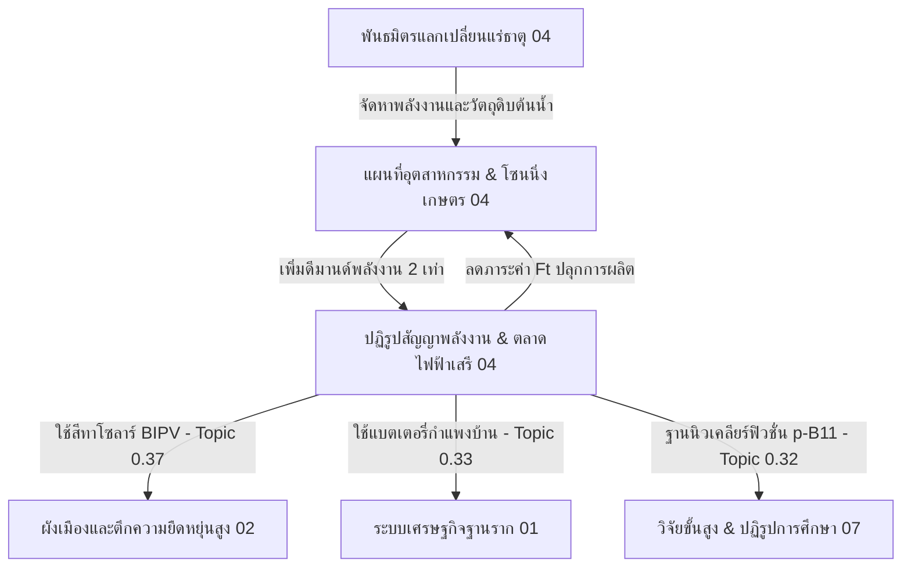

# 04. พลังงาน ทรัพยากรธรรมชาติ และอุตสาหกรรมในประเทศ (Industry & Production)

ยินดีต้อนรับสู่ส่วนจัดการข้อเสนอเชิงระบบด้านพลังงาน การพัฒนาอุตสาหกรรม และการใช้ประโยชน์ทรัพยากรธรรมชาติของประเทศไทย (`04_industry_and_production`) ตามแนวคิดทฤษฎี **Unity Equilibrium Theory (UET)**

โฟลเดอร์นี้รวบรวมข้อเสนอและแผนยุทธศาสตร์เพื่อสร้างอธิปไตยทางอุตสาหกรรมและสิ่งแวดล้อมที่ยั่งยืน โดยครอบคลุมหัวข้อดังต่อไปนี้:

---

## 📋 สารบัญข้อเสนอเชิงระบบ (Proposal Index)

### 1. ยุทธศาสตร์ทรัพยากรและการโซนนิ่งอุตสาหกรรมขั้นสูง (Resource & Industrial Mapping)
*   **[แผนที่ทรัพยากรและยุทธศาสตร์อุตสาหกรรมขั้นสูงเชิงพื้นที่ของประเทศไทย](thailand_resource_industry_map.md)** (`thailand_resource_industry_map.md`): เสนอการโซนนิ่งพืชเกษตรกรรมเชิงอุตสาหกรรม (พืชกลุ่ม A, B, C) ยุทธศาสตร์ "โปรตีนราคาถูกเพื่อประชาชน" เพื่อลดอัตราการเกิดโรค NCDs การปฏิรูปป่าไม้หุบเขาภาคเหนือ และแผนงานโครงข่ายคูน้ำมหาภาคเชื่อมการเดินทางน้ำแบบแรงเสียดทานต่ำ

### 2. นโยบายความมั่นคงและกลไกการแลกเปลี่ยนทรัพยากรระดับโลก (Global Alliances & Security)
*   **[ยุทธศาสตร์พันธมิตรต่างตอบแทนและจัดหาทรัพยากรระดับโลกเพื่อความมั่นคงทางอุตสาหกรรม](global_resource_barter_alliance.md)** (`global_resource_barter_alliance.md`): กรอบนโยบายเชิงสัญญากลางเพื่อการแลกเปลี่ยนทรัพยากรแร่ธาตุ ปุ๋ย และการจัดหาเทคโนโลยีประมวลผล AI กับมหาอำนาจ เพื่อความมั่นคงทางเทคโนโลยีและเศรษฐกิจ

### 3. นโยบายพลังงานและการเปลี่ยนผ่านสู่ตลาดไฟฟ้าเสรีสีเขียว (Energy Contract & Grid Reform)
*   **[นโยบายควบคุมมาตรฐานสิ่งแวดล้อมเพื่อปฏิรูปสัญญารับซื้อไฟฟ้าล้นระบบและการเปลี่ยนผ่านสู่ตลาดเสรีพลังงานสะอาด](energy_contract_reform.md)** (`energy_contract_reform.md`): นโยบายการแก้ปัญหาสัญญาซื้อขายไฟฟ้า (PPA) แบบ Take-or-Pay และค่าความพร้อมจ่าย (AP) โดยใช้เกณฑ์มาตรฐานสิ่งแวดล้อมและภาษีคาร์บอนเหนี่ยวนำให้เกิดการผิดสัญญาฝั่งผู้ขาย เพื่อยกเลิกสัญญาเก่าที่เป็นภาระโดยชอบด้วยกฎหมาย ควบคู่กับการผลักดัน BIPV (สีทาโซลาร์ Perovskite-Graphene), โซลาร์บ้าน + แบตเตอรี่ผนัง, พลังงานน้ำสูบกลับ และการเปลี่ยนผ่านฐานพลังงาน Baseload สู่ไมโครนิวเคลียร์ฟิวชั่น (p-B11) เพื่อรองรับดีมานด์ที่สูงขึ้น 2 เท่าจากภาคอุตสาหกรรมใหม่

---

## 🔗 ความสัมพันธ์ระหว่างนโยบาย (Inter-policy Connections)

