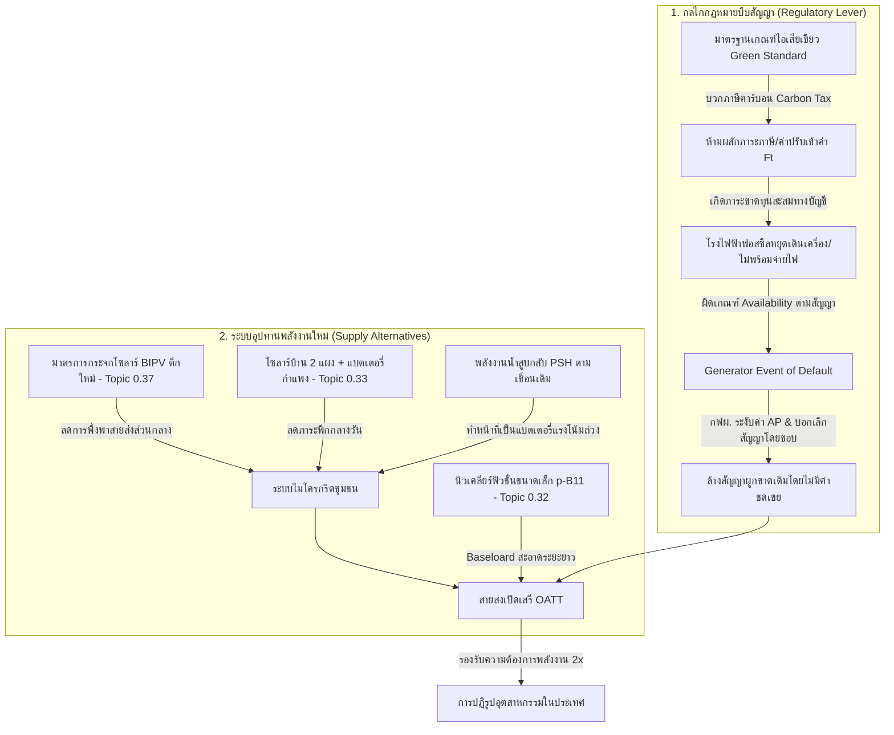

# นโยบายควบคุมมาตรฐานสิ่งแวดล้อมเพื่อปฏิรูปสัญญารับซื้อไฟฟ้าล้นระบบและการเปลี่ยนผ่านสู่ตลาดเสรีพลังงานสะอาด (PPA Overcoming through Environmental Regulatory Levers & Industrial Synergy)

**Date Added:** 2026-07-07  
**Status:** 💡 Idea (ไอเดียตั้งต้น)  
**Category:** Energy Policy / Economic Reform / Industrial Alignment / UET Systems

---

## 1. ปัญหาบนโลกจริง (The Real-world Problem)

### 1.1 กับดักสัญญาพลังงานผูกขาดและภาระค่าความพร้อมจ่ายล้นระบบ (PPA Lock-in & Availability Payment Drain)
* **กลไกสัญญา "ไม่ซื้อก็ต้องจ่าย" (Take-or-Pay):** โครงสร้างการซื้อขายไฟฟ้าระหว่างการไฟฟ้าฝ่ายผลิตแห่งประเทศไทย (กฟผ.) กับผู้ผลิตไฟฟ้าเอกชนรายใหญ่ (IPP) และรายเล็ก (SPP) ถูกผูกมัดด้วยสัญญาระยะยาว 20-25 ปี ซึ่งประกอบด้วย **ค่าความพร้อมจ่าย (Availability Payment: AP)** ซึ่งครอบคลุมต้นทุนคงที่ (Fixed Costs) เช่น ค่าก่อสร้าง เงินกู้ดอกเบี้ย และกำไรขั้นต่ำของผู้ประกอบการ โดยรัฐมีภาระต้องจ่ายเงินส่วนนี้ให้โรงไฟฟ้าเอกชนทุกเดือนแม้โรงไฟฟ้าเหล่านั้นจะไม่ได้เดินเครื่องจ่ายไฟฟ้าเลยก็ตาม
* **วิกฤตปริมาณไฟฟ้าสำรองล้นระบบ (Overcapacity Reserve):** ประเทศไทยมีระดับกำลังการผลิตไฟฟ้าสำรองสูงเกินเกณฑ์มาตรฐานสากล (ซึ่งควรอยู่ที่ 15-20%) โดยในปัจจุบันพุ่งสูงถึง 40-50% ส่งผลให้โรงไฟฟ้าเอกชนฟอสซิลจำนวนมากปิดเครื่องอยู่นิ่ง แต่ประชาชนยังต้องแบกรับภาระค่า AP ที่ถูกส่งผ่านเข้าสู่ **ค่าไฟฟ้าผันแปร (Ft)** ในบิลค่าไฟทุกเดือน กลายเป็นกลไกดูดซับสภาพคล่องจากฐานรากไปสู่ทุนพลังงานอย่างไม่เป็นธรรม (Rent-seeking)
* **การส่งผ่านต้นทุนที่ไร้ความเสี่ยง (Risk-free Cost Pass-Through):** สูตรการคำนวณค่าไฟฟ้าฐานและ Ft ของไทยยอมให้ผู้ประกอบการโรงไฟฟ้าส่งผ่านต้นทุนเชื้อเพลิงและภาษีเกือบทั้งหมดไปยังผู้บริโภค ทำให้โรงไฟฟ้าเอกชนไม่มีแรงจูงใจในการปรับปรุงประสิทธิภาพเครื่องจักร หรือการเปลี่ยนผ่านสู่พลังงานสะอาด เนื่องจากไม่มีความเสี่ยงทางธุรกิจ

### 1.2 ข้อจำกัดทางอุตุนิยมวิทยาและภูมิศาสตร์ของประเทศไทย (Meteorological & Geological Constraints)
* **ข้อจำกัดของพลังงานหมุนเวียนแบบดั้งเดิม (Solar Intermittency):** ประเทศไทยมีลักษณะภูมิอากาศแบบ "ฝน 8 แดด 4" (โดยเฉพาะภาคใต้) และมีมรสุมปกคลุมเกือบทั้งปี ทำให้พลังงานแสงอาทิตย์ (Solar PV) เผชิญความไม่เสถียรสูง (Intermittency) ไม่สามารถทำหน้าที่เป็นพลังงานฐาน (Baseload) ได้หากไม่มีระบบกักเก็บพลังงานที่มีประสิทธิภาพ
* **ข้อจำกัดเชิงภูมิศาสตร์สำหรับพลังงานน้ำ (Geological Hydro Limitations):** ภูมิประเทศส่วนใหญ่ของไทยมีความต่างระดับความสูงน้อย (Flat Terrain) เมื่อเทียบกับประเทศจีนหรือนอร์เวย์ ทำให้ไม่สามารถสร้างเขื่อนไฟฟ้าพลังน้ำขนาดใหญ่ที่มีแรงตกน้ำสูงเพื่อป้อนพลังงานปริมาณมหาศาลได้ พลังงานน้ำจึงทำหน้าที่ได้เพียงแหล่งจ่ายเสริมในช่วงพีก (Peak Shaving) ผ่านโรงไฟฟ้าพลังน้ำสูบกลับ (Pumped-Storage Hydropower) เท่านั้น

---

## 2. ข้อเสนอเชิงนโยบายยุทธศาสตร์ชาติ (Proposed Solution & Policy)

เพื่อปลดล็อกกับดักสัญญาสัมปทานพลังงานผูกขาดโดยไม่ละเมิดข้อตกลงจนเกิดการฟ้องร้องทางอนุญาโตตุลาการ นโยบายนี้เสนอ **"กลไกบังคับใช้เกณฑ์มาตรฐานสิ่งแวดล้อมเพื่อเหนี่ยวนำให้เกิดการผิดสัญญาฝั่งผู้ขาย" (Regulatory-Induced Generator Default)** ควบคู่กับการจัดหาแหล่งพลังงานสะอาดทดแทนตามแนวทาง UET 4 มิติหลักดังนี้:

### 2.1 กลไกกฎหมายมาตรฐานไอเสียสีเขียวและภาษีคาร์บอนห้ามส่งผ่านต้นทุน (Green Emission Standard & Non-Pass-Through Rule)
1. **การกำหนดมาตรฐานปริมาณการปล่อยก๊าซคาร์บอนสูงสุดรายโรง (Green Emission Ceiling):** กำหนดขีดจำกัดปริมาณการปล่อยก๊าซเรือนกระจกต่อหน่วยพลังงาน ($gCO_2/kWh$) สำหรับโรงไฟฟ้าที่เชื่อมโยงกับระบบสายส่งแห่งชาติ โดยเกณฑ์มาตรฐานนี้จะปรับลดระดับลงอย่างเข้มงวดทุกปีตามเป้าหมายความเป็นกลางทางคาร์บอน
2. **การจัดเก็บภาษีคาร์บอน ณ แหล่งกำเนิด (Carbon Tax at Generation Source):** เก็บภาษีคาร์บอนจากปริมาณก๊าซเรือนกระจกที่ปล่อยจริงจากการเผาไหม้เชื้อเพลิงฟอสซิลในโรงไฟฟ้า
3. **การประกาศกฎเหล็กห้ามส่งผ่านภาษีสิ่งแวดล้อมไปยัง Ft (Non-Pass-Through of Environmental Penalties):** ปรับปรุงหลักเกณฑ์โครงสร้าง Ft โดยออกข้อบัญญัติห้ามนำต้นทุนที่เกิดจากภาษีคาร์บอนและค่าปรับจากการไม่ปฏิบัติตามมาตรฐานสิ่งแวดล้อม มารวมในสูตรส่งผ่านค่าพลังงานไฟฟ้าผันแปรไปยังประชาชน โรงไฟฟ้าเอกชนฟอสซิลที่ไร้ประสิทธิภาพจะต้องแบกรับภาระภาษีนี้ไว้ในงบกำไรขาดทุนของตนเอง 100%

### 2.2 การเหนี่ยวนำให้เกิด "เหตุผิดสัญญาฝั่งผู้ขาย" (Regulatory-Induced Generator Default Trigger)
* **การกดดันจนสิ้นสภาพความพร้อมจ่าย:** เมื่อโรงไฟฟ้าฟอสซิลแบบดั้งเดิม (เช่น ถ่านหินเกรดต่ำ หรือโรงไฟฟ้าก๊าซธรรมชาติประสิทธิภาพต่ำ) เผชิญกับภาระภาษีคาร์บอนที่ไม่สามารถส่งผ่านได้ จะส่งผลให้กระแสเงินสดติดลบและขาดทุนสะสม จนไม่สามารถจัดหาเชื้อเพลิงหรือบำรุงรักษาอุปกรณ์ให้พร้อมทำหน้าที่ตามคำสั่งระบบได้
* **การบังคับใช้กฎหมายปิดตัว/เพิกถอนใบอนุญาต (Licensing Decoupling):** หากโรงไฟฟ้าไม่ยอมปรับปรุงมาตรฐานสิ่งแวดล้อมจนถูกหน่วยงานรัฐสั่งระงับการเดินเครื่องชั่วคราวหรือเพิกถอนใบอนุญาตการผลิตพลังงาน
* **การเข้าเกณฑ์ผิดสัญญา (Default Climax):** ในสัญญา PPA ระบุว่าหากผู้ขายไม่สามารถประกาศ **ความพร้อมจ่ายไฟ (Declared Availability)** หรือสูญเสียสิทธิ์ตามใบอนุญาตในการดำเนินงานผลิตไฟฟ้าติดต่อกันเกินระยะเวลาที่กำหนด (เช่น 15-30 วัน) จะถือเป็น **"เหตุผิดสัญญาฝั่งผู้ผลิต (Generator Event of Default)"** 
* **ผลลัพธ์ทางกฎหมาย:** กฟผ. มีสิทธิ์โดยชอบตามสัญญาในการ:
  1. ระงับการจ่ายค่าความพร้อมจ่าย (AP) เป็นศูนย์ทันที
  2. ยกเลิกสัญญาซื้อขายไฟฟ้าระยะยาว (PPA) ทั้งหมดโดยรัฐไม่ต้องเสียเงินค่าชดเชยการเลิกสัญญา (Termination Compensation) หรือค่าโง่สัมปทาน

### 2.3 แผนจัดหาอุปทานพลังงานทางเลือกหลากหลายและกระจายศูนย์ (Multi-pronged Clean Energy Supply)
เพื่อรองรับความต้องการใช้ไฟฟ้าที่จะเพิ่มขึ้นเป็น 2 เท่า ($2\times$) จากมาตรการปฏิรูปอุตสาหกรรมในประเทศและการย้ายฐานอุตสาหกรรมขั้นสูง รัฐบาลจะผลักดันระบบพลังงานสีเขียวคู่ขนานดังนี้:
1. **มาตรฐาน BIPV (Building-Integrated Photovoltaics) สำหรับอาคารใหม่:** กำหนดให้การขออนุมัติก่อสร้างอาคารพาณิชย์และตึกสูงแห่งใหม่ในเขตผังเมืองอัจฉริยะ ต้องติดตั้งกระจกอาคารและผนังภายนอกที่เคลือบสารผลิตพลังงานแสงอาทิตย์ (ใช้เทคโนโลยี **[Topic 0.37: Quantum Photovoltaics / Acoustic Solar Paint](../../docs/topics/0.37_Quantum_Photovoltaics/README.md)**) ในสัดส่วนไม่ต่ำกว่า 30% ของพื้นที่สัมผัสแดดทั้งหมด เพื่อรีดเอนโทรปีแสงอาทิตย์สะท้อนรอบตัวตึกมาแปลงเป็นพลังงานลดภาระแอร์
2. **โครงการโซลาร์ครัวเรือนจับคู่แบตเตอรี่ผนังบ้าน (Distributed Household Solar + Wall Battery):** สนับสนุนเงินทุนและมาตรการลดหย่อนภาษีให้ประชาชนติดตั้งแผงโซลาร์เซลล์ขนาดเล็กจำนวน 2 แผงต่อครัวเรือน ควบคู่กับระบบแบตเตอรี่เก็บไฟฟ้าชนิดติดตั้งบนกำแพงบ้าน (Home Battery Wall ที่พัฒนาต่อยอดจากวัสดุขั้วแอโนดซิลิคอนและเทคโนโลยี SEI อัจฉริยะใน **[Topic 0.33: Battery Materials](../../docs/topics/0.33_Battery_Tech/README.md)**) เพื่อลดพลังงานพีกกลางวันและเสริมเสถียรภาพระบบกริดย่อย
3. **การดึงดูดห่วงโซ่อุปทานการผลิตแบตเตอรี่และโซลาร์เซลล์สีเขียว (Supply Chain Localization):** ใช้เงื่อนไขความต้องการแผงโซลาร์เซลล์และแบตเตอรี่มหาศาลในประเทศ เหนี่ยวนำให้บริษัทผู้ผลิตชั้นนำจากประเทศจีนเข้ามาตั้งฐานการผลิตและแปรรูปในไทย โดยกำหนดเงื่อนไขให้ต้องใช้ชิ้นส่วนในประเทศ (Local Content) และถ่ายทอดกระบวนการพิมพ์แผง Perovskite แบบม้วน (Roll-to-Roll Acoustic Manufacturing) เพื่อสร้างการพึ่งตนเองทางอุตสาหกรรมในระยะยาว
4. **ระบบพลังงานน้ำสูบกลับเพื่อการกักเก็บแรงโน้มถ่วง (Gravitational Battery Hydro-Pumped Storage):** เร่งรัดการเปลี่ยนผ่านเขื่อนชลประทานและอ่างเก็บน้ำขนาดกลาง-ใหญ่เดิมที่มีอยู่ทั่วประเทศ ให้ติดตั้งระบบปั๊มน้ำสูบกลับแรงโน้มถ่วง (PSH) โดยอาศัยจังหวะที่ไฟฟ้าจากพลังงานแสงอาทิตย์ล้นเกินในช่วงกลางวัน สูบน้ำขึ้นไปกักเก็บไว้บนยอดอ่างเก็บน้ำระดับสูง และปล่อยระบายลงมาปั่นไฟเลี้ยงระบบในช่วงไม่มีแสงแดด ทำหน้าที่เป็น Buffer เสถียรภาพพลังงานทางกายภาพ
5. **การเปลี่ยนผ่านสู่พลังงานฐานนิวเคลียร์ฟิวชั่นขนาดเล็กขั้นสูง (Baseload Transition to Micro-Nuclear Fusion):** ในระยะยาว ประเทศไทยจะลงทุนวิจัยและติดตั้งระบบเตาปฏิกรณ์นิวเคลียร์ฟิวชั่นขนาดเล็กแบบกักเก็บในสนามผลึกกราฟีน-เพอร์รอฟสไกต์ (Lattice Confinement Fusion p-B11 จาก **[Topic 0.32: Micro-Nuclear Fusion](../../docs/topics/0.32_Micro_Nuclear_Fusion/README.md)**) ซึ่งใช้เชื้อเพลิงโปรตอน-โบรอน ปราศจากปัญหารังสีนิวตรอนและความเสี่ยงภัยพิบัติระเบิด เพื่อทำหน้าที่เป็นพลังงานฐานที่สะอาด ปลอดภัย และเสถียร 100% แทนโรงไฟฟ้าถ่านหินและก๊าซ

---

## 3. มุมมองเชิงระบบตามทฤษฎี UET (UET Perspective)

การบริหารจัดการพลังงานและการแก้ไขสัญญาสามารถวิเคราะห์และปรับดุลยภาพผ่านสมการพลศาสตร์เอนโทรปีและความคุ้มค่าเชิงอุณหพลศาสตร์ตามแนวคิด UET:

### 3.1 สมการกำไรและการขจัดเอนโทรปีค่าโง่สัญญา (Entropy Eradication in PPA Payoff Matrix)
สัญญารับซื้อเดิมที่ไร้ขีดจำกัดด้านสิ่งแวดล้อมทำหน้าที่เป็น **ตัวเก็บสะสมเอนโทรปีทางการเงิน (Financial Entropy Accumulator)** ที่รัฐต้องสูญเสียพลังงานว่างใช้งานได้ (Exergy) ออกไปในรูปของค่าความพร้อมจ่ายโดยไม่ได้รับงานจริงกลับคืนมา

ภายใต้นโยบายเก็บภาษีคาร์บอน ($T_{\text{carbon}}$) และมาตรฐานการปล่อยมลพิษสูงสุด ($S_{\text{green}}$) สมการกำไรคาดหวังของเครื่องผลิตไฟฟ้าเอกชนฟอสซิลที่ $t$ ($\Pi_g(t)$) จะเปลี่ยนไปดังนี้:

$$\Pi_g(t) = AP(t) \cdot A(t) + EP(t) - C_{\text{fuel}}(t) - C_{\text{O\&M}}(t) - \theta(S(t) - S_{\text{green}}) \cdot F_{\text{penalty}} - T_{\text{carbon}} \cdot \sigma_{\text{emission}}(t)$$

โดยที่:
* $A(t) \in [0, 1]$: อัตราส่วนความพร้อมจ่ายจริงที่โรงไฟฟ้าสามารถประกาศและจ่ายไฟได้ภายใต้เกณฑ์กฎหมาย
* $\theta(x)$: คือฟังก์ชัน Heaviside Step Function ($\theta(x) = 1$ เมื่อ $x > 0$, $\theta(x) = 0$ เมื่อ $x \le 0$) เพื่อสะท้อนค่าปรับกรณีไอเสียเกินเกณฑ์มาตรฐาน
* $F_{\text{penalty}}$: ค่าปรับกรณีไม่ปฏิบัติตามมาตรฐานสิ่งแวดล้อม
* $\sigma_{\text{emission}}(t)$: อัตราความเข้มข้นคาร์บอนต่อหน่วยที่ปล่อยออกมา

เมื่อรัฐบาลเปลี่ยนสภาวะแวดล้อมทางกฎหมายให้ $\Pi_g(t) < 0$ อย่างต่อเนื่อง โรงไฟฟ้าจะไม่สามารถรักษาประสิทธิภาพการเดินเครื่องได้ ทำให้ $A(t) \to 0$ ซึ่งเข้าข่ายการทำผิดสัญญาฝ่ายเดียว (Generator Event of Default) ทำให้ กฟผ. สามารถลดงบการจ่าย $AP(t) \to 0$ ได้อย่างสมบูรณ์ตามหลักพลศาสตร์เกมทฤษฎี

### 3.2 ดุลยภาพมหาภาคของการขยายตัวและการปฏิรูปโครงข่ายไฟฟ้าเสรี (Grid Open Access exergy alignment)
การเพิ่มขึ้นของปริมาณความต้องการใช้ไฟฟ้าเป็น 2 เท่า ($2\times$) จากระบบอุตสาหกรรมในประเทศ จะส่งผลให้ระบบความจุไฟฟ้าเข้าสู่สภาวะไม่สมดุลชั่วคราว (Transient Disequilibrium) หากยังเชื่อมโยงกับระบบสายส่งแบบผูกขาดตัวกลางเดี่ยว (Single Buyer Model) 

นโยบายนี้จะปลดล็อกระบบสายส่งด้วย **ค่าธรรมเนียมการเข้าใช้ระบบสายส่งเสรี (Open Access Transmission Tariff: OATT)** ซึ่งจะเปลี่ยนให้สายส่งมีสมดุลการไหลแบบไดนามิกคล้ายการไหลเวียนของของไหลหนืดต่ำ (Low-Viscosity Fluid Flow):

$$J_{\text{energy}} = - \sigma_{\text{grid}} \nabla \mu_{\text{price}}$$

โดยที่:
* $J_{\text{energy}}$: ฟลักซ์การส่งผ่านพลังงานไฟฟ้าในโครงข่าย
* $\sigma_{\text{grid}}$: ค่าสัมประสิทธิ์ความนำของสายส่ง (ซึ่งจะสูงขึ้นเมื่อปลดข้อจำกัดทางกฎหมายให้ทุกคนเข้าใช้งานได้อย่างเสรี)
* $\nabla \mu_{\text{price}}$: ผลต่างค่าศักย์ราคาระหว่างแหล่งผลิตพลังงานสะอาดกับศูนย์กลางอุตสาหกรรม
* ความเสถียรของสมดุลระบบไฟฟ้าในสภาวะที่มีพลังงานแสงอาทิตย์แปรปรวน จะถูกค้ำจุนด้วยแรงโน้มถ่วงสะสมของระบบสูบกลับ (Gravitational Exergy Buffer) ร่วมกับการปลดปล่อยพลังงานไฟฟ้าความหนาแน่นสูงจากเตาปฏิกรณ์ฟิวชั่นขนาดเล็ก (Lattice Fusion Energy Flux)

---

## 4. สิ่งที่ต้องวิจัยเพิ่มในอนาคต (Future Research Needs)

### 4.1 การวิเคราะห์ความพร้อมโครงสร้างทางกฎหมายและจำลองคดีความอนุญาโตตุลาการ (Arbitration Legal Risk Simulation)
* **การศึกษาข้อความข้อยกเว้น Change in Law ในสัญญา IPP/SPP แต่ละยุค:** วิเคราะห์คำนิยามของการเปลี่ยนแปลงกฎหมายสิ่งแวดล้อมเพื่อร่าง พ.ร.บ. สภาพภูมิอากาศ ให้มีกรอบที่รัดกุมและปิดช่องทางไม่ให้โรงไฟฟ้าฟอสซิลเรียกร้องค่าชดเชยการปรับเปลี่ยนเกณฑ์มาตรฐานได้
* **การจำลองสภาวะล้มละลายของโรงไฟฟ้าฟอสซิลขนาดใหญ่:** ประเมินความมั่นคงทางการเงินของระบบธนาคารผู้ให้กู้โครงการโรงไฟฟ้าฟอสซิล เพื่อไม่ให้เกิดความเสี่ยงเชิงระบบ (Systemic Financial Risk) ต่อเสถียรภาพสถาบันการเงินไทยเมื่อเกิดการผิดสัญญาและการฟ้องร้อง

### 4.2 ระบบควบคุมโครงข่ายการจำลองพลังงานอัจฉริยะ (AI-Driven Exergy Grid Balancing)
* **การจำลองสัดส่วนพลังงานหมุนเวียน (Solar PV) ร่วมกับแบตเตอรี่สูบกลับและแบตเตอรี่ตามบ้าน:** พัฒนาแบบจำลองคอมพิวเตอร์เพื่อหาจุดดุลยภาพความคุ้มค่า (Optimal Sizing) ของแบตเตอรี่กำแพงบ้านและระบบไฮโดรสูบกลับทั่วประเทศ เพื่อรักษาระดับไฟฟ้าให้เสถียรตลอด 24 ชั่วโมงในฤดูมรสุมพายุฝน
* **การเตรียมแบบจำลองฟิสิกส์วิศวกรรมนิวเคลียร์ฟิวชั่น p-B11 เชิงพาณิชย์:** ศึกษาประสิทธิภาพการถ่ายเทความร้อนและความต้านทานแรงดึงสะสมของแผ่น Graphene-Perovskite ภายใต้ฟลักซ์ความร้อนระดับสูงจากการเกิดฟิวชั่นในห้องปฏิบัติการจำลองของมหาวิทยาลัยไทย (เชื่อมกับนโยบายสร้างนักวิจัยใน **[Topic 0.7/Category 07: Education Reform](../07_education_reform/README.md)**)

---

## 5. แหล่งอ้างอิงและข้อมูลเสริม (References & Resources)

* **[thailand_resource_industry_map.md](thailand_resource_industry_map.md):** แผนที่ทรัพยากรและยุทธศาสตร์การพัฒนาอุตสาหกรรมในประเทศที่จะเพิ่มปริมาณการใช้ไฟฟ้าขึ้น 2 เท่า
* **[global_trade_partnership_diplomacy.md](../01_policy_and_strategy/global_trade_partnership_diplomacy.md):** การสร้างพันธมิตรความร่วมมือทางการทูตดึงดูดกองทุนสีเขียวของนอร์เวย์ร่วมลงทุนโครงข่ายสายส่งเสรีและสมาร์ทกริด
* **[Topic 0.32: Micro-Nuclear Fusion (Lattice Confinement Fusion p-B11)](../../docs/topics/0.32_Micro_Nuclear_Fusion/README.md)**
* **[Topic 0.33: High Energy Density Battery Materials (Atomic Layer Deposition)](../../docs/topics/0.33_Battery_Tech/README.md)**
* **[Topic 0.37: Quantum Photovoltaics (Solar Paint via Roll-to-Roll & Acoustic crystallization)](../../docs/topics/0.37_Quantum_Photovoltaics/README.md)**
* **พ.ร.บ. การเปลี่ยนแปลงสภาพภูมิอากาศ พ.ศ. .... (Thailand Climate Change Bill Draft)** และแนวทางการจัดเก็บภาษีคาร์บอนภาคสรรพสามิตของไทย
