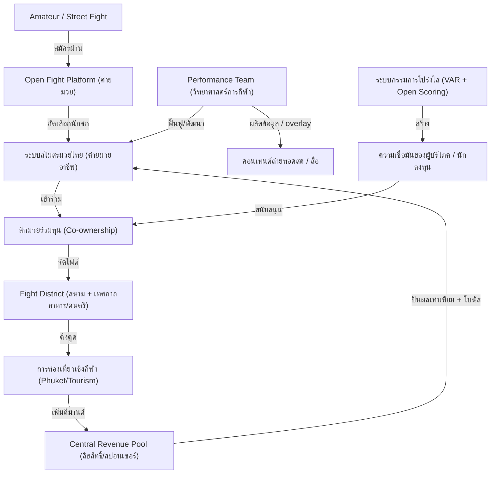

# ระบบลีกสโมสรมวยไทยและระบบนิเวศเศรษฐกิจสร้างสรรค์เชิงกีฬา (Muay Thai Club League Ecosystem)

ข้อเสนอนี้มุ่งปฏิรูปโครงสร้างพื้นฐานวงการมวยไทยและการสร้างซอฟต์พาวเวอร์เชิงวัฒนธรรม โดยยกระดับค่ายมวยไทยให้กลายเป็น "สโมสรอาชีพ" และสร้างระบบนิเวศน์ทางเศรษฐกิจเชิงวัฒนธรรม สื่อ สารสนเทศ และการท่องเที่ยว (Sports & Media Soft Power)

---

## 🗺️ แผนภาพแสดงวงจรระบบ (System Map)

---

## 1. ปัญหาเชิงโครงสร้าง (Structural Problem)
วงการมวยไทยและธุรกิจกีฬาต่อสู้ในปัจจุบันมีข้อจำกัดและคอขวดเชิงโครงสร้างดังนี้:
*   **ค่ายมวยขาดความยั่งยืนเชิงแบรนด์ (Lack of Club Brand Value):** ผู้ชมและสปอนเซอร์มักยึดติดและรู้จักเพียง "ตัวนักมวยดัง" (Star Athlete) แต่ค่ายมวยซึ่งเป็นผู้ลงทุนฟูมฟักกลับไม่มีมูลค่าแบรนด์หรือฐานแฟนคลับที่ถาวร เมื่อนักชกเกษียณอายุหรือย้ายค่าย ค่ายมวยมักประสบปัญหาทางการเงินและขาดเสถียรภาพในระยะยาว
*   **วิกฤตความโปร่งใสและกรรมการตัดสิน (Governance & Transparency Crisis):** ระบบการตัดสินมวยไทยแบบเดิมขาดเกณฑ์มาตรฐานที่ชัดเจน มีความกำกวมสูง และมีปัญหาประวัติการล็อกผลแข่งขันหรือดราม่าบ่อยครั้ง ทำให้ "นักลงทุนรายใหญ่" ขาดความเชื่อมั่นที่จะเข้ามาลงทุนในระบบอย่างเป็นทางการ
*   **การผูกขาดของโปรโมเตอร์ใหญ่ (Promoter Monopoly):** โครงสร้างรายได้ของวงการมวยผูกติดอยู่กับโปรโมเตอร์รายใหญ่ไม่กี่รายที่ควบคุมโควตาทั้งหมด ขาดระบบเงินส่วนกลางของลีก (Central Revenue Pool) ที่จะช่วยพยุงค่ายมวยขนาดเล็กให้มีรายได้หล่อเลี้ยงตัวเองอย่างต่อเนื่อง
*   **ทางตันของบัณฑิตวิทยาศาสตร์การกีฬา (Sports Science Bottleneck):** ประเทศไทยมีสถาบันผลิตบุคลากรด้านวิทยาศาสตร์การกีฬาและการแพทย์ทางกายภาพจำนวนมาก แต่กลับไม่มีการจ้างงานอย่างมีระบบในสโมสรกีฬาไทย บัณฑิตส่วนใหญ่ไม่มีงานตรงสายทำ ในขณะที่นักมวยไทยอาชีพยังคงฝึกซ้อมตามยุทธวิธีเดิมๆ ขาดการดูแลกล้ามเนื้อและโภชนาการ ส่งผลให้อายุการชกสั้นและร่างกายบาดเจ็บเรื้อรัง

---

## 2. ข้อเสนอเชิงระบบ (System Proposal)

### 2.1 การปรับเปลี่ยนสู่โมเดลสโมสรอาชีพ (Club Model Integration)
ยกระดับค่ายมวยไทยจาก "ศูนย์ฝึกซ้อมส่วนตัว" ให้กลายเป็น "สโมสรกีฬาอาชีพ (Sport Club)" ที่จดทะเบียนนิติบุคคล มีระบบการจัดการแบ่งรุ่นน้ำหนัก มีทีมโค้ช ผู้จัดการ และเจ้าหน้าที่วิทยาศาสตร์การกีฬาประจำสโมสร เพื่อให้สโมสรมีคุณค่าและสามารถดำเนินกิจการสร้างรายได้ต่อไปได้อย่างยั่งยืน แม้ไม่มีนักชกระดับซูเปอร์สตาร์ชั่วคราว

### 2.2 โครงสร้างลีกแบบหุ้นส่วนร่วมและการแบ่งปันรายได้กลาง (Co-ownership & Revenue Pooling)
*   **การจัดโครงสร้างผู้ถือหุ้นลีก (Ownership Distribution):** กำหนดให้หุ้นของระบบลีกกลางมีสัดส่วน 100% แบ่งเป็น:
    *   **นักลงทุนภายนอก (Investors):** 49% เพื่อเอื้อต่อการดึงเม็ดเงินทุนและระบบบริหารสมัยใหม่
    *   **กลุ่มค่ายมวย/สโมสร (Clubs):** 49% (แบ่งตามสัดส่วนค่ายมวยที่เข้าร่วมลีก) เพื่อให้นักมวยและค่ายมวยมีอำนาจตรวจสอบและเป็นเจ้าของร่วม
    *   **ฝ่ายบริหารกลาง (Management):** 2% สำหรับการดำเนินงานและรักษาสมดุลเชิงนโยบาย
*   **กองกลางรายได้กลาง (Central Revenue Pool):** รวบรวมรายได้จาก **"ลิขสิทธิ์ถ่ายทอดสดและการสตรีมมิ่งระดับโลก"** (เป็นช่องทางหลัก) และผู้สนับสนุนลีกทั้งหมด จากนั้นกระจายส่วนแบ่งให้แก่สโมสรต่างๆ อย่างเท่าเทียมเป็นปันผลพื้นฐานเพื่อความอยู่รอด และแบ่งอีกส่วนเป็นโบนัสตามผลการแข่งขันและระดับการมีส่วนร่วมของคนดู

### 2.3 การยกระดับความโปร่งใสและระบบเทคโนโลยีช่วยตัดสิน (Transparency & Data Overlay)
-   **Open Scoring:** แสดงผลการให้คะแนนของกรรมการทุกคนขึ้นสู่จอภาพของสนามและหน้าจอผู้เสพสื่อทันทีที่จบการชกแต่ละยก เพื่อความโปร่งใสและลดการแทรกแซง
-   **Replay Center & VAR:** จัดตั้งศูนย์ตรวจสอบภาพช้าในจังหวะน็อก ฟาวล์ หรือจังหวะปะทะสำคัญ
-   **Data Overlay System:** ติดตั้งเซ็นเซอร์และกล้องจับสถิติเพื่อแปลงพฤติกรรมการชกให้ออกมาเป็นข้อมูลดิบเชิงฟิสิกส์ (เช่น ความเร็วหมัด ความแรง และจำนวนการกระทบเป้าหมายที่แท้จริง) เพื่อใช้เป็นส่วนประกอบในการตัดสินและการนำเสนอสื่อ

### 2.4 การสร้าง "Fight District" (Economic Zone & Sports Tourism)
ปรับปรุงสนามมวยจากสถานที่แบบปิดให้เป็น **"พื้นที่เขตเศรษฐกิจสร้างสรรค์เชิงกีฬา" (Fight District)**:
*   **สเตเดียมกึ่งเปิด (Hybrid Arena):** ในสนามแข่งขันเน้นจัดไฟต์ต่อสู้ระยะสั้น กระชับ ดุเดือด และสามารถขายตั๋วพรีเมียมได้
*   **พื้นที่ลานกลางแจ้งรอบสนาม (Festival Zone):** จัดให้มีร้านอาหาร ตลาดนัดชุมชน ลานเบียร์ หน้าจอถ่ายทอดสดขนาดยักษ์ และกิจกรรมคอนเสิร์ต (Combat Sports Festival) เพื่อให้ผู้ชมที่ไม่ซื้อตั๋วเข้าชมภายในสเตเดียม ยังคงสามารถท่องเที่ยว รับประทานอาหาร และเสพความบันเทิงในพื้นที่รอบสนามได้ โลเคชันเป้าหมายคือเมืองท่องเที่ยวหลัก เช่น ภูเก็ต ซึ่งจะได้รับประโยชน์ทางอ้อมจากการท่องเที่ยวเชิงกีฬา (Sports Tourism) 2 เด้ง

### 2.5 แพลตฟอร์มมวยมวลชนกึ่งกฎหมาย (Open Fight Platform)
จัดตั้งระบบในการเปลี่ยน "การดวลกำปั้นแบบสตรีทคอนเทนต์" (Street Fight) หรือคอนเทนต์มวยป่าเถื่อนตามที่ต่างๆ ให้เข้ามาจัดแข่งในยิมหรือสโมสรท้องถิ่นอย่างเป็นมาตรฐาน โดยมีฝ่ายแพทย์ตรวจร่างกายและปฐมพยาบาล เพื่อเปลี่ยนความขัดแย้ง/คอนเทนต์เถื่อนให้กลายเป็นเศรษฐกิจสร้างสรรค์และเป็นช่องทางการค้นหาดาวรุ่ง (Amateur Funnel) เข้าสู่สโมสร

---

## 3. การวิเคราะห์เชิงระบบ (Systems Analysis)

### 3.1 วงจรความยั่งยืนเชิงอภิมหาเศรษฐกิจการกีฬา (Sovereign Sports Loop)
โมเดลนี้ทำงานบน Positive Feedback Loop ดังนี้:
\[\text{ลีกร่วมทุน} \rightarrow \text{รายได้กองกลางเสถียร} \rightarrow \text{จ้าง Performance Team/วิทย์การกีฬา} \rightarrow \text{นักมวยฟิตซ้อมเชิงลึก} \rightarrow \text{ไฟต์แข่งขันสนุกและน่าดึงดูด} \rightarrow \text{ลิขสิทธิ์สื่อและนักท่องเที่ยวเติบโต} \rightarrow \text{รายได้กองกลางเพิ่มขยาย}\]
ซึ่งการขับเคลื่อนข้อมูล (Data overlay เช่น สปีดหมัด กล้ามเนื้อที่ใช้) ผ่านสื่อ จะช่วยเปลี่ยนวัฒนธรรมคนดูมวยทั่วไปให้เกิดบทสนทนาเชิงเทคนิคอย่างลึกซึ้ง (คล้ายแฟนฟุตบอลวิเคราะห์เทคนิคการจัดทีม) ทำให้เกิดความผูกพันและอยู่กับแบรนด์ลีกได้ยาวนาน ดึงดูดนักลงทุนอย่างยั่งยืน

### 3.2 ความทนทานต่อดราม่าและการบริหารจัดการกรรมการ
เป้าหมายของระบบไม่ใช่การกำจัดดราม่าการให้คะแนนออกไปทั้งหมด (เพราะดราม่าเชิงกีฬาสามารถเพิ่มยอดการมีส่วนร่วมในสื่อสังคมออนไลน์และกระตุ้นดีมานด์คนดู) แต่คือการสร้างความมั่นใจว่าความขัดแย้งของคะแนนนั้น "เกิดขึ้นภายใต้มาตรฐานเทคโนโลยีที่เป็นวิทยาศาสตร์" เพื่อป้องกันไม่ให้โครงสร้างความเชื่อมั่นในผลการแข่งขันพังทลายลงจนสูญเสียนักลงทุน

---

## 4. ความเชื่อมโยงในระบบ (Interdependence & Alignment)
-   **ยุทธศาสตร์แลกที่ดินลดหย่อนภาษี:** เชื่อมโยงกับ [land_reform_progressive_tax.md](../01_policy_and_strategy/land_reform_progressive_tax.md) ในการดึงที่ดินรกร้างของนายทุนใหญ่ในทำเลดีหรือจุดท่องเที่ยว มาพัฒนาเป็น "Fight District" หรือลานกิจกรรม โดยนายทุนจะได้สิทธิ์ลดหย่อนภาษีที่ดิน แลกกับการมีพื้นที่ค้าขายทำกินของพ่อค้ารายย่อยและพื้นที่สร้างสรรค์กีฬา
-   **ระบบสวัสดิการดิจิทัลและการเรียนรู้:** เชื่อมโยงกับ [education_reform_cognitive_learning.md](../07_education_reform/education_reform_cognitive_learning.md) ในการสร้างความร่วมมือผลิตคอนเทนต์ให้ความรู้เกี่ยวกับวิทยาศาสตร์การกีฬา โภชนาการ และการฝึกกล้ามเนื้อ เพื่อเป็นสื่อการเรียนรู้เชิงปัญหาสนับสนุนระบบนิเวศการศึกษาสาธารณะของเยาวชนไทย
