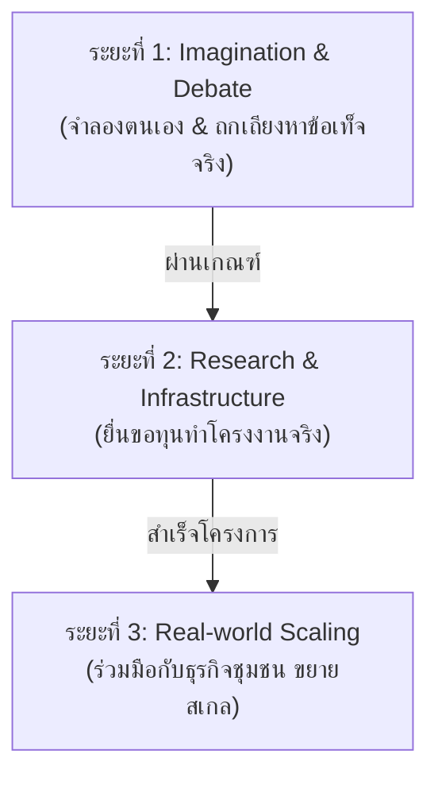
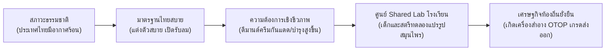

# ข้อเสนอเชิงระบบ: โรงเรียนในฐานะกิลด์และศูนย์กลางข้อมูล (School as Guild & Information Hub)

## 1. ปัญหาเชิงโครงสร้าง (Structural Problem)

### 1.1 การครอบงำด้วยข้อมูลเก่าและภาระงานครูที่ไร้ประสิทธิภาพ (Obsolete Information & Teacher Burden)
ระบบการศึกษาในปัจจุบันตั้งอยู่บนฐานคิดแบบยุคอุตสาหกรรมที่เน้นการผลิตคนป้อนโรงงาน โดยใช้หลักสูตรแกนกลางที่รวมศูนย์และเน้นการท่องจำข้อมูลเก่า (Obsolete Data) ทว่าในยุคปัจจุบันที่เทคโนโลยีปัญญาประดิษฐ์ (AI) สามารถเข้าถึงและประมวลผลข้อมูลที่มีอยู่แล้วบนโลกได้ในเสี้ยววินาที การบังคับให้เด็กท่องจำข้อมูลจึงเป็นการสูญเสียทรัพยากรมนุษย์อย่างมหาศาล 

ในขณะเดียวกัน ครูผู้สอนต้องแบกรับภาระงานเอกสารและการเตรียมเนื้อหาบรรยายเชิงลึกด้วยตนเอง เกิดภาวะเหนื่อยล้าทางสติปัญญา (Cognitive Fatigue) ส่งผลให้ครูไม่มีเวลาในการขัดเกลาพฤติกรรม พัฒนาทักษะชีวิต หรือสร้างปฏิสัมพันธ์ส่วนบุคคลกับผู้เรียน นโยบายของรัฐที่พยายามแก้ปัญหาโดยการบังคับให้ครูหันมาผลิตสื่อคลิปสั้นเอไอ (เช่น การตัดต่อวิดีโอลง TikTok เพื่อประเมินผลงาน) กลับยิ่งเป็นการสร้างภาระซ้ำซ้อนและกลายเป็นการเลียนแบบเชิงโครงสร้างโดยปราศจากการพัฒนาปัญญาจริง (Mimicry without Comprehension)

### 1.2 วิกฤตการปฏิเสธธรรมชาติความใคร่รู้ของมนุษย์ (Denial of Natural Curiosity)
มนุษย์ไม่ได้เรียนรู้เพราะถูกบังคับให้เดินเข้าห้องเรียน แต่ **เรียนรู้เพราะความสงสัยใคร่รู้ตามธรรมชาติ (Curiosity)** ระบบการศึกษาปัจจุบันใช้วิธีการบังคับป้อนความรู้เชิงรับ (Passive Learning) ซึ่งเป็นการทำลายกลไกลูปโดปามีนในสมองของเด็ก ทำให้อัตราการดูดซับสารสนเทศเชิงปัญญา (Cognitive Information Absorption Rate) ตกต่ำลงอย่างมากเมื่อเทียบกับเวลาที่เสียไป เด็กต้องทนเรียนวิชาที่ไม่มีความเชื่อมโยงกับชีวิตจริง ทำให้เกิดแรงเสียดทานในโครงข่ายประสาท (Neural Impedance) และเอนโทรปีความเครียดสะสมในระบบการเรียนรู้

### 1.3 ความไม่สอดคล้องระหว่างโครงสร้างกายภาพกับสภาวะแวดล้อม (Physical Friction vs. Tropical Climate)
กฎระเบียบที่แข็งทื่อและระบบระเบียบในโรงเรียน เช่น การบังคับสวมใส่เครื่องแบบนักเรียนที่หนาและไม่ระบายอากาศ ขัดแย้งกับสภาพภูมิอากาศร้อนชื้นของประเทศไทยอย่างรุนแรง การฝืนธรรมชาติในเรื่องกายภาพนี้นอกจากจะเพิ่มความเครียดสะสมแล้ว ยังลดทอนพลังงานและแรงจูงใจในการลงพื้นที่ภาคปฏิบัติและการจดจ่อระดับลึก (Sustained Deep Focus) ซึ่งเป็นอุปสรรคต่อการพัฒนาศักยภาพเชิงสร้างสรรค์

### 1.4 การผูกขาดอำนาจและการแบ่งเค้กทางการเมืองท้องถิ่น (Centralized Power & Local Rent-Seeking)
ในมิติทางรัฐศาสตร์ โครงสร้างการปกครองส่วนท้องถิ่นในปัจจุบัน (อบต. และเทศบาลขนาดเล็กเกือบ 8,000 แห่งทั่วประเทศ) มีลักษณะเป็นหน่วยอำนาจขนาดจิ๋วที่เปิดช่องให้กลุ่มอิทธิพลท้องถิ่น (บ้านใหญ่) เข้ามาผูกขาดอำนาจการตัดสินใจและจัดสรรงบประมาณผ่านระบบอุปถัมภ์ส่วนตัว (Clientelism) นโยบายการพัฒนาและงบประมาณส่วนใหญ่จึงไม่ได้ถูกใช้เพื่อเพิ่มขีดความสามารถที่แท้จริงของประชาชน แต่ถูกใช้เพื่อการรักษาความจงรักภักดีเชิงอำนาจ (Rent-Seeking & Vassalage) ขณะที่โรงเรียนในท้องถิ่นไม่มีอำนาจและทรัพยากรในการตัดสินใจ ต้องรอรับการจัดสรรงบประมาณแนวดิ่งจากกระทรวงส่วนกลางเท่านั้น

---

## 2. ข้อเสนอเชิงระบบ (System Proposal)

ข้อเสนอนี้มุ่งทำลายสถาบันโรงเรียนแบบเดิม แล้วเปลี่ยนผ่านสู่ **"กิลด์และศูนย์กลางข้อมูลประจำถิ่น" (School as Guild & Local Information Hub)** ซึ่งทำหน้าที่เป็นทั้งแพลตฟอร์มการปกครองแบบสภาโต๊ะกลม แหล่งทรัพยากรการผลิต และโหนดการคลังท้องถิ่น โดยมีโครงสร้างและกลไกการทำงานดังนี้:

### 2.1 เส้นทางการเรียนรู้ผ่านเควสต์ 3 ระยะ (Quest-Driven 3-Phase Journey)
เปลี่ยนหลักสูตรและการตัดเกรดแบบเดิม เป็นภารกิจเก็บเกี่ยวประสบการณ์จริง (Quests) ที่ตอบโจทย์การพัฒนาชุมชน:

*   **ระยะที่ 1: จินตนาการและการถกเถียง (Imagination & Debate Phase):** ให้ผู้เรียนได้ทดลอง "เป็น" ในสิ่งที่สนใจผ่านแบบจำลองหรือโลกดิจิทัล จากนั้นนำไอเดียมาถกเถียงด้วยกระบวนการ Dialectics ว่าแนวคิดนั้นสามารถแก้ไขปัญหาและสเกลใช้งานได้จริงในระยะยาวหรือไม่ เพื่อค้นหาความถนัดและเจตจำนงที่แท้จริง
*   **ระยะที่ 2: ข้อเสนองานวิจัยและโครงสร้างพื้นฐาน (Research & Infrastructure Phase):** นักเรียนเขียนข้อเสนอโครงการวิจัย (Research Proposal) เพื่อแก้ปัญหาจริงในพื้นที่ (เช่น การจัดการน้ำชุมชน การพัฒนาสูตรการผลิตสกินแคร์) โดยขอสนับสนุน "งบวิจัยและทรัพยากร" ผ่านกองทุนกิลด์ ครูจะทำหน้าที่เป็นที่ปรึกษาเชิงเทคนิค (Technical Advisor) และผู้อำนวยความสะดวก (Facilitator)
*   **ระยะที่ 3: การขยายผลสู่โลกจริง (Real-World Scaling Phase):** เมื่อโปรเจกต์วิจัยผ่านเกณฑ์และสร้างผลลัพธ์ที่พิสูจน์ได้ จะได้รับสิทธิ์ในการขยายสเกลเพื่อดึงดูดการร่วมลงทุนจากภาคธุรกิจและแบรนด์ท้องถิ่น

### 2.2 โครงสร้างการบริหารแบบสภาโต๊ะกลมไร้ศูนย์กลาง (Decentralized Roundtable Council Structure)
ยกเลิกระบบอำนาจรวมศูนย์ของผู้อำนวยการโรงเรียนและระบบข้าราชการแนวดิ่ง สู่การทำงานร่วมกันแบบแนวราบ (Flat Hierarchy):
*   **สภาเชี่ยวชาญ (Specialized Expert Council):** การรวมกลุ่มของนักเรียน ปราชญ์ชาวบ้าน และครูที่มีทักษะเฉพาะด้าน (เช่น ทีมวิศวกรออกแบบระบบไฟฟ้า, ทีมฟิสิกส์คำนวณโครงสร้างวัสดุ, ทีมกราฟิกและสื่อสาร) มาร่วมกันตรวจทาน ให้ข้อโต้แย้ง และช่วยปรับปรุงโปรเจกต์ของทีมอื่นๆ (Human Synergy)
*   **สภาประสานงาน (Coordination Council):** ทำหน้าที่เป็นตัวกลางเชื่อมโยงทรัพยากรและการทำงานข้ามสายงาน (Interdisciplinary) เพื่อให้เกิดการสร้างสรรค์นวัตกรรมใหม่ๆ
*   **กลไกผู้นำเฉพาะกิจ (Swiss General Model):** ในภาวะวิกฤตหรือช่วงเวลาที่ต้องมีการตัดสินใจฉับพลัน สภาสามารถโหวตมอบอำนาจเต็มชั่วคราวให้ผู้ที่มีศักยภาพสูงสุดในงานนั้นๆ เป็นผู้นำเดี่ยว เมื่อภารกิจเสร็จสิ้น อำนาจนั้นจะสลายตัวและผู้ปกครองชั่วคราวจะกลับมาอยู่ในสถานะเสมอภาคกับทุกคนในสภาโต๊ะกลมทันที

### 2.3 วิทยาเขตในฐานะแหล่งแปรรูปข้อมูลและผลิตภัณฑ์ชุมชน (Campus Production Hubs & Shared Labs)
ยกระดับสิ่งอำนวยความสะดวกในโรงเรียนให้กลายเป็นปัจจัยการผลิตของชุมชน:
*   **ดาต้าเซ็นเตอร์และเซิร์ฟเวอร์กระจายศูนย์ประจำถิ่น (Local Data Center & Dedicated Servers):** โรงเรียนเป็นโหนดจัดเก็บข้อมูล Hyper-local ที่ไม่มีอยู่ในระบบคลาวด์ขนาดใหญ่ และรันบล็อกเชนเพื่อเก็บบันทึกผลงาน โครงการ และบัญชีธุรกรรมของกิลด์อย่างโปร่งใส
*   **แล็บวิจัยและพัฒนาชีวเคมีส่วนรวม (Shared Bio-Chemical Lab):** จัดตั้งห้องแล็บมาตรฐานสากลเพื่อการทดสอบผลิตภัณฑ์ชุมชน สอดรับกับนโยบาย **"มาตรฐานไทยสบาย" (Thai Comfort Standard)** ที่ส่งเสริมการสวมใส่เสื้อผ้าสบายตัวระบายอากาศดีในเมืองร้อน ซึ่งทำให้ความต้องการครีมกันแดดและสกินแคร์สูงขึ้น โรงเรียนทำหน้าที่เป็นพื้นที่ให้สตรีและกลุ่มวิจัยทดลองคิดค้นสูตร (คล้ายสูตรต้มยำที่มีเอกลักษณ์) และนำไปผ่านการรับรองเพื่อจำหน่ายเป็นสินค้า OTOP ยุคใหม่
*   **สตูดิโอสื่อและโรงพิมพ์ของวิทยาเขต (Media & Printing Studios):** เพื่อสร้างช่องทางการตลาดท้องถิ่นและการโฆษณาตรง (Direct Community Engagement) ทำให้เยาวชนในกิลด์สามารถทำหน้าที่เป็นผู้นำทางความคิดในชุมชนและสร้างรายได้จากพันธมิตรธุรกิจ

### 2.4 การแฮ็กพฤติกรรมการเรียนรู้ผ่านวงจรโดปามีน (Neurological Dopamine Loop Optimization)
นำความเข้าใจในจิตวิทยาประสาท (Neurological Focus Profiles) มาออกแบบระบบการเรียนการสอน:
*   **ครูเป็นผู้คัดสรร ไม่ใช่ผู้สร้าง (Teacher as Curator):** รัฐหยุดสนับสนุนการบังคับครูทำคลิปสั้น แต่สนับสนุนให้ครูทำหน้าที่คัดสรรคลิปความรู้คุณภาพสูงที่ครีเอเตอร์อิสระผลิตไว้ดีอยู่แล้วบน YouTube/TikTok มารวบรวมและวาง flow การเรียนรู้ตามธรรมชาติ
*   **การเรียนรู้แบบย้อนศร (Flipped Classroom):** เด็กศึกษาเนื้อหาป้อนลูปความถี่สูงนอกเวลาเรียนด้วย Micro-content ที่มีความสนุกและจุดประกายความอยากรู้ (Spark Phase) จากนั้นในเวลาเรียน ครูจะใช้กิจกรรมการทดลองจริง การถกเถียง และการลงมือปฏิบัติเพื่อพาเด็กเข้าสู่ระยะการจดจ่อระดับลึก (Sustained Deep Focus)
*   **ข้อตกลงแลกเปลี่ยนสตรีมมิ่งระดับชาติ (National YouTube Premium Deal):** ผ่านความร่วมมือกับพันธมิตรนานาชาติ (Barter Alliance) เพื่อจัดหาบัญชีปลอดโฆษณาให้เยาวชนและครูทั่วประเทศ เพื่อป้องกันการแทรกแซงจากมลพิษข้อมูลเชิงพาณิชย์ในระหว่างชั่วโมงการเรียนรู้

### 2.5 ระบบความมั่นคงรากหญ้าผ่านการบูรณาการเยาวชนนอกระบบ (Civic Integration of Marginalized Youth)
*   เปลี่ยนกลุ่มเด็กนอกระบบ เช่น **"เด็กแว้น"** ให้กลายเป็น **"หน่วยเคลื่อนที่เร็ว" (Agile Civic Units)** 
*   มอบหมายภารกิจ (Quests) เฝ้าระวังภัย รายงานสภาพความปลอดภัย ทราฟฟิกจราจร หรือภัยพิบัติในจุดที่ข้าราชการเข้าไม่ถึง แลกกับค่าตอบแทนและแต้มความน่าเชื่อถือ (Trust Score) ซึ่งเป็นการเปลี่ยนผ่านพลังงานของกลุ่มวัยรุ่นนอกระบบมาสนับสนุนความปลอดภัยชุมชนเชิงบวก

---

## 3. การวิเคราะห์เชิงระบบ (Systems Analysis)

### 3.1 การปฏิวัติอำนาจต่อรองและการคานอำนาจ 4 รูปแบบ (Bargaining Power Revolution & The 4 Powers)
ตามทฤษฎี UET อำนาจบนโลกนี้สามารถแบ่งโครงสร้างออกเป็น 4 มิติหลัก:

| มิติต้นกำเนิดอำนาจ | รูปแบบการคานอำนาจ |
| :--- | :--- |
| **1. อำนาจทางชีวะ (Biological Power)** | กำลังคน สุขภาพ อัตราการเกิด ยีน |
| **2. อำนาจทางเศรษฐกิจ (Economic Power)** | ทุน ทรัพยากร ห่วงโซ่อุปทาน การคลัง |
| **3. อำนาจทางกำลัง (Physical/Military Power)** | กำลังรบ อาวุธ ตำรวจ การบังคับใช้กฎหมาย |
| **4. อำนาจทางความรู้และข้อมูล (Knowledge Power)** | เทคโนโลยี ข้อมูลเชิงลึก งานวิจัย ปัญญา |

ในระยะยาว **อำนาจทางความรู้คือผู้ชนะที่สามารถเข้าควบคุมและปรับเปลี่ยนคุณสมบัติของอำนาจอีก 3 รูปแบบที่เหลือได้ทั้งหมด**

การเปลี่ยนโครงสร้างโรงเรียนให้เป็นกิลด์ ไม่ใช่เรื่องเชิงการสอนทั่วไป แต่คือ **"การปฏิวัติเพื่อติดอาวุธทางปัญญาและอำนาจข้อมูล (Knowledge Power) ให้แก่ประชาชนระดับรากหญ้า"** เมื่อประชาชนสามารถผูกขาดและเป็นเจ้าของข้อมูลเชิงลึกในพื้นที่ (Hyper-local Data) ที่ส่วนกลางหรือ AI ไม่มี รัฐบาลส่วนกลางและกลุ่มนายทุนจะไม่สามารถปกครองแบบกดขี่ได้โดยง่าย และจำเป็นต้องยอมรับเงื่อนไขการต่อรองเพื่อแลกเปลี่ยนข้อมูลเหล่านั้นกับอำนาจทางเศรษฐกิจและทรัพยากรระดับประเทศ

### 3.2 รัฐศาสตร์แนวใหม่: อนาธิปไตยเชิงปัญญาและการลื่นไหลของอำนาจ (Cognitive Anarchy & Liquid Governance)
ระบบนี้ปฏิเสธโมเดลการปฏิรูปราชการของตะวันตกหรือญี่ปุ่นที่เน้นการควบรวม อบต. ให้ใหญ่ขึ้นเพื่อความคุ้มค่าทางการคลังเพียงอย่างเดียว เพราะโมเดลดังกล่าวไม่ได้แก้ไขปัญหาการผูกขาดเก้าอี้ของนักการเมืองและเครือข่ายอิทธิพลส่วนบุคคล 

แต่ UET ใช้วิธี **"ละลายเก้าอี้แห่งอำนาจทิ้ง" (Decentralized Platform Over Ownership)** โดยกำหนดให้:
*   ไม่มีนักการเมืองประจำตำแหน่งที่มีอำนาจชี้ขาดในชุมชน
*   อำนาจจะอยู่ในรูปของ **"สภาโต๊ะกลมตามภารกิจ"** ซึ่งเปิดและปิดตัวลงอย่างเป็นพลวัตตามโครงการวิจัย (Proposal of Action)
*   งบประมาณและการดำเนินการจะอนุมัติผ่านข้อมูลเชิงวิศวกรรม/ฟิสิกส์ ที่ยืนยันได้จริง (มี Technical Validation จากสภาเชี่ยวชาญ) ระบบจึงบีบให้แรงผลักดันความเห็นแก่ตัวของนักเลือกตั้งท้องถิ่นสูญสิ้นพลัง และถูกแปลงสภาพไปเป็นแรงจูงใจในการสร้างผลงานที่ส่งมอบความมั่งคั่งให้ชุมชนแทน

### 3.3 กลไกการเงินที่เท่าเทียมและกองทุนต้านเงินเฟ้อ (Anti-Inflation & Knowledge-Backed Economy)
เพื่อป้องกันการปั่นมูลค่าของทรัพยากรในระบบนิเวศการศึกษาและการแจกแต้ม/คะแนนอย่างสะเปะสะปะ (Token Inflation) UET กำหนดระบบ Backed Asset ดังนี้:
*   คะแนน **Trust Score** และ **Social Capital** ในกิลด์จะออกได้ก็ต่อเมื่อมีผลงานวิจัยหรือนวัตกรรมเชิงปฏิบัติที่มีความสำคัญในระดับกายภาพ (เช่น ผลิตอาหารปลอดภัยสำเร็จ ขุดคลองระบายน้ำได้จริง ผลิตครีมกันแดดชุมชนได้มาตรฐาน)
*   การสำรองมูลค่านี้ได้รับการดูแลผ่านเซิร์ฟเวอร์ประจำโรงเรียน (Decentralized Server Asset backing) ทำให้แต้มและเงินรางวัลในระบบการศึกษาท้องถิ่นไม่ได้มีสถานะเป็นเงินกระดาษเปล่า (Fiat) แต่มี "มูลค่าทางปัญญาและความมั่งคั่งจริงของผลงานวิจัย" ค้ำประกัน ป้องกันภาวะเงินเฟ้อและลดความเหลื่อมล้ำในการเข้าถึงทรัพยากร

### 3.4 ห่วงโซ่คุณค่าความชิลและโดมิโนเศรษฐกิจ (The Chill Value Chain Domino)

---

## 4. ความเชื่อมโยงในระบบ (Interdependence & Alignment)

*   **เชื่อมโยงกับ [education_reform_cognitive_learning.md](education_reform_cognitive_learning.md):** บูรณาการเครื่องมือแฮ็กพฤติกรรมการเรียนรู้และระบบครูผู้คัดสรร (Teacher as Curator) เข้ากับการทำวิจัยในระยะที่ 1-2
*   **เชื่อมโยงกับ [global_resource_barter_alliance.md](../04_industry_and_production/global_resource_barter_alliance.md):** การนำงบและการแลกเปลี่ยนทรัพยากรเชิงยุทธศาสตร์ระหว่างประเทศมาสนับสนุนโครงการ YouTube Premium และเซิร์ฟเวอร์ประจำท้องถิ่น
*   **เชื่อมโยงกับ [global_trade_partnership_diplomacy.md](../01_policy_and_strategy/global_trade_partnership_diplomacy.md):** การนำผลงานครีมกันแดดและสารสกัดชีวภาพจาก Shared Labs ประจำโรงเรียนเข้าสู่เวทีความร่วมมือในการส่งออกสู่ตลาดโลก
*   **เชื่อมโยงกับโครงสร้างความปลอดภัยเมือง:** เชื่อมระบบเควสต์ความมั่นคงของเยาวชนนอกระบบ (เด็กแว้น) เข้ากับระบบควบคุมความปลอดภัยระดับเส้นเลือดฝอยของแผนพัฒนาผังเมืองท้องถิ่น
