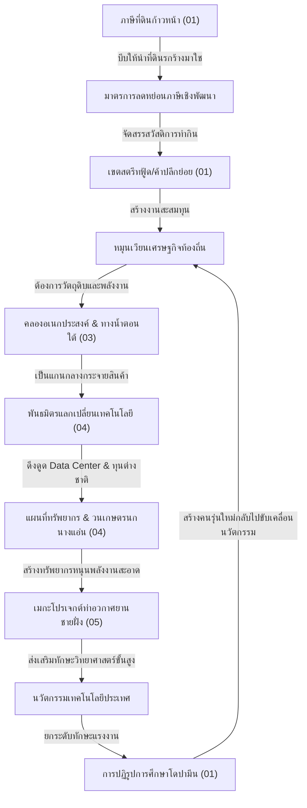

# แผนยุทธศาสตร์และข้อเสนอประเทศไทยเชิงระบบ (Thailand Proposals)

ยินดีต้อนรับสู่ศูนย์รวมข้อเสนอเชิงระบบ โครงสร้างพื้นฐาน และนโยบายสาธารณะเพื่อการพัฒนาประเทศไทยอย่างยั่งยืน โฟลเดอร์นี้ถูกย้ายออกจากเอกสาร UET Research หลักเพื่อความเป็นอิสระ และจัดหมวดหมู่ระบบระเบียบอย่างชัดเจน

---

## 🗺️ แผนภาพความเชื่อมโยงของระบบข้อเสนอ (System-wide Feedback Map)

ข้อเสนอทั้งหมดในโครงการนี้ไม่ได้เกิดขึ้นแบบแยกส่วน แต่มีปฏิสัมพันธ์และสนับสนุนซึ่งกันและกันดังนี้:

---

## 🏛️ ดัชนีข้อเสนอเชิงนโยบายและระบบ (Index of Proposals)

เพื่อความสะดวกในการอ่านและการอ้างอิง ข้อมูลด้านล่างนี้คือดัชนีนำทางของไฟล์ข้อเสนอหลักที่ได้รับการเรียบเรียงแล้วในแต่ละหมวดหมู่:

### 1. ⚖️ ยุทธศาสตร์และนโยบายเชิงระบบ ([01_policy_and_strategy](./01_policy_and_strategy/))
หมวดนโยบายปฏิรูปกฎหมาย ภาษี การศึกษา และการบริหารลุ่มน้ำของประเทศ
*   **[การปฏิรูปราคาโปรตีน โซนนิ่งเกษตรกรรม และสาหร่ายจิ๋ว](./01_policy_and_strategy/national_protein_reform_agriculture.md)**: นโยบายควบคุมสุขภาพประชากร การปฏิรูปพื้นที่การเกษตรตามธรรมชาติ และใช้ฟาร์มสาหร่ายในการเปลี่ยนน้ำเสียเป็นไบโอดีเซล
*   **[การปฏิรูปภาษีที่ดินก้าวหน้าและมาตรการกันนอมินี](./01_policy_and_strategy/land_reform_progressive_tax.md)**: โครงสร้างภาษีที่คำนวณเปรียบเทียบค่าเฉลี่ยประชากร พร้อมกลไกสกัดกั้นตัวแทนถือครองเพื่อบังคับปลดปล่อยที่ดินรกร้าง
*   **[การจัดตั้งเขตสตรีทฟู้ดและพื้นที่ค้าปลีกย่อยเพื่อทำกินฐานราก](./01_policy_and_strategy/infrastructure_streetfood_micro_economy.md)**: การลงทุนจัดสร้างพื้นที่ค้าขายถาวรค่าเช่าต่ำ เพื่อสร้างระบบสวัสดิการอาชีพและหมุนเวียนเงินในฐานราก
*   **[การปฏิรูปการศึกษาเชิงปัญญาและการรักษาสมดุลโดปามีน](./01_policy_and_strategy/education_reform_cognitive_learning.md)**: ปฏิรูปกระบวนการเรียนรู้ผ่านสื่อสั้นเชิงความรู้และการดีลสิทธิ์บริการ YouTube Premium เพื่อเป็นระบบป้องกันสิ่งเร้าในห้องเรียน
*   **[อุตสาหกรรมฟืน วิวัฒนาการอุณหภาพ และภาระสิ่งแวดล้อมภาคเกษตร](./01_policy_and_strategy/origin_of_wealth_pyrotechnology.md)**: ข้อวิเคราะห์ทางประวัติศาสตร์เปรียบเทียบภาระมลพิษและการใช้พลังงานระหว่างระบบการเกษตรกรรมแบบเปิดกับโรงงานอุตสาหกรรม
*   **[การบริหารจัดการสามน้ำทะเลสาบสงขลาและอาหารอวกาศ](./01_policy_and_strategy/songkhla_lagoon_water_and_spacefood.md)**: ระบบตรวจวัดคุณภาพน้ำอัจฉริยะในทะเลสาบสงขลา พร้อมการยกระดับผลผลิตการเกษตรท้องถิ่นเข้าสู่อุตสาหกรรมอวกาศ
*   **[เส้นทางขนส่งสองทิศทางและโครงข่ายความมั่นคงทางชลศาสตร์แห่งชาติ](./01_policy_and_strategy/inter_regional_logistics_disaster_backbone.md)**: การวิเคราะห์ระบบกระจายสินค้าและเส้นทางบรรเทาภัยพิบัติทางน้ำข้ามภูมิภาค
*   **[กรอบความร่วมมือทางการทูตเชิงยุทธศาสตร์และการซื้อขายทรัพยากรระดับโลก](./01_policy_and_strategy/global_trade_partnership_diplomacy.md)**: นโยบายรักษาอธิปไตยทางการค้าและการจัดการพลังงานหมุนเวียนร่วมกับพันธมิตรโลก
*   **[พิมพ์เขียวหนังสือความมั่งคั่งของแผ่นดิน (The Origin of Wealth Book Blueprint)](./01_policy_and_strategy/the_origin_of_wealth_book_blueprint.md)**: โครงร่างแผนการเขียนหนังสือรวบรวมทฤษฎีและยุทธศาสตร์เศรษฐกิจประยุกต์ของประเทศไทย

### 2. 🏙️ ผังเมืองและความยืดหยุ่นทางกายภาพ ([02_urban_resilience](./02_urban_resilience/))
หมวดการจัดการโครงสร้างทางสถาปัตยกรรม ความปลอดภัยอาคาร และผังเมืองเชิงนิเวศ
*   **[แนวทางการพัฒนาอาคารเมืองความยืดหยุ่นสูงและการวางระบบผังเมือง](./02_urban_resilience/mountain_building_urban_resilience.md)**: แนวทางการออกแบบโครงสร้างอาคารเพื่อรองรับการทรุดตัวของชั้นดิน การจัดระบบระเบียบอาคารสูง และการจัดสรรระบบนิเวศแนวตั้ง

### 3. 🚢 โลจิสติกส์และโครงสร้างพื้นฐานคมนาคม ([03_logistics_and_infra](./03_logistics_and_infra/))
หมวดการคมนาคมขนส่ง เมกะโปรเจกต์คลอง และการจัดสรรระบบท่าเรือสองฝั่งมหาสมุทร
*   **[แนวทางการจัดทำคลองอเนกประสงค์เชื่อมต่อระดับภูมิภาค (Inland Canal)](./03_logistics_and_infra/inland_multipurpose_canal_feasibility.md)**: การวิเคราะห์ความเป็นไปได้ในการจัดตั้งร่องน้ำเดินเรือผ่านผืนดินเพื่อรองรับการชลประทานและสร้างความรวดเร็วในการขนส่ง
*   **[แผนแม่บททางเลือกร่องน้ำเดินเรือทางตอนใต้ (Southern Waterway Alternative)](./03_logistics_and_infra/southern_waterway_alternative.md)**: แผนพัฒนาท่าเรือน้ำลึกอ่าวไทย-อันดามันและการเชื่อมต่อร่องน้ำขนส่งสินค้า

### 4. ⚙️ อุตสาหกรรมและกำลังการผลิตในประเทศ ([04_industry_and_production](./04_industry_and_production/))
หมวดการโซนนิ่งอุตสาหกรรม แผนที่ทรัพยากรชาติ และพันธมิตรแลกเปลี่ยนข้อมูล
*   **[ยุทธศาสตร์พันธมิตรจัดหาทรัพยากรและการแลกเปลี่ยนเทคโนโลยีระดับโลก](./04_industry_and_production/global_resource_barter_alliance.md)**: โมเดลแลกเปลี่ยนสิทธิ์ที่ดินสำหรับ Data Center แลกกับสวัสดิการซอฟต์แวร์ระดับพรีเมียมราคาประหยัดสำหรับครูและเด็กไทย
*   **[แผนที่การจัดการทรัพยากรและโซนนิ่งอุตสาหกรรมสำหรับประเทศไทย](./04_industry_and_production/thailand_resource_industry_map.md)**: การวิเคราะห์ขีดความสามารถทรัพยากร วนเกษตรนกนางแอ่น (Swiftlet) และโครงข่ายการเกษตร-อุตสาหกรรม

### 5. 🚀 ท่าอวกาศยานและเทคโนโลยีขั้นสูง ([05_spaceport_and_rocket](./05_spaceport_and_rocket/))
หมวดวิศวกรรมเทคโนโลยีอวกาศ โลจิสติกส์จรวด และการจัดการสิ่งแวดล้อมโดยรอบ
*   **[วิศวกรรมการขนส่งรถไฟไฮโดรเจนชายฝั่งและโลจิสติกส์ท่าอวกาศ](./05_spaceport_and_rocket/coastal_hydrogen_rail_logistics.md)**: แผนการจัดการระบบพลังงานสะอาดและโลจิสติกส์เชื่อมต่อท่าปล่อยจรวดชายฝั่ง
*   **[การควบคุมและวิเคราะห์สภาวะเสียงเพื่อป้องกันโลมาชายฝั่ง](./05_spaceport_and_rocket/dolphin_acoustic_buffer.md)**: การจำลองคลื่นเสียงและการใช้ป่าชายเลนเป็นเขตกันชนทางชีวภาพเพื่อปกป้องโลมาอิรวดี
*   **[การออกแบบฐานปล่อยจรวดและวิศวกรรมธรณีฟิสิกส์ชายฝั่ง](./05_spaceport_and_rocket/launchpad_geophysics_design.md)**: สถาปัตยกรรมเชิงวิศวกรรมการก่อสร้างฐานปล่อยจรวดริมฝั่งทะเลรองรับแรงสั่นสะเทือนและการกัดเซาะ

---

## 🛠️ การมีส่วนร่วมและการทำงาน (Workflow Rule)

หากต้องการเสนอแนวคิดหรือพัฒนาข้อเสนอใหม่ กรุณาปฏิบัติตามมาตรฐานที่กำหนดไว้ใน **[thailand_proposals_standard.md](./thailand_proposals_standard.md)** อย่างเคร่งครัด
1.  **ข้อมูลดิบ / บทสนทนา:** ให้นำไปเก็บไว้ที่โฟลเดอร์ `raw/` ในหมวดหมู่นั้นๆ เสมอ
2.  **เขียนเอกสารข้อเสนอหลัก:** เรียบเรียงขึ้นมาใหม่ระดับโฟลเดอร์หลัก โดยระบุองค์ประกอบครบ 4 ส่วน (ปัญหาเชิงโครงสร้าง -> ข้อเสนอเชิงระบบ -> การวิเคราะห์เชิงระบบ -> ความเชื่อมโยง)
3.  **การลิงก์เอกสาร:** ใช้ Relative Link เสมอ ห้ามเขียน absolute local path เด็ดขาด
