# 📖 โครงร่างหนังสือ: The Origin of Wealth (ต้นกำเนิดความมั่งคั่งแห่งประชาชาติ)
> **ผู้เขียน:** สังเคราะห์จากทัศนะและแนวคิดเชิงทฤษฎี UET (Unity Equilibrium Theory)
> **แนวคิดหลัก:** การใช้ประวัติศาสตร์อารยธรรม วิวัฒนาการความรู้ และตรรกะเชิงระบบ เพื่ออธิบายว่าเงินตราเป็นเพียง "ตัวกลางสัดส่วนระหว่าง ปริมาณของในระบบ กับ ปริมาณเงินทั้งหมด" และวิพากษ์ระบบทุนนิยมและการเงินกระแสหลักที่บิดเบือนสัจธรรมข้อนี้จนขัดแย้งกับชีวภาพและธรรมชาติของมนุษย์

---

## 🗺️ แผนผังวิวัฒนาการของ "ไม้บรรทัดแห่งความรู้" (The Evolutionary Tech-Tree)

```mermaid
graph TD
    %% Base Equation & Value Generation
    Crisis["🌍 ภัยพิบัติ / ความจำเป็น<br/>(Necessity)"] -->|กระตุ้นการประมวลผล| Knowledge["🧠 ความรู้ / แรงงาน<br/>(Knowledge)"]
    Knowledge -->|รวมความพร้อมโครงสร้าง| Innovation["🔥 นวัตกรรม / ทรัพยากรใหม่<br/>(Innovation)"]

    %% Hominid & Firewood Phase
    Innovation -->|ต้องการมาตรวัดจัดการคลัง| MathLogics["📐 ตรรกะคณิตศาสตร์ก่อนภาษาพูด<br/>(Math as First Language)"]
    MathLogics -->|วิกฤตภูมิอากาศในแอฟริกา| Firewood["🪵 อุตสาหกรรมฟืน & คลังฟืนในถ้ำ<br/>(First Industry & Logistics)"]

    %% Historical Rulers Phase
    Firewood -->|รังวัดที่ดินหลังน้ำท่วมไนล์| Egypt["📐 เรขาคณิตอียิปต์โบราณ<br/>(Geometry: Physical Ruler)"]
    Egypt -->|ข้อจำกัดเลขโรมันขัดขวางการคำนวณ| Crusade["⚔️ สงครามครูเสด & การแลกเปลี่ยนวัฒนธรรม<br/>(Import of Hindu-Arabic Numerals)"]
    Crusade -->|อินเดียคิดเลขศูนย์จากปรัชญาสุญญตา| India["0️⃣ ศูนย์ และ สุญญตา<br/>(The Origin of Zero)"]

    %% Abstract Rulers Phase
    India -->|ไม้บรรทัดนามธรรมในโลกความคิด| Calculus["📈 แคลคูลัส & ทางลัดค่าลิมิต<br/>(Calculus as Relationship Ruler)"]
    Calculus -->|คำนวณย่านความเร็ว/พลังงานต่ำ| Newton["🍎 ไม้บรรทัดนิวตัน<br/>(Absolute Space & Time)"]

    %% Epistemological Upgrades & Crisis
    Newton -->|ข้อมูลขัดแย้งสะสม + เครื่องมือละเอียด| EinsteinUpgrade["⏳ สังเคราะห์ Riemann + Maxwell + c"]
    EinsteinUpgrade -->|ไม้บรรทัดยืดหยุ่นตามพลังงาน| Einstein["⏳ ไม้บรรทัดไอน์สไตน์<br/>(Spacetime Curvature / E=mc²)"]

    %% Modern Economic Phase
    Einstein -->|ความพยายามผูกมูลค่ากับทองคำ| GoldStandard["🏅 มาตรฐานทองคำ<br/>(The Gold Standard)"]
    GoldStandard -->|ความรู้นำหน้าปริมาณทองคำ เกิดเงินฝืด| GreatDepression["📉 วิกฤตเศรษฐกิจตกต่ำ 1930<br/>(Knowledge Outpaces Gold)"]
    GreatDepression -->|เคนส์เสนอพิมพ์เงินกระดาษแก้เงินฝืด| FiatGlitch["💸 วิกฤตเงิน Fiat 1971<br/>(เงินสร้างหนี้ขโมยอนาคต)"]
    FiatGlitch -->|วงจรอุบาทว์หนี้สินและการดึงพลังงานอนาคต| DebtLoop["🌀 วิกฤตหนี้สินและเอนโทรปีระบบ<br/>(Systemic Entropy)"]
    DebtLoop -->|รื้อถอนสมดุลใหม่ด้วย 4 เสาหลักแห่งอำนาจ| FourPowers["🏛️ สี่เสาหลักแห่งอำนาจ<br/>(กำลัง, เงิน, ชีวภาพ, ความรู้)"]
    FourPowers -->|ปฏิรูประบบเงินด้วยสมการแรกและความรู้| DynamicMoney["🪙 Dynamic Energy Money<br/>(เงินอิงนวัตกรรมฟิสิกส์: ไร้เงินเฟียด)"]

    %% Styling
    classDef hominid fill:#2d3a1a,stroke:#6e8f3d,stroke-width:2px,color:#fff;
    classDef history fill:#3c2d12,stroke:#a67c37,stroke-width:2px,color:#fff;
    classDef abstract fill:#1a103c,stroke:#7d5bb6,stroke-width:2px,color:#fff;
    classDef science fill:#102e3c,stroke:#4a8a9e,stroke-width:2px,color:#fff;
    classDef econ fill:#3c101a,stroke:#a64b58,stroke-width:2px,color:#fff;

    class Crisis,Knowledge,Innovation,MathLogics,Firewood hominid;
    class Egypt,Crusade,India history;
    class Calculus,Newton,EinsteinUpgrade,Einstein science;
    class GoldStandard,GreatDepression,FiatGlitch,DynamicMoney econ;
```

---

## 📑 สารบัญและรายละเอียดเนื้อหารายบท (Chapter-by-Chapter Blueprint)

### 📌 บทนำ: ความย้อนแย้งเชิงระบบและความมั่งคั่งที่แท้จริง
*   **แก่นประเด็น:** การรื้อถอนกรอบคิดของวิชาเศรษฐศาสตร์กระแสหลักที่ประเมินคุณค่าทุกอย่างเป็นตัวเลขสมมติ โดยดึงกระบวนการคิดกลับมาสู่ "ความจริงทางกายภาพและชีววิทยา"
*   **คำถามนำทางเชิงวิพากษ์:**
    *   ทำไมเราจึงยอมรับโครงสร้างที่ "ค่าเดินทางในชีวิตประจำวันสูงเท่ากับค่าอาหารที่หล่อเลี้ยงชีวิต"? (การบิดเบือนมูลค่าพลังงานชีวภาพเพื่อไปทำงานป้อนระบบ)
    *   ทำไมระบบการเงินในปัจจุบันจึงสามารถเพิ่มปริมาณเงินได้อย่างไม่มีขีดจำกัดผ่านการ "สร้างหนี้สิน" ซึ่งเป็นการขโมยแรงงานและเวลาในอนาคตของประชากร?

---

### 📌 บทที่ 1: รากฐานอุณหเศรษฐศาสตร์ - เงินในฐานะตัวกลางสัดส่วนและสมการกำเนิดทรัพยากร (The Root of Value)
> *"เงินไม่ใช่สิ่งของที่มีมูลค่าในตัวเอง แต่เป็นตัวกลางของอัตราส่วน และทรัพยากรจะเกิดขึ้นได้ต้องมีวิกฤตเป็นตัวจุดประกายความรู้"*

*   **1.1 สมการมูลค่าของเงิน (The Value Ratio of Money):**
    *   UET วิเคราะห์สัดส่วนความสัมพันธ์ของ 2 ตัวแปรหลักที่กำหนดมูลค่าของเงิน:
        $$\text{มูลค่าของเงิน} = \frac{\text{ปริมาณของ/ทรัพยากรทั้งหมดในระบบ}}{\text{ปริมาณเงินทั้งหมดในระบบ}}$$
*   **1.2 สมการกำเนิดทรัพยากร (The Knowledge-Resource Engine):**
    *   ทรัพยากร (ตัวตั้งของระบบ) ไม่ได้เกิดขึ้นลอยๆ แต่งอกเงยตามกฎของธรรมชาติและญาณวิทยา:
        $$\text{ความจำเป็น/การปรับปรุงประสิทธิภาพ (Necessity/Optimization)} + \text{ความรู้/การประมวลผล (Knowledge)} + \text{ความพร้อมของโครงสร้าง (Infrastructure)} = \text{นวัตกรรม (Innovation = ทรัพยากรใหม่)}$$
    *   **ความจำเป็นคือเรื่องเดียวกับอุณหพลศาสตร์ (Necessity is Thermodynamic Optimization):** ตัวแปรแรกสุดของสมการ (ความจำเป็น) แท้จริงแล้วคือสัญชาตญาณในการ "ประหยัดพลังงานระดับเซลล์" (ความขี้เกียจทางชีวภาพ) เมื่อระบบเผชิญวิกฤต มันจะสร้างเงื่อนไขบีบคั้นให้มนุษย์ "จำเป็น" ต้องหาวิธีที่ดีกว่าในการรักษาพลังงานของตนเองให้อยู่รอดได้นานที่สุด
    *   **สัญชาตญาณการกักเก็บพลังงานศักย์ (The Potential Energy Heuristics):** มนุษย์มีสัญชาตญาณในการ "ออม (Saving)" ทรัพยากรเพื่อรักษาพลังงานศักย์ไว้ใช้ในระยะยาว เพื่อหลีกเลี่ยงการใช้พลังงานจลน์โดยไม่จำเป็น สัญชาตญาณนี้ถูกฝังลึกระดับชีววิทยา
    *   **กลลวงทางชีวภาพ (Biological Illusion of Value):** ธรรมชาติตบตาเราด้วยการสร้างกลไกให้เราหลงใหลใน "ความสวยงาม" (เช่น การชอบเครื่องประดับ หรือวัตถุที่มีความแวววาวอย่างทองคำ) แท้จริงแล้วมันคือเครื่องมือทางอารมณ์ (Heuristics) ที่หลอกให้เรากักเก็บทรัพยากรที่มีความคงทนและหายาก เพื่อสร้างความมั่นคงของพลังงานในระยะยาว
    *   **การผลักภาระสู่พลังงานภายนอก (Externalizing Energy):** จุดเด่นที่ทำให้มนุษย์ครองโลก ไม่ใช่แค่จินตนาการ แต่คือความสามารถในการนำ "ทรัพยากรภายนอก" (เช่น หิน ฟืน หรือถ่านหิน) มาสวมรอยใช้แทนพลังงานชีวภาพของตนเอง นวัตกรรมจึงเป็นเครื่องมือดึงพลังงานภายนอกเข้ามาให้เราบริหารจัดการ เพื่อตอบสนองเงื่อนไขการ Optimization นั้น (ซึ่งนำไปสู่จุดเริ่มต้นของการทำลอจิสติกส์ในบทที่ 2)
    *   เมื่อสมการนี้ทำงานสำเร็จ นวัตกรรมที่เกิดขึ้นจะเปิดทางไปดึงเอาพลังงานหรือวัตถุดิบที่ยังไม่เคยใช้เข้ามาเป็น "ทรัพยากรใหม่" ของระบบ ส่งผลให้สัดส่วนของเศรษฐกิจขยายตัวอย่างแท้จริง
*   **1.3 การทดลองเชิงจินตนาการ: ก้อนหินในลูกโป่งพองตัว (The Stone in the Balloon):**
    *   จินตนาการว่าบัญชีเงินเก็บของเราคือ **"ก้อนหิน"** ก้อนหนึ่ง (เช่น เงิน 100 บาท) ซึ่งเก็บอยู่ภายใน **"ลูกโป่งลูกใหญ่"** ที่แทนระบบเศรษฐกิจทั้งหมดซึ่งมีปริมาณเงินและทรัพยากรค้ำประกันอยู่ภายใน
    *   **เงินเฟ้อทำงานอย่างไร:** เมื่อมีการพิมพ์เงินเข้าสู่ระบบ (เหมือนการเติมลมหรือน้ำเข้าไปในลูกโป่ง) โดยที่ไม่มีนวัตกรรมจริงมาค้ำประกัน ลูกโป่งนี้จะขยายใหญ่ขึ้น (พองตัว) ก้อนหินของเรายังคงตัวเท่าเดิม แต่มูลค่าสัมพัทธ์ในลูกโป่งของเราหดเล็กลงครึ่งหนึ่งทันทีเมื่อปริมาณเงินทั้งระบบขยายตัวจาก 100,000 เป็น 200,000
    *   **มายาการรวยขึ้น (The Illusion of Wealth):** ระบบอาจประกาศว่าระบบรวยขึ้นเพราะขนาดลูกโป่งใหญ่ขึ้น แต่หากทรัพยากรจริงในลูกโป่งมีเท่าเดิม ลมที่เติมเข้าไปไม่ได้สร้างความมั่งคั่งจริง มันเป็นเพียงการหั่นมูลค่าก้อนหิน 100 บาทของเราให้เหลือ 50 บาทในทางกายภาพ
    *   **การพิมพ์เงินกับการผลิตจริง (Printing Money vs Real Output):** การพิมพ์เงินหรือสร้างเงินเพิ่มไม่ใช่เรื่องผิด หากเงินที่ถูกสร้างขึ้นนั้นถูกแปลงไปเป็น **"ทรัพยากรหรือผลผลิตจริง"** ทันที เพราะเท่ากับตัวตั้ง ($R$) ขยายตัวตามเงิน ($M$) เงินจึงไม่เฟ้อ
    *   **ทองคำและบิทคอยน์ (Gold, Bitcoin, and Trust):** ทองคำและบิทคอยน์มีมูลค่าเพราะต้องใช้การเผาผลาญพลังงานและแรงงานจริง (ขุดดิน/เผาการ์ดจอ) ในการดึงมันออกมา มันคือสินทรัพย์ (Asset) ที่สะท้อนพลังงาน ไม่ใช่เงินเฟียต (Fiat) ที่เสกตัวเลขขึ้นมาลอยๆ แต่มันไม่สามารถทำหน้าที่เป็น "เงินตรา (Currency)" ที่สมบูรณ์ได้ เพราะอัตราการเกิดของมันไม่แน่นอนและไม่ได้ผูกกับการสร้างผลผลิตใหม่โดยตรง มูลค่าของมันจึงเกิดจาก "ความพ่ายแพ้ของความเชื่อใจในเงินสด (Fiat)" เป็นหลัก
    *   **ทางออกเชิงระบบ - ก้อนหินที่ผูกติดกับทรัพยากรจริง (The Scaling Pegged Stone):** ในระบบลูกโป่งแบบเงินเฟียด ก้อนหิน (เงินสด) กับขนาดลูกโป่ง (ระบบ) ไม่มีความสัมพันธ์กันจริง ลมที่อัดเข้าไปทำให้ลูกโป่งใหญ่ขึ้นแต่ก้อนหินมีขนาดเท่าเดิม ระบบการเงินที่ดีจึงต้องบังคับให้มูลค่าผูกกับปริมาณทรัพยากรจริงในระบบ (เช่น พลังงาน) หากเศรษฐกิจมีพลังงาน น้ำมัน หรือทรัพยากรเพิ่ม ก้อนหินในลูกโป่งก็ต้องขยายตัวตามลูกโป่งด้วย
    *   **การอพยพมูลค่าสู่สินทรัพย์จริง (Escaping to Intrinsic Assets):** ในเมื่อเงินกระดาษในลูกโป่งไม่ยอมขยายตัวตามทรัพยากร มนุษย์จึงต้องอพยพมูลค่าไปสู่ทรัพย์สินอย่าง **"ทองคำ" หรือ "หุ้น"** ซึ่งเป็นก้อนหินแบบพิเศษในระบบที่มีคุณสมบัติขยายตัวและแปรผันตามการเปลี่ยนแปลงของปริมาณทรัพยากรจริง UET จึงเสนอว่าเราต้องออกแบบระบบการเงิน (Currency) ให้มีคุณสมบัติผูกกับทรัพยากรจริงแบบเดียวกับสินทรัพย์เหล่านี้
    *   **การกู้สองประเภทและการยึดโยงทรัพยากร (The Two Faces of Debt):**
        *   **การกู้แบบมีผลิตภาพ/มีหลักทรัพย์ค้ำประกัน (Secured/Productive Debt):** การกู้ยืมเงินที่แท้จริงไม่ใช่การพิมพ์เงินจากอากาศอย่างไร้ค่าเฉยๆ หากแต่เป็นการนำ **"ทรัพยากรที่มีอยู่จริง (เช่น ที่ดิน บ้าน เครื่องจักร)"** มาค้ำประกัน หรือสัญญาว่าจะใช้ **"ศักยภาพ/แรงงานในอนาคต"** ในการประมวลผลเพื่อสร้างผลผลิตเพิ่ม ($\Delta R$) เข้าสู่ระบบนำมาจ่ายคืนหนี้ หากผู้กู้ทำงานสำเร็จ ผลผลิตจริงในระบบจะเพิ่มขึ้น (ตัวตั้ง $R$ โตทันเงิน $M$) แต่หากทำไม่สำเร็จ สินทรัพย์จริงที่ใช้ค้ำประกันไว้จะถูกยึดไป ซึ่งสินทรัพย์นั้นก็คือทรัพยากรจริงที่มีอยู่แล้วในระบบ ทั้งสองกรณีนี้ มูลค่าของเงินยังคงมีตัวตนทางกายภาพรองรับและสอดคล้องตามสมการมูลค่าเงินของ UET
        *   **สินเชื่อลอยตัวไร้ผลผลิต (Unsecured/Unproductive Credit):** ปัญหาคอขวดที่แท้จริงคือสินเชื่อลอยๆ ที่อาศัยเพียง "ความเชื่อใจ" (Credit) โดยไม่มีทรัพยากรทางกายภาพค้ำประกัน และไม่ได้นำไปขยายกำลังผลิตจริง (เช่น การกู้เงินเพื่อนำมาเก็งกำไรในสินทรัพย์ทางการเงินหรือกระตุ้นการบริโภคเปล่าๆ) ส่งผลให้ปริมาณเงินในระบบ ($M$) พองตัวขึ้นฝ่ายเดียวโดยตัวตั้ง ($R$) ไม่เติบโตตาม ลูกโป่งการเงินจึงขยายตัวและเจือจางความมั่งคั่งของทุกคนอย่างรวดเร็ว
*   **1.4 การประมวลผลคือการมีพฤติกรรม (Behavior & Processing):**
    *   การนำทรัพยากรภายนอกเข้ามาบริหารจัดการ ไม่ใช่เรื่องของนิติกรรมเปล่าๆ แต่คือการนำมาผ่านกระบวนการมี **"พฤติกรรม (Behavior)"** หรือ **"การประมวลผล (Processing)"**
    *   **การบริการคือผลผลิตจริงทางกายภาพ (Services as Real Output):** การบริการไม่ใช่เพียงพฤติกรรมลอยๆ แต่คือผลผลิตจริง (Real Output) แม้จะจับต้องไม่ได้โดยตรง เช่น การนวดแผนไทย (Massage) หรือ โลจิสติกส์ (Logistics) สิ่งเหล่านี้ฟื้นฟูสภาพร่างกาย ลดอัตราการเจ็บป่วย (ลดค่าใช้จ่ายสาธารณสุขของรัฐ) และเพิ่มประสิทธิภาพในการมีชีวิต (Work-Life Balance / Productivity) การบริการจึงแปรสภาพเป็นความมั่นคงของทรัพยากรมนุษย์และของรัฐอย่างเป็นรูปธรรม
    *   **วัตถุผลผลิต (Goods/Products):** คือทรัพยากรที่ถูกนำไปผ่านการมีพฤติกรรมแปรรูปจนเสร็จสิ้นและส่งต่อให้มนุษย์บริโภค (ซึ่งการบริโภคก็คืออีกหนึ่งพฤติกรรมในระบบ)
*   **1.5 เอนโทรปีและระบบปิดซ้อนย่อย (Thermodynamics of Nested Systems):**
    *   **กฎเทอร์โมไดนามิกส์ในเศรษฐศาสตร์:** ในระบบเศรษฐกิจปิด มูลค่าที่มีประโยชน์ (กำลังซื้อสัมพัทธ์ในชีวิตจริง) จะสลายตัวตามเอนโทรปีที่สะสมขึ้น:
        $$\Delta E_{\text{usable}} = - \sum \Delta S_{\text{nested}}$$
    *   **ปัญหาของระบบปิดซ้อนย่อย (Nested Closed Systems):** ทุนนิยมการเงินสร้าง "ระบบปิดย่อย" (เช่น ตลาดหุ้น, กองทุนสะสมเก็งกำไร, หรือสินทรัพย์อนุพันธ์ที่เป็นกระดาษเปล่า) ซ้อนกันหลายชั้นเพื่อกักเก็บพลังงาน (เงินและสภาพคล่อง) ไว้ไม่ให้ไหลออกสู่ระบบเปิด (ภาคการผลิตจริง ชีวิต สังคม ธรรมชาติ) ส่งผลให้เกิดความร้อนเชิงระบบสะสม (ความเหลื่อมล้ำและหนี้ล้น) และระบายเอนโทรปีออกไม่ได้

---

### 📌 บทที่ 2: อุตสาหกรรมแรกและตรรกะแรกของมนุษยชาติ - อุตสาหกรรมฟืน (The Firewood Economy & Logistical Math)
> *"หลักฐานเชิงประจักษ์ชิ้นแรก: วิกฤตภูมิอากาศบีบคั้นให้มนุษย์ใช้ความรู้สร้างนวัตกรรมคลังฟืน"*

*   **2.1 วิกฤตภูมิอากาศในแอฟริกาและการควบคุมไฟ (The Necessity):**
    *   **หลักฐานเชิงประจักษ์:** เมื่อประมาณ 2-3 ล้านปีก่อน วัฏจักรภูมิอากาศโลก (Milankovitch Cycles) ส่งผลให้แอฟริกาเหนือเปลี่ยนจากป่าชุ่มชื้นเป็นทุ่งหญ้าสะวันนาที่แห้งแล้ง วิกฤตระดับเผ่าพันธุ์นี้บีบให้โฮมินิดส์ (Hominids) หรือมนุษย์ยุคแรก ต้องเผชิญหน้าและประมวลผลข้อมูลเกี่ยวกับไฟป่า เปลี่ยนความกลัวเป็นการควบคุมไฟป่าเพื่อปรุงอาหารและป้องกันตัว
*   **2.2 อุตสาหกรรมฟืน (Pyrotechnology) ในฐานะระบบลอจิสติกส์แรก (The Innovation):**
    *   มนุษย์นำความรู้และแรงงานมาแก้ปัญหาวิกฤต เกิดการแบ่งหน้าที่เป็นระบบ: กลุ่มหาฟืน, กลุ่มเฝ้าไฟ, กลุ่มสำรวจ จัดเก็บฟืนในถ้ำให้แห้งและมีขนาดที่ "สมมาตร" เพื่อให้จัดเก็บง่าย เกิดคลังทรัพยากรและการจัดการลอจิสติกส์แรกขึ้นมา
*   **2.3 ภูมิรัฐศาสตร์คลังฟืนและการทำลายล้างลอจิสติกส์ (Logistical Sabotage):**
    *   คลังฟืนในถ้ำคืออำนาจชี้เป็นชี้ตายของเผ่า สงครามดึกดำบรรพ์จึงไม่ใช่การฆ่าฟันกันตรงๆ แต่คือ "การทำลายคลังฟืนของฝ่ายตรงข้าม" เพื่อบุกทำลายความมั่นคงทางทรัพยากร
*   **2.4 คณิตศาสตร์เป็นภาษาแรกของมนุษยชาติ (The First Ruler):**
    *   ตรรกะคณิตศาสตร์เชิงปริมาณพัฒนาขึ้นมาเป็น "ไม้บรรทัดตัวแรก" ในสมองมนุษย์ เพื่อจัดการการใช้สัดส่วนฟืนในคลังร่วมกันอย่างสมมาตร ตรรกะนี้จึงเกิดขึ้นก่อนภาษาพูดที่ซับซ้อน เพื่อเชื่อมระบบความคิดเข้ากับโลกกายภาพ

---

### 📌 บทที่ 3: กำเนิดไม้บรรทัด - จากเรขาคณิตอียิปต์ถึงอิทธิพลสงครามครูเสดและการเดินทางของเลขศูนย์ (Upgrading the Quantitative Ruler)
> *"วิกฤตธรรมชาติสร้างเครื่องมือวัดใหม่เสมอ และการเดินทางส่งต่อความรู้คือตัวเร่งสมรรถนะระบบ"*

*   **3.1 อียิปต์โบราณกับเรขาคณิตกายภาพ (Geometry):**
    *   **หลักฐานเชิงประจักษ์:** แม่น้ำไนล์ท่วมล้างพรมแดนที่ดินทุกปี (Necessity) บีบให้เกิดการรังวัดเพื่อจัดสรรพรมแดนและเก็บภาษีอย่างเป็นธรรม เกิดเรขาคณิต (Geometry) ซึ่งเป็นไม้บรรทัดกายภาพตัวแรกในการระบุพื้นที่ทำกิน
*   **3.2 ทางตันของตัวเลขโรมันและยุคมืดในยุโรป:**
    *   ตัวเลขโรมัน (I, II, V, X) ไม่มีเศษส่วนและเลขศูนย์ ทำให้ไม่สามารถคำนวณทางวิทยาศาสตร์และบัญชีขั้นสูงได้ เป็นอุปสรรคต่อโครงสร้างความรู้และการประมวลผลทางเศรษฐกิจของยุโรป
*   **3.3 เลขศูนย์และการเดินทางผ่านสงครามครูเสด (Epistemological Upgrade):**
    *   **หลักฐานเชิงประจักษ์:** อารยธรรมอินเดียคิดค้นเลข "ศูนย์ (0)" จากปรัชญาสุญญตา ปลดล็อกระบบทศนิยม ต่อมาในศตวรรษที่ 9 นักคณิตศาสตร์ชาวเปอร์เซีย **อัล-คอวาริซมี (Al-Khwarizmi)** ได้นำระบบตัวเลขฮินดู-อารบิกมาเผยแพร่
    *   ในช่วงสงครามครูเสด (ศตวรรษที่ 11-13) ยุโรปได้เกิดการแลกเปลี่ยนทางวัฒนธรรม โดยนักคณิตศาสตร์ **ฟีโบนักชี (Fibonacci)** ได้เขียนหนังสือ *Liber Abaci (ค.ศ. 1202)* นำเลขฮินดู-อารบิกมาใช้ในระบบพาณิชย์ของยุโรป ปฏิวัติระบบคิดและการคำนวณพาณิชย์ ปลดล็อกระบบบัญชีคู่และวิทยาศาสตร์ระดับสูง

---

### 📌 บทที่ 4: แคลคูลัส - ไม้บรรทัดโลกนามธรรมที่วัดความสัมพันธ์ (Calculus as the Relationship Ruler)
> *"ไม้บรรทัดทางกายภาพยืดหดได้ตามสิ่งแวดล้อม แต่นิวตันได้สร้างแคลคูลัสเป็นไม้บรรทัดโลกความคิดที่มั่นคง"*

*   **4.1 ข้อจำกัดของไม้บรรทัดทางกายภาพ:**
    *   ในโลกจริง วัตถุยืดหดตามอุณหภูมิ วัตถุกายภาพจึงไม่มีเสถียรภาพพอที่จะวัดความสัมพันธ์ที่แปรผันตลอดเวลา
*   **4.2 แคลคูลัสคือไม้บรรทัดในโลกนามธรรม:**
    *   แคลคูลัสทำหน้าที่เป็นมาตรวัดเสถียรในโลกความคิด เพื่อวัดความสัมพันธ์ของสองสิ่งที่เปลี่ยนแปลงแปรผันตามกัน (เช่น มวล แรง ความเร็ว เวลา)
*   **4.3 ลิมิต (Limit) และอินฟินิตี้ (Infinity) ในฐานะทางลัดสามัญสำนึก:**
    *   การคำนวณกราฟโค้งคือการซอยพื้นที่เป็นสี่เหลี่ยมเล็กๆ สมมาตรจำนวนอนันต์ แนวคิด "ลิมิต" และ "อินฟินิตี้" คือทางลัดเชิงตรรกะเพื่อให้เราประมวลผลความเปลี่ยนแปลงที่ละเอียดอ่อนนี้ได้โดยใช้สูตรที่ง่ายที่สุด
*   **4.4 กำเนิดเศรษฐศาสตร์คลาสสิกจากฟิสิกส์แบบนิวตัน (Newtonian Physics & The Birth of Economics):**
    *   **หลักฐานเชิงประจักษ์:** หลังจากการตีพิมพ์ *Principia Mathematica (ค.ศ. 1687)* ของ **ไอแซก นิวตัน (Isaac Newton)** ซึ่งวางรากฐานฟิสิกส์คลาสสิก แนวคิดการหาจุดสมดุลและกฎการเคลื่อนที่ได้กลายมาเป็นแม่แบบทางความคิด (Paradigm) ให้กับ **อดัม สมิธ (Adam Smith)** ในการเขียน *The Wealth of Nations (ค.ศ. 1776)* ก่อตั้งวิชาเศรษฐศาสตร์คลาสสิก
    *   **มือที่มองไม่เห็น (The Invisible Hand):** แท้จริงแล้วคือความพยายามของสมิธที่จะอธิบาย "กฎแรงโน้มถ่วงทางเศรษฐศาสตร์" โดยเชื่อว่าตลาดมีกลไกธรรมชาติที่ดึงตัวแปรต่างๆ เข้าสู่จุดสมดุลได้เองเหมือนระบบฟิสิกส์ของดวงดาว
*   **4.5 จากแคลคูลัสสู่กราฟอุปสงค์-อุปทาน (Calculus in Supply & Demand):**
    *   วิชาเศรษฐศาสตร์ได้หยิบยืมเครื่องมือทางแคลคูลัสมาใช้ในการอธิบายความสัมพันธ์ของ 2 ตัวแปรที่แปรผันตามกัน (เช่น ความสัมพันธ์ระหว่าง 'ราคา' และ 'ปริมาณ')
    *   การตัดกันของกราฟอุปสงค์-อุปทาน (Demand & Supply Curve) รวมไปถึงการหาค่าส่วนเพิ่ม (Marginal Concept) ในเศรษฐศาสตร์ ล้วนเป็นการประยุกต์ใช้สมการแคลคูลัสเพื่อหาจุดสมดุลสถิต (Static Equilibrium) และอัตราการเปลี่ยนแปลง (Rate of change) แบบเดียวกับที่ใช้ในฟิสิกส์
    *   **รอยรั่วทางความคิด:** แม้เครื่องมือคณิตศาสตร์จะทรงพลัง แต่การนำไม้บรรทัดฟิสิกส์สถิต (Static) มาใช้วัดพฤติกรรมมนุษย์ที่เป็นชีวภาพพลวัต (Dynamic) ทำให้วิชาเศรษฐศาสตร์ในยุคต่อมาละเลยมิติเรื่อง "เอนโทรปีและความสูญเสียด้านพลังงาน" (ซึ่งจะเป็นชนวนวิกฤตที่ต้องวิพากษ์ในบทที่ 5)

---

### 📌 บทที่ 5: วิพากษ์ทฤษฎีกระแสหลัก - วิกฤตเงินฝืด สู่การลัดวงจรของระบบเงินเฟียด (The Epistemological Upgrades & Critique)
> *"เมื่อความรู้และนวัตกรรมสร้างผลผลิตนำหน้าปริมาณทองคำ ระบบเงินจึงฝืด รัฐจึงหักไม้บรรทัดทองคำทิ้งเพื่อปั๊มหนี้แทนการผูกกับความรู้"*

*   **5.1 แพทเทิร์นของการอัปเกรดทฤษฎี (Epistemological Pattern):**
    *   เมื่อชุดข้อมูลใหม่มีความหนาแน่นสูงจนขัดแย้งกับไม้บรรทัดเดิม (เช่นRiemann + Maxwell ขัดแย้งกับนิวตัน จนไอน์สไตน์ต้องสร้าง E=mc²) ระบบจำต้องรับการอัปเกรด
*   **5.2 ต้นกำเนิดธนาคารไร้ศูนย์กลางและการอพยพของทุน (Decentralized Banks & Migration of Potential Energy):**
    *   **ร้านทองคือธนาคารแห่งแรก (The Original Bank):** ธนาคารยุคแรกไม่ได้เกิดจากนิติกรรมรัฐ แต่เกิดจากรูปแบบทางธรรมชาติของ "ร้านค้าทรัพยากร" (เช่น ร้านแร่ ร้านทอง) ที่รับเปลี่ยนสภาพมูลค่า โมเดลธุรกิจการรับแลกและหมุนเวียนสต็อกของร้านทอง คือระบบสถาบันการเงินที่ทำงานบนโครงสร้างแบบไร้ศูนย์กลาง (Decentralized Custody) ที่ผู้ถือครองกำกับมูลค่าทางกายภาพไว้เองโดยตรง
    *   **การอพยพของสัญชาตญาณและพลังงานศักย์ (Migration of Capitalist Instincts):** ทุกครั้งที่เกิดวิกฤตการเมืองหรือการปฏิวัติทางชนชั้น (ความร้อน/Entropy ในสังคม) บุคคลที่มีสัญชาตญาณทุนนิยมหรือนักเก็บออมมักจะแปลงความมั่งคั่งของตนเป็นทองคำ (พลังงานศักย์) แล้วอพยพหนีวิกฤตออกไปตั้งรกรากใหม่ การอพยพนี้คือการแพร่กระจายวัฒนธรรมการค้าและเครือข่ายร้านทอง (ธนาคารธรรมชาติ) ไปยังภูมิภาคต่างๆ ทำให้บางภูมิภาค (เช่น เอเชียตะวันออกเฉียงใต้) กลายเป็นศูนย์กลางการเทรดทรัพยากรและทองคำที่สำคัญ
*   **5.3 การก้าวกระโดดของความหนาแน่นทางพลังงาน (The Energy Density Leap):**
    *   ก่อนยุคปฏิวัติอุตสาหกรรม มนุษย์พึ่งพา "พลังงานบนผิวดิน" (ฟืน, แรงงานสัตว์, เกษตรกรรม) ซึ่งเติบโตช้า แต่เมื่อนวัตกรรมเครื่องจักรไอน้ำเปิดประตูให้มนุษย์ลงไปขุด **"พลังงานศักย์ใต้ดิน" (ถ่านหินและน้ำมัน)** ทรัพยากรเหล่านี้มีความหนาแน่นทางพลังงานสูงกว่าฟืนมหาศาล ทำให้ลูกโป่งแห่งทรัพยากรและการผลิตขยายตัวอย่างบ้าคลั่งในเวลาอันสั้น
*   **5.4 วิกฤตมาตรฐานทองคำ: เมื่อพลังงานและความรู้นำหน้าเงิน (The Deflationary Crisis):**
    *   ในระบบมาตรฐานทองคำ (Gold Standard) เงินถูกตรึงไว้กับมวลสารทางกายภาพ (ทองคำ)
    *   เมื่อเกิดการก้าวกระโดดทางพลังงาน (ข้อ 5.3) ประกอบกับการปฏิวัติอุตสาหกรรม **ความรู้และนวัตกรรมก้าวหน้าไปรวดเร็วมากจนสร้างผลผลิตและศักยภาพทรัพยากรใหม่ๆ ออกมาอย่างถล่มทลาย** แต่ปริมาณทองคำบนโลกมีจำกัดและขุดเพิ่มไม่ทัน
    *   เมื่อสัดส่วนทรัพยากรขยายตัวมหาศาล แต่ปริมาณเงิน (ทองคำ) ถูกจำกัด ระบบจึงเข้าสู่ภาวะ **"เงินฝืดรุนแรง" (Deflation)** ของมีมหาศาลแต่มูลค่าตัวเงินที่จะมาแลกเปลี่ยนไม่เพียงพอ นำไปสู่วิกฤตเศรษฐกิจตกต่ำครั้งใหญ่ (Great Depression) ในช่วงทศวรรษ 1930
*   **5.5 วิพากษ์ จอห์น เมนฮาร์ด เคนส์ (John Maynard Keynes) - วงจรอุบาทว์หนี้สินและการคลังบิดเบือน:**
    *   **หลักฐานเชิงประจักษ์:** เพื่อแก้ปัญหาเงินฝืด **จอห์น เมนฮาร์ด เคนส์ (John Maynard Keynes)** เสนอให้รัฐบาลแทรกแซงเศรษฐกิจและละทิ้งมาตรฐานทองคำ แนวคิดนี้นำไปสู่การประกาศ **Nixon Shock ในปี ค.ศ. 1971** โดยประธานาธิบดี ริชาร์ด นิกสัน ซึ่งยกเลิกการผูกเงินดอลลาร์กับทองคำ เป็นจุดเริ่มต้นของยุคเงินเฟียด (Fiat Money) แบบสมบูรณ์ที่เสกเงินจากอากาศโดยไม่ต้องอ้างอิงทรัพยากรจริง
    *   **The Wage-Productivity Gap (ตัวเลขสถิติ):** หลังจากปี 1971 เกิดการหักไม้บรรทัดอย่างชัดเจน ข้อมูลสถิติจากสถาบัน EPI ชี้ว่า **ตั้งแต่ปี 1979 ถึง 2021 ผลิตภาพ (Productivity) ของสหรัฐฯ โตขึ้นถึง 64.6% แต่ค่าจ้างแรงงานทั่วไปกลับโตเพียง 17.3%** ส่วนต่างนี้คือพลังงานและแรงงานที่ถูกสูบฉีดเข้าสู่ระบบทุนผูกขาดผ่านอำนาจเงินเฟียด
    *   **กลไกคอขวดพลังงาน (The Fiscal Debt Loop Glitch):** แทนที่เงินจะขยายตัวตามอัตราการเกิดนวัตกรรม (สมการ 1.2) เงินในยุคเฟียดกลับขยายตัวผ่าน "การสร้างหนี้สิน" กลุ่มทุนกู้เงินเปล่าๆ มาซื้อสินทรัพย์ที่มีอยู่จริง (เก็งกำไรสินทรัพย์/ทุนนิยมผูกขาด) เงินเฟ้อที่เกิดขึ้นจึงไม่ใช่การขยายตัวของเศรษฐกิจจริง แต่คือการเติมลมเจือจางมูลค่าเงินของประชากร เป็นการยืมแรงงานในอนาคตมาจ่ายหนี้ที่ไม่มีวันชำระหมด
    *   **ปรากฏการณ์แคนทิลลอน (The Cantillon Effect) และมายาคติของสภาพคล่อง:** อธิบายกลไกที่ว่า ทำไมเมื่อรัฐหรือระบบธนาคารพิมพ์เงินออกมาทำสถิติสูงสุด (All-Time High) แต่เงินในกระเป๋าของประชาชนทั่วไปถึงไม่เพิ่มตาม? คำตอบคือเงินใหม่ที่ถูกเสกขึ้นมาจะไหลไปสู่ "ผู้ที่อยู่ใกล้เครื่องพิมพ์เงินที่สุด" (เช่น รัฐบาล, ธนาคารพาณิชย์, และกลุ่มทุนใหญ่) ก่อนเสมอ พวกเขาได้ใช้เงินใหม่ไปกว้านซื้อสินทรัพย์ในราคาเดิม แต่เมื่อเงินนั้นไหลเวียนลงมาถึงประชาชนระดับล่างผ่านค่าจ้าง ราคาสินค้าและสินทรัพย์ก็ได้เฟ้อ (แพงขึ้น) ไปเรียบร้อยแล้ว นี่คือกลไกการสูบความมั่งคั่งจากฐานรากขึ้นสู่ยอดปิรามิดอย่างถูกกฎหมายผ่านระบบเงินเฟียด
    *   **เงินในฐานะคลื่นสัญญาณข้อมูลที่ถูกรบกวน (Currency as a Jammed Information Signal):** ในระบบธรรมชาติ เงินควรทำหน้าที่เป็นคลื่นสัญญาณ (Signal) ที่คอยบอกว่าทรัพยากรควรไหลไปตรงไหน (Demand/Supply) แต่เมื่อธนาคารกลางเสกเงินเฟียดลอยๆ มันคือการ **"รบกวนคลื่นสัญญาณ (Signal Jamming)"** ทำให้ตลาดรับข้อมูลผิดพลาด (Price Distortion) คนจึงนำทรัพยากรไปลงทุนในสิ่งที่ไม่ก่อให้เกิดผลผลิตจริง (เช่น เก็งกำไรอสังหาริมทรัพย์) เพราะเข็มทิศข้อมูลของระบบพัง
    *   **กติการะบบกึ่งปิด และกับดักเพดานหนี้ (The Semi-Closed System & Debt-to-GDP Trap):** เมื่อรัฐกู้เงินมาบริหาร แต่ประชาชนไร้กำลังจ่ายภาษี หนี้สินจะพอกพูนจนต้องดันเพดานหนี้สาธารณะ (เช่น ทะลุ 75% หรือ 100% ของ GDP) ซึ่งในระบบเศรษฐกิจที่เป็นระบบกึ่งปิด หากตัวเลขเศรษฐกิจโตแต่ประชาชนไม่รวยขึ้น แปลว่าความมั่งคั่งไหลไปกระจุกอยู่ที่กลุ่มอำนาจ
    *   **ทำไมวิชาเศรษฐศาสตร์กระแสหลักไม่สอนเรขาคณิตของเงินเฟ้อ? (Why Mainstream Economics Obscures the Geometry of Inflation):**
        *   วิชาเศรษฐศาสตร์กระแสหลักหลีกเลี่ยงการอธิบายเงินเฟ้อเป็นภาพเรขาคณิตของ "สิทธิ์สัมพัทธ์ในการครอบครองที่โดนหารครึ่ง" เพราะหากอธิบายแบบนี้ ประชากรจะตระหนักทันทีว่าระบบการเงินเป็นเครื่องมือในการโอนย้ายมูลค่าแรงงานแบบเงียบเชียบ (Silent Redistribution of Value)
        *   **การโยนบาปให้ตัวตั้ง (Blame-Shifting to Prices):** ตำราเรียนมุ่งเน้นไปที่นิยามเงินเฟ้อว่า "ราคาของปรับตัวสูงขึ้น" เพื่อโยนความผิดไปให้นายทุนหน้าเลือด พ่อค้าขูดรีด หรือภัยธรรมชาติ แทนที่จะวิพากษ์ตัวหารเชิงระบบ คือปริมาณเงินกระดาษและสินเชื่อเปล่าๆ ($M$) ที่พองตัวขึ้นมา
        *   **ความไม่ผิดของผู้เล่นภายใต้กติกา (Rule-Following Dilution):** ผู้พิมพ์เงิน (เช่น ธนาคารกลางสหรัฐฯ หรือสถาบันการเงินพาณิชย์) รวมถึงผู้กู้ยืมเงิน ไม่ได้ทำการโกงกติกาหรือกระทำความผิดทางกฎหมายใดๆ พวกเขาเพียงดำเนินการภายใต้โครงสร้างกติกาที่เปิดช่องให้ทำเช่นนั้นได้ ปัญหาจึงไม่ได้อยู่ที่คุณธรรมของตัวบุคคลหรือตัวประเทศ แต่คือ **"การออกแบบกติกาเชิงระบบ" (Systemic Incentive Glitch)** ที่ยอมให้มีเสกสินเชื่อลอยๆ มาหารแบ่งสิทธิ์ของทรัพยากรจริงในลูกโป่งได้โดยไม่มีกฎฟิสิกส์กั้นไว้วันยันค่ำ นำไปสู่วงจรการเสื่อมค่าของเงินที่ไม่เกิดจากการสร้างสรรค์ใหม่ แต่เกิดจากการยืมพลังงานจากอนาคตมาปะทะวิกฤตปัจจุบันอย่างไม่มีวันสิ้นสุด
*   **5.6 วิพากษ์ทฤษฎีทุนนิยมกระแสหลัก: วิกฤตการผลิตล้นเกินและเอนโทรปีเชิงพาณิชย์ (Crisis of Overproduction & Commercial Entropy):**
    *   **ปัญหาที่ฝังอยู่ในชื่อ "ทุนนิยม" (The Nomenclature Flaw of Capitalism):** จุดเริ่มต้นของความพังทลายฝังอยู่ตั้งแต่รากศัพท์คำว่า "ทุนนิยม (Capital-ism)" หรือ "การนิยมทุน" ผู้ที่ครอบครองทุนมากกว่าคือผู้ชนะ และเมื่อชนะก็สามารถนำทุนนั้นไปต่อทุนเพื่อสร้างความได้เปรียบที่ผูกขาดขึ้นไปเรื่อยๆ (Snowball Effect) ผู้ที่มีต้นทุนน้อยกว่าจึงมีโอกาสชนะน้อยลงเรื่อยๆ โครงสร้างนี้ไม่ใช่ "การแข่งขันที่ไม่เสรี" แต่มัน **"เสรีเกินไป (Too Free)"** จนขาดการถ่วงดุลอำนาจ (Checks and Balances) เมื่อปล่อยให้สู้กันอย่างเสรีเต็มที่ สุดท้ายผู้ชนะจะกินรวบและผูกขาดระบบทั้งหมด สิ่งที่เราควรตั้งเป้าหมายจึงไม่ใช่ "ตลาดเสรี (Free Market)" แต่ควรเป็น **"ตลาดสมดุล (Balanced Market)"** ที่ผู้เล่นทุกฝ่ายมีดุลยภาพซึ่งกันและกัน (ทฤษฎีนี้ไม่ได้เสนอให้กลับไปใช้คอมมิวนิสต์ แต่ชี้ให้เห็นรอยรั่วที่ระดับสมมติฐานตั้งต้นของชื่อทฤษฎี)
    *   **การลงทุน 2 มิติ (Quantity vs Systemic Quality):** การลงทุนมี 2 ขาคือ แบบที่ 1 (Scale/Quantity) เช่นการลงทุนในเครื่องจักรหรือ AI เพื่อลดต้นทุนต่อหน่วย และ แบบที่ 2 (Quality/Labor) เช่นการขึ้นค่าแรงเพื่อเพิ่มคุณภาพและประสิทธิภาพ เมื่อนายทุนเทน้ำหนักไปที่แบบที่ 1 แต่กดแบบที่ 2 ระบบจะพังทลาย เพราะสินค้าจะล้นตลาดแต่ประชาชนไม่มีอำนาจการซื้อ (Purchasing Power) สุดท้ายนายทุนต้องแก้ปัญหาโดยการผลักประชาชนเข้าสู่ "ระบบหนี้ (Debt Trap)" เพื่อให้มีเงินมาซื้อของตนเอง
    *   **ภาวะขี่หลังเสือและความแข็งทื่อของทุน (Sunk Cost & Capital Rigidity):** เมื่อตัดสินใจลงทุนสเกลใหญ่ไปแล้ว แม้สินค้าจะไม่ดีหรือตลาดเปลี่ยนเทรนด์ ผู้เล่นระดับล่างและกลางก็ไม่สามารถหยุดได้เพราะติดกับดักต้นทุนจม (Sunk Cost) ระบบที่ไร้ตาข่ายรองรับ (Safety Net) จึงบีบให้มนุษย์ต้องฝืนผลิตขยะออกสู่ตลาด
    *   **การวิ่งตามเทรนด์จนสูญเสียสมดุล (The Jack-of-All-Trades Entropy):** ทุนนิยมที่ใช้ "กระแสความสนใจ" เป็นตัววัดมูลค่า จะบีบให้ผู้เชี่ยวชาญทิ้ง "ความชำนาญ (Expertise)" ของตนเอง แล้วแห่ไปทำสิ่งที่ตัวเองไม่รู้จริงเพื่อไล่ล่ากระแสกำไร ส่งผลให้ตลาดเสื่อมโทรมและเต็มไปด้วยความตื้นเขิน
    *   **การชำแหละข้ออ้างทุนนิยม (The Illusion of Compensation & Buybacks):** ข้ออ้างที่ว่า "สวัสดิการโดยรวม" โตทันผลิตภาพ แท้จริงคือการสะท้อนถึงการรีดไถของระบบสาธารณสุขผูกขาด ในขณะที่การลดภาษีนิติบุคคลที่อ้างว่าเพื่อกระตุ้นเศรษฐกิจ (เช่น **กฎหมาย TCJA ปี 2017 ของสหรัฐฯ**) ผลเชิงประจักษ์พบว่าบรรษัทนำเงินไป **ซื้อหุ้นคืน (Stock Buybacks) สูงถึงกว่า 1 ล้านล้านดอลลาร์** โดยผลประโยชน์กว่า 81% ตกอยู่กับกลุ่มคนรวย 10% บนสุด ในขณะที่ค่าแรงแทบไม่ขยับ เป็นการปั่นลูกโป่งโดยไม่เพิ่มมวลของก้อนหิน (อำนาจซื้อ) ให้กับประชาชน
*   **5.7 วิพากษ์ อดัม สมิธ (Adam Smith) - สมดุลสถิต:**
    *   การนำฟิสิกส์แคลคูลัสของนิวตันมาใช้หาจุดสมดุลสถิต (Static Equilibrium) และเชื่อใน "มือที่มองไม่เห็น" โดยละเลยทิศทางการไหลเวียนพลังงานและขัดแย้งกับชีวภาพวัยเจริญพันธุ์/การสะสมทุนของมนุษย์
*   **5.8 ทฤษฎีเกมและเศรษฐศาสตร์พฤติกรรม (Game Theory & Behavioral Economics):**
    *   พฤติกรรมไร้เหตุผลของมนุษย์ แท้จริงคือ **ทางลัดประหยัดพลังงานระดับเซลล์ (Thermodynamic Heuristics)** ที่ทุนนิยมใช้ปั่นสัญชาตญาณล่อลวง
    *   UET เสนอการใช้ทฤษฎีเกมเพื่อออกแบบ **"กติกาเชิงความร่วมมือสัมพัทธ์" (Cooperative Equilibrium)** ที่การรักษาระบบร่วมกันมีประสิทธิภาพสูงสุด แทนที่จะสร้างสนามแข่งขันแบบ Zero-sum Game ที่ทุกคนเลือกหนทางเห็นแก่ตัว
*   **5.9 การฆ่าล้างเผ่าพันธุ์ทางอ้อมและวิกฤตทางชีวภาพ (Indirect Genocide & Capitalist Biological Crisis):**
    *   **การฆ่าล้างเผ่าพันธุ์ทางอ้อม (Indirect Genocide):** วิกฤตประชากรหดตัวไม่ใช่เรื่องบังเอิญที่ค่อยๆ เกิดเงียบๆ แต่เป็นผลลัพธ์จากการที่กลุ่มอำนาจนิยมออกแบบโครงสร้างเพื่อดึงทรัพยากรไปเป็นความมั่นคงของตนเอง จนประชาชนสูญเสียอำนาจการตัดสินใจทางเศรษฐกิจและสภาพแวดล้อมกลายเป็นพิษต่อการขยายเผ่าพันธุ์
    *   **นาฬิกาชีวภาพ vs นาฬิกาเศรษฐกิจ (Biological Clock vs Economic Clock):** ทุนนิยมบังคับให้ประชากรวัยรุ่นต้องเลื่อน "นาฬิกาชีวภาพ" (การมีความรัก การสร้างครอบครัว การมีลูก) ออกไป เพื่อเอาเวลาช่วงที่แข็งแรงที่สุด (18-35 ปี) ไปพิสูจน์ตัวเองใน "นาฬิกาเศรษฐกิจ" จนกว่าจะมีฐานะมั่นคง ซึ่งมักจะสายเกินไปสำหรับการเจริญพันธุ์ที่สมบูรณ์ เป็นการบดขยี้ Social Buffer ของครอบครัวและเปลี่ยนการมีชีวิตใหม่ให้เป็นหนี้สินและภาระ
    *   **ความล้มเหลวของความเห็นแก่ตัว (The Failure of Absolute Selfishness):** หากนายทุนและผู้มีอำนาจยังดึงทรัพยากรเข้าตัวจนประชาชน(ซึ่งก็คือลูกค้า) ไม่มีกำลังซื้อ ระบบทุนนิยมจะพังทลายลงด้วยตัวมันเอง เพราะกลไกการไหลเวียนของเงินถูกตัดขาด
*   **5.10 สี่เสาหลักแห่งอำนาจและการวิวัฒน์ของความรู้ (The Four Pillars of Power and the Evolution of Knowledge):**
    *   แจกแจงรูปแบบของอำนาจทั้ง 4: **กำลัง (Physical Force), เงิน (Financial Power), ชีวภาพ (Biological/Family Buffer), และ ความรู้ (Knowledge / Computational Power)**
    *   **ความพ่ายแพ้ของสหภาพแรงงาน (The Fall of Labor Unions):** ในระบบทุนนิยมเดิม แรงงานพยายามรวมตัวสู้กับนายทุน แต่สุดท้ายมักจะแพ้ เพราะแรงงานเป็นเพียงผู้สร้าง "ผลผลิตจริง ($R$)" แต่นายทุนและรัฐผูกขาด "การพิมพ์เงิน ($M$)" ผ่านอำนาจรัฐ (เสาหลักที่ 1: กำลังทหาร/กฎหมาย) เมื่อผู้เล่นหนึ่งควบคุมกติกาการขยายตัวของลูกโป่งได้ สหภาพแรงงานจึงสู้ในเกมที่ถูกโกงตั้งแต่ต้น
    *   **เงินเฟียดค้ำประกันด้วยความรุนแรง (Fiat is Backed by Violence):** แท้จริงแล้วเงินเฟียดในปัจจุบันไม่ได้มีมูลค่าในตัวเอง แต่มันคงอยู่ได้เพราะถูกค้ำประกันด้วย **เสาหลักที่ 1 (กำลังและความรุนแรงของรัฐ)** รัฐบังคับให้ประชาชนใช้เงินเฟียดจ่ายภาษี (Legal Tender) และใช้กองทัพ (เช่น ระบบเปโตรดอลลาร์) คุ้มครองความน่าเชื่อถือเอาไว้ มันจึงไม่ใช่สมดุลที่เกิดจาก "ความร่วมมือ (Cooperative Equilibrium)" แต่เป็นสมดุลที่เกิดจากการข่มขู่ด้วยกำลัง
    *   **กรณีศึกษาสิงคโปร์ในฐานะศูนย์กลางทองคำ (The Singapore Gold Hub Model):** สิงคโปร์และฮ่องกงไม่มีทรัพยากรธรรมชาติ แต่เข้าใจกลไกของ "ก้อนหินในลูกโป่ง" (ความมั่งคั่งจริง) ชาติมหาอำนาจในเอเชียรู้ทันการเสื่อมค่าของเงิน Fiat ตะวันตก จึงใช้ภูมิรัฐศาสตร์ตั้งตนเป็นศูนย์กลางลอจิสติกส์และ **"ศูนย์กลางการเทรดทองคำ"** เพื่อดึงดูดสินทรัพย์ที่คงทน (ก้อนหิน) เข้ามาเก็บไว้ สร้างหลุมหลบภัยทางพลังงานที่อยู่นอกเหนือการบิดเบือนของระบบเงินกระดาษ และใช้ Data ในการกำหนดกลไกตลาดแทน
    *   ในระยะยาว **ความรู้ชนะหมด (Knowledge wins)** เพราะเป็นสิ่งเดียวที่สามารถคิดค้นวิธีการใหม่ในการจัดการทรัพยากร พลังงาน และรีเซ็ตโครงสร้างของอำนาจเงินและกำลังได้ ยืนยันถึงความจำเป็นที่ต้องเชื่อมโยงระบบการเงินเข้ากับความรู้และข้อมูล
*   **5.11 มายาคติของคำว่า "กำไร" (The Illusion of Profit & Unpaid Entropy):**
    *   **กำไรคือเอนโทรปีที่ถูกผลักภาระ (Profit is Unpaid Entropy):** ทุนนิยมมักยกย่องผลกำไรว่าเป็นความสำเร็จ แต่ในมุมมองอุณพลศาสตร์ กำไรของกลุ่มทุนใหญ่มักเกิดจากการผลัก "เอนโทรปี" (มลพิษ, ฝุ่น PM2.5, ปัญหาน้ำท่วมจากป่าเสื่อมโทรม, สุขภาพจิตที่ย่ำแย่ของพนักงาน) ออกไปอยู่นอกงบดุลบัญชี (Externalities)
    *   **หนี้สินทางธรรมชาติที่รอการทวงคืน:** กำไรเหล่านั้นแท้จริงคือหนี้สินที่ระบบนิเวศและสังคมต้องจ่ายซ้ำเพื่อซ่อมแซมโลกในภายหลัง ตราบใดที่ระบบเศรษฐกิจยังไม่นำเอนโทรปีมาหักล้างในต้นทุนการผลิต การเติบโตของ GDP (Gross Domestic Product) ก็เป็นเพียงภาพลวงตาของการทำลายล้างที่ถูกทำให้ถูกกฎหมาย

---

### 📌 บทสรุป (บทที่ 6): The Paradigm Shift (เปลี่ยนผ่านความเชื่อ สู่รุ่งอรุณใหม่)
> *"ทุนนิยมไม่ได้เสรี แต่เสรีเกินไปจนทำลายสมดุล ถึงเวลาทวงคืนไม้บรรทัดแห่งความเป็นจริง"*

*   **6.1 จาก "ตลาดเสรี" สู่ "ตลาดสมดุล" (From Free Market to Balanced Market):**
    *   ข้ออ้างของ "ตลาดเสรี" ในปัจจุบันถูกใช้เป็นข้ออ้างให้กลุ่มอำนาจผูกขาดกติกา การแข่งขันที่เสรีเกินไปโดยปราศจากการตรวจสอบร่องรอยเอนโทรปี (Unpaid Entropy) นำไปสู่สภาวะ "Winner Takes All" ที่ผู้ชนะฮุบทั้งระบบ
    *   จุดมุ่งหมายของ UET ไม่ใช่การทำลายการค้า แต่คือการเปลี่ยนผ่านจาก "ความเสรีที่ไร้กติกา" ไปสู่ **"ตลาดสมดุล (Balanced Market)"** ที่ผู้ผลิตและสังคมมีอำนาจต่อรองที่สมน้ำสมเนื้อผ่านกลไกความโปร่งใสของข้อมูล (Data & Knowledge)
*   **6.2 ทวงคืนไม้บรรทัดแห่งการประเมินมูลค่า (Reclaiming the Universal Ruler):**
    *   สรุปความล้มเหลวของมาตรวัดยุคเก่า (เงินเฟียด, ทองคำ) ที่ไม่สามารถรับมือกับพลวัตของโลกยุคปัจจุบัน
    *   ข้อเสนอในการเชื่อมโยงมูลค่ากลับเข้าสู่ **"ความรู้ (N) พลังงาน (K) และสติปัญญา (I)"** ซึ่งเป็นรากฐานที่แท้จริงของการดำรงอยู่ตามหลักฟิสิกส์
*   **6.3 บทส่งท้าย: ส่งไม้ต่อสู่ยุคปัญญาประดิษฐ์ (Bridge to Book 2):**
    *   เมื่อสมการความมั่งคั่ง ($R = N + K + I$) ถูกท้าทายด้วยตัวแปร "I" (Intelligence) ที่กำลังจะก้าวข้ามขีดจำกัดของมนุษย์
    *   เกริ่นนำถึงความน่าจะเป็นในอนาคต: เมื่อเทคโนโลยีก้าวหน้าจนสร้าง "บรรษัทระดับรัฐ (The Sovereign Corporation)" มนุษยชาติจะเดินไปสู่ความล่มสลายทางชนชั้น (Dystopia) หรือการปลดแอกสู่สังคมสาธารณะ (Utopia)? (นำเข้าสู่เนื้อหาของ **หนังสือเล่มที่ 2: AI and the Divergence**)
