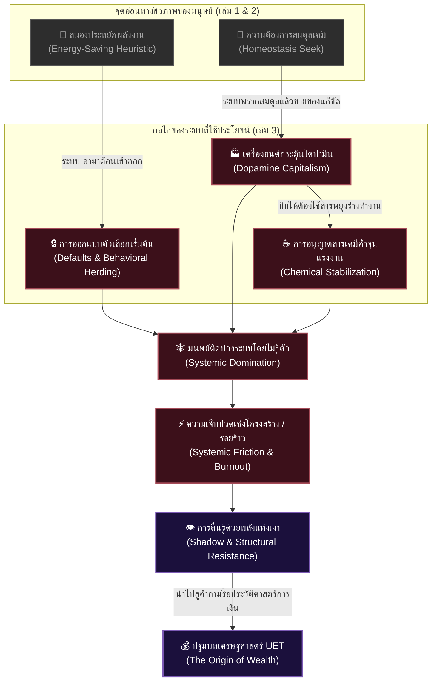

# 📖 โครงร่างหนังสือเล่มที่ 3 (Bio/Psy/Econ Series): โลกที่ติดโดปามีน (The Dopamine World)
> **ชื่อโครงการ:** psy + Econmi (หนังสือเกี่ยวกับไบโอ-จิตวิทยา เล่ม 3)  
> **ผู้เขียน:** สังเคราะห์จากทัศนะและแนวคิดเชิงทฤษฎี UET (Unity Equilibrium Theory)  
> **แก่นความคิดหลัก:** วิเคราะห์ **"ระบบภายนอก (ทุนนิยม/เมือง/อุตสาหกรรม) ที่ใช้ประโยชน์และแฮกกลไกชีวภาพของมนุษย์"** โดยเน้นว่าระบบโครงสร้างสังคมออกแบบมาเพื่อควบคุมพฤติกรรม กักขังเวลา และรีดเค้นแรงงานจากเราผ่านลูปสารเคมีและกลไกการประหยัดพลังงานของสมองอย่างไร โดยที่ปัจเจกคิดว่าตนเองเลือกเอง เล่มนี้จะไม่เน้นการอธิบายวิทยาศาสตร์ชีวภาพโดยตรง (เพราะเป็นหน้าที่ของเล่ม 1-2) แต่จะเน้น **"การเมืองเรื่องชีวภาพ (Biopolitics)"** เพื่อส่งไม้ต่อไปยังวิกฤตเศรษฐกิจและการเงินในเล่ม [0.1 Econmi - The Origin of Wealth](file:///c:/Users/santa/Desktop/uet_harness/uet_history/3_publish/books/0.1%20Econmi%20-%20The%20Origin%20of%20Wealth/book_1_blueprint.md)

---

## 🗺️ แผนผังการแสวงหาประโยชน์เชิงระบบ (Systemic Exploitation Tree)

---

## 📑 สารบัญและรายละเอียดเนื้อหารายบท (Chapter-by-Chapter Blueprint)

### 📌 บทนำ: เมื่อระบบนิเวศภายนอก แฮก ระบบประสาทภายใน
*   **แก่นประเด็น:** ทำความเข้าใจว่าทำไมการแก้ปัญหาชีวิตในระดับปัจเจก (เช่น การทำสมาธิ, การปรับ Mindset หรือการรักษาจิตเวชส่วนบุคคล) ถึงไม่มีทางสำเร็จอย่างยั่งยืน ตราบใดที่ระบบภายนอกจงใจแฮกและบิดเบือนสารเคมีในสมองของเราในระดับโครงสร้าง 
*   **เป้าหมายการเล่า:** ปรับโฟกัสของผู้อ่านจากการโทษตัวเอง (Self-blame) ไปสู่การมองเห็น **"กรงขังทางกายภาพ"** ที่มองไม่เห็น

---

### 📌 บทที่ 1: การพรากสมดุลตามธรรมชาติและการขาย "ตัวแทนความสุข" (Urban Colonization of the Senses)
*   **แก่นประเด็น:** ระบบเมืองและสังคมอุตสาหกรรมจงใจพรากสมดุลทางชีวภาพดั้งเดิม (Serotonin จากธรรมชาติ และ Oxytocin จากความผูกพันจริง) เพื่อสร้างสภาวะ **"ขาดแคลนเรื้อรัง"** แล้วนำเสนอความสุขแบบบริโภคนิยมเข้ามาขายแทนที่
*   **ประเด็นวิเคราะห์:**
    *   การเปลี่ยนพื้นที่ทางกายภาพให้กลายเป็นคอนกรีตและการจัดตารางเวลาทำงานที่บีบให้มนุษย์ตัดขาดจากระบบนิเวศ
    *   การทำลายสายสัมพันธ์ชุมชนย่อยเพื่อบีบให้ทุกคนต้องพึ่งพาระบบตลาดในการหาความสุขและการยอมรับ
    *   **การแปลงความโหยหาเป็นยอดขาย:** ระบบสร้างสินค้าโดปามีนสูงเข้ามาเสียบแทนช่องว่างของความอุ่นใจที่สูญหายไป

---

### 📌 บทที่ 2: เครื่องยนต์ผลิตโดปามีนเชิงพาณิชย์ (Dopamine Extraction Infrastructure)
*   **แก่นประเด็น:** ทุนนิยมไม่ได้ขายสินค้า แต่ขาย **"กลไกการคาดหวังรางวัล (Reward Expectation Loops)"** เพื่อดึงเวลาและเงินจากผู้บริโภค
*   **ประเด็นวิเคราะห์:**
    *   วิศวกรรมความสนใจ (Attention Engineering): การใช้ Algorithm และ Notification แฮกสมองส่วนหน้าเพื่อสร้างลูปการเสพติดโดยไม่มีจุดอิ่ม (Infinite Scroll)
    *   การทำเงินจากความเครียด: ยิ่งทำงานเหนื่อย สมองยิ่งต้องการรางวัลระยะสั้นที่หาซื้อง่าย (ของหวาน, ช็อปปิ้งออนไลน์, เกมมือถือ) ทุนนิยมจึงได้ประโยชน์ทั้งจากการใช้แรงงานและการขายของคลายเครียดในคนคนเดียวกัน

---

### 📌 บทที่ 3: Biopolitical Coping—การใช้สารเคมีค้ำยันโครงสร้างแรงงาน
*   **แก่นประเด็น:** ระบบใช้ประโยชน์จากสารเสพติดและพฤติกรรมเสพติดในฐานะ **"ตัวควบคุมเสถียรภาพของแรงงาน (Chemical Stabilizers)"** เพื่อประคองไม่ให้คนในระบบพังทลายลงก่อนกำหนด
*   **ประเด็นวิเคราะห์:**
    *   **กัญชา/สารผ่อนคลาย (Systemic Downers):** ทางแก้ขัดราคาถูกที่ระบบอนุญาต เพื่อจำลองความสงบธรรมชาติ (Serotonin) ให้แรงงานที่ไม่มีสิทธิ์เข้าถึงธรรมชาติจริง ได้เสพเพื่อคลายความตึงเครียดและไม่ลุกฮือขึ้นมาต่อต้านโครงสร้าง
    *   **คาเฟอีน/สารกระตุ้น (Systemic Uppers):** การทำให้สารกระตุ้นการลงมือทำงานเป็นเรื่องถูกกฎหมายและเข้าถึงได้ทุกหัวมุมถนน เพื่อให้แรงงานสามารถฝืนข้อจำกัดทางชีวภาพของร่างกายไปผลิตผลผลิตป้อนระบบได้เกินจริง
    *   **แอลกอฮอล์ (Social Integration Agent):** สารเคมีที่ระบบใช้เพื่อหล่อลื่นความตึงเครียดในสังคมเมือง ช่วยบรรเทาการขาด Oxytocin ชั่วคราวเพื่อให้มนุษย์ยังคงมีแรงปฏิสัมพันธ์ร่วมกันได้ภายใต้โครงสร้างที่เหินห่าง

---

### 📌 บทที่ 4: ลอจิกความขี้เกียจของสมองและการต้อนคนเข้าคอก (Exploiting the Energy Minimization Heuristic)
*   **แก่นประเด็น:** ระบบใช้ประโยชน์จากกลไกธรรมชาติของสมองที่ต้องการ **"ประหยัดพลังงานสูงสุด"** มาเป็นเครื่องมือในการควบคุมพฤติกรรมหมู่
*   **ประเด็นวิเคราะห์:**
    *   **การออกแบบ Default Option:** ระบบสร้างตัวเลือกเริ่มต้นในชีวิตประจำวัน (ผังเมือง, เส้นทางขนส่ง, โครงสร้างอาหารฟาสต์ฟู้ด) ที่ทำให้การเลือกสิ่งที่เป็นโทษต่อร่างกายกลายเป็นทางเลือกที่ประหยัดพลังงานสมองที่สุด
    *   **สิ่งแวดล้อมกำหนดเลือดเลี้ยงสมอง:** ลิงก์จากเรื่องผังบ้าน/ท่านอน—ระบบสถาปัตยกรรมห้องพักและผังเมืองที่ห่วย ส่งผลต่อคุณภาพอากาศ การนอน และการไหลเวียนโลหิต ซึ่งจงใจทำให้สมองของประชากรอยู่ในภาวะอ่อนล้าเรื้อรัง (Cognitive Fatigue) เพื่อให้ยอมจำนนต่อการตัดสินใจที่ง่ายและเอื้อต่อนายทุนที่สุด

---

### 📌 บทที่ 5: รอยร้าวเชิงระบบและปัญญาที่เกิดจากแรงบีบ (Systemic Friction & Cognitive Resistance)
*   **แก่นประเด็น:** เมื่อระบบรีดประสิทธิภาพมากเกินไปจนเกิดรอยร้าว (Burnout/Crisis) ร่างกายและจิตใจจะเริ่มต่อต้าน ซึ่งเป็นจุดกำเนิดของปัญญาและการเข้าสู่ Shadow Function
*   **ประเด็นวิเคราะห์:**
    *   ความทุกข์และการขาดแคลนทรัพยากร (เช่น ชนชั้นกลาง-ล่าง) ไม่ใช่ข้อบกพร่อง แต่เป็น **"เงื่อนไขบังคับ"** ที่ทำให้มนุษย์หมดหนทางพึ่งพาลูปสำเร็จรูปของระบบ และต้องหันกลับมาประมวลผลภายในอย่างลึกซึ้ง
    *   **การใช้พลังจาก Shadow:** การกระตุ้นฟังก์ชันสมองที่ระบบพยายามกดทับไว้ ให้ตื่นขึ้นมามองเห็นความบิดเบี้ยวของกติกาภายนอก และใช้ความเจ็บปวดเป็นแรงขับเคลื่อนในการทำลายกติกาเดิม

---

### 📌 บทที่ 6: ทางตันของการแก้ปัญหาที่ตัวตน สู่การทลายไม้บรรทัดโลก (Epilogue: The Bridge to Physical Wealth)
*   **แก่นประเด็น:** สรุปว่าปัญหาทางจิตวิทยาและสารเคมีทั้งหมดคืออาการสะท้อน (Symptom) ของระบบปิดส่วนเกินทางเศรษฐกิจ 
*   **รอยต่อสะพานเชื่อม:**
    *   เราไม่สามารถเยียวยาจิตใจในกรงขังที่ยังมีผู้คุมแฮกสมองเราได้ ทางออกเดียวคือการเปลี่ยนกติกาเศรษฐกิจและตัวกลางในการประเมินคุณค่า (เงิน)
    *   การโยงคำถามสำคัญส่งต่อไปยังเล่ม **[0.1 The Origin of Wealth](file:///c:/Users/santa/Desktop/uet_harness/uet_history/3_publish/books/0.1%20Econmi%20-%20The%20Origin%20of%20Wealth/book_1_blueprint.md)**: ระบบเงินเฟียตและโครงสร้างหนี้สินที่เราใช้ในปัจจุบัน มันขโมยอนาคตและเวลาชีวิตของเราไปทำลายชีวภาพของตัวเราตั้งแต่ตอนไหน? และอะไรคือจุดเริ่มต้นทางประวัติศาสตร์ของเรื่องนี้?
