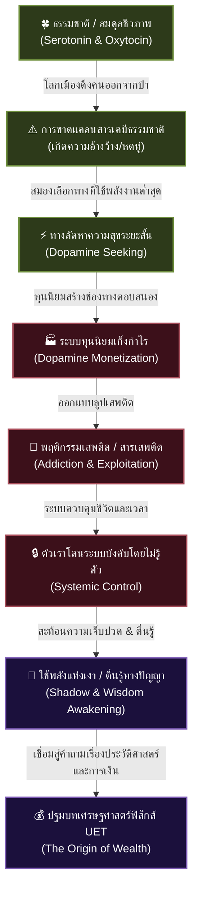

# 📖 โครงร่างหนังสือเล่มที่ 3 (Bio/Psy/Econ Series): โลกที่ติดโดปามีน (The Dopamine World)
> **ชื่อโครงการ:** psy + Econmi (หนังสือเกี่ยวกับไบโอ-จิตวิทยา เล่ม 3)  
> **ผู้เขียน:** สังเคราะห์จากทัศนะและแนวคิดเชิงทฤษฎี UET (Unity Equilibrium Theory)  
> **แก่นความคิดหลัก:** อธิบายการเปลี่ยนผ่านจาก "พฤติกรรมปัจเจก" สู่ "ปัญหาเชิงระบบ" ผ่านมุมมองทางจิตวิทยาและชีวภาพ วิเคราะห์ว่าระบบทุนนิยมและการออกแบบสังคมเมืองบังคับให้สมองของมนุษย์ตกอยู่ในลูปการหลั่งสารเคมีที่บิดเบี้ยวอย่างไร โดยที่ตัวเราไม่รู้ตัว เพื่อเป็นสะพานเชื่อม (Bridge) ไปสู่การรื้อประวัติศาสตร์และสร้างเศรษฐศาสตร์ใหม่ในเล่ม [0.1 Econmi - The Origin of Wealth](file:///c:/Users/santa/Desktop/uet_harness/uet_history/3_publish/books/0.1%20Econmi%20-%20The%20Origin%20of%20Wealth/book_1_blueprint.md)

---

## 🗺️ แผนผังการเปลี่ยนผ่าน: ปัจเจก → จิตวิทยา → ปัญหาเชิงระบบ

---

## 📑 สารบัญและรายละเอียดเนื้อหารายบท (Chapter-by-Chapter Blueprint)

### 📌 บทนำ: การเดินทางของตัวตนและพรมแดนระบบ
*   **แก่นประเด็น:** สรุปการเชื่อมโยงของไตรภาคหนังสือไบโอ-จิตวิทยา (เล่ม 1: ร่างกายธรรมชาติ $\rightarrow$ เล่ม 2: จิตสมองและเงา $\rightarrow$ เล่ม 3: จิตวิทยาและระบบสังคม) ชี้ให้เห็นว่าทำไมความเข้าใจในตนเองจึงไม่สามารถตัดขาดจากโครงสร้างภายนอกที่บีบเค้นเราอยู่ได้
*   **คำถามนำทาง:** เราจะพูดว่าตัวเราไร้สิทธิ์ควบคุมพฤติกรรมตัวเองได้อย่างไร หากระบบที่แวดล้อมเราถูกออกแบบมาเพื่อแฮกสมองเราตั้งแต่ลืมตาตื่น?

---

### 📌 บทที่ 1: ความสุขที่สูญหายในป่าคอนกรีต (The Lost Serotonin & Oxytocin)
*   **แก่นประเด็น:** มนุษย์ไม่ได้ต้องการความสุขแบบเดียว โครงสร้างสารเคมีสมองต้องการความสมดุล 3 ระดับ แต่สังคมเมืองดึงคนออกจากระบบนิเวศดั้งเดิม
*   **รายละเอียดเนื้อหา:**
    *   **เซโรโทนิน (Serotonin):** ความสงบและสมดุลจากการอยู่ร่วมกับธรรมชาติ
    *   **ออกซิโทซิน (Oxytocin):** ความผูกพันที่ปลอดภัยในชุมชนกายภาพจริง
    *   **โดปามีน (Dopamine):** แรงขับไล่ล่าและความสำเร็จระยะสั้น
    *   **วิกฤตความอ้างว้างสะสม:** เมื่อโลกเมืองทำลายเซโรโทนินและออกซิโทซิน ทำให้มนุษย์เกิด "ช่องว่างแห่งความสุข" และพยายามใช้วิธีเดียวแก้ปัญหาคือการถมมันด้วยโดปามีนชั่วคราว

---

### 📌 บทที่ 2: โดปามีน—เครื่องยนต์ขับเคลื่อนทุนนิยม (Dopamine Capitalism)
*   **แก่นประเด็น:** ทุนนิยมไม่ใช่แค่ระบบเศรษฐกิจ แต่คือ **"ระบบขยายโดปามีนลูป (Dopamine Optimization Loop)"**
*   **รายละเอียดเนื้อหา:**
    *   การออกแบบสินค้า บริการ และโซเชียลมีเดียให้สอดคล้องกับพฤติกรรมการล่ารางวัลระยะสั้น (Instant Gratification)
    *   การเปลี่ยน "เวลาชีวิต" ให้กลายเป็น "ต้นทุนการบริโภค" ที่หมุนเงินกลับสู่ระบบทุนนิยม
    *   วงจรอุบาทว์: ยิ่งเศรษฐกิจพุ่งตัว ความสุขตามธรรมชาติยิ่งลดลง คนยิ่งต้องเสพติดโดปามีนลูปเพื่อบรรเทาความเจ็บปวดจากการสูญเสียสมดุล

---

### 📌 บทที่ 3: สารเสพติดและการจำลองธรรมชาติในโลกที่ป่วยไข้ (Addiction & The Chemical Coping Mechanisms)
*   **แก่นประเด็น:** การเสพติดสารและพฤติกรรมในโลกยุคนี้ไม่ได้เกิดจาก "ศีลธรรมที่อ่อนแอ" แต่เป็นกลไกการปรับต้าน (Adaptation) เพื่อความอยู่รอดภายใต้แรงบีบของระบบ
*   **รายละเอียดเนื้อหา:**
    *   **กัญชาและธรรมชาติตัวจำลอง (Cannabis as Serotonin Substitute):** ในโลกคอนกรีตที่ขาดพื้นที่สีเขียวและความสุขสงบตามธรรมชาติ กัญชาทำหน้าที่เป็น "ทางลัด" จำลองเซโรโทนินและปลดปล่อยสมองชั่วคราว
    *   **คาเฟอีน ยาบ้า และสารขับเคลื่อนแรงงาน (Caffeine & Stimulants):** ในระบบทุนนิยมที่ให้คุณค่ากับประสิทธิภาพการผลิต (Productivity) มนุษย์จำเป็นต้องใช้สารกระตุ้นโดปามีนอย่างคาเฟอีนหรือแอมเฟตามีนเพื่อบังคับร่างกายให้ทำงานเกินพิกัดเพื่อความอยู่รอด
    *   **แอลกอฮอล์ในฐานะน้ำมันหล่อลื่นสังคม (Alcohol as the Mainstream Lubricant):** เมื่อความสัมพันธ์แบบลึกซึ้ง (Oxytocin) สลายไป แอลกอฮอล์จึงกลายเป็นสารเคมีชั่วคราวที่ทำให้มนุษย์ยอมลดเกราะป้องกันตัวเองเพื่อสร้างปฏิสัมพันธ์ทางสังคม
    *   วิเคราะห์ภาพเปรียบเทียบเชิงลึกของสารเสพติดแต่ละประเภทในฐานะ "ตัวตอบสนองที่เปลี่ยนรูปตามโครงสร้างสังคม"

---

### 📌 บทที่ 4: สมองประหยัดพลังงานและการถูกควบคุมโดยไม่รู้ตัว (The Energy-Saving Brain & Environmental Physics)
*   **แก่นประเด็น:** การทำความเข้าใจกลไกประหยัดพลังงานของสมองและการที่สภาพแวดล้อมทางกายภาพมีผลต่อพฤติกรรม
*   **รายละเอียดเนื้อหา:**
    *   **Neuro-Optimization (สมองขี้เกียจ):** สมองวิวัฒน์มาเพื่อลดการใช้พลังงาน (Energy Minimization) ส่งผลให้เราเลือกพฤติกรรมอัตโนมัติ (Habits) แม้ว่ามันจะเป็นนิสัยเชิงลบก็ตาม
    *   **ฟิสิกส์การไหลเวียนเลือดและพฤติกรรม:** นำเสนอวิทยาศาสตร์เชิงระบบที่อยู่เบื้องหลังความเชื่อแบบฮวงจุ้ย/ผังบ้าน การจัดวางเฟอร์นิเจอร์ ทิศทางการนอน และสิ่งแวดล้อมทางกายภาพที่ส่งผลต่อการไหลเวียนโลหิตไปเลี้ยงสมอง ซึ่งส่งผลโดยตรงต่อการทำหน้าที่ของสมองซีกซ้าย-ขวาและการตัดสินใจชีวิต
    *   การที่ระบบควบคุมเราผ่านสภาพแวดล้อมที่กระตุ้นให้สมองตัดสินใจเลือก "ลูปอัตโนมัติ" ที่สิ้นเปลืองพลังงานคิดน้อยที่สุด แต่ก่อเอนโทรปีเชิงชีวิตสูงที่สุด

---

### 📌 บทที่ 5: ความเจ็บปวดและพลังแห่งเงา (Pain & The Shadow Power)
*   **แก่นประเด็น:** ปัญญาและการตื่นรู้ไม่ได้เกิดขึ้นในภาวะสุขสบาย แต่เกิดจากการปะทะกับ "ความทุกข์และการขาดแคลนทรัพยากร"
*   **รายละเอียดเนื้อหา:**
    *   **การวิวัฒน์เพราะไม่มีทางเลือก:** การขาดแคลนทางทรัพยากร (ชนชั้นกลาง-ล่าง) บีบให้มนุษย์ต้องดึงพลังงานภายในออกมาใช้เพื่อเอาชีวิตรอด
    *   **การยอมรับและดึงพลังจาก Shadow Function:** ขยายความเข้าใจจากจิตวิทยาของ Carl Jung—ด้านมืดหรือฟังก์ชันที่ไม่ได้พัฒนาคือขุมพลังงานที่แข็งแกร่งที่สุดเมื่อเรานำมันขึ้นมาใช้เป็นฐานคิดในการทำลายกรอบความเชื่อเดิม
    *   การเปลี่ยนความเจ็บปวด (Pain) และความตึงเครียดภายในจิตใจ (Cognitive Dissonance) ให้กลายเป็นการตื่นรู้ทางสติปัญญา (Intellectual Awakening) ที่พร้อมตั้งคำถามกับระบบโครงสร้างโลก

---

### 📌 บทที่ 6: ปมปัญหาปัจเจกปะทะโครงสร้างโลก สู่การตั้งคำถามเชิงประวัติศาสตร์เศรษฐกิจ (Epilogue: The Bridge to Wealth)
*   **แก่นประเด็น:** สรุปยอดปัญหาเมื่อปัจเจกบุคคลไม่สามารถมีสุขภาวะที่ดีได้ ตราบใดที่ระบบเศรษฐกิจการเงินยังคงเป็น "ไม้บรรทัดบิดเบี้ยว"
*   **รายละเอียดเนื้อหา:**
    *   การประสานปัญหา: ปัญหาภายในจิตตนเอง $\rightarrow$ ปัญหากับความสัมพันธ์ทางสังคม $\rightarrow$ ปัญหากับตัวระบบการเงินคุมชีวิต
    *   **รอยต่อสะพานเชื่อม:** ทำไมปัญหาโดปามีนลูปและการทำงานหนักจนร่างพัง จึงย้อนกลับไปสู่คำถามที่ว่า **"เงินและมูลค่าถูกกติกาเศรษฐกิจบิดเบือนไปตั้งแต่ตอนไหน?"**
    *   การส่งไม้ต่อไปยัง [The Origin of Wealth](file:///c:/Users/santa/Desktop/uet_harness/uet_history/3_publish/books/0.1%20Econmi%20-%20The%20Origin%20of%20Wealth/README.md) เพื่อย้อนกลับไปศึกษาประวัติศาสตร์เรื่องความร้อน พลังงานฟืน และการสร้างตัวกลางในการวัดความมั่งคั่งที่นำไปสู่ความผิดปกติของเงินเฟียตในปัจจุบัน
