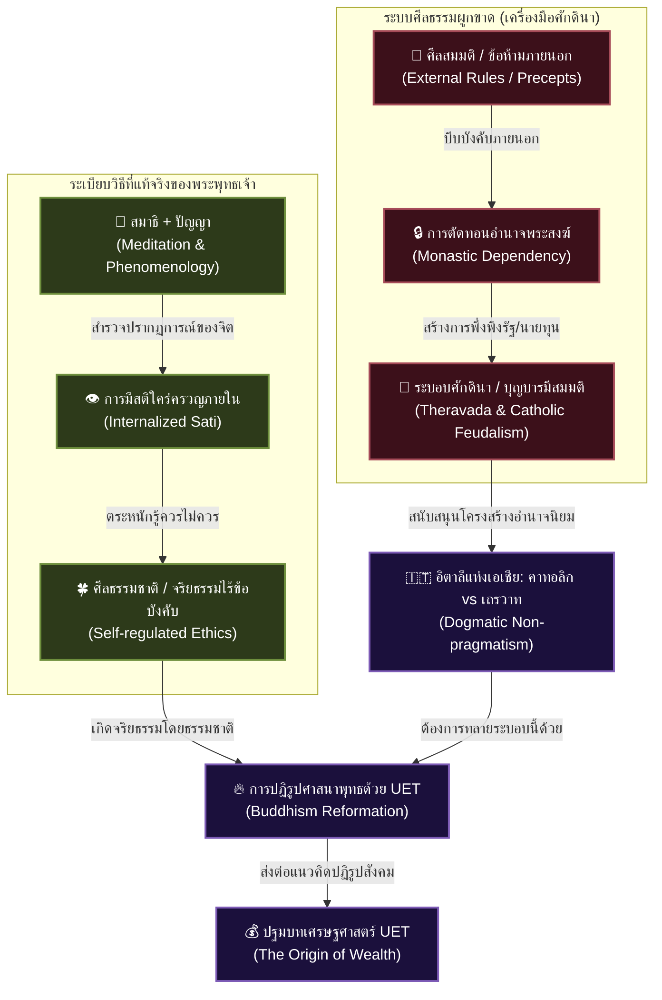

# 📖 โครงร่างหนังสือเล่มที่ 5 (Project: uet_religion_reformation): ปฏิวัติจิตสำนึกทลายศักดินา (Reformation of the Mind)
> **ชื่อโครงการ:** reformation_of_the_mind (การปฏิวัติจิตใจและวิทยาศาสตร์ศาสนา เล่ม 5)  
> **ผู้เขียน:** สังเคราะห์จากทัศนะและแนวคิดเชิงทฤษฎี UET (Unity Equilibrium Theory)  
> **แก่นความคิดหลัก:** เสนอการตีความพุทธศาสนาแบบตรงไปตรงมาตามข้อเท็จจริงทางประวัติศาสตร์และหลักกายภาพ (Secular Reformation) เพื่อทลายมายาคติของพุทธเถรวาทแบบไทยที่เป็นฐานคิดหนุนหลังระบอบศักดินา โดยการชี้ให้เห็นว่าพระพุทธเจ้าตรัสรู้ด้วย **"สมาธิ + ปัญญา (ระเบียบวิธีแบบปรากฏการณ์วิทยา)"** ไม่ใช่การยึดถือศีลแบบจารีต และการเปรียบเทียบเชิงโครงสร้างสังคมระหว่างพุทธเถรวาทไทยกับคริสต์คาทอลิกในอิตาลีที่สร้างระบบศักดินาขึ้นมาเหมือนกัน

---

## 🗺️ แผนผังโครงสร้างคิด: จากสมมติศีลธรรม สู่การตื่นรู้และปฏิบัติการจริง

---

## 📑 สารบัญและรายละเอียดเนื้อหารายบท (Chapter-by-Chapter Blueprint)

### 📌 บทนำ: เมื่อพุทธเถรวาทไทยกลายเป็นเครื่องมือแช่แข็งสังคม
*   **แก่นประเด็น:** ตั้งประเด็นท้าทายว่า ทำไมการพยายามเปลี่ยนโครงสร้างการเมืองหรือเศรษฐกิจไทยจึงพังทลายลงเสมอ? นั่นเพราะเราไม่เคยปฏิรูป "ศาสนาพุทธเถรวาทแบบไทย" ซึ่งทำหน้าที่เป็นซอฟต์แวร์ฝังชิปความเชื่อเรื่องกรรมและบุญบารมีที่สร้างความชอบธรรมให้ระบอบศักดินา
*   **เป้าหมายการเล่า:** ปักธงว่าหนังสือเล่มนี้จะทำหน้าที่เป็น **"การปฏิรูปศาสนา (Buddhism Reformation)"** เพื่อดึงแก่นธรรมออกจากมือของชนชั้นนำสถาปนา

---

### 📌 บทที่ 1: พระพุทธเจ้าไม่ได้ตรัสรู้ด้วย "มรรคมีองค์ 8" (ฉบับศีลข้อห้าม)
*   **แก่นประเด็น:** วิเคราะห์ข้อเท็จจริงทางประวัติศาสตร์ในคืนที่พระพุทธเจ้าตรัสรู้ พระองค์ไม่ได้นั่งไล่เช็กข้อห้ามทางศีลธรรม (ศีล 5/8/227) แต่ทรงใช้เพียง **"สมาธิ (Samadhi)"** และ **"ปัญญา (Panna)"** ในการพิจารณาสัจธรรมของธรรมชาติ
*   **ประเด็นวิเคราะห์:**
    *   **ศีลธรรมชาติที่เกิดจากข้างใน (Self-Regulated Morality):** การมีสติ (Sati) และปัญญา (Panna) ใคร่ครวญว่าอะไรควรทำไม่ควรทำ จะทำให้มนุษย์เกิด "ศีลในตัว" โดยอัตโนมัติ ไม่จำเป็นต้องสถาปนากฎเกณฑ์ภายนอกขึ้นมากดทับ
    *   การที่สถาบันทางศาสนายกเอา "ศีลภายนอก (ข้อห้าม)" ขึ้นมาเป็นตัวตั้งด่านแรก ก็เพื่อใช้เป็น **เครื่องมือควบคุมพฤติกรรมคนหมู่มาก (Social Herding)** ไม่ใช่เพื่อการหลุดพ้นที่แท้จริง

---

### 📌 บทที่ 2: การทำหมันอำนาจพระสงฆ์ไทย กับการขยายบทบาทในนิกายอื่น
*   **แก่นประเด็น:** เปรียบเทียบข้อจำกัดอันบิดเบี้ยวของพระสงฆ์ไทย (เถรวาทจารีต) กับพระสงฆ์นิกายอื่นในระดับสากล เพื่อชี้ให้เห็นว่าการจำกัดสิทธิ์พระสงฆ์ไทยเป็นแผนการเมือง
*   **ประเด็นวิเคราะห์:**
    *   **พระไทยที่ทำอะไรไม่ได้เลย:** การห้ามจับเงิน ห้ามทำอาหารกินเอง ห้ามมีเมีย ห้ามยุ่งการเมือง ทำให้พระสงฆ์ต้องพึ่งพายอดบริจาคและฆราวาสอย่างสมบูรณ์ ส่งผลให้สถาบันสงฆ์กลายเป็นเครื่องมือที่เชื่องและสยบยอมต่อรัฐ
    *   **บทบาททางเลือกในต่างแดน:** การที่พระญี่ปุ่นแต่งงานมีครอบครัวและบริหารวัดเป็นชุมชน การที่พระจีนเปิดมูลนิธิ/ทำธุรกิจเพื่อสังคม หรือแม้แต่พระสงฆ์เถรวาทในศรีลังกาที่สามารถมีบทบาทนำทางการเมืองและเรียกร้องสิทธิ์ให้ประชาชนได้จริง

---

### 📌 บทที่ 3: อิตาลีแห่งเอเชียตะวันออกเฉียงใต้—ขนานคาทอลิกและเถรวาทไทย (The Italy of Southeast Asia)
*   **แก่นประเด็น:** การเปรียบเทียบเชิงวิเคราะห์ความคล้ายคลึงระหว่างโครงสร้างสังคมของ **"ประเทศไทย" และ "ประเทศอิตาลี"**
*   **ประเด็นวิเคราะห์:**
    *   **ความเหมือนของระบบรากฐาน:** ทั้งสองประเทศขับเคลื่อนด้วยศาสนาที่มีความเข้มข้นทางพิธีกรรมและมีความเป็นสถาบันสูง (คาทอลิกในอิตาลี vs เถรวาทในไทย)
    *   **ศาสนาผู้สร้างระบบศักดินา (Feudalist Engine):** ทั้งคาทอลิกและเถรวาทจารีตเน้นคำสอนแบบไม่ปรับตัวตามยุคสมัย (Non-pragmatic) และมีการสร้าง "ชนชั้นทางจิตวิญญาณ" (บาทหลวง/พระสงฆ์ผู้มีบุญ) เพื่อนำมารองรับการสร้าง **ระบอบศักดินา (Feudalism)** ในโลกจริง ทำให้เกิดระบบอุปถัมภ์และวัฒนธรรมยอมจำนนต่อผู้มีอำนาจ

---

### 📌 บทที่ 4: จาก " Being " สู่ " Becoming " ของสัจธรรมที่แท้จริง
*   **แก่นประเด็น:** ศาสนาพุทธถูกทำให้เป็นความรู้สถิตนิ่งตายตัว (Being) ทั้งที่คำสอนของพระพุทธเจ้าว่าด้วยเรื่อง ไตรลักษณ์ (อนิจจัง) คือวิทยาศาสตร์เชิงกระบวนการแปรเปลี่ยน (Becoming)
*   **ประเด็นวิเคราะห์:**
    *   วิเคราะห์ความลื่นไหลของวิทยาศาสตร์ที่ไม่เคยหยุดนิ่ง (นิวตัน $\rightarrow$ ไอน์สไตน์ $\rightarrow$ UET) ซึ่งตรงข้ามกับความเชื่อของคนพุทธไทยที่พยายามตรึงคำสอนไว้กับความลี้ลับคงที่
    *   การดึงพุทธศาสนากลับมาเป็นปรัชญาปรากฏการณ์วิทยา (Phenomenology) ที่พร้อมถูกตั้งคำถามและพิสูจน์ใหม่ได้เสมอ

---

### 📌 บทที่ 5: สุญญตาและฟิสิกส์แห่งการถอนอัตตาเชิงระบบ
*   **แก่นประเด็น:** เชื่อมโยงแนวคิดความว่าง (Sunyata) สู่เลขศูนย์ (0) ในวิชาคณิตศาสตร์และสมการฟิสิกส์ UET
*   **ประเด็นวิเคราะห์:**
    *   การนำเสนอความจริงว่า "อนัตตา (ไม่มีตัวตน)" ไม่ใช่ปรัชญานามธรรมลอย ๆ แต่เป็นกฎฟิสิกส์เชิงโครงสร้างระบบเปิดที่ต้องปฏิบัติตามเพื่อรักษาสมดุลพลังงานและเอนโทรปีในสมองและร่างกาย

---

### 📌 บทส่งท้าย: ปลดปล่อยความจริงออกจากศาสนาเพื่อทลายระบบศักดินา
*   **แก่นประเด็น:** การปฏิรูปศาสนา (Buddhism Reformation) คือก้าวแรกที่จะปลดปล่อยประชากรให้หลุดพ้นจากการยอมจำนนต่อชนชั้นและโชคชะตา เพื่อเตรียมความพร้อมของระดับจิตสำนึกในการรื้อโครงสร้างการเงินและการเมืองในก้าวต่อไป
