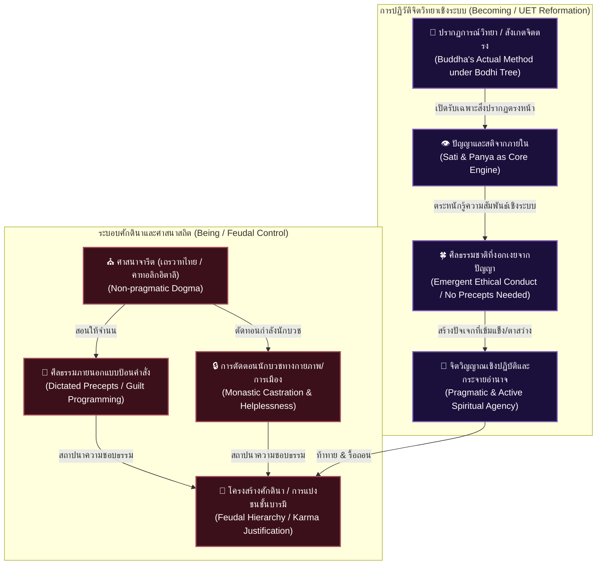

# 📖 โครงร่างหนังสือเล่มที่ 5 (Project: uet_religion_reformation): การตื่นรู้หลังการตาสว่าง (The Reformation of the Mind)
> **ชื่อโครงการ:** reformation_of_the_mind (การปฏิวัติจิตใจและวิทยาศาสตร์ศาสนา เล่ม 5)  
> **ผู้เขียน:** สังเคราะห์จากทัศนะและแนวคิดเชิงทฤษฎี UET (Unity Equilibrium Theory)  
> **แก่นความคิดหลัก:** เสนอการปฏิรูปพุทธศาสนาในระดับฐานราก (Radical Reformation) โดยการรื้อถอน "ศีลธรรมแบบสั่งการ" และ "ระบบสงฆ์จำนนต่อรัฐ" วิเคราะห์กระบวนการตรัสรู้จริงของพระพุทธเจ้าในฐานะ "ปรากฏการณ์วิทยา (Phenomenology)" ที่ใช้เพียงปัญญาและสมาธิสังเกตจิตตนเองเพื่อสร้างศีลจากภายใน เปรียบเทียบโครงสร้างพุทธเถรวาทไทยกับคริสต์คาทอลิกอิตาลีในฐานะเสาหลักของระบอบศักดินา (Feudalism) ที่จงใจหล่อหลอมให้ประชากรและนักบวชเป็นผู้อ่อนแอช่วยเหลือตัวเองไม่ได้ เพื่อรักษาสมดุลทางอำนาจของชนชั้นสูง

---

## 🗺️ แผนผังการปฏิวัติระบบคิด: การปะทะระหว่างจริยธรรมสั่งการกับระบอบศักดินา

---

## 📑 รายละเอียดเนื้อหาบทต่อบทอย่างเจาะลึก (Deep Chapter Breakdown)

### 📌 บทนำ: ปลดแอกศาสนาพุทธออกจากกรงขังศักดินา
*   **แก่นประเด็น:** ทำไมหนังสือ UET ทุกเล่มที่เขียนมา ทั้งเรื่องสมอง (เล่ม 1-2) และเรื่องระบบสังคม/การเงิน (เล่ม 3-4) จะไม่มีวันเปลี่ยนแปลงประเทศหรือโครงสร้างสังคมได้จริง ตราบใดที่เราไม่รื้อถอน "ซอฟต์แวร์ทางจิตวิญญาณ" ที่ฝังหัวประชากรอยู่ นั่นคือพุทธศาสนาแบบจารีตที่ทำหน้าที่ปูพื้นฐานทางจิตวิทยาให้คนยอมจำนนต่อระบอบศักดินา
*   **แกนการเล่า:** การปฏิวัติสังคมต้องการการปฏิวัติศาสนา (Reformation) เป็นเงื่อนไขนำ เหมือนที่ยุโรปต้องพังทลายอำนาจคาทอลิกเพื่อเปิดประตูสู่เสรีภาพทางปัญญา

---

### 📌 บทที่ 1: มายาการของ "ศีลป้อนคำสั่ง" vs ปรากฏการณ์วิทยาใต้ต้นพระศรีมหาโพธิ์
*   **แก่นประเด็น:** วิเคราะห์กระบวนการตรัสรู้จริงของพระพุทธเจ้า ชี้ให้เห็นว่าพระองค์ตรัสรู้ได้ด้วย **"ปัญญาและสมาธิ"** ผ่านระเบียบวิธีแบบปรากฏการณ์วิทยา (Phenomenology) ไม่ใช่การปฏิบัติตามกฎศีลธรรมป้อนคำสั่ง (Sila Precepts) อย่างที่ระบบการศึกษาไทยบิดเบือน
*   **ประเด็นวิเคราะห์เจาะลึก:**
    *   **พระพุทธเจ้าไม่ได้ตรัสรู้ด้วยศีล 5 หรือศีล 8:** ตอนที่ทรงนั่งใต้ต้นโพธิ์ พระองค์เพียงแค่ทำสมาธิ สังเกตการทำงานของจิตสำนึก คัดกรองและถอดถอนความเชื่อดั้งเดิมออกไปจนเห็นปรากฏการณ์ตรงหน้า (Phenomena) นี่คือการใช้สติปัญญาใคร่ครวญเชิงระบบ
    *   **ศีลธรรมที่แท้จริงเกิดจากปัญญาภายใน (Emergent Morality):** เมื่อปัจเจกมี "สติ (Sati)" และ "ปัญญา (Panya)" ในระดับลึก จะเกิดการตระหนักรู้เชิงระบบได้เองว่าการกระทำใดสร้างเอนโทรปีส่วนเกิน (ความเดือดร้อน) แก่ตนเองและผู้อื่น ศีลธรรมที่ดีงามจะงอกเงยขึ้นมาเองตามธรรมชาติโดยไม่ต้องท่องจำกฎเกณฑ์
    *   **วิพากษ์ศีลแบบสั่งการ (Dictated Precepts):** การบังคับให้คนท่องจำศีล 5 ศีล 8 จากภายนอกโดยไม่มีปัญญารองรับ ไม่ได้ทำให้คนดีขึ้นจริง แต่เป็นเครื่องมือสร้างความรู้สึกผิด (Guilt Programming) เพื่อปราบปรามทางจิตวิทยาให้เชื่องและควบคุมง่าย

---

### 📌 บทที่ 2: Biopolitical Castration—ทำไมพระไทยต้องถูกทำให้ช่วยเหลือตัวเองไม่ได้?
*   **แก่นประเด็น:** การเปรียบเทียบสถานะของนักบวชในแต่ละนิกายและประเทศ เพื่อเปิดเผยว่า **"ความอ่อนแอและช่วยเหลือตัวเองไม่ได้ของพระไทย"** เป็นงานออกแบบเชิงนโยบายเพื่อไม่ให้นักบวชกลายเป็นผู้นำการเปลี่ยนแปลงทางสังคม
*   **ประเด็นวิเคราะห์เจาะลึก:**
    *   **พรมแดนนักบวชที่แตกต่าง:** ในญี่ปุ่น พระนิกายเซนสามารถแต่งงาน มีครอบครัว ทำงานและใช้ชีวิตปกติได้; ในจีน พระสามารถเปิดมูลนิธิ ทำธุรกิจชุมชน และนำการพัฒนาสังคม; ในศรีลังกา (ซึ่งเป็นเถรวาทเหมือนไทย) พระสามารถมีบทบาทนำในการเมืองและลงสมัครรับเลือกตั้งได้
    *   **การตัดตอนทางชีวการเมือง (Biopolitical Castration) ในไทย:** กฎเกณฑ์ที่ห้ามพระไทยทำอาหารกินเองต้องคอยคนประเคน ห้ามจับเงินโดยตรง (แต่หลังไมค์ทำ) ห้ามลงคะแนนเสียงเลือกตั้ง และห้ามยุ่งเกี่ยวกับการเมืองโดยเด็ดขาด 
    *   **กลลวงเชิงระบบ:** การทำให้พระกลายเป็น "ผู้ไร้ความสามารถทางกายภาพและการเมือง (Institutionalized Helplessness)" ต้องพึ่งพาการอุปถัมภ์จากรัฐและเงินบริจาคจากประชาชนตลอดเวลา เพื่อให้พระทำหน้าที่เพียงแค่เป็น "เครื่องมือสร้างความศักดิ์สิทธิ์และสะสมบุญบารมี" ให้กับผู้มีอำนาจในระบอบศักดินา โดยไม่มีโอกาสซ่องสุมกำลังหรือคิดปฏิวัติสังคม

---

### 📌 บทที่ 3: คู่ขนาน อิตาลี-ไทย: คริสต์คาทอลิกและพุทธเถรวาทในฐานะสถาปัตยกรรมศักดินา
*   **แก่นประเด็น:** วิเคราะห์เปรียบเทียบเชิงโครงสร้างระดับมหภาคระหว่าง **ประเทศอิตาลี** และ **ประเทศไทย** ซึ่งมีลักษณะการฝังตัวของสถาบันศาสนาที่เข้มข้นเหมือนกัน และนำไปสู่ระบอบศักดินา (Feudalism) ที่ฝังรากลึก
*   **ประเด็นวิเคราะห์เจาะลึก:**
    *   **ความไม่ยืดหยุ่นเชิงปฏิบัติ (Non-pragmatic Dogma):** ทั้งคาทอลิกในอิตาลีและเถรวาทในไทยยึดมั่นใน "คำสอนแบบ Being" (ความจริงนิ่งสถิต/กฎจารีตที่ไม่ยอมปรับตัว) ซึ่งต่างจากโปรเตสแตนต์ที่เน้นความสอดคล้องกับพฤติกรรมการทำงานจริงของมนุษย์
    *   **การค้ำยันโครงสร้างชนชั้น:** ศาสนาคาทอลิกอิตาลีใช้การสารภาพบาปและพระคุณเจ้าเพื่อครอบงำจิตใจคน ส่วนเถรวาทไทยใช้เรื่อง "กรรมเก่าและการสั่งสมบุญ" เพื่ออธิบายว่าเหตุใดคนรวย/คนมีอำนาจจึงสมควรอยู่เหนือคนอื่น ทั้งสองฝั่งสร้างสมมติฐานเดียวกันคือ **"โครงสร้างชนชั้นในปัจจุบันเป็นเรื่องที่ชอบธรรมตามกฎของจักรวาล"**
    *   ผลกระทบเชิงระบบ: ทำให้ประชากรยอมจำนนต่อโชคชะตา ลดทอนจิตวิญญาณแห่งการตั้งคำถามเชิงวิทยาศาสตร์ และขัดขวางการกระจายอำนาจสู่ท้องถิ่น

---

### 📌 บทที่ 4: การรู้แจ้ง (Enlightenment) ก่อนการตื่นรู้ (Awakening)—บทเรียนการทลายโบสถ์วิหารของยุโรป
*   **แก่นประเด็น:** วิเคราะห์ว่าทำไมกระบวนการเปลี่ยนแปลงทางปัญญาของมนุษยชาติในระดับสังคมใหญ่ จำเป็นต้องให้การตาสว่างด้วยเหตุผลและการวิพากษ์ (Enlightenment) มาชำระล้างความเชื่อโบราณก่อน จึงจะเกิดการตื่นรู้เชิงสติปัญญาที่แท้จริง
*   **ประเด็นวิเคราะห์เจาะลึก:**
    *   **การทลายคนกลาง (Disintermediation):** เช่นเดียวกับที่โปรเตสแตนต์ตัดระบบบาทหลวงทิ้งเพื่อให้ปัจเจกคุยกับพระเจ้าเอง พุทธศาสนายุค UET ต้องตัดสถาบันสงฆ์จารีตและตัวแทนพิธีกรรมออกไป เพื่อให้ปัจเจกศึกษาการทำงานของจิตและฟิสิกส์ธรรมชาติด้วยตนเอง
    *   ความรู้แจ้งทางวิทยาศาสตร์และประวัติศาสตร์ (Enlightenment) จะช่วยถอนพิษ "พุทธจำลอง" ทำให้คนตาสว่างเห็นว่าศาสนาถูกบิดเบือนมาใช้อย่างไร จากนั้นจึงค่อยใช้ปรากฏการณ์วิทยา (Phenomenology) ในการเข้าถึงการตื่นรู้ (Awakening) ที่แท้จริง

---

### 📌 บทที่ 5: ฟิสิกส์สุญญตาและการวิจัยจิตสำนึกด้วยวิทยาศาสตร์จริง
*   **แก่นประเด็น:** การนำเสนอระเบียบวิธีการวิจัยตามทฤษฎี UET เพื่อเปลี่ยนแก่นธรรมพุทธศาสนาให้เป็นเครื่องมือวิศวกรรมจิตใจที่ตรวจสอบได้ทางกายภาพ
*   **ประเด็นวิเคราะห์เจาะลึก:**
    *   การแปลงความเชื่อเรื่องสมาธิ/การรู้ตัว ให้กลายเป็นการศึกษา **"สมดุลพลังงานสมองซีกซ้าย-ขวา"** และผลกระทบทางกายภาพของสิ่งแวดล้อม
    *   การนำเสนอความว่าง (Sunyata) ในฐานะสนามพลังงานศักย์ (Potential Field) ที่ไม่มีสภาวะตัวตนคงที่ แต่พร้อมจะแปรเปลี่ยนและเชื่อมโยงตามเงื่อนไขของระบบเปิด

---

### 📌 บทส่งท้าย: ปฏิญญาว่าด้วยจริยธรรมศูนย์สมดุล
*   **แก่นประเด็น:** การประกาศนิยามใหม่ของจริยศาสตร์และการพ้นทุกข์สำหรับโลกยุคถัดไป ปลดปล่อยมนุษย์จากการควบคุมของระบบศีลธรรมศักดินา เข้าสู่สมดุลเชิงฟิสิกส์ที่ค้ำประกันอิสรภาพและความเท่าเทียมของปัจเจกบุคคลอย่างแท้จริง
