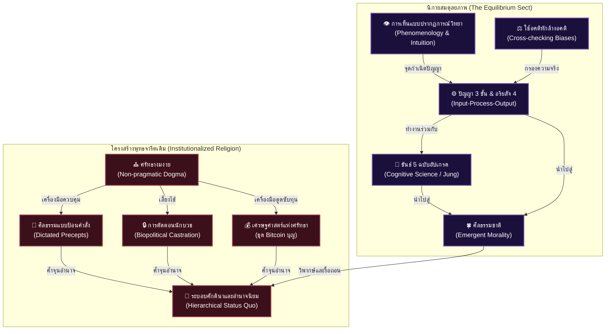

# 📖 โครงร่างหนังสือเล่มที่ 5 (Project: reformation_of_the_mind): การตื่นรู้หลังการตาสว่าง (The Reformation of the Mind)

> **ชื่อโครงการ:** reformation_of_the_mind (การปฏิวัติจิตใจและวิทยาศาสตร์ศาสนา เล่ม 5)  
> **ผู้เขียน:** สังเคราะห์จากทัศนะและแนวคิดเชิงทฤษฎี UET (Unity Equilibrium Theory)  
> **แก่นความคิดหลัก:** เสนอการปฏิวัติพุทธศาสนาในระดับแกนโครงสร้างความคิดมนุษย์ ผ่านการจัดตั้ง **"นิกายสมดุลยภาพ (The Equilibrium Sect)"** รื้อถอนระบบความเชื่อแบบดั้งเดิมที่ผูกขาดศีลธรรมภายนอกและโครงสร้างศักดินา ทำความเข้าใจอริยสัจ 4 ในฐานะระบบประมวลผลข้อมูล (Input-Process-Output) ควบคู่กับกระบวนการทำงานของปัญญา 3 ขั้น พร้อมเปิดเผยความจริงว่า "ศีล" ไม่ใช่เครื่องมือบรรลุธรรม แต่เป็นเพียงแพตช์ทางสังคม หนังสือเล่มนี้ยังขยายขอบเขตไปถึงการอัปเกรด "ขันธ์ 5" ด้วยจิตวิทยาปริชาน (Cognitive Science) แฉกลไกเศรษฐศาสตร์การขูดรีดผ่าน "Bitcoin บุญ" และวิพากษ์ความต่างระหว่างปัญญาที่แท้จริง (Intuition & Lived Experience) กับข้อจำกัดทางอคติของ AI

---

## 🗺️ แผนผังการปฏิวัติระบบคิด UET: นิกายสมดุลยภาพ (The Equilibrium Sect)

---

## 📑 รายละเอียดเนื้อหาบทต่อบทเชิงลึก (Comprehensive Chapter-by-Chapter Design)

### 📌 บทนำ: ปฏิญญาปฏิวัติจิตใจและการสถาปนา "นิกายสมดุลยภาพ"
*   **บริบทของปัญหา:** การปฏิวัติทางเศรษฐกิจและการเมืองจะไม่มีความหมาย หากจิตวิญญาณของผู้คนยังถูกจองจำในความเชื่อที่ส่งเสริมการยอมจำนน (Fatalism)
*   **ทางออก:** รื้อถอนเปลือกประเพณีและสร้าง "นิกายสมดุลยภาพ" ที่วางรากฐานศาสนาพุทธลงบนทฤษฎีระบบ (Systems Theory) และจิตวิทยาประยุกต์ เปลี่ยนผ่านจากการใช้เหตุผลแบบผิวเผิน (ยุค Enlightenment) ไปสู่การ "ตื่นรู้" แบบใช้งานได้จริงในชีวิต

---

### 📌 บทที่ 1: อริยสัจ 4 ในฐานะ "ระบบประมวลผลข้อมูลเพื่อดับทุกข์" (The Information Processing Loop)
*   **แก่นประเด็น:** อริยสัจ 4 ไม่ใช่บทสวด แต่คือสมการเชิงระบบประมวลผลข้อมูล
*   **การวิเคราะห์เจาะลึก:**
    *   **Input (ทุกข์ / ปัญหา):** การรับรู้ข้อมูลความจริงตรงตามปรากฏการณ์ ปราศจากการหลอกตัวเอง (Denial)
    *   **Process (สมุทัย / วิเคราะห์สาเหตุ):** การสืบสาวเหตุปัจจัย (ปัจจยาการ) ค้นหาจุดที่ข้อมูลหรือโครงสร้างขัดแย้งกับกฎธรรมชาติ
    *   **Output (นิโรธและมรรค):** การอัปเดตระบบ การปรับเปลี่ยนพฤติกรรม และคลายแรงต้านเชิงระบบเพื่อคืนสู่สมดุล 

---

### 📌 บทที่ 2: รื้อถอนและประกอบใหม่—จาก "ขันธ์ 5" สู่โมเดลจิตวิทยาปริชาน (Cognitive Science & Jung)
*   **แก่นประเด็น:** ขันธ์ 5 ไม่ใช่สิ่งศักดิ์สิทธิ์ที่ห้ามแตะต้อง แต่เป็นเพียงโมเดล (Framework) อธิบายจิตใจในยุคโบราณ การศึกษาที่แท้จริงต้องนำไปสอบทาน (Cross-check) กับศาสตร์สมัยใหม่เพื่อป้องกันการสุดโต่ง
*   **การอัปเกรด (Mapping with Psychology):**
    *   **รูป (Form) $\approx$** ฐานกายภาพและฮาร์ดแวร์
    *   **วิญญาณ (Consciousness) $\approx$** Sensing / การรับรู้
    *   **สัญญา (Perception) $\approx$** Memory / การจำแนกจำ
    *   **สังขาร (Mental Formations) $\approx$** Thinking, Intuition, Processing / การปรุงแต่ง
    *   **เวทนา (Feeling) $\approx$** Feeling / ความรู้สึกตอบสนอง
*   **สรุป:** การศึกษาจิตใจต้องใช้หลายโมเดล (เช่น Carl Jung, Existentialism, Phenomenology) มาถ่วงดุลกัน เพื่อสร้างระบบจัดการตัวเองที่ทดลองได้และใช้ได้จริงมากกว่าการท่องจำคัมภีร์

---

### 📌 บทที่ 3: "การเห็น (Intuition)" และกลไกปัญญา 3 ขั้น (The Origin of True Wisdom)
*   **แก่นประเด็น:** อัจฉริยะระดับโลก (นิวตัน, ไอน์สไตน์, พระพุทธเจ้า) ไม่ได้เริ่มจากการ "ใช้ตรรกะ (Logic)" แต่เริ่มจากการ **"เห็น (Intuition & Phenomenology)"** ในสิ่งที่คนอื่นมองข้าม ปัญญาที่แท้จริงจึงเริ่มต้นจากการรับรู้ที่มีคุณภาพ
*   **โมเดลปัญญา (The Data Pipeline):**
    *   **จุดกำเนิด:** "การเห็น" (Intuition) ปรากฏการณ์อย่างทะลุปรุโปร่ง
    *   **สุตมยปัญญา (Input):** การรวบรวมข้อมูลดิบและเรียนรู้โลก
    *   **จินตามยปัญญา (Process):** การคิดวิเคราะห์ ใคร่ครวญ และถ่วงดุลอคติ
    *   **ภาวนามยปัญญา (Output):** การลงมือปฏิบัติจนเกิดผลลัพธ์และเปลี่ยนแปลงชีวิตจริง ปัญญาจึงเท่ากับความสามารถในการจัดการข้อมูล (Data Processing Pipeline) ไม่ใช่ข้ออ้างทางศาสนาหรือตรรกะลอยๆ

---

### 📌 บทที่ 4: มายาการของ "ศีลป้อนคำสั่ง" และความจริงเชิงประวัติศาสตร์
*   **แก่นประเด็น:** "พระพุทธเจ้าไม่ได้ตรัสรู้ด้วยศีล" วันที่ท่านบรรลุธรรมยังไม่มีการบัญญัติศีลแม้แต่ข้อเดียว
*   **การวิเคราะห์เจาะลึก:**
    *   ศีลข้อแรกเกิดขึ้นหลังตรัสรู้ถึง 20 ปี ศีลจึงเป็นเพียง "แพตช์ (Patch)" หรือกฎหมายชุมชนแบบ Reactive เพื่อควบคุมคนหมู่มาก
    *   ต่อมา โครงสร้างศักดินาได้บิดเบือนศีลให้กลายเป็น **"ศีลป้อนคำสั่ง"** เพื่อตั้งโปรแกรมความรู้สึกผิด (Guilt Programming) ทำให้คนเชื่อง
    *   **ศีลธรรมชาติ (Emergent Sila):** เมื่อปัญญาทำงานสมบูรณ์ (เข้าถึงภาวนามยปัญญา) มนุษย์จะเข้าใจ Feedback Loop ว่าการเบียดเบียนคนอื่นคือการทำลายระบบตัวเอง ศีลจึงงอกเงยขึ้นมาเองตามธรรมชาติ ไม่ใช่กฎหมายบังคับ

---

### 📌 บทที่ 5: Biopolitical Castration—กลไกการทำให้เป็นง่อยในระบอบชีวการเมือง
*   **แก่นประเด็น:** กฎระเบียบที่ทำให้พระไทยหยิบจับเงินไม่ได้ ทำอาหารไม่ได้ หรือห้ามยุ่งเกี่ยวกับการเมือง คือสถาปัตยกรรมชีวการเมืองเพื่อตอนอำนาจ
*   **การวิเคราะห์เจาะลึก:**
    *   การบีบให้นักบวชต้องพึ่งพาการอุปถัมภ์จากรัฐ ทำให้สถาบันศาสนากลายเป็นตรายางรับรองอำนาจรัฐ
    *   เปรียบเทียบกับคริสต์คาทอลิกในอิตาลี (ยุคกลาง) ที่ใช้แนวคิดบาป-บุญเพื่อมอมเมาประชาชนและรักษาระเบียบศักดินา ป้องกันไม่ให้ประชาชนตั้งคำถามถึงความเหลื่อมล้ำทางเศรษฐกิจ

---

### 📌 บทที่ 6: เศรษฐศาสตร์แห่งศรัทธาและการขูดรีดผ่านระบบ "Bitcoin บุญ" (The Economy of Faith)
*   **แก่นประเด็น:** ศาสนาในปัจจุบันขาด "ปรัชญาเศรษฐศาสตร์" ที่โปร่งใส ทำให้ศรัทธาถูกเปลี่ยนรูปเป็นธุรกิจที่ไร้การตรวจสอบ
*   **การวิเคราะห์เจาะลึก:**
    *   **โมเดล "ขุด Bitcoin บุญ":** การหลอกให้คนจนทำบุญโดยหวังผลชาติหน้า เป็นการลงทุนด้วยเงินและเวลาที่ **"ไม่มีการรับประกันผลตอบแทนจริง"** อำนาจและเม็ดเงินไหลกลับไปสู่ชนชั้นบนและกลายเป็นความมั่งคั่งที่ตรวจสอบไม่ได้
    *   เมื่อปราศจากการบริหารระบบเศรษฐศาสตร์ที่ถูกต้อง ศาสนาจึงเปิดช่องว่างให้ถูกสแกมเมอร์และเครือข่ายธุรกิจสีเทาเข้ามากอบโกย ทำลายแก่นคำสอนอย่างย่อยยับ

---

### 📌 บทที่ 7: การแยก "วัฒนธรรมประเพณี" ออกจาก "เครื่องยนต์ดับทุกข์"
*   **แก่นประเด็น:** ต้องขีดเส้นแบ่งระหว่างกิจกรรมสังคมและแก่นปฏิบัติตามแนวทางวิทยาศาสตร์
*   **การประเมิน (UET Validation Rules):**
    *   **PASS (ผ่าน):** หลักการที่เป็นไปตาม Input-Process-Output ลดทุกข์ ลด EGO นำไปใช้ได้จริง
    *   **FAIL (ตก):** พิธีกรรมงมงาย การบูชาตัวบุคคล และระบบทำบุญซื้อแต้มเพื่อขยายอัตตาตัวตน สิ่งเหล่านี้คือวัฒนธรรมประเพณี ไม่ใช่ศาสนาพุทธ

---

### 📌 บทที่ 8: ฟิสิกส์สุญญตา, อคติ (Bias), และเหตุผลที่ AI บรรลุธรรมไม่ได้
*   **แก่นประเด็น:** ธรรมชาติของอคติ และการทำความเข้าใจจิตสำนึกผ่านมุมมองฟิสิกส์
*   **การวิเคราะห์เจาะลึก:**
    *   **อคติ (Bias) คือเฟรมภาพ (Frame of Reference):** เราหลีกเลี่ยงอคติไม่ได้เพราะไม่มีใครมองเห็นทุกอย่างได้พร้อมกัน คนมีปัญญาไม่ใช่คนที่อ้างว่าตัวเองเป็นกลาง แต่คือคนที่ **"รู้อคติ และใช้หลายความรู้มาถ่วงดุลอคติ"**
    *   **ข้อจำกัดของ AI:** ปัญญาประดิษฐ์ไม่มี "Lived Experience" ไม่มีร่างกายหรือความเจ็บปวด และมีอคติเชิงโครงสร้างจาก Weight ของ Data (กระแสหลักมักกลบทฤษฎีใหม่ที่ถูกต้องกว่า) AI จึงเป็นเพียงเครื่องมือจัดการข้อมูล แต่ไม่สามารถมี "Intuition" ที่นำไปสู่การตื่นรู้แบบมนุษย์ได้
    *   **สุญญตา = สมดุลสัมพัทธ์:** ความไม่มีตัวตนไม่ใช่ความว่างเปล่าทางจิตวิทยา แต่คือ "Relative Equilibrium" แบบฟิสิกส์ควอนตัม

---

### 📌 บทส่งท้าย: ปฏิญญาว่าด้วยจริยธรรมศูนย์สมดุล (The Equilibrium Declaration)
*   **บทสรุป:** นำเสนอการเปลี่ยนผ่านจาก "ศีลธรรมแห่งความกลัว" ไปสู่ **"จริยธรรมวิเคราะห์เชิงระบบผลกระทบ (Secular Systems Ethics)"** ปลดปล่อยปัจเจกบุคคลให้พ้นจากการผูกขาดของรัฐและนายหน้าทางศาสนา เพื่อสถาปนาอิสรภาพทางปัญญาที่แท้จริง

---
**จบโครงร่างหนังสือเล่มที่ 5 (Revision 3.0 - Integrated Psychological & Economic Critiques)**
