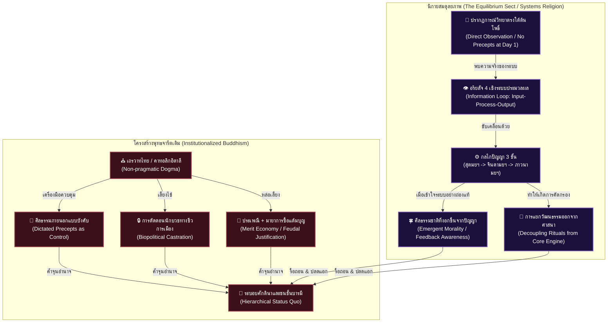

# 📖 โครงร่างหนังสือเล่มที่ 5 (Project: reformation_of_the_mind): การตื่นรู้หลังการตาสว่าง (The Reformation of the Mind)

> **ชื่อโครงการ:** reformation_of_the_mind (การปฏิวัติจิตใจและวิทยาศาสตร์ศาสนา เล่ม 5)  
> **ผู้เขียน:** สังเคราะห์จากทัศนะและแนวคิดเชิงทฤษฎี UET (Unity Equilibrium Theory)  
> **แก่นความคิดหลัก:** เสนอการปฏิวัติพุทธศาสนาในระดับแกนโครงสร้างความคิดมนุษย์ ผ่านการจัดตั้ง **"นิกายสมดุลยภาพ (The Equilibrium Sect)"** รื้อถอนระบบความเชื่อแบบดั้งเดิมที่ผูกขาดศีลธรรมภายนอกและโครงสร้างศักดินา ทำความเข้าใจอริยสัจ 4 ในฐานะระบบประมวลผลข้อมูล (Input-Process-Output) ควบคู่กับกระบวนการทำงานของปัญญา 3 ขั้น (สุตมยปัญญา, จินตามยปัญญา, ภาวนามยปัญญา) ซึ่งสอดคล้องกับระเบียบวิธีทางวิทยาศาสตร์โดยสมบูรณ์ พร้อมเปิดเผยความจริงเชิงประวัติศาสตร์ว่า "ศีล" ไม่ใช่เครื่องมือบรรลุธรรม แต่เป็นเพียงกฎหมายชุมชนที่ถูกสร้างขึ้นภายหลังเพื่อจัดการปัญหาพฤติกรรมมนุษย์ หนังสือเล่มนี้คือการปลดแอกจิตวิญญาณจากจารีตที่งมงาย สู่เสรีภาพทางปัญญาที่อธิบายได้ด้วยหลักฟิสิกส์และกลไกเชิงระบบ

---

## 🗺️ แผนผังการปฏิวัติระบบคิด UET: นิกายสมดุลยภาพ (The Equilibrium Sect)

---

## 📑 รายละเอียดเนื้อหาบทต่อบทเชิงลึก (Comprehensive Chapter-by-Chapter Design)

### 📌 บทนำ: ปฏิญญาปฏิวัติจิตใจและการสถาปนา "นิกายสมดุลยภาพ"
*   **บริบทของปัญหา:** การปฏิวัติเชิงโครงสร้างการเมืองและเศรษฐกิจ (อ้างอิงถึงหนังสือเล่มที่ 4) จะไม่มีทางประสบความสำเร็จอย่างยั่งยืน หาก "ซอฟต์แวร์นำทางจิตวิญญาณ" ของผู้คนในสังคมยังคงถูกจองจำอยู่ในระบบความเชื่อที่ส่งเสริมการยอมจำนนต่อโชคชะตาและอำนาจเหนือธรรมชาติ
*   **ความจำเป็นของการตาสว่าง (Enlightenment):** ในประวัติศาสตร์ยุโรป การปฏิวัติอุตสาหกรรมและวิทยาศาสตร์ เกิดขึ้นได้เพราะมีการปฏิรูปศาสนา (Protestant Reformation) ที่ทำลายการผูกขาดความจริงของศาสนจักรคาทอลิก ประเทศไทยและโลกตะวันออกจำเป็นต้องมีกระบวนการ "รื้อถอนและสร้างใหม่" ในลักษณะเดียวกัน
*   **ทางออก (Solution):** เสนอแนวทางการแยกตัวมาจัดตั้ง **"นิกายสมดุลยภาพ (The Equilibrium Sect)"** ซึ่งไม่ใช่การทำลายล้างศาสนาพุทธ แต่เป็นการ "กะเทาะเปลือก" เอาเฉพาะแก่น (Core Engine) ที่เป็นวิทยาศาสตร์และสามารถนำไปปฏิบัติการได้จริงในชีวิตประจำวัน (Pragmatism) คล้ายคลึงกับปรัชญาเซน (Zen) แต่วางรากฐานอยู่บนหลักฟิสิกส์ ทฤษฎีระบบ และทฤษฎีความสมดุล (UET)

---

### 📌 บทที่ 1: อริยสัจ 4 ในฐานะ "ระบบประมวลผลข้อมูลเพื่อดับทุกข์" (The Information Processing Loop)
*   **แก่นประเด็น:** อริยสัจ 4 ไม่ใช่บทสวดมนต์ศักดิ์สิทธิ์หรือหลักธรรมที่ต้องท่องจำเพื่อสอบเลื่อนวิทยฐานะ แต่คือแก่นแท้เพียงสิ่งเดียวที่พระพุทธเจ้าค้นพบ นั่นคือ "สมการเชิงระบบประมวลผลข้อมูล (Information Loop)" ที่ใช้อธิบายพลวัตของเหตุและผลอย่างแท้จริง
*   **ประเด็นวิเคราะห์เจาะลึก:**
    *   **กฎแห่งความเป็นเหตุเป็นผล (Causality):** ปฏิเสธแนวคิดเรื่องโชคชะตา พระผู้เป็นเจ้าดลบันดาล หรือกรรมเก่าที่แก้ไขไม่ได้ การดับทุกข์เกิดจากการวิเคราะห์แบบ "Reverse Engineering" เพื่อหาสาเหตุของปัญหาเชิงระบบ (สมุทัย)
    *   **โมเดลการประมวลผลข้อมูล (Input-Process-Output):**
        *   **Input (ทุกข์ / ปัญหา):** การรับรู้ข้อมูลความจริงตรงตามปรากฏการณ์ (Data Acquisition) เป็นขั้นตอนของการมีสติรับรู้สภาวะความไม่สมดุล ความขัดแย้ง หรือปัญหาที่เกิดขึ้นตามจริง โดยปราศจากอคติหรือการหลอกตัวเอง (Denial)
        *   **Process (สมุทัย / การวิเคราะห์สาเหตุ):** ขั้นตอนของการนำข้อมูลดิบ (Input) มาประมวลผล (Processing) การสืบสาวหาเหตุปัจจัยที่เกี่ยวโยงกันเป็นทอดๆ (ปัจจยาการ) การมองเห็นว่าความทุกข์นั้นเกิดจากการยึดติดในข้อมูลที่ผิดพลาด (อวิชชา) หรือความอยากที่ขัดแย้งกับกฎธรรมชาติ (ตัณหา) 
        *   **Output (นิโรธและมรรค / การอัปเดตระบบและการลงมือทำ):** ผลลัพธ์คือสภาวะที่ระบบกลับคืนสู่สมดุล (นิโรธ) ผ่านกระบวนทัศน์และแนวทางปฏิบัติที่ถูกต้อง (มรรค) ซึ่งก็คือการปรับเปลี่ยนพฤติกรรม ปรับแต่งโครงสร้าง และคลายแรงต้านเชิงระบบเพื่อแก้ไขปัญหาอย่างเบ็ดเสร็จ

---

### 📌 บทที่ 2: ปัญญา 3 ขั้น ในฐานะ "กระบวนการทางวิทยาศาสตร์และชีวิตจริง" (The Three Stages of Wisdom)
*   **แก่นประเด็น:** กระบวนการแสวงหาความรู้และการทำงานของมนุษย์ตั้งแต่อดีตจนถึงปัจจุบัน ไม่ว่าจะเป็นในการทำธุรกิจ การวิจัยทางวิทยาศาสตร์ หรือการเขียนโปรแกรม ล้วนทำงานอยู่บนแกนของ "ปัญญา 3 ขั้น" ตามที่ศาสนาพุทธระบุไว้ นี่ไม่ใช่เรื่องลึกลับทางจิตวิญญาณ แต่คือ "ระเบียบวิธีทางวิทยาศาสตร์ (Scientific Method)"
*   **ประเด็นวิเคราะห์เจาะลึก:**
    *   **1. สุตมยปัญญา (Sutamaya Paññā) - ปัญญาเกิดจากการรับข้อมูล (Input / Data Gathering):**
        *   คือการได้อ่าน ได้ฟัง ได้เขียน ได้เรียนรู้รวบรวมข้อมูลดิบ เป็นขั้นตอนของการรับรู้ว่าโลกนี้มีปัญหาอะไร มีทฤษฎีอะไรอยู่บ้าง เปรียบเสมือนการทำ Literature Review หรือการดึง Data เข้าสู่ฐานข้อมูล
    *   **2. จินตามยปัญญา (Cintāmaya Paññā) - ปัญญาเกิดจากการคิดวิเคราะห์ (Process / Analytical Thinking):**
        *   คือการนำข้อมูลที่ได้จากขั้นแรกมาขบคิด ใคร่ครวญ เปรียบเทียบ ตั้งสมมติฐาน และสร้างแบบจำลองทางความคิด (Mental Models) เพื่อค้นหาความเชื่อมโยงและตรรกะเบื้องหลัง นี่คือขั้นตอนของการประมวลผลข้อมูลดิบให้กลายเป็น "ความเข้าใจเชิงโครงสร้าง" (Understanding)
    *   **3. ภาวนามยปัญญา (Bhāvanāmaya Paññā) - ปัญญาเกิดจากการลงมือปฏิบัติ (Output / Empirical Execution):**
        *   คือการลงมือทำ การทดสอบสมมติฐานในโลกแห่งความเป็นจริง การนำทฤษฎีไปใช้งานจริง (Implementation) คำว่า "ภาวนา" ไม่ได้หมายถึงการนั่งหลับตาท่องพุทโธอย่างไร้จุดหมาย แต่คือการ "ปฏิบัติการและการสังเกตผลเชิงประจักษ์ (Empirical Observation)" เพื่อดูว่าโมเดลที่เราคิดไว้ในขั้นที่ 2 นั้น สามารถนำไปแก้ปัญหา (ดับทุกข์) ในสภาพแวดล้อมจริงได้หรือไม่ หากล้มเหลวก็ต้องกลับไปรับข้อมูลใหม่ (Loop back to Input)
*   **สรุป:** ปัญญาในศาสนาพุทธ คือกระบวนการเดียวกันกับวัฏจักรการเรียนรู้ของมนุษยชาติ (อ่าน $\rightarrow$ คิด $\rightarrow$ ลงมือทำ) และนี่คือเครื่องยนต์หลัก (Core Engine) เพียงหนึ่งเดียวที่จะพาไปสู่การตื่นรู้

---

### 📌 บทที่ 3: มายาการของ "ศีลป้อนคำสั่ง" และความจริงเชิงประวัติศาสตร์ของการตรัสรู้
*   **แก่นประเด็น:** ทำลายความเชื่อผิดๆ ที่สถาบันศาสนาพยายามฝังหัวประชากรว่า "ศีล" (Precepts/Rules) คือบันไดขั้นแรกที่ต้องมีเพื่อการบรรลุธรรม นำเสนอข้อเท็จจริงทางประวัติศาสตร์อย่างตรงไปตรงมาว่า "พระพุทธเจ้าไม่ได้ตรัสรู้ด้วยศีล" 
*   **ประเด็นวิเคราะห์เจาะลึก:**
    *   **ประวัติศาสตร์ที่ถูกบิดเบือน:** ในวันเพ็ญเดือนหก ณ ใต้ต้นพระศรีมหาโพธิ์ พระพุทธเจ้าตรัสรู้ด้วยเครื่องมือเพียงสองอย่างคือ **"ปัญญาและสมาธิ (ความตั้งมั่นของจิต)"** ทรงใช้ความสามารถทางปรากฏการณ์วิทยา (Phenomenology) ในการสังเกตการเกิดดับของสภาวะจิตใจโดยไม่มีอคติ ในเวลานั้น **"ยังไม่มีการบัญญัติศีลแม้แต่ข้อเดียว"**
    *   **ศีลเกิดจาก "ความส้นตีน" ของมนุษย์สังคม:** พระวินัยหรือสิกขาบทข้อแรก (เช่น ปาราชิก) ถูกบัญญัติขึ้น **หลังจากพระพุทธเจ้าตรัสรู้ไปแล้วถึง 20 ปี** เมื่อองค์กรสงฆ์ขยายตัวใหญ่ขึ้นและรับเอาบุคคลที่มีพฤติกรรมเสื่อมเสีย (อาสวัฏฐานิยธรรม) เข้ามา ศีลจึงเป็นเพียง "กฎหมายชุมชน" หรือ "แพตช์ (Patch)" ที่ถูกสร้างขึ้นแบบ Reactive เพื่ออุดช่องโหว่และควบคุมพฤติกรรมคนหมู่มาก ไม่ใช่ปัจจัยเชิงประจักษ์เพื่อการตรัสรู้
    *   **การกลายพันธุ์เป็น "ศีลแบบป้อนคำสั่ง" (Dictated Sila):** ในเวลาต่อมา โครงสร้างศักดินาได้บิดเบือนศีลธรรมให้กลายเป็นกฎข้อบังคับตายตัวแบบเผด็จการ (Dictated Precepts) เพื่อใช้เป็นเครื่องมือสร้างความรู้สึกผิด (Guilt Programming) ทำให้ประชากรเชื่อง คุมง่าย และไม่กล้าลุกขึ้นสู้กับความอยุติธรรม
    *   **ศีลที่แท้จริงคือ "ศีลธรรมชาติที่งอกเงยจากปัญญา" (Emergent Sila):** ผู้ที่ฝึกฝนจนมี "ภาวนามยปัญญา" จะตระหนักรู้ถึง Feedback Loop ของระบบ ว่าการเบียดเบียนผู้อื่นจะสร้างแรงกระเพื่อมและความทุกข์ (เอนโทรปีส่วนเกิน) กลับมาสู่ตนเอง เขาจึงหลีกเลี่ยงการทำร้ายผู้อื่นไปเองโดยธรรมชาติ (Emergent Morality) ไม่ใช่เพราะกลัวตกนรกหรือกลัวผิดกฎหมาย ศีลที่แท้จริงจึงเป็น "ผลลัพธ์ของการมีปัญญา" ไม่ใช่ข้อบังคับสถิตที่ต้องท่องจำ

---

### 📌 บทที่ 4: Biopolitical Castration—กลไกการทำให้เป็นง่อยในระบอบชีวการเมืองของไทย
*   **แก่นประเด็น:** ทำไมพระสงฆ์ไทยถึงต้องถูกบังคับให้ช่วยเหลือตัวเองไม่ได้? นี่ไม่ใช่วินัยที่บริสุทธิ์ผุดผ่อง แต่เป็นสถาปัตยกรรมเชิงชีวการเมือง (Biopolitics) ที่ถูกออกแบบมาอย่างแยบยลเพื่อรักษาระเบียบศักดินา
*   **ประเด็นวิเคราะห์เจาะลึก:**
    *   **การเปรียบเทียบข้ามพรมแดนนิกาย:** 
        *   **ญี่ปุ่น (มหายาน/เซน):** พระมีครอบครัวได้ บริหารวัดเหมือนธุรกิจและมูลนิธิ ทำงานประกอบอาชีพได้ จึงมีอิสระทางการเงินและความคิด
        *   **จีน/ไต้หวัน:** พระเปิดมูลนิธิขนาดใหญ่ ดำเนินกิจกรรมช่วยเหลือสังคมและสร้างโรงพยาบาลได้เอง มีอำนาจต่อรองสูง
        *   **ศรีลังกา (เถรวาทเช่นเดียวกับไทย):** พระสามารถตั้งพรรคการเมือง ลงเล่นการเมือง และสมัครรับเลือกตั้งเป็นสมาชิกรัฐสภาได้ เพื่อขับเคลื่อนนโยบายสาธารณะ
    *   **การตัดตอนนักบวชทางชีวการเมืองในไทย (Biopolitical Castration):**
        *   กฎระเบียบจุกจิก เช่น ห้ามพระไทยทำอาหารกินเอง ห้ามจับต้องเงินทองโดยตรง ห้ามมีบทบาททางการเมือง ห้ามออกเสียงเลือกตั้ง ล้วนเป็นกลไก "การทำให้เป็นง่อยเชิงสถาบัน (Institutionalized Helplessness)"
        *   วัตถุประสงค์ที่แท้จริงคือการบีบให้พระสงฆ์กลายเป็นกลุ่มคนที่ "ไร้ความสามารถในการพึ่งพาตนเอง" และต้องพึ่งพาการอุปถัมภ์ทางการเงินจากรัฐบาลศักดินาและชนชั้นสูงอยู่ตลอดเวลา
        *   เมื่อพระสงฆ์ต้องรอคอยเศษเงินและสมณศักดิ์จากรัฐ พวกเขาจึงถูก "ตอน" อำนาจต่อรอง ไม่สามารถทำหน้าที่เป็นผู้นำทางจิตวิญญาณเพื่อวิพากษ์วิจารณ์ความอยุติธรรมของรัฐ หรือเป็นกระบอกเสียงให้กับผู้ถูกกดขี่ได้ สถาบันสงฆ์ไทยจึงกลายเป็นเพียงตรายางประทับความชอบธรรมให้กับผู้มีอำนาจ

---

### 📌 บทที่ 5: คู่ขนาน อิตาลี-ไทย: คริสต์คาทอลิกและพุทธเถรวาทในฐานะสถาปัตยกรรมศักดินา
*   **แก่นประเด็น:** เปรียบเทียบเชิงโครงสร้างระดับมหภาคระหว่าง "อิตาลี" (ศูนย์กลางคริสต์คาทอลิก) และ "ประเทศไทย" (ศูนย์กลางพุทธเถรวาท) เพื่อแสดงให้เห็นว่าศาสนาแบบจารีตที่ไม่ยืดหยุ่น (Non-pragmatic Dogma) คืออุปสรรคสำคัญที่สุดในการพัฒนาประเทศ
*   **ประเด็นวิเคราะห์เจาะลึก:**
    *   **กลไกครอบงำเพื่อรักษาสถานะชนชั้น:** 
        *   คาทอลิกในอิตาลี (ในอดีต) ใช้ความเชื่อเรื่องพระผู้สร้าง การสารภาพบาป และสิทธิขาดของศาสนจักร ในการกล่อมเกลาจิตใจประชากรและรีดไถทรัพยากร (เช่น การขายใบไถ่บาป)
        *   เถรวาทในไทย ใช้กลไกความเชื่อเรื่อง "กรรมเก่าในอดีตชาติ" และ "การสะสมบุญบารมี" เพื่ออธิบายความเหลื่อมล้ำทางเศรษฐกิจและสังคม โดยอ้างว่าคนที่รวยล้นฟ้าคือผู้ที่ทำบุญมามาก ส่วนคนจนคือผู้ที่มีกรรมเก่า ต้องยอมจำนนต่อสภาพและทำบุญกับวัดเพื่อหวังผลในชาติหน้า (Merit Economy)
    *   **ผลกระทบต่อสังคม:** โครงสร้างความเชื่อที่มอมเมาทั้งสองแบบนี้ ทำหน้าที่เป็น "ยาชา" ที่ขัดขวางไม่ให้ประชาชนลุกขึ้นมาตั้งคำถามถึงโครงสร้างเศรษฐกิจที่ไม่เป็นธรรม ยับยั้งการคิดเชิงตรรกะวิทยาศาสตร์ และแช่แข็งสังคมให้อยู่ในระบอบศักดินาอย่างถาวร

---

### 📌 บทที่ 6: การแยก "วัฒนธรรมประเพณี" ออกจาก "เครื่องยนต์ดับทุกข์"
*   **แก่นประเด็น:** เสนอกระบวนทัศน์ใหม่ของการจัดโครงสร้างศาสนา โดยต้องแยกเส้นแบ่งอย่างเด็ดขาดระหว่าง "กิจกรรมทางสังคม/ประเพณี" และ "แก่นปฏิบัติการทางจิตวิทยา (Core Engine)" เพื่อไม่ให้เกิดความสับสนและงมงาย
*   **ประเด็นวิเคราะห์เจาะลึก:**
    *   **ประเพณีคืองานวัฒนธรรม ไม่ใช่ศาสนา:** กิจกรรมเช่น งานวัด งานศพ การทอดกฐิน หรือพิธีกรรมต่างๆ เป็นเพียง "นวัตกรรมทางสังคม (Social Innovation)" ที่ออกแบบมาเพื่อดึงผู้คนมารวมตัวกัน สร้างเครือข่ายชุมชน และรักษาเอกลักษณ์ของชาติ ซึ่งเป็นสิ่งที่ดีในแง่ของวัฒนธรรม แต่ **ไม่ใช่ "เครื่องมือในการดับทุกข์" หรือ "จุดสะสมแต้มบุญเพื่อซื้อสิทธิพิเศษในชีวิต"**
    *   **เกณฑ์คัดกรองคำสอนของนิกายสมดุลยภาพ (UET Validation Rules for Buddhism):**
        *   **หลักเกณฑ์ที่ผ่าน (PASS):** คำสอนหรือแนวปฏิบัติใดที่เป็นไปเพื่อการ "ลดทุกข์ ลดกิเลสตัณหา ลดอัตตาตัวตน (Ego)" และสามารถอธิบายกลไกการทำงานได้ตามหลัก Input-Process-Output $\rightarrow$ ถือเป็นแก่นแท้ของพุทธศาสนาและนิกายสมดุลยภาพ
        *   **หลักเกณฑ์ที่ไม่ผ่าน (FAIL):** คำสอนหรือพิธีกรรมใดที่ส่งเสริมการยึดติดสมมติบัญญัติ เน้นอำนาจวิเศษ การบูชาตัวบุคคล พิธีกรรมลึกลับ หรือการทำบุญเพื่อหวังผลประโยชน์ส่วนตน (ขยายอัตตาตัวตน) $\rightarrow$ ต้องถูกคัดออกและระบุชัดเจนว่าเป็นสิ่งแปลกปลอมที่เพิ่มเข้ามาในภายหลัง

---

### 📌 บทที่ 7: ฟิสิกส์สุญญตาและการวิจัยจิตสำนึกด้วยวิทยาศาสตร์จริง
*   **แก่นประเด็น:** การอธิบายปรัชญาขั้นสูงสุดของพุทธศาสนา (ความว่าง/สุญญตา/อนัตตา) ด้วยภาษาของฟิสิกส์เชิงควอนตัมและทฤษฎีความสมดุล (UET)
*   **ประเด็นวิเคราะห์เจาะลึก:**
    *   **สุญญตาและเลขศูนย์:** รากฐานทางปรัชญาของความไม่มีตัวตนเอกเทศ (Sunyata / Non-Self) ไม่ใช่ความว่างเปล่าแบบไม่มีอะไรเลย แต่คือ "สภาวะสมดุลสัมพัทธ์" (Relative Equilibrium) แนวคิดนี้สอดคล้องกับการค้นพบเลขศูนย์ (Zero) ในโลกตะวันออก ซึ่งเป็นรากฐานของคณิตศาสตร์และวิทยาศาสตร์สมัยใหม่
    *   **การเปลี่ยนจิตวิญญาณเป็นการวัดค่าเชิงกายภาพ:** นำเสนอกรอบแนวคิดในการวิจัยเรื่อง "สมาธิ" และ "การรู้แจ้ง" ผ่านตัวแปรทางวิทยาศาสตร์ เช่น การวัดสมดุลคลื่นสมอง (Brainwave Synchronization) อัตราการเต้นของหัวใจ (HRV) และความแปรปรวนของการไหลเวียนโลหิต เพื่อพิสูจน์ว่าพุทธศาสนาที่แท้จริงคือประสาทวิทยาศาสตร์ (Neuroscience) เชิงประจักษ์ ไม่ใช่เรื่องลึกลับเหนือธรรมชาติ

---

### 📌 บทส่งท้าย: ปฏิญญาว่าด้วยจริยธรรมศูนย์สมดุล (The Equilibrium Declaration)
*   **แก่นประเด็น:** บทสรุปเพื่อประกาศจุดยืนของมนุษยชาติยุคใหม่ นำเสนอการเปลี่ยนผ่านจาก "ศีลธรรมแห่งความกลัว (Fear-based Morality)" ที่ขับเคลื่อนด้วยการกลัวนรก-หวังสวรรค์ ไปสู่ **"จริยธรรมวิเคราะห์เชิงระบบผลกระทบ (Secular Systems Ethics)"**
*   **ข้อเสนอ:** ปลดปล่อยปัจเจกบุคคลให้พ้นจากการสยบยอมต่อระบอบศักดินาและสถาบันตัวกลาง สถาปนาเสรีภาพ ความเสมอภาค และความตระหนักรู้ร่วมกัน (Collective Consciousness) ว่ามนุษย์ทุกคนมีศักยภาพในการประมวลผลข้อมูล (ปัญญา 3 ขั้น) เพื่อเข้าถึงความสมดุลและความจริงสูงสุดได้ด้วยตนเองโดยไม่ต้องผ่านนายหน้าทางศาสนาใดๆ

---
**จบโครงร่างหนังสือเล่มที่ 5 (Revision 2.0 - Expanded & Deepened Analysis)**
