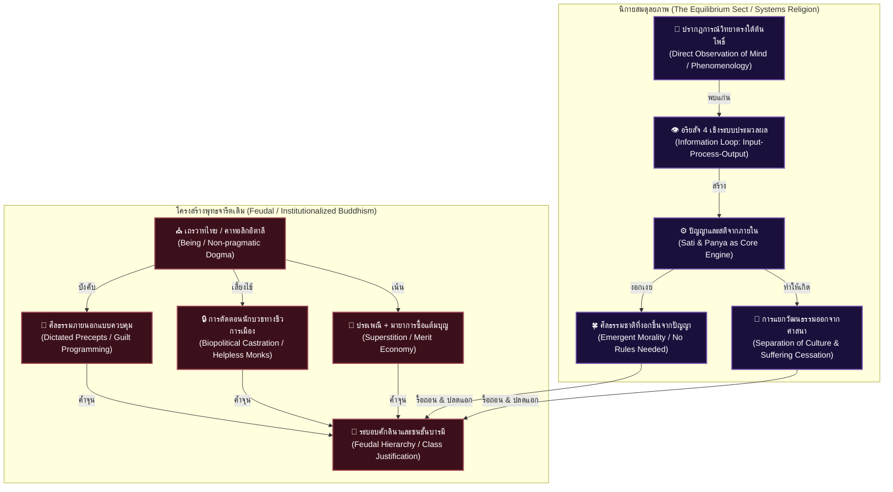

# 📖 โครงร่างหนังสือเล่มที่ 5 (Project: uet_religion_reformation): การตื่นรู้หลังการตาสว่าง (The Reformation of the Mind)
> **ชื่อโครงการ:** reformation_of_the_mind (การปฏิวัติจิตใจและวิทยาศาสตร์ศาสนา เล่ม 5)  
> **ผู้เขียน:** สังเคราะห์จากทัศนะและแนวคิดเชิงทฤษฎี UET (Unity Equilibrium Theory)  
> **แก่นความคิดหลัก:** เสนอการปฏิวัติพุทธศาสนาในระดับแกนโครงสร้างความคิดมนุษย์ ผ่านการจัดตั้ง **"นิกายสมดุลยภาพ (The Equilibrium Sect)"** รื้อถอนระบบความเชื่อแบบดั้งเดิมที่ผูกขาดศีลธรรมภายนอกและโครงสร้างศักดันา ทำความเข้าใจอริยสัจ 4 ในฐานะระบบประมวลผลข้อมูล (Input-Process-Output) เพื่อดับทุกข์และถอนอัตตาตัวตน เปรียบเทียบพุทธเถรวาทไทยกับคริสต์คาทอลิกอิตาลีในฐานะโครงสร้างเชิงชีวการเมือง (Biopolitics) ที่สถาปนาระบอบศักดินา และเสนอการแยกส่วน "วัฒนธรรม/ประเพณี" ออกจาก "แก่นศาสนา" อย่างเด็ดขาดเพื่อเปิดเสรีภาพทางปัญญา

---

## 🗺️ แผนผังการปฏิวัติระบบคิด UET: นิกายสมดุลยภาพ (The Equilibrium Sect)

---

## 📑 รายละเอียดเนื้อหาบทต่อบทแบบครบถ้วนครอบคลุม (Comprehensive Chapter-by-Chapter Design)

### 📌 บทนำ: ปฏิญญาปฏิวัติจิตใจและการสถาปนา "นิกายใหม่"
*   **แก่นประเด็น:** ชี้ให้เห็นความล้มเหลวของการปฏิวัติโครงสร้างสังคมและการเมือง (เล่ม 4) ที่ไม่ได้ปฏิวัติซอฟต์แวร์นำทางจิตวิญญาณ (เล่ม 5) ของคนในสังคมก่อน เสนอแนวทางการแยกนิกายมาจัดตั้ง **"นิกายสมดุลยภาพ"** ที่มีความชัดเจนและนำไปปฏิบัติการได้จริงเหมือนนิกายเซน (Zen) แต่มีหลักวิทยาศาสตร์และฟิสิกส์ UET ที่แน่นหนารองรับ
*   **แกนการวิเคราะห์:** วิเคราะห์ประวัติศาสตร์ตะวันตกที่ต้องโค่นล้มระบบอำนาจคิดของคาทอลิกผ่านการปฏิรูปศาสนา (Protestant Reformation) และการตาสว่างด้วยเหตุผล (Enlightenment) ก่อนสังคมจะพัฒนาทางปัญญาและจิตวิญญาณ (Awakening) ได้จริง

---

### 📌 บทที่ 1: อริยสัจ 4 ในฐานะ "ระบบประมวลผลข้อมูลเพื่อดับทุกข์" (Information Processing Loop)
*   **แก่นประเด็น:** อริยสัจ 4 คือแก่นแท้เพียงสิ่งเดียวที่พระพุทธเจ้าสอน (การดับทุกข์) และเป็นสมการเชิงระบบประมวลผลข้อมูล (Information Loop) ที่มีเหตุและผลอย่างแท้จริง
*   **ประเด็นวิเคราะห์เจาะลึก:**
    *   **ทุกข์ต้องมีสาเหตุ (Causality):** การดับทุกข์ไม่ได้เกิดจากการอ้อนวอนหรือโชคชะตา แต่เกิดจากการสืบเสาะจนเห็น "สาเหตุย้อนกลับ" ของระบบ (สมุทัย)
    *   **โมเดลการประมวลผลข้อมูล (Input-Process-Output):**
        *   **Input (ขั้นรับข้อมูล):** การมีสติและปัญญาในการตระหนักรู้ข้อมูลความจริงตรงตามปรากฏการณ์ (ทุกข์และสาเหตุของทุกข์) โดยปราศจากอคติ
        *   **Process (ขั้นประมวลผล):** การนำข้อมูลดิบที่ได้จากการสังเกตมาใคร่ครวญคิดคำนวณความเชื่อมโยงตามเงื่อนไขธรรมชาติและกฎ UET (ปัญญาขั้นพิจารณา)
        *   **Output (ขั้นแก้ไขผลลัพธ์):** การลงมือปฏิบัติการและปล่อยวางแรงต้านเพื่อดับทุกข์เชิงระบบ (นิโรธและมรรค)

---

### 📌 บทที่ 2: มายาการของ "ศีลป้อนคำสั่ง" vs ปัญญาและปรากฏการณ์วิทยาใต้ต้นโพธิ์
*   **แก่นประเด็น:** พระพุทธเจ้าตรัสรู้ได้โดยใช้เพียง **"ปัญญาและสมาธิ"** สังเกตจิตตัวเอง (Phenomenology) ไม่ได้ปฏิบัติหรือพึ่งพาศีลแบบป้อนคำสั่ง (Dictated Sila)
*   **ประเด็นวิเคราะห์เจาะลึก:**
    *   **วิพากษ์ศีลแบบจารีต:** การกำหนดศีลเป็นข้อๆ จากภายนอกเป็นเพียงเครื่องมือสร้างความรู้สึกผิด (Guilt Programming) เพื่อปราบปรามจิตวิทยาของประชากรให้ยอมจำนนและปกครองง่าย
    *   **ศีลคือผลลัพธ์ที่งอกเงยจากปัญญา (Emergent Sila):** คนที่มีสติและปัญญาที่ตระหนักรู้ถึง Feedback Loop ของระบบ จะรู้ได้ด้วยตัวเองว่าพฤติกรรมใดสร้างความเหลื่อมล้ำหรือความทุกข์ (เอนโทรปีส่วนเกิน) และจะเลี่ยงการกระทำนั้นเองตามธรรมชาติโดยไม่ต้องใช้กฎศีลธรรมมาบังคับ ศีลจึงเป็นคุณสมบัติที่เกิดขึ้นเองเมื่อมีปัญญา ไม่ใช่เงื่อนไขนำทางสถิต

---

### 📌 บทที่ 3: Biopolitical Castration—ทำไมพระไทยต้องถูกทำให้ช่วยเหลือตัวเองไม่ได้?
*   **แก่นประเด็น:** ความช่วยเหลือตัวเองไม่ได้ของพระสงฆ์ไทยเป็นงานออกแบบเชิงโครงสร้างชีวการเมืองของระบอบศักดินา
*   **ประเด็นวิเคราะห์เจาะลึก:**
    *   **เปรียบเทียบข้ามพรมแดนนิกาย:** พระญี่ปุ่นมีครอบครัวและทำงานประกอบอาชีพปกติได้, พระจีนเปิดมูลนิธิดำเนินกิจกรรมสังคมและชุมชนอย่างเข้มแข็ง, พระศรีลังกา (เถรวาท) สามารถลงเล่นการเมืองและสมัครรับเลือกตั้งได้
    *   **การทำให้เป็นง่อยในระบบไทย (Institutionalized Helplessness):** กฎห้ามพระไทยทำอาหารกินเอง ห้ามจับเงิน ห้ามมีบทบาททางการเมืองและออกเสียงเลือกตั้ง ถูกออกแบบมาเพื่อให้พระเป็นกลุ่มคนที่ต้องพึ่งพาการสนับสนุนเชิงเงินบริจาคและโครงสร้างอุปถัมภ์จากรัฐศักดินาตลอดเวลา เพื่อสยบยอมนักบวชให้อยู่ภายใต้การควบคุม ไม่ให้มีอำนาจต่อรองหรือสร้างแรงผลักดันเพื่อปฏิรูปสังคม

---

### 📌 บทที่ 4: คู่ขนาน อิตาลี-ไทย: คริสต์คาทอลิกและพุทธเถรวาทในฐานะสถาปัตยกรรมศักดินา
*   **แก่นประเด็น:** การเปรียบเทียบเชิงโครงสร้างระดับมหภาคระหว่าง อิตาลี และ ประเทศไทย ซึ่งฝังตัวอยู่กับสถาบันศาสนาจารีตที่ไม่ยืดหยุ่นเชิงปฏิบัติ (Non-pragmatic Dogma)
*   **ประเด็นวิเคราะห์เจาะลึก:**
    *   **กลไกครอบงำเพื่อรักษาสถานะชนชั้น:** คาทอลิกในอิตาลีใช้การสารภาพบาปและความเชื่อพระผู้สร้างเพื่อกล่อมเกลาจิตใจ ส่วนเถรวาทในไทยใช้หลัก "กรรมเก่า-การสะสมบุญบารมี" เพื่อสร้างความชอบธรรมให้ชนชั้นปกครองรวยล้นฟ้า และปลอบใจคนจนให้ยอมจำนนเพื่อชาติหน้า
    *   การฝังฐานคิดเรื่องลำดับชั้นทางจิตวิญญาณนี้ขัดขวางการคิดเชิงวิทยาศาสตร์ เสรีภาพของปัจเจก และการกระจายอำนาจสู่ท้องถิ่นอย่างถาวร

---

### 📌 บทที่ 5: การแยก "วัฒนธรรม/ประเพณี" ออกจาก "แก่นศาสนาเพื่อการดับทุกข์"
*   **แก่นประเด็น:** การแยกอย่างเด็ดขาดระหว่างประเพณีทางสังคมและแก่นปฏิบัติการจิตวิทยาเพื่อดับทุกข์ ปลดแอกความเชื่อจากจารีตมาสู่ความจริงเชิงประจักษ์
*   **ประเด็นวิเคราะห์เจาะลึก:**
    *   **ประเพณีคืองานวัฒนธรรมไม่ใช่ศาสนา:** งานวัด เทศกาล งานศพ คือเรื่องของการรักษาความสัมพันธ์ทางสังคม ประเพณีและวัฒนธรรมสามารถทำเพื่อตอบสนองต่อระบบชุมชนและปกป้องมรดกทางประวัติศาสตร์ได้ แต่ไม่ใช่ "เครื่องดับทุกข์" หรือ "เครื่องมือกวาดซื้อแต้มบุญ"
    *   **เกณฑ์คัดกรองคำสอนของพุทธนิกายสมดุลยภาพ (UET Buddhism Validation Rules):**
        *   ยึดเกณฑ์ที่พระพุทธเจ้ามอบไว้: คำสอนใดเป็นไปเพื่อการลดทุกข์ ลดกิเลสตัณหา และลดอัตตาตัวตน (Selfishness) $\rightarrow$ ยึดเป็นแก่นของนิกาย
        *   คำสอนใดเน้นการติดสมมติทางอำนาจ สิทธิ์ขาดเหนือผู้อื่น พิธีกรรมลึกลับ หรือการขยายอัตตาตัวตน $\rightarrow$ คัดออกว่าเป็นของแปลกปลอม

---

### 📌 บทที่ 6: ฟิสิกส์สุญญตาและการวิจัยจิตสำนึกด้วยวิทยาศาสตร์จริง
*   **แก่นประเด็น:** สัจธรรมและความว่างในฐานะสนามพลังงานที่ไม่มีตัวตนคงที่ และแนวทางการแปลงสมาธิเป็นการตรวจวัดทางกายภาพ
*   **ประเด็นวิเคราะห์เจาะลึก:**
    *   **สุญญตาและเลขศูนย์:** รากฐานทางปรัชญาของความไม่มีอัตตาเอกเทศ (Sunyata) ที่นำไปสู่การประดิษฐ์เลขศูนย์และปูทางสู่วิทยาศาสตร์สมัยใหม่
    *   **การวิจัยเชิง UET:** การแปลงกระบวนการสังเกตจิตของปรากฏการณ์วิทยา ไปสู่การศึกษาการไหลเวียนโลหิต สมดุลคลื่นสมอง และการเปลี่ยนแปลงสภาวะจิตใจตามตัวแปรทางชีวภาพและสภาพแวดล้อมที่แท้จริง

---

### 📌 บทส่งท้าย: ปฏิญญาว่าด้วยจริยธรรมศูนย์สมดุล
*   **แก่นประเด็น:** การปฏิญญาจริยธรรมแบบวิเคราะห์ตามผลกระทบจริงเชิงระบบ (Secular Systems Ethics) แทนที่ศีลธรรมแห่งความกลัวบาป ปลดปล่อยปัจเจกบุคคลให้พ้นจากการสยบยอมในระบอบศักดินา สถาปนาเสรีภาพและความเสมอภาคในโลกกายภาพจริง
