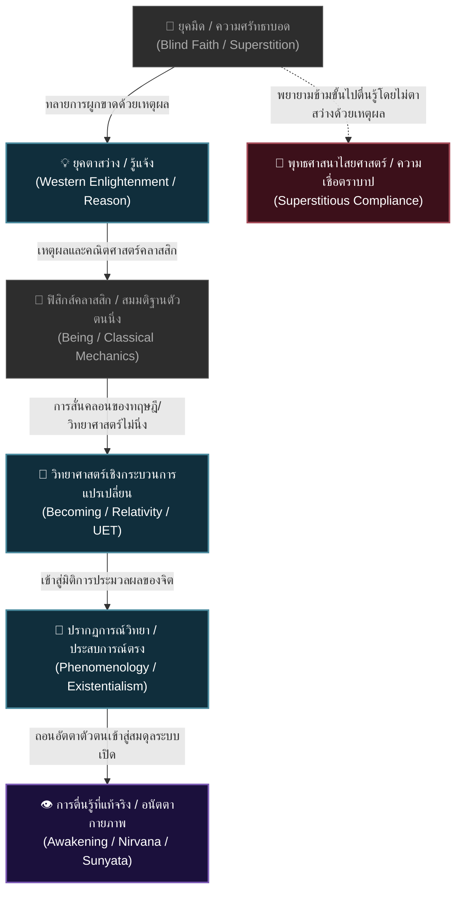

# 📖 โครงร่างหนังสือเล่มที่ 5 (Project: uet_religion_reformation): การตื่นรู้หลังการตาสว่าง (The Reformation of the Mind)
> **ชื่อโครงการ:** reformation_of_the_mind (การปฏิวัติจิตใจและวิทยาศาสตร์ศาสนา เล่ม 5)  
> **ผู้เขียน:** สังเคราะห์จากทัศนะและแนวคิดเชิงทฤษฎี UET (Unity Equilibrium Theory)  
> **แก่นความคิดหลัก:** เสนอแนวทางการ **"ปฏิวัติศาสนาพุทธด้วยเหตุผลทางวิทยาศาสตร์เชิงระบบ (Secular/Scientific Reformation)"** โดยถอดบทเรียนจากประวัติศาสตร์ยุโรปที่ต้องผ่านยุคตาสว่างด้วยเหตุผล (Enlightenment) ก่อนจะเกิดการตื่นรู้เชิงสัญชาตญาณหรือปรัชญาปรากฏการณ์วิทยา (Phenomenology/Awakening) วิพากษ์การแอบอ้างวิทยาศาสตร์แบบผิวเผินเพื่อหาผลประโยชน์ และนำเสนอการตีความพุทธศาสนาในระดับแก่นกายภาพ (สมการเอนโทรปี อนัตตาในฐานะระบบเปิด และเลขศูนย์จากสุญญตา) เพื่อสร้างซอฟต์แวร์นำทางจิตใจชุดใหม่ที่สอดคล้องกับความจริงจริง ๆ

---

## 🗺️ แผนผังวิวัฒนาการทางสติปัญญา: ตาสว่าง (Enlightenment) → ตื่นรู้ (Awakening)

---

## 📑 สารบัญและรายละเอียดเนื้อหารายบท (Chapter-by-Chapter Blueprint)

### 📌 บทนำ: ทำไมต้องปฏิวัติซอฟต์แวร์จิตใจก่อนปฏิวัติสังคม?
*   **แก่นประเด็น:** ถอดรหัสประวัติศาสตร์ยุโรป ชี้ให้เห็นว่าโครงสร้างทางสังคมจะไม่สามารถเปลี่ยนแปลงได้อย่างถาวร ตราบใดที่ระบบศีลธรรมและสมมติฐานทางจิตวิญญาณชุดเดิม (Operating System) ยังไม่ถูกท้าทายและปฏิรูป การตาสว่างด้วยเหตุผล (Enlightenment) คือรากฐานที่ต้องเกิดขึ้นก่อนการตื่นรู้ (Awakening)
*   **คำถามนำทาง:** ทำไมการต่อสู้เชิงโครงสร้างการเมืองในประเทศที่มีวัฒนธรรมพุทธแบบจารีต จึงมักจะหมุนวนกลับไปสู่ระบบชนชั้นและการยอมรับผู้มีบารมีทางศีลธรรมอยู่เสมอ?

---

### 📌 บทที่ 1: วิพากษ์ "พุทธแอบอ้างวิทยาศาสตร์" และความเขลาของตลาด Mass
*   **แก่นประเด็น:** วิพากษ์คลิปไวรัลและคอนเทนต์ผิวเผินที่พยายามนำวิทยาศาสตร์ไปรับรองความเชื่อศาสนาพุทธเพื่อสร้างภาพลักษณ์ให้ตนเองดูดี โดยไม่เข้าใจปรัชญาวิทยาศาสตร์ที่แท้จริง
*   **ประเด็นวิเคราะห์:**
    *   **การลดทอนคุณค่าทั้งสองฝั่ง:** วิทยาศาสตร์คือระบบความรู้แบบ **Becoming** (ลื่นไหล อัปเกรด และฟ้องตัวเองตลอดเวลา เช่น ไอน์สไตน์แก้ลอจิกนิวตัน และ UET กำลังแก้ลอจิกไอน์สไตน์) การนำไปอ้างอิงกับศาสนาพุทธในฐานะความรู้นิ่งสถิต (**Being**) จึงเป็นการแสดงความไม่เข้าใจกระบวนการทางวิทยาศาสตร์อย่างแท้จริง
    *   วิพากษ์ความมักง่ายของนักสร้างคอนเทนต์ในตลาด Mass (เช่น TikTok หรือพอดแคสต์แนวเล่าตามยูทูปฝรั่งโดยไร้งานวิจัยรองรับ) ที่เน้นเพียงยอดวิวแต่บิดเบือนข้อเท็จจริง

---

### 📌 บทที่ 2: ปรากฏการณ์วิทยา—ระเบียบวิธีเข้าถึงความจริงของพระพุทธเจ้า (Buddhism as Phenomenology)
*   **แก่นประเด็น:** เชื่อมโยงแนวคิดของอาจารย์ภาควิชาปรัชญา (อาจารย์วิทย์ จุฬาฯ) ที่ระบุว่า หนทางที่พระพุทธเจ้าใช้ในการตรัสรู้และนิพพาน แท้จริงแล้วคือระเบียบวิธีคิดแบบ **ปรากฏการณ์วิทยา (Phenomenology)**
*   **ประเด็นวิเคราะห์:**
    *   การข้ามพ้นอภิปรัชญาแฟนตาซี ไปสู่การสังเกตสิ่งปรากฏแก่จิตโดยตรง (Phenomena) แบบ "กลับไปหาตัวสิ่งนั้นเอง" (Go back to the things themselves)
    *   การวิเคราะห์โครงสร้างจิตสำนึกและการตัดความเชื่อส่วนเกินออกเพื่อมองเห็นสัจธรรมของธรรมชาติ

---

### 📌 บทที่ 3: สุญญตา เลขศูนย์ และฟิสิกส์ของความว่าง (The Mathematical Physics of Sunyata)
*   **แก่นประเด็น:** ความสอดคล้องระหว่างคณิตศาสตร์ ฟิสิกส์ และปรัชญาตะวันออกโบราณ เรื่อง **"ความว่าง (Sunyata)"** ซึ่งเป็นต้นกำเนิดของเลขศูนย์ (0) ในอินเดียที่เปลี่ยนโฉมวิทยาศาสตร์โลก
*   **ประเด็นวิเคราะห์:**
    *   ความว่างไม่ใช่ความไม่มีอะไร แต่คือสภาวะ "ปราศจากตัวตนเอกเทศ" (Dependent Origination - ทุกสิ่งอาศัยกันและกันจึงเกิดขึ้นได้)
    *   การวิเคราะห์หลัก **อนิจจัง (Impermanence)** ในฟิสิกส์อุณหพลศาสตร์: ทุกอย่างคือการไหลของพลังงาน ไม่มีสิ่งใดคงตัวนิ่งสนิท

---

### 📌 บทที่ 4: จาก "อนัตตา" สู่การถอนอัตตาเชิงระบบ (Systemic Anatta & Ego Dissolution)
*   **แก่นประเด็น:** การอธิบายกฎ **อนัตตา (Non-self)** ผ่านฟิสิกส์เชิงระบบและทฤษฎี UET เพื่อล้างความเข้าใจผิดเรื่อง "จิตวิญญาณสถิต"
*   **ประเด็นวิเคราะห์:**
    *   ตัวตน (Ego) ในมุมมอง UET คือ "ระบบปิดซ้อนย่อยชั่วคราว" ที่พยายามรักษาสถานะของตนเองโดยกักเก็บพลังงานศักย์ไว้
    *   การพ้นทุกข์ (นิพพาน) คือการเปลี่ยนระบบปิดที่ตึงเครียดและสะสมเอนโทรปีส่วนเกิน ให้กลายเป็นระบบเปิดที่ไหลเวียนร่วมกับพลังงานของจักรวาลอย่างสมดุล (Dynamic Equilibrium)

---

### 📌 บทที่ 5: จากศรัทธาสู่การวิจัยเชิงระบบ (From Faith to Rigorous Systems Research)
*   **แก่นประเด็น:** หากเชื่อว่าแก่นธรรมคือความจริงเชิงกายภาพ หน้าที่ของนักคิดไม่ใช่การเทศนา แต่คือการนำวิธีคิดนั้นไปวิจัย สร้างแบบจำลอง และเขียนสมการพิสูจน์
*   **ประเด็นวิเคราะห์:**
    *   โมเดล UET ในการทดสอบความสัมพันธ์ระหว่างสภาพแวดล้อมทางกายภาพ การไหลเวียนโลหิตในร่างกาย และการประมวลผลทางจิตสำนึกซีกซ้าย-ขวา
    *   การเปลี่ยนศาสนาจากเรื่องของความเชื่อและการบนบานศาลกล่าว ให้กลายเป็นวิทยาศาสตร์การออกแบบพฤติกรรมมนุษย์

---

### 📌 บทส่งท้าย: การปฏิวัติศาสนาพุทธแบบลูเธอร์ และการเปิดเสรีทางสติปัญญา
*   **แก่นประเด็น:** ประกาศแนวทางปฏิรูปพุทธศาสนาในไทยเพื่อตัดตอนสถาบันสงฆ์และพิธีกรรมผูกขาด มอบอำนาจการรู้แจ้งและสิทธิในการเข้าถึงสัจธรรมคืนสู่มือปัจเจกบุคคลทุกคน เพื่อปูทางสู่การปฏิวัติสังคมในขั้นถัดไป
