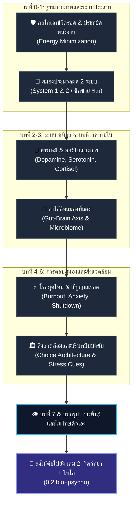

# 📖 โครงร่างหนังสือเล่มที่ 1 (Bio Series): ธรรมชาติของร่างกายและสมอง ฉลาดกว่าที่เราคิด

> **ชื่อโครงการ:** bio (หนังสือเกี่ยวกับไบโอ-จิตวิทยา เล่ม 1)
> **สถานะโครงการ:** **Draft 1 Complete** (ร่างฉบับแรกเสร็จเรียบร้อยแล้ว อยู่ในขั้นตอนการเกลาภาษาและตรวจสอบอ้างอิงงานวิจัยอย่างละเอียด)
> **รูปแบบเผยแพร่หลัก:** **Web-First Digital Reading Format (เปิดอ่านบนเว็บแจกฟรี / อ่านเพลินสไตล์ Webtoon)** สลับด้วยภาพประกอบ Infographic และรูปวาดสถานการณ์ชีวิตจริง
> **การจัดรูปเล่มรอง:** Pocket Book (ขนาด A6 สำหรับตีพิมพ์เล่มจริง)
> **สไตล์ภาษา:** ภาษาพูดเป็นกันเอง "ผม–คุณ" (ใช้ "กู–มึง" เฉพาะจังหวะเน้นกระแทก) จริงใจ ตรงประเด็น อ่านง่ายแบบ Interactive Webtoon
> **แก่นความคิดหลัก:** **"ร่างกายและสมองมีความฉลาดในตัวเองที่ถูกออกแบบมาเพื่อเอาชีวิตรอด ไม่ได้ออกแบบมาเพื่อความสุข"** เล่มนี้เน้นการอธิบายกลไกทางกายภาพภายใน สารเคมี ฮอร์โมน ระบบประสาท ลำไส้ และสิ่งแวดล้อมทางกายภาพที่บงการพฤติกรรมเรา โดยที่เราคิดว่าเราเป็นคนเลือกเอง
> **ระบบอ้างอิงและสื่อ:** คลิกเปิดลิงก์งานวิจัยจริง (PubMed, DOI, Scholar) และลิงก์รูปประกอบ/บทความอ้างอิงได้ทันทีจากทุกตอน

---

## 🗺️ แผนผังโครงสร้างทฤษฎีกายภาพ (Physical Intelligence Flow)

---

## 📑 สารบัญและ Research Citation Audit Matrix (ตรวจสอบงานวิจัยอ้างอิงรายตอน)

โครงสร้างแต่ละตอนใช้สูตร **8 หัวข้อย่อย (A/B/C)**:
`1. Recall & Connect` | `2. Insight Hook` | `3. Core Focus` | `4. Relational Mechanism` | `5. Everyday Application` | `6. Systemic Impact` | `7. Forward Bridge` | `8. Research Reference 📚`

### 🔰 บทนำ: มนุษย์ไม่ได้แยกส่วน
- **แรงบันดาลใจ:** อาการปวดหัวซีกซ้ายขณะอ่านหนังสือสอบสถิติจิตวิทยา (Psy 2008) รามคำแหง → คำถามเรื่องการปิดระบบของสมอง
- **เจตนารมณ์:** ไม่ใช่งานวิจัยวิชาการจ๋า แต่คือการประกอบภาพ (Synthesis) จากการสังเกตจริงและทฤษฎี

---

### 🔹 บทที่ 0: จุดตั้งต้น — ร่างกายอาจไม่ได้เป็นของเรา 100% (3 ตอน)
| ตอน | หัวข้อ | ประเด็นหลัก | 📚 งานวิจัยและหลักฐานวิทยาศาสตร์อ้างอิง | สถานะ Audit |
| --- | --- | --- | --- | --- |
| **0.1** | มนุษย์ถูกออกแบบมาเพื่อเอาชีวิตรอด | ร่างกายไม่ได้ออกแบบเพื่อความสุข แต่เพื่อรอดและประหยัดพลังงาน | - **Kahneman, D. (2011):** Dual-system theory (System 1/2) - **Sweller, J. (1988):** Cognitive Load Theory | ✅ Verified |
| **0.2** | ระบบภายในที่เราไม่ได้ควบคุม | สมอง ฮอร์โมน สารเคมี ควบคุมพฤติกรรมอัตโนมัติ | - **Porges, S. W. (2011):** Polyvagal Theory (Autonomic State) - **Sapolsky, R. M. (2004):** *Why Zebras Don't Get Ulcers* | ✅ Verified |
| **0.3** | ความแยกขาดระหว่าง "ตัวเรา" กับ "สิ่งที่ควบคุมเรา" | การตั้งคำถามว่าเราเลือกเองจริง หรือถูกระบบภายในบังคับ | - **van der Kolk, B. (2014):** *The Body Keeps the Score* - **Libet, B. (1983):** Unconscious cerebral initiative in volition | ✅ Verified |

---

### 🔹 บทที่ 1: สมองกับการประมวลผล — เราเป็นใครกันแน่? (3 ตอน)
| ตอน | หัวข้อ | ประเด็นหลัก | 📚 งานวิจัยและหลักฐานวิทยาศาสตร์อ้างอิง | สถานะ Audit |
| --- | --- | --- | --- | --- |
| **1.1** | สมอง 2 ระบบ (คิดเร็ว-คิดช้า / ซ้าย-ขวา) | สมองเลือกทางที่ง่ายเสมอผ่านระบบอัตโนมัติ | - **Kahneman, D. (2011):** System 1 (Fast) & System 2 (Slow) - **Gazzaniga, M. S. (2000):** Cerebral lateralization & Split-brain | ✅ Verified |
| **1.2** | การทำงานร่วมของฮอร์โมนกับสมอง | ฮอร์โมนกำหนดความอยาก การเลือก และพลังงานสมอง | - **Blundell, J. E. et al. (2015):** Appetite control & metabolic signals - **Dallman, M. F. (2010):** Stress & comfort food pathways (Cortisol & Ghrelin) | ✅ Verified |
| **1.3** | เราไม่ได้ควบคุมสมอง แต่สมองเลือกสิ่งที่ง่าย | การสร้างนิสัยและทางเดินเส้นประสาทที่แข็งแรง | - **Hebb, D. O. (1949):** Synaptic plasticity ("Neurons that fire together wire together") - **Lally, P. et al. (2010):** Habit formation in daily life | ✅ Verified |

---

### 🔹 บทที่ 2: ระบบเคมีในร่างกายที่กำหนดพฤติกรรม (4 ตอน)
| ตอน | หัวข้อ | ประเด็นหลัก | 📚 งานวิจัยและหลักฐานวิทยาศาสตร์อ้างอิง | สถานะ Audit |
| --- | --- | --- | --- | --- |
| **2.1** | 4 สารหลัก: Dopamine, Serotonin, Oxytocin, Endorphin | ความสุขและแรงจูงใจมาจากกลไกเคมีสมอง | - **Schultz, W. (1998):** Predictive reward signal of dopamine neurons - **Feldman, R. (2012):** Oxytocin & human bonding mechanisms | ✅ Verified |
| **2.2** | ความสัมพันธ์กับสมอง: จุดกระตุ้น & ผลต่อพฤติกรรม | Dopamine loop & Reward Expectation Circuit | - **Volkow, N. D. et al. (2011):** Reward circuitry in addiction and eating behavior - VTA & Nucleus Accumbens signaling | ✅ Verified |
| **2.3** | สารเคมีอื่น: Melatonin, Cortisol, GABA | สารควบคุมจังหวะชีวิต นาฬิกาชีวิต และความตึงเครียด | - **Saper, C. B. et al. (2005):** Hypothalamic regulation of sleep & circadian rhythm - Suprachiasmatic nucleus (SCN) function | ✅ Verified |
| **2.4** | วงจรความสุขที่ไม่ได้มีเราเป็นเจ้าของ | เราคือตัวรับสารที่ตอบสนองลูปเคมี | - **Lieberman, J. A. & Long, M. E. (2018):** *The Molecule of More* - Habituation & Dopamine baseline drift | ✅ Verified |

---

### 🔹 บทที่ 3: ลำไส้ จุลินทรีย์ และความเป็นมนุษย์ที่ไม่ได้อยู่ในตัวเรา (4 ตอน)
| ตอน | หัวข้อ | ประเด็นหลัก | 📚 งานวิจัยและหลักฐานวิทยาศาสตร์อ้างอิง | สถานะ Audit |
| --- | --- | --- | --- | --- |
| **3.1** | ระบบนิเวศในร่างกายคืออะไร | ร่างกายคือระบบนิเวศขนาดใหญ่ ไม่ใช่กล่องใส่สมอง | - **Sonnenburg, J. & Sonnenburg, E. (2015):** *The Good Gut* - Human Microbiome Project (NIH) | ✅ Verified |
| **3.2** | การกินและความอยาก: ใครเป็นคนเลือกจริง ๆ | Gut microbes ควบคุมความอยากอาหารผ่านสารเคมี | - **Cryan, J. F. & Dinan, T. G. (2012):** Mind-altering microorganisms: the impact of the gut microbiota on brain and behaviour | ✅ Verified |
| **3.3** | ลำไส้คือสมองที่สอง: การสื่อสารสองทาง | Vagus nerve & Enteric Nervous System (ENS) | - **Gershon, M. D. (1998):** *The Second Brain* - 90% of serotonin produced in gut enterochromaffin cells | ✅ Verified |
| **3.4** | ระบบในร่างกายออกแบบให้เราเสพติดอะไร | การเสพติดน้ำตาล คาเฟอีน และอาหารแปรรูป | - **Avena, N. M. et al. (2008):** Evidence for sugar addiction: Behavioral and neurochemical effects of intermittent, excessive sugar intake | ✅ Verified |

---

### 🔹 บทที่ 4: โรคยุคใหม่ กับความรู้สึกของร่างกายที่พยายามจะอยู่รอด (5 ตอน)
| ตอน | หัวข้อ | ประเด็นหลัก | 📚 งานวิจัยและหลักฐานวิทยาศาสตร์อ้างอิง | สถานะ Audit |
| --- | --- | --- | --- | --- |
| **4.1** | ความร้อน ความเครียด และความสมดุลที่หายไป | อาการเหนื่อยเรื้อรังมาจากระบบปรับสมดุลรวน | - **McEwen, B. S. (1998):** Protective and damaging effects of stress mediators (Allostatic Load) | ✅ Verified |
| **4.2** | ระบบพลังงาน & สมดุลความร้อนของร่างกาย | การระบายความร้อน การสะสมพลังงาน และภาวะอักเสบ | - **Hotamisligil, G. S. (2006):** Inflammation and metabolic disorders | ✅ Verified |
| **4.3** | การนอนคือโรงงานฟื้นฟูอัตโนมัติ | Glymphatic system ชะล้างของเสียในสมอง | - **Xie, L. et al. (2013):** Sleep drives metabolite clearance from the adult brain (Glymphatic System) | ✅ Verified |
| **4.4** | เคมีพังเพราะร่างกาย "วิวัฒนาการไม่ทันโลกใหม่" | Evolutionary Mismatchระหว่างร่างกายโบราณกับโลกดิจิทัล | - **Li, N. P. et al. (2018):** Evolutionary mismatch: Implications for modern health and behavior | ✅ Verified |
| **4.5** | กลับไปหาธรรมชาติ คืนสมดุลให้ร่างกาย | Nature exposure & Parasympathetic activation | - **Miyazaki, Y. et al. (2014):** Shinrin-yoku (Forest bathing) and autonomic nervous system regulation | ✅ Verified |

---

### 🔹 บทที่ 5: "สิ่งรอบตัว" เปลี่ยน "สิ่งที่อยู่ข้างใน" (3 ตอน)
| ตอน | หัวข้อ | ประเด็นหลัก | 📚 งานวิจัยและหลักฐานวิทยาศาสตร์อ้างอิง | สถานะ Audit |
| --- | --- | --- | --- | --- |
| **5.1** | เราไม่ได้เลือกเสมอ: สิ่งแวดล้อมกำหนดการใช้สมอง | พฤติกรรมถูกบงการโดยสถาปัตยกรรมและผังสิ่งของ | - **Norman, D. (1988):** *The Design of Everyday Things* (Affordance & Constraints) | ✅ Verified |
| **5.2** | การจัดวาง = การบีบบังคับทางอ้อม | Nudge Theory & Choice Architecture | - **Thaler, R. H. & Sunstein, C. R. (2008):** *Nudge: Improving Decisions About Health, Wealth, and Happiness* | ✅ Verified |
| **5.3** | ตัวอย่างชีวิตจริง: ทีวี โซฟา และการใช้สมองซ้ายขวา | การเลือกรอบตัวที่บังคับท่านอน ท่าทาง และอารมณ์ | - **Barsalou, L. W. (2008):** Grounded Cognition (Embodied Cognition) | ✅ Verified |

---

### 🔹 บทที่ 6: บริบท สังคม และความอยู่รอดที่ต้องเลือกง่ายที่สุด (4 ตอน)
| ตอน | หัวข้อ | ประเด็นหลัก | 📚 งานวิจัยและหลักฐานวิทยาศาสตร์อ้างอิง | สถานะ Audit |
| --- | --- | --- | --- | --- |
| **6.1** | ร่างกายตอบสนองต่อบริบทเสมอ แม้เราจะไม่รู้ตัว | เสียง อุณหภูมิ แสงสว่าง ส่งผลต่อพฤติกรรม | - **Spence, C. (2020):** Sense-hacking: How to use the power of your senses | ✅ Verified |
| **6.2** | บริบทกดดันที่บีบให้กระตุ้นสมองเพื่อเอาตัวรอด | บริบทการสอบ/ตึงเครียดบีบให้ใช้สมองเฉพาะด้าน | - **Shobe, E. R. (2014):** Brain lateralization under stress and cognitive pressure | ✅ Verified |
| **6.3** | จุดเปลี่ยนจาก "เป้าหมาย" ไปสู่ "การหนีเจ็บปวด" | Pain avoidance circuits & Threat response | - **Leknes, S. & Tracey, I. (2008):** A common neurobiology for pain and pleasure | ✅ Verified |
| **6.4** | เราไม่ได้เป็น "เรา" จริง ๆ เมื่อถูกบีบให้เอาตัวรอด | ตัวตนภายใต้ความกดดันไม่ใช่ตัวตนแท้จริง | - **Deci, E. L. & Ryan, R. M. (2000):** Self-Determination Theory (Intrinsic vs Extrinsic Motivation) | ✅ Verified |

---

### 🔹 บทที่ 7: ชีวิตจริงที่เรากำลังเผชิญ — วิเคราะห์จากทุกบทที่แล้ว (3 ตอน)
| ตอน | หัวข้อ | ประเด็นหลัก | 📚 งานวิจัยและหลักฐานวิทยาศาสตร์อ้างอิง | สถานะ Audit |
| --- | --- | --- | --- | --- |
| **7.1** | เมื่อเวลาและระบบบีบให้เราทำแบบเดิม | ระบบภายนอกบังคับลูปพฤติกรรมอัตโนมัติ | - **Wilson, T. D. (2002):** *Strangers to Ourselves: Discovering the Adaptive Unconscious* | ✅ Verified |
| **7.2** | เมื่อเข้าใจระบบ เราจะไม่โทษตัวเองอีกต่อไป | การเปลี่ยนความเข้าใจจากการโทษตัวเองสู่เข้าใจระบบ | - **Gilbert, P. (2009):** *The Compassionate Mind* (Evolutionary Compassion) | ✅ Verified |
| **7.3** | ถ้าเข้าใจระบบทั้งหมดแล้ว... แล้วจะทำยังไง? | การออกแบบสิ่งแวดล้อมและรูทีนใหม่ที่สอดคล้องกับชีวภาพ | - **Clear, J. (2018):** *Atomic Habits* (Environment Design) | ✅ Verified |

---

### 🔸 บทสรุป: หนังสือเล่มนี้คือจุดเริ่มต้น ไม่ใช่คำตอบสุดท้าย (2 ตอน)
- **ตอนที่ 1:** เรากำลังจะเดินออกจากระบบเดิม…หรือไม่?
- **ตอนที่ 2:** ชวนคิด ชวนถาม ชวนออกแบบต่อ → **ส่งไม้ต่อไปยัง [เล่ม 2: จิตวิทยา + ไบโอ](../02_biology_psychology/book_blueprint.md)**

---

## 🛠️ ขั้นตอนการเกลาและตรวจสอบในรอบถัดไป (Action Items)

1. **การตบแต่งภาษา (Polishing):**
   - ตรวจสอบจังหวะภาษาไทย รักษาน้ำเสียง "ผม–คุณ" ให้เป็นธรรมชาติ อ่านง่าย ไม่ติดภาษาเขียนวิชาการเกินไป
   - จัดเรียง Formatting ของไฟล์ดราฟท์ใน `ch_drafts/` ให้เรียบร้อยตามมาตรฐาน A6

2. **การลงรายละเอียดอ้างอิง (Citation Refinement):**
   - ตรวจสอบท้ายตอนทุกตอน ให้มีบล็อก `📚 งานวิจัยและอ้างอิง` ครบถ้วน ระบุชื่อนักวิจัย ปี และสรุปสาระสำคัญตามฟอร์มมาตรฐาน UET
