# 📖 โครงร่างหนังสือเล่มที่ 2 (Bio Series): จิตวิทยา + ไบโอ (Bio & Psycho)

> **ชื่อโครงการ:** bio+psycho (หนังสือเกี่ยวกับไบโอ-จิตวิทยา เล่ม 2)  
> **สถานะโครงการ:** **Drafting Phase** (กำลังยกร่างบทและจัดโครงสร้างอ้างอิงงานวิจัยตามมาตรฐานเล่ม 1)  
> **รูปแบบเผยแพร่หลัก:** **Web-First Digital Reading Format (เปิดอ่านบนเว็บแจกฟรี / อ่านเพลินสไตล์ Webtoon)** สลับด้วยภาพประกอบ Infographic และรูปวาดสถานการณ์ชีวิตจริง  
> **การจัดรูปเล่มรอง:** Pocket Book (ขนาด A6 สำหรับตีพิมพ์เล่มจริง)  
> **เจตนารมณ์และบทบาทของงานวิจัยอ้างอิง:** หนังสือเล่มนี้เขียนขึ้นในรูปแบบ **Web-First / Pocket Book อ่านเพลิน เข้าใจง่าย สไตล์ Webtoon** เพื่อให้คนทั่วไปอ่านสนุก งานวิจัยสากลและทฤษฎีอ้างอิง (เช่น PNI, Flavell, Husserl, Kahneman, Jung) นำมาใช้เป็น **"สะพานอ้างอิงสากล (External Scientific References)"** เพื่อสร้างความน่าเชื่อถือและช่วยให้คนทั่วไปเห็นภาพตรงกัน แต่นี่ไม่ใช่ทฤษฎีหลักเฉพาะตัวของผู้เขียน ทฤษฎีลึกของ UET (Proprietary UET Theoretical Framework) จะถูกเสนอในรูปแบบที่เข้าใจง่ายในเล่มนี้ และจะถูกขยายความในระดับโครงสร้างลึกต่อไปในงานวิเคราะห์หลัก
> **แก่นความคิดหลักศูนย์รวม:** **"สมองและระบบประสาทคือระบบเอกภาพเนื้อเดียวกัน (Unified Neural System) ตามหลักประสาทจิตวิทยาภูมิคุ้มกันวิทยา (Psychoneuroimmunology - PNI) มนุษย์ขับเคลื่อนด้วยการคานสมดุลระหว่าง 'อารมณ์ความรู้สึก' (การเอาตัวรอดระยะสั้น) กับ 'ตรรกะเหตุผล' (การเอาตัวรอดระยะยาวและทฤษฎีเกม) โดยมี Ego (Freud) ทำหน้าที่สร้างสมดุลบนโครงสร้างพัฒนาการทางชีวภาพตั้งแต่เกิด (Piaget 0-12+ปี) เพื่อปูทางสู่สถาปัตยกรรม 8 ฟังก์ชัน (Carl Jung ตั้งแต่วัย 6 ขวบเป็นต้นไป) มนุษย์ทุกคนมีอคติ (Cognitive Bias) แต่เราสามารถใช้ 'อคติเป็นสะพานไปสู่การไม่อคติ' (ผ่านบริบทพระพุทธเจ้า Archetype) เมื่อระบบ Ego (1-4) ติดขัด การยอมรับความจริงในสภาวะจุดตัน (Radical Self-Acceptance) จะปลุก Daemon ตัวที่ 8 ขึ้นมาพัฒนา 8 ฟังก์ชัน สร้าง New Normal ทางจิตใจ สลายอัตลักษณ์ตัวตน และส่งไม้ต่อไปยังกลไกการสะสมทุนในเล่ม 3"**

---

## 🗺️ แผนผังโครงสร้างความคิด (Master Cognitive & Psychological Architecture)

```mermaid
graph TD
    subgraph FromBio ["จาก เล่ม 1: 0.1 bio"]
        BioBase["🧪 สารเคมี & ระบบประสาทอัตโนมัติ<br/>(Reptilian & Limbic Systems)"]
        EnergyOptimization["⚡ สมองเลือกทางประหยัดพลังงานเพื่อเอาตัวรอด<br/>(Energy Optimization Drive)"]
    end

    subgraph Book2Core ["แกนกลาง เล่ม 2: 0.2 bio+psycho"]
        NeuroBase["🧠 1. ประสาทวิทยา สรีระระยะทาง ไมอีลิน & PNI<br/>(Psychoneuroimmunology, Myelin Gateway, Einstein's Brain Density)"]
        BehavioralEcon["⚖️ 2. อารมณ์ (เอาตัวรอดระยะสั้น) vs ตรรกะ (เอาตัวรอดระยะยาว & ทฤษฎีเกม)<br/>(Short-Term Emotion/Id vs Long-Term Logic/Superego & Game Theory)"]
        FreudEgo["🧱 3.1 จิตวิเคราะห์ Freud: Ego เป็นตัวสร้างสมดุล<br/>(Ego Balancing Id vs Superego)"]
        PiagetHardware["🌱 3.2 พัฒนาการ Jean Piaget: โครงสร้างทางชีวภาพตั้งแต่เกิด (0-12+ปี)<br/>(Biological Hardware Foundation from Birth)"]
        JungFunctions["🧩 3.3 Carl Jung 8 Cognitive Functions & จิตสำนึก 5 ชั้น<br/>(Self, Ego, Persona, Shadow, Collective Unconscious)"]
        FunctionalPositions["🎡 4. สถาปัตยกรรม 8 ตำแหน่ง & อคติในฐานะสะพานสู่ความไม่อคติ<br/>(Bias as a Bridge -> Daemon #8 Activation & New Normal Rebirth)"]
        Purification["🧘 5. ความปลอดภัย ขอบเขตพื้นที่ & อัตลักษณ์ PNI<br/>(PNI Somatic Safety, Identity Formation & Pure Awareness)"]
    end

    subgraph ToBook3 ["สู่ เล่ม 3: 0.3 psy + Econmi"]
        Biopolitics["🌐 Biopolitics & Dopamine Capitalism<br/>(การแฮกจุดอ่อนจิตวิทยาและการสะสมทุนเกินจำแนก)"]
    end

    BioBase --> EnergyOptimization
    EnergyOptimization --> NeuroBase
    NeuroBase --> BehavioralEcon
    BehavioralEcon --> FreudEgo
    FreudEgo --> PiagetHardware
    PiagetHardware --> JungFunctions
    JungFunctions --> FunctionalPositions
    FunctionalPositions --> Purification
    Purification --> Biopolitics

    classDef bio fill:#1e293b,stroke:#475569,color:#fff;
    classDef psy fill:#0f172a,stroke:#38bdf8,stroke-width:2px,color:#fff;
    classDef sys fill:#312e81,stroke:#818cf8,stroke-width:2px,color:#fff;

    class BioBase,EnergyOptimization bio;
    class NeuroBase,BehavioralEcon,FreudEgo,PiagetHardware,JungFunctions,FunctionalPositions,Purification psy;
    class Biopolitics sys;
```

---

## 🌉 แผนผังการปูเนื้อหาข้ามเล่ม (Cross-Volume Intellectual Seeds & Continuity Blueprint)

| เล่มในชุดซีรีส์ UET | แก่นเนื้อหาเฉพาะเล่ม | การปูเมล็ดพันธุ์ความคิดในเล่มนี้ (Intellectual Seeds Planted) | การต่อยอดไปสู่เล่มถัดไป (Future Expansion Bridge) |
| --- | --- | --- | --- |
| **เล่ม 2 (Bio+Psycho)** `02_biology_psychology` | **ประสาทวิทยาภายใน, PNI & สถาปัตยกรรมจิต:** - Psychoneuroimmunology (PNI) - Least Action & Myelin Gateway - อารมณ์ (เอาตัวรอดระยะสั้น) vs ตรรกะ (เอาตัวรอดระยะยาว) - Persistence Hunting & Dopamine Thrill - 8 Functions, Polarity Matrix & Daemon #8 - อคติในฐานะสะพานสู่การไม่อคติ (Buddha Archetype) | **ปูฐานชีววิทยาและวงจรสมองมนุษย์:** ปูเรื่องกลไกประสาทจิตวิทยาภูมิคุ้มกันวิทยา (PNI) สารเคมีโดพามีน การเอาตัวรอดระยะยาว และจุดกำเนิดการสะสมส่วนเกินจากความสะใจในการล่า | **ส่งไม้ต่อไปยังเล่ม 3 และ เล่มเศรษฐศาสตร์ 1:** - ส่งต่อเรื่องการถูกแฮกวงจรโดพามีนและ PNI ให้ **เล่ม 3 (Dopamine Capitalism)** - ส่งต่อเรื่องจุดกำเนิดส่วนเกินให้ **เล่ม 1 เศรษฐศาสตร์ (Origin of Wealth)** |
| **เล่ม 3 (Psy+Econ)** `03_psychology_economics` | **การเมืองเรื่องชีวภาพ & ทุนนิยมเสพติดโดพามีน:** - Dopamine Capitalism & Attention Engineering - Outrage Hunting บนโซเชียลมีเดีย - Chemical Stabilizers (คาเฟอีน/กัญชา) - Biological Mismatch & Shadow Resistance | **ต่อยอดจากฐานชีววิทยาในเล่ม 2:** อธิบายว่าระบบทุนนิยมภายนอกนำจุดอ่อนทางโดพามีน การอักเสบ PNI และการประหยัดพลังงานในเล่ม 2 มาสร้างเป็นกรงขังควบคุมสังคมอย่างไร | **ส่งไม้ต่อไปยังหมวดเศรษฐศาสตร์:** ส่งต่อคำถามรื้อประวัติศาสตร์การเงินและโครงสร้างมูลค่าให้แก่ **เล่ม 1 หมวดเศรษฐศาสตร์** |
| **เล่ม 1 เศรษฐศาสตร์** `01_economics` | **ปฐมบทเศรษฐศาสตร์ UET (Origin of Wealth):** - ฟิสิกส์พลังงานกับมูลค่าที่แท้จริง (Real Wealth) - วิวัฒนาการการสะสมส่วนเกินกายภาพสู่ระบบเงินตรา - อุณหพลศาสตร์ของระบบเศรษฐกิจ | **ต่อยอดการสะสมส่วนเกินจากเล่ม 2 & 3:** ดึงประเด็นการสะสมเกินความต้องการทางสรีระ (ที่ปูไว้ในเล่ม 2) มาอธิบายรากเหง้ากำเนิดเงิน ทรัพย์สิน และการบิดเบือนมูลค่า | **เชื่อมต่อไปยังเล่ม AI & Energy:** เปิดประตูสู่การก้าวข้ามระบบทุนนิยมเดิมผ่านเทคโนโลยี AI และพลังงานยั่งยืน |

---

## 📑 สารบัญและ Research Citation Audit Matrix (ตรวจสอบงานวิจัยอ้างอิงรายตอนย่อย)

โครงสร้างแต่ละตอนใช้สูตรมาตรฐาน **8 หัวข้อย่อย (A/B/C)** แบบเดียวกับเล่ม 1:
`1. Recall & Connect` | `2. Insight Hook` | `3. Core Focus` | `4. Relational Mechanism` | `5. Everyday Application` | `6. Systemic Impact` | `7. Forward Bridge` | `8. Research Reference 📚`

---

### 🔹 บทที่ 1: สถาปัตยกรรมสมอง ประสาทจิตวิทยาภูมิคุ้มกันวิทยา (PNI, Sensation/Perception & Myelin Gateway)
**จำนวนตอนย่อย: 5 ตอน** | **ไฟล์ดราฟท์ฉบับเต็ม:** **[ch01_neuroscience_pni_myelin.md](file:///c:/Users/santa/Desktop/uet_harness/uet_history/3_publish/books/biology_psychology_economics/02_biology_psychology/ch_drafts/ch01_neuroscience_pni_myelin.md)**

| ตอนย่อย | หัวข้อ | เป้าหมายการเล่า | แนวการเล่าและภาพเปรียบเทียบ | 📚 งานวิจัยและหลักฐานวิทยาศาสตร์อ้างอิง |
| --- | --- | --- | --- | --- |
| **1.1** | Sensation vs Perception: การแปลงสัญญาณ ➔ การตีความ | ปูพื้นฐานว่าสมองไม่ได้ปะทะโลกตรงๆ แต่รับกระแสไฟ (Sensation) มาตีความ (Perception) | เปรียบเหมือนกล้องถ่ายรูปแปลงแสงเป็นไฟล์ภาพดิจิทัล แล้วสมองใส่ฟิลเตอร์แต่งรูป | - **Kahneman, D. (2011):** Top-down vs Bottom-up processing - **Sweller, J. (1988):** Cognitive Load Theory |
| **1.2** | ฟิสิกส์ไมอีลิน & ถอดรหัสโรค MS (Myelin Gateway) | อธิบายสายไฟแอกซอน การกระโดดข้าม Nodes of Ranvier และไฟรั่วในโรค MS | เปรียบแอกซอนเป็นสายไฟทองแดง ไมอีลินเป็นฉนวนหุ้ม โรค MS คือฉนวนรั่วไฟช็อต | - **Haier, R. J. (2015):** Neural Efficiency Hypothesis - **Falk, D. et al. (2013):** Einstein's Brain density & Glia ratio |
| **1.3** | ประสาทจิตวิทยาภูมิคุ้มกันวิทยา (PNI): วงจรย้อนกลับ | ชี้ให้เห็นการสื่อสาร 2 ทางระหว่าง จิตใจ ↔ ระบบประสาท ↔ ภูมิคุ้มกัน | เล่าจากอาการเครียดแล้วปวดท้อง แน่นท้อง สารเคมีอักเสบพ่นเข้ากระแสเลือด | - **Ader, R. & Cohen, N. (1975):** Psychoneuroimmunology foundation - **Sapolsky, R. M. (2004):** Stress & immune response |
| **1.4** | สมอง 3 ชั้น & ระบบสองซีก (`T&S` vs `F&N` บน 2D Matrix) | ปูโครงสร้างสมอง Reptilian ➔ Limbic ➔ Neocortex และแพทเทิร์น 2D Matrix | เปรียบสมองเป็นตึก 3 ชั้น ชั้นล่างสุดสั่งสัญชาตญาณ ชั้นบนสุดสั่งตรรกะ | - **MacLean, P. D. (1990):** Triune Brain in Evolution - **Sperry, R. W. (1982):** Hemispheric Lateralization |
| **1.5** | มือถนัด (Handedness) & ประสิทธิภาพสมองไอน์สไตน์ | แสดงให้เห็นว่าพฤติกรรมมือถนัดขวากระตุ้นสมองซีกซ้ายเพิ่มความหนาแน่นไมอีลินตลอดชีวิต | เล่าจากกรณีศึกษาไอน์สไตน์ที่สมองไม่ได้ใหญ่แต่หนาแน่นและสายไฟสั้นกระชับ | - **Diamond, M. C. et al. (1985):** Einstein's Glia-to-Neuron Ratio - **Shobe, E. R. (2014):** Handedness & Lateralization |

---

### 🔹 บทที่ 2: อารมณ์ (เอาตัวรอดระยะสั้น) vs ตรรกะ (เอาตัวรอดระยะยาว & ไดนามิกเกมส์) และบทบาทของไฟต่อสรีระ
**จำนวนตอนย่อย: 4 ตอน** | **ไฟล์ดราฟท์ฉบับเต็ม:** **[ch02_emotion_logic_game_theory.md](file:///c:/Users/santa/Desktop/uet_harness/uet_history/3_publish/books/biology_psychology_economics/02_biology_psychology/ch_drafts/ch02_emotion_logic_game_theory.md)**

| ตอนย่อย | หัวข้อ | เป้าหมายการเล่า | แนวการเล่าและภาพเปรียบเทียบ | 📚 งานวิจัยและหลักฐานวิทยาศาสตร์อ้างอิง |
| --- | --- | --- | --- | --- |
| **2.1** | อารมณ์ (ฉุกเฉินระยะสั้น) vs ตรรกะ (ยุทธศาสตร์ระยะยาว) | ชี้ให้เห็นว่าอารมณ์ไม่ได้โง่ แต่เป็นระบบเอาตัวรอดฉุกเฉิน ส่วนตรรกะคือการรอดระยะยาว | เปรียบอารมณ์เหมือนเบรกมือฉุกเฉิน ตรรกะเหมือนพวงมาลัยคุมทิศทางระยะยาว | - **Kahneman, D. (2011):** System 1 & System 2 Duality - **Damasio, A. (1994):** *Descartes' Error* |
| **2.2** | ไดนามิกเกมส์ในสิ่งมีชีวิต: การขู่แทนการกัด & การเลียขน | พิสูจน์ตรรกะในไดนามิกเกมส์ระยะยาวผ่านการประเมินความคุ้มค่า (Least Action) | ยกตัวอย่างสัตว์ขู่กันแทนการกัด และลิงเลียขนแลกเปลี่ยนผลตอบแทนระยะยาว | - **Trivers, R. L. (1971):** Dynamic Reciprocal Altruism - **Axelrod, R. (1984):** *The Evolution of Cooperation* |
| **2.3** | ความสำคัญของไฟและเศษฟืนต่อชีววิทยา สรีระ และสมองมนุษย์ | อธิบายบทบาททางสรีระที่การปรุงสุกช่วยให้ลำไส้เล็กลง และโอนย้ายพลังงานไปเลี้ยงสมองโต | เล่าจากงานวิจัยย่อยอาหารสุกที่ส่งผลต่อการขยายตัวของสมองและวงล้อมไฟสังคม | - **Wrangham, R. (2009):** *Catching Fire: Cooking* - **Aiello, L. & Wheeler, P. (1995):** Expensive Tissue Hypothesis |
| **2.4** | Thinking, Fast and Slow & Predictive Processing | อธิบายกลไกสมองประหยัดพลังงานโดยการเติมข้อมูลช่องว่าง (Law of Closure) | เปรียบสมองเป็นเครื่องเดาอนาคตที่ไม่ชอบช่องว่าง จึงรีบดึงอคติมาปิดกล่องความคิด | - **Kruglanski, A. W. (1996):** Need for Cognitive Closure - **Festinger, L. (1957):** Cognitive Dissonance Theory |

---

### 🔹 บทที่ 3: จิตวิเคราะห์ Ego ตัวสร้างสมดุล และพัฒนาการสองชั้น (Freud, Piaget 0-12y & Carl Jung 6y+)
**จำนวนตอนย่อย: 4 ตอน** | **ไฟล์ดราฟท์ฉบับเต็ม:** **[ch03_ego_piaget_jung_functions.md](file:///c:/Users/santa/Desktop/uet_harness/uet_history/3_publish/books/biology_psychology_economics/02_biology_psychology/ch_drafts/ch03_ego_piaget_jung_functions.md)**

| ตอนย่อย | หัวข้อ | เป้าหมายการเล่า | แนวการเล่าและภาพเปรียบเทียบ | 📚 งานวิจัยและหลักฐานวิทยาศาสตร์อ้างอิง |
| --- | --- | --- | --- | --- |
| **3.1** | Freud's Ego: ตัวกลางบริหารคานสมดุลระหว่าง Id กับ Superego | อธิบาย Ego ในฐานะตัวปรับสมดุลระหว่าง อารมณ์ (Id) กับ ตรรกะ (Superego) | เปรียบ Id เป็นคันแอคเซโลเรเตอร์ Superego เป็นเบรก และ Ego เป็นคนขับรถ | - **Freud, S. (1923):** *The Ego and the Id* - **Baumeister, R. F. (2002):** Ego Depletion & Self-Regulation |
| **3.2** | พัฒนาการ Jean Piaget (0-12+ ปี): ฐานฮาร์ดแวร์ชีวภาพตั้งแต่เกิด | ปูพื้นฐานว่า Piaget พัฒนาฮาร์ดแวร์สติปัญญาตั้งแต่เกิด เพื่อให้ Ego นำไปใช้สร้างสมดุล | อธิบาย 4 ขั้นพัฒนาการชีวภาพ (Sensorimotor ➔ Formal Operational) | - **Piaget, J. (1952):** *The Origins of Intelligence in Children* - **Inhelder, B. & Piaget, J. (1958)** |
| **3.3** | จิตสำนึก 5 ชั้นของ Carl Jung (เริ่มวัย 6 ขวบเป็นต้นไป) | ถอดรหัสโครงสร้างจิต 5 ชั้น: Self ➔ Ego ➔ Persona ➔ Shadow/Anima ➔ Collective Unconscious | เปรียบโครงสร้างจิตเป็นภูเขาน้ำแข็ง โดยมี 8 ฟังก์ชันเป็นเครื่องมือบริหารจัดการชีวิต | - **Jung, C. G. (1921):** *Psychological Types* - **Myers, I. B. (1980):** *Gifts Differing* |
| **3.4** | 4 คู่เหรียญสองด้าน (Ego ↔ Shadow Interdependence) | ชำแหละรายละเอียด 8 ฟังก์ชันแบ่งตาม 4 คู่เหรียญสองด้าน (`Fi/Fe`, `Ti/Te`, `Ni/Ne`, `Si/Se`) | เล่าผ่านวงจรประสาท DMN, Insula, TPJ และ Frontoparietal networks | - **Brodmann Area Mapping:** dlPFC, vPFC, Insula & TPJ Networks - **Decety, J. (2007):** Empathy & Mirror Circuits |

---

### 🔹 บทที่ 4: สถาปัตยกรรม 8 ตำแหน่ง, อคติในฐานะสะพาน และ New Normal ทางจิตใจ
**จำนวนตอนย่อย: 4 ตอน** | **ไฟล์ดราฟท์ฉบับเต็ม:** **[ch04_polarity_matrix_daemon8_new_normal.md](file:///c:/Users/santa/Desktop/uet_harness/uet_history/3_publish/books/biology_psychology_economics/02_biology_psychology/ch_drafts/ch04_polarity_matrix_daemon8_new_normal.md)**

| ตอนย่อย | หัวข้อ | เป้าหมายการเล่า | แนวการเล่าและภาพเปรียบเทียบ | 📚 งานวิจัยและหลักฐานวิทยาศาสตร์อ้างอิง |
| --- | --- | --- | --- | --- |
| **4.1** | โครงสร้าง 8 ตำแหน่งเชิงวิเคราะห์ระดับสากล | อธิบายตำแหน่ง Ego Stack (1-4) และ Shadow Stack Coping (5-8) | เปรียบเหมือนทีมฟุตบอลที่มีผู้เล่นตัวจริง 4 คน และทีมรับมือฉุกเฉิน 4 คน | - **Beebe, J. (2004):** *Energies and Patterns in Psychological Type* - **Jung, C. G. (1959):** *The Archetypes and Collective Unconscious* |
| **4.2** | ตารางสูตรสากลคู่ปรับ 16 บุคลิกภาพ (Dominant #1 ↔ Daemon #8) | เสนอตารางสูตรสากลคู่ปรับปลดล็อกความคิดสำหรับมนุษย์ทุกประเภทบุคลิกภาพ | เล่าผ่านตารางสูตรการปลดล็อก `Fi`↔`Ti`, `Fe`↔`Te`, `Ni`↔`Si`, `Ne`↔`Se` | - **UET Polarity Matrix:** Dominant to Daemon Integration Formula - **Sharp, D. (1991):** *Personality Types* |
| **4.3** | อคติในฐานะสะพานสู่การไม่อคติ (Cognitive Bias as a Bridge) | ชี้ให้เห็นว่าอคติไม่ใช่สิ่งเลวร้าย แต่คือกลไกเอาตัวรอดที่เราใช้เป็นสะพานก้าวข้ามอคติได้ | เล่าผ่านบริบทพระพุทธเจ้า Archetype (เริ่มจากอคติเห็นความทุกข์ ➔ ก้าวข้ามสลาย Ego) | - **Kahneman & Tversky (1974):** Cognitive Biases as Heuristics - **UET Buddha Archetype Framework** |
| **4.4** | Radical Self-Acceptance & การกำเนิด New Normal ทางจิตใจ | ชี้จุดแตกหักเมื่อ Ego ยอมรับความจริงว่าเครื่องมือเดิมกาก ➔ ปลุก Daemon #8 รีเซ็ตระบบ | เปรียบเหมือนการถอดหมวกอีโก้ลง แล้วพบวิธีแก้ปัญหาใหม่ที่ไม่เคยกล้าทำ | - **Brach, T. (2003):** *Radical Acceptance* - **Kuhn, T. S. (1962):** Paradigm Shift & System Rebirth |

---

### 🔹 บทที่ 5: สถาปัตยกรรมแห่งความปลอดภัย ขอบเขตพื้นที่ และการก่อรูปของอัตลักษณ์ (PNI & Meta-Cognition)
**จำนวนตอนย่อย: 3 ตอน** | **ไฟล์ดราฟท์ฉบับเต็ม:** **[ch05_pni_somatic_safety_meta_cognition.md](file:///c:/Users/santa/Desktop/uet_harness/uet_history/3_publish/books/biology_psychology_economics/02_biology_psychology/ch_drafts/ch05_pni_somatic_safety_meta_cognition.md)**

| ตอนย่อย | หัวข้อ | เป้าหมายการเล่า | แนวการเล่าและภาพเปรียบเทียบ | 📚 งานวิจัยและหลักฐานวิทยาศาสตร์อ้างอิง |
| --- | --- | --- | --- | --- |
| **5.1** | Uncertainty, Confirmation Bias & Identity Formation (Terror Management Theory) | อธิบายกลไกที่สมองใช้ **Confirmation Bias (เลือกรับเฉพาะข้อมูลที่ยืนยันความเชื่อเดิม)** เพื่อปิดช่องว่างความไม่แน่นอน และหล่อหลอมสร้างขึ้นเป็น "อัตลักษณ์ (Identity)" เพื่อความอุ่นใจและปลอดภัย | เล่าจากพฤติกรรมมนุษย์ที่ยึดติด Confirmation Bias เป็นโล่ป้องกันความกลัวความไม่แน่นอน และสร้างเกราะอัตลักษณ์ทางจิตวิทยา | - **Greenberg, J. et al. (1997):** Terror Management Theory (TMT) - **Nickerson, R. S. (1998):** Confirmation Bias: A Ubiquitous Phenomenon - **Berger, C. R. (1975):** Uncertainty Reduction |
| **5.2** | Somatic Safety & PNI Homeostasis | ชี้ให้เห็นว่าการปรับระบบประสาทให้อยู่ในสภาวะปลอดภัยช่วยลดสารเคมีอักเสบในเลือด | เปรียบเหมือนการปิดระบบเตือนภัยสรีระ เพื่อให้สมองกล้าเปิดรับ Shadow Functions | - **Porges, S. W. (2011):** Polyvagal Theory (Ventral Vagal) - **van der Kolk, B. (2014):** *The Body Keeps the Score* |
| **5.3** | ความต่างระหว่าง Self-Awareness กับ Meta-Cognition & การก้าวข้าม Confirmation Bias | ชี้ความต่างระหว่าง Self-Awareness (แค่รู้ว่ารู้สึกอะไร/รู้ว่ามี Confirmation Bias) กับ **Meta-Cognition (การก้าวข้าม Confirmation Bias โดยเข้าใจกลไกประหยัดพลังงานของสมองตัวเอง)** เพื่อสลายอัตลักษณ์ และใช้ 8 ฟังก์ชันอย่างยืดหยุ่น | เปรียบ Self-Awareness เป็นการรู้ว่ารถกำลังวิ่ง ส่วน Meta-Cognition คือการเข้าใจเครื่องยนต์ การถอดฟิลเตอร์ Confirmation Bias และการเข้าเกียร์ (Husserl's Epoché & Cognitive Flexibility) | - **Flavell, J. H. (1979):** Metacognition & Cognitive Monitoring - **Husserl, E. (1913):** Phenomenology & Epoché (Bracketing) - **Kahneman, D. (2011):** Overcoming Confirmation Bias via System 2 |

---

### 🔸 บทสรุป: ส่งไม้ต่อไปยังการเมืองเรื่องชีวภาพและระบบทุนนิยม (Bridge to Book 3 & Economics Book 1)
- **ตอนที่ 1:** เมื่อสถาปัตยกรรมจิตภายในถูกถอดรหัสแล้ว… ใครกำลังนำจุดอ่อนนี้ไปใช้ในระดับสังคม?
- **ตอนที่ 2:** ชวนคิด ชวนถาม ชวนออกแบบต่อ → **ส่งไม้ต่อไปยัง [เล่ม 3 (0.3 psy + Econmi)](../03_psychology_economics/book_blueprint.md) และ [เล่ม 1 เศรษฐศาสตร์](../../economics_ai_energy/01_economics/book_1_blueprint.md)**

---

## 🛠️ ขั้นตอนการเกลาและตรวจสอบในรอบถัดไป (Action Items)

1. **การยกร่างดราฟท์ฉบับเต็มรายตอนย่อย (Full Episode Drafting):**
   - ทยอยยกร่างฉบับเต็มลงใน `ch_drafts/` โดยใช้สูตร 8 หัวข้อย่อย (A/B/C) ให้ครบทุกตอนย่อย (1.1 - 5.3)
2. **การตรวจสอบงานวิจัยและ DOI (Citation Audit):**
   - ตรวจสอบชื่อนักวิจัย ปี และ DOI ท้ายตอนย่อยทุกตอนให้ตรงตามมาตรฐาน PubMed / Scholar
