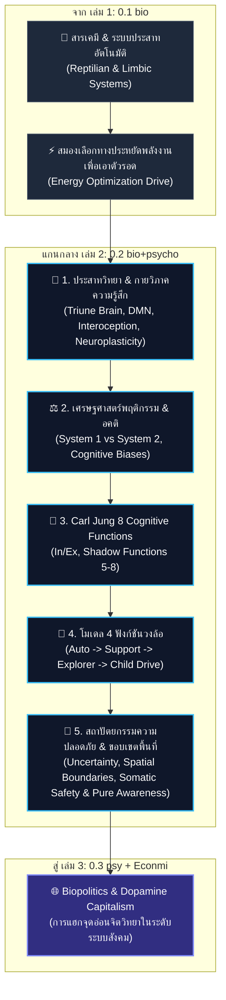

# 📖 โครงร่างหนังสือเล่มที่ 2 (Bio Series): จิตวิทยา + ไบโอ (Bio & Psycho)

> **ชื่อโครงการ:** bio+psycho (หนังสือเกี่ยวกับไบโอ-จิตวิทยา เล่ม 2)
> **ผู้เขียน:** สังเคราะห์จากทัศนะและแนวคิดเชิงทฤษฎี UET (Unity Equilibrium Theory)
> **ไฟล์ต้นทางอ้างอิงหลัก:** `1_raw/แชทร่าง.md`
> **แก่นความคิดหลักศูนย์รวม:** **"สมองคิดด้วยอคติ จิตสร้างอัตลักษณ์และขอบเขตพื้นที่เพื่อความปลอดภัย แต่เมื่อเราเข้าใจกลไกทางสรีระและความไม่แน่นอนทั้งหมด — เราสามารถใช้อคติและร่างกายเป็นสะพาน เพื่อพัฒนา 8 ฟังก์ชันของจิตให้สมดุล จนถึงจุดที่ 'รู้โดยไม่ยึด' นั่นคือสภาวะของจิตที่บริสุทธิ์ ไม่ใช่เพราะไม่มีอคติ แต่เพราะเข้าใจอคติจนไม่ต้องหนีจากมันอีกต่อไป"**

---

## 🗺️ แผนผังโครงสร้างความคิด (Master Cognitive & Psychological Architecture)

---

## 📑 สารบัญและรายละเอียดเนื้อหารายบท (Master Chapter Breakdown)

### 📌 บทนำ: สมองฉลาดกว่าที่เราคิด (ต่อยอดจากเล่ม 1)
* **แก่นประเด็น:** สรุปบทเรียนจากเล่ม 1 ว่า ร่างกายและสมองคือระบบประหยัดพลังงานเพื่อเอาตัวรอด ทุกพฤติกรรมทำซ้ำถูกย้ายไปยึดโยงในสมองลึก (Auto)
* **จุดตั้งต้นเล่ม 2:** *"เราไม่ได้ควบคุมสมองเต็มที่ แต่สมองคือผู้กำหนดพฤติกรรม จิตวิทยา และตัวตนของเรามากกว่าที่เราคิด"*

---

### 📌 บทที่ 1: สถาปัตยกรรมสมองและประสาทวิทยา (Neuroscience & Interoceptive Foundation)
* **แก่นประเด็น:** สมองคือระบบพลังงานที่ประเมินสัญญาณจากร่างกาย (Interoception) เพื่อเอาตัวรอดผ่านโครงสร้างประสาทและสารเคมี
* **ประเด็นวิเคราะห์หลัก:**
  1. **ทฤษฎีสมอง 3 ชั้น (Triune Brain):** สมองสัตว์เลื้อยคลาน ➔ สมองอารมณ์ (Limbic System) ➔ สมองคิด (Neocortex)
  2. **ทฤษฎีสมองซ้าย–ขวา & Neuroanatomy:** การประมวลผลเชิงวิเคราะห์ (Analytical) และเชิงภาพรวม (Holistic)
  3. **Interoception & Embodied Cognition (กายวิภาคทางความรู้สึก):**
     * สัญญาณจากร่างกาย (หัวใจเต้น แน่นท้อง กล้ามเนื้อเกร็ง) คือสิ่งที่กระตุ้นให้สมองเลือกพฤติกรรมก่อนความคิด
  4. **สารสื่อประสาท (Neurotransmitters):**
     * **Dopamine:** ระบบรางวัลและการเสพติดวงจรความคุ้นเคย (Loop System)
     * **Serotonin, Oxytocin, Cortisol, Norepinephrine:** ตัวควบคุมอารมณ์และแรงขับทางชีวภาพ
  5. **Default Mode Network (DMN) & Mirror Neurons:**
     * **DMN:** สมองตอนว่างที่คอยคิดเรื่องอดีต กังวลอนาคต และสร้างเรื่องเล่าตัวตน
     * **Mirror Neurons:** ระบบประสาทเลียนแบบอารมณ์ผู้อื่น (พื้นฐานของ Empathy)
  6. **Neuroplasticity:** สมองปรับเปลี่ยนโครงสร้างได้ตลอดชีวิต การเปิดรับประสบการณ์ใหม่ (Ex) คือการสร้างเส้นทางประสาทใหม่

---

### 📌 บทที่ 2: เศรษฐศาสตร์พฤติกรรม และกลไกทางจิต (Behavioral Economics & Psychological Biases)
* **แก่นประเด็น:** มนุษย์ไม่ได้ตัดสินใจด้วยเหตุผลบริสุทธิ์ แต่ใช้ "ทางลัดทางความคิด" เพื่อเอาตัวรอดให้เร็วที่สุด
* **ประเด็นวิเคราะห์หลัก:**
  1. **Thinking, Fast and Slow (Daniel Kahneman):**
     * **ระบบ 1 (เร็ว, อัตโนมัติ, อารมณ์):** สมองชั้นใน (Reptilian + Limbic)
     * **ระบบ 2 (ช้า, ใช้เหตุผล):** สมองชั้นนอก (Neocortex / PFC)
     * **ความจริง:** พฤติกรรมส่วนใหญ่เกิดจากระบบ 1 แล้วระบบ 2 ค่อยแต่งเหตุผลอธิบายทีหลัง
  2. **Cognitive Biases & Framing Effect (Amos Tversky & Richard Thaler):**
     * Confirmation bias, Availability heuristic, Framing effect
     * อคติไม่ใช่ความโง่ แต่คือทางลัดชีวภาพในการลด Cognitive Load
  3. **Descartes' Error (Antonio Damasio):** เหตุผลไม่สามารถทำงานได้ถ้าไม่มีอารมณ์ (Limbic ตัดสินใจก่อน Neocortex เสมอ)
  4. **Cognitive Dissonance (Leon Festinger):** เมื่อความจริงขัดแย้งกับความเชื่อ สมองจะบิดเบือนเหตุผลเพื่อรักษาความรู้สึกปลอดภัย

---

### 📌 บทที่ 3: ทฤษฎีจิตของ Carl Jung และ 8 Cognitive Functions
* **แก่นประเด็น:** 8 ฟังก์ชันของ Jung ไม่ใช่บุคลิกภาพตายตัว แต่คือแพทเทิร์นการใช้สมองและจิตในการรับรู้และประมวลผล
* **ประเด็นวิเคราะห์หลัก:**
  1. **โครงสร้างจิตตามแนวคิด Carl Jung:**
     * **Ego (ตัวรู้)** ➔ **Persona (ภาพลักษณ์)** ➔ **Shadow & Anima/Animus (จิตใต้สำนึก)** ➔ **Self (แกนกลางจิตใจ)** ➔ **Collective Unconscious (จิตไร้สำนึกร่วม)**
  2. **8 Cognitive Functions (In ↔ Ex):**
     * **In ↔ Ex:** Introverted ต้องอาศัย Extraverted สะสมข้อมูลถึงจะลึก / Extraverted ต้องอาศัย Introverted กรองถึงจะเฉียบ
     * **คู่ฟังก์ชัน 8 รูปแบบ:** `Fi/Fe` (ความรู้สึกภายใน/ภายนอก), `Ti/Te` (ตรรกะภายใน/ภายนอก), `Ni/Ne` (สัญชาตญาณภายใน/ภายนอก), `Si/Se` (การรับรู้ดั้งเดิม/สิ่งแวดล้อมจริง)
  3. **Shadow Functions (ตำแหน่งที่ 5–8):** แรงผลักจากจิตใต้สำนึกที่บังคับให้ระบบจิตเติบโตเมื่อระบบหลักเกิดจุดตัน

---

### 📌 บทที่ 4: โมเดล 4 ฟังก์ชันวงล้อ (Author's 4-Function Flow Loop)
* **แก่นประเด็น:** โมเดลการทำงานทางจิต 4 ระบบที่ซ้อนทับอยู่บนกลไกสมองจริง
* **ประเด็นวิเคราะห์หลัก:**
  1. **โครงสร้าง 4 ระบบ:**
     $$\text{1. ระบบหลัก (Auto)} \rightarrow \text{4. ระบบเสริม (Support/Emergency)} \rightarrow \text{2. ระบบแก้ปัญหา (Explorer)} \rightarrow \text{3. ระบบแรงขับ (Child Drive)}$$
  2. **Flow Loop การทำงานจริง:** สมอง optimize การทำงานเพื่อประหยัดพลังงาน ➔ แต่มนุษย์กลับตีความว่ามันคือ "เจตจำนงอิสระ (Free Will)"

---

### 📌 บทที่ 5: สถาปัตยกรรมแห่งความปลอดภัย ขอบเขตพื้นที่ และจิตสำนึกบริสุทธิ์ (Somatic Safety, Boundaries & Purification)
* **แก่นประเด็น:** อคติไม่ได้เกิดจากความโง่ แต่เกิดจากการที่ร่างกายพยายามรับมือกับ "ความไม่แน่นอน (Uncertainty)" ผ่านการสร้าง "ขอบเขตพื้นที่ (Spatial Boundary)" และเกราะป้องกันเพื่อความปลอดภัยทางสรีระ
* **ประเด็นวิเคราะห์เชิงลึก:**
  1. **ความไม่แน่นอนกับขอบเขตพื้นที่ (Uncertainty & Spatial Boundaries):**
     * เมื่อสภาพแวดล้อมควบคุมไม่ได้ สมองจะบีบพื้นที่ปลอดภัยให้เล็กลง และสร้าง อคติ (Bias) เป็นกำแพงป้องกันภัย
  2. **กายวิภาคทางความรู้สึก (Interoception & Embodied Cognition):**
     * สัญญาณจากร่างกาย (หัวใจเต้น แน่นท้อง เกร็ง) คือสิ่งที่กระตุ้นให้สมองสร้างเรื่องเล่าและอคติขึ้นมาปกป้องตัวเอง
  3. **Somatic Safety (ความปลอดภัยเชิงสรีระ):**
     * การปรับระบบประสาทให้อยู่ในสภาวะปลอดภัย (Ventral Vagal) เพื่อปลดล็อกให้สมองกล้าใช้ Extraverted (Ex) และพัฒนา Shadow Functions
  4. **การพัฒนา 8 ฟังก์ชันสู่ Pure Awareness (รู้โดยไม่ติด):**
     * ใช้อคติ สรีระ และขอบเขตพื้นที่เป็นสะพานสลาย Ego เข้าสู่สภาวะตระหนักรู้โดยไม่ยึดติด (บริบทพระพุทธเจ้า)

---

### 📌 บทสรุป: ส่งไม้ต่อไปยังการเมืองเรื่องชีวภาพและระบบทุนนิยม (Bridge to Book 3)
* **แก่นประเด็น:** สรุปว่าเมื่อจิตวิทยา ประสาทวิทยา ขอบเขตพื้นที่ และจุดอ่อนทางอคติของมนุษย์ถูกเข้าใจแล้ว... คำถามสำคัญคือ **"ใครกำลังนำจุดอ่อนเหล่านี้ไปใช้ประโยชน์ในระดับสังคม?"**
* **ส่งต่อไปยัง [เล่ม 3 (0.3 psy + Econmi)](../03_psychology_economics/book_blueprint.md):** เปิดประตูสู่เรื่อง Biopolitics, Dopamine Capitalism, การสร้างความโลภ ความกลัว และการใช้สารเคมีค้ำยันโครงสร้างระบบสังคม

---

## 📚 ตารางเชื่อมโยงงานวิจัยและทฤษฎีหลัก (Research Mapping Matrix)

| หมวดหมู่ | ทฤษฎี / งานวิจัยอ้างอิง | การเชื่อมโยงเนื้อหาในเล่ม 2 |
| --- | --- | --- |
| **Neuroscience** | Triune Brain (MacLean), DMN, Neuroplasticity | ปูพื้นฐานกลไกพลังงานสมอง และระบบความคิดอัตโนมัติ |
| **Somatic & Emotion** | Interoception, *The Body Keeps the Score* (Van der Kolk), *Descartes' Error* (Damasio) | สัญญาณจากร่างกายที่กระตุ้นให้เกิดอคติ / ร่างกายกับจิตใจเป็นระบบเดียวกัน |
| **Neurochemistry** | Dopamine Loop, Oxytocin, Cortisol, Mirror Neurons | อธิบายแรงขับ สภาพแวดล้อม และระบบรับรู้ความรู้สึกของผู้อื่น |
| **Behavioral Economics** | *Thinking, Fast and Slow* (Daniel Kahneman), Nudge Theory (Thaler) | เชื่อมโยง ระบบ 1 (สัญชาตญาณ) vs ระบบ 2 (เหตุผล) |
| **Psychology & Safety** | Polyvagal Theory (Porges), Cognitive Biases (Tversky), Cognitive Dissonance (Festinger) | สภาวะความปลอดภัยทางสรีระ ขอบเขตพื้นที่ และความไม่แน่นอน |
| **Carl Jung** | 8 Cognitive Functions, Shadow Functions 5-8, Self/Ego | รูปแบบแพทเทิร์นการใช้สมองและจิตใจในการประมวลผล |
| **Consciousness Archetype** | Buddha Archetype (อคติแบบไม่อคติ), Pure Awareness | การพัฒนา 8 ฟังก์ชันเพื่อสลายตัวตน และรู้โดยไม่ยึดติด |
