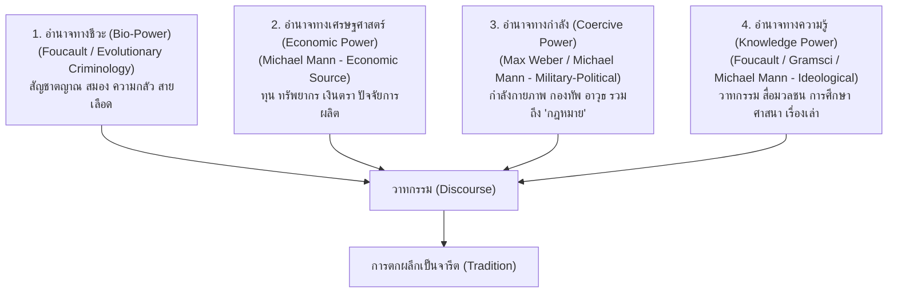

# 📖 โครงร่างพิมพ์เขียวหนังสือเล่มที่ 1 (3.1): วาทกรรม ประวัติศาสตร์สื่อ ทฤษฎีอำนาจ 4 มิติ และการจัดระเบียบความจริง
*(Book 1 Master Blueprint: Discourse, Media History, 4-Power Academic Framework & Selective Framing)*

> **ชื่อโครงการ:** history_media_and_cold_war (Section 3: History & Hegemony - Book 1)
> **รูปแบบการวิเคราะห์:** งานวิจัยเชิงคุณภาพ ปรัชญาประยุกต์ วิวัฒนาการของเรื่องเล่า พฤติกรรมศาสตร์การสื่อสาร และเศรษฐศาสตร์การเมือง (Qualitative, Applied Philosophy, Discursive Analysis & Political Economy)
> **แก่นความคิดหลัก:** สื่อและวาทกรรมไม่ได้ทำหน้าที่เพียงโฆษณาชวนเชื่อแบบขาว-ดำ หรือทฤษฎีสมคบคิดลอยๆ แต่คือ **"กระบวนการเลือกพูดเพื่อจัดระเบียบความจริงทางสังคม (Selective Framing & Ordering of Reality)"** วาทกรรมที่จะคงอยู่และมีอิทธิพลย่อมต้องพึ่งพา **"ทฤษฎีอำนาจ 4 มิติ"** (อำนาจทางชีวะ, อำนาจทางเศรษฐศาสตร์, อำนาจทางกำลังรวมถึงกฎหมาย, และอำนาจทางความรู้รวมถึงสื่อ) ซึ่งมีรากฐานเชื่อมโยงกับงานวิชาการทางอาชญาวิทยาและรัฐศาสตร์ (เช่น งานวิเคราะห์อำนาจของ อ.ติน/คณาจารย์อาชญาวิทยาไทย, Michael Mann, Michel Foucault, Max Weber, Gramsci) เมื่อวาทกรรมที่ถูกขับเคลื่อนด้วยอำนาจ 4 มิตินี้ถูกกระทำซ้ำข้ามยุคสมัย มันจะกลายสภาพเป็น **"จารีตหรือเรื่องปกติที่ไร้คำถาม"** ส่งไม้ต่อให้หนังสือเล่มที่ 2 ต่อไป

---

## 📐 ภาคที่ 1: แกนทฤษฎีวาทกรรม การเลือกพูด และทฤษฎีอำนาจ 4 มิติ (Discourse & The 4-Power Academic Model)

### 1. นิยามวาทกรรมและการจัดระเบียบความจริง (Defining Discourse & Social Reality)
*   **ไม่ใช่แค่ภาษา แต่คือระเบียบการมองโลก:** วาทกรรมไม่ใช่แค่ตัวอักษรหรือคำพูด แต่คือ "ระบบการกำหนดคุณค่าทางสังคม" ว่าอะไรคือความจริง อะไรคือความดี อะไรถูกต้อง และอะไรควรถูกละเลยหรือมองข้าม
*   **กลไก "การเลือกพูด" (The Art of Selective Framing):** ปรากฏการณ์ทางสังคมทุกชนิดมีหลายมิติเสมอ (มีทั้งประโยชน์ โทษ ความขัดแย้ง และผลกระทบ) แต่ผู้มีอำนาจจะใช้วิธี **"เลือกพูดเฉพาะมิติที่ตนเองได้ประโยชน์"** เพื่อสร้างความชอบธรรมให้แก่ระบอบปกครองของตน (เช่น เลือกพูดเรื่องความสงบ แต่ปิดบังเรื่องความยุติธรรม)

### 2. ทฤษฎีอำนาจ 4 มิติและการอ้างอิงทางวิชาการ (The 4 Dimensions of Power & Academic Foundations)
*   **วาทกรรมลอยๆ ไร้อำนาจหนุนหลัง ย่อมไม่สามารถชี้นำสังคมได้:** เล่มที่ 1 อ้างอิงและผ่าลึกทฤษฎีอำนาจ 4 มิติที่ใช้แพร่หลายในแวดวงอาชญาวิทยา รัฐศาสตร์ และสังคมวิทยา (สอดคล้องกับงานวิเคราะห์ของ อ.ติน / คณาจารย์อาชญาวิทยาไทย และงานระดับสากล):

1.  **อำนาจทางชีวะ (Bio-Power / Biological & Evolutionary Power):**
    สัญชาตญาณการอยู่รอดของมนุษย์, กลไกสมอง (*Basal Ganglia, Amygdala, Insula/ACC*), ความกลัวเจ็บปวดจากการถูกกีดกันทางสังคม (*Social Pain*), สายเลือด, พันธุกรรม, และอารมณ์พื้นฐานตามธรรมชาติ (อ้างอิงแนวคิด *Bio-power / Biopolitics* ของ Michel Foucault และอาชญาวิทยาเชิงวิวัฒนาการ)
2.  **อำนาจทางเศรษฐศาสตร์ (Economic Power):**
    ทุน, ทรัพยากรทางวัตถุ, การควบคุมปัจจัยการผลิต, เงินตรา, การต่อรองทางเศรษฐกิจ, และความมั่นคงทางปากท้อง (อ้างอิงฐานอำนาจทางเศรษฐกิจในโมเดล *IEMP* ของ Michael Mann)
3.  **อำนาจทางกำลัง (Coercive & Force Power — รวมกฎหมาย):**
    กำลังกายภาพ, กองทัพ, ตำรวจ, อาวุธ, การใช้กำลังความรุนแรง และ **"กฎหมาย" (Law)** ในฐานะเครื่องมือและกลไกของรัฐในการผูกขาดการใช้กำลัง (อ้างอิง *State Monopoly of Legitimate Violence* ของ Max Weber และอำนาจทางการเมือง/ทหารของ Michael Mann)
4.  **อำนาจทางความรู้ (Knowledge & Discursive Power — รวมสื่อ):**
    วาทกรรม, สื่อมวลชน, ระบบการศึกษา, สถาบันศาสนา, เรื่องเล่า, ข้อมูลข่าวสาร, และการสร้างกรอบความเข้าใจ (*Framing*) (อ้างอิง *Power/Knowledge* ของ Foucault, *Cultural Hegemony* ของ Gramsci และอำนาจทางอุดมการณ์ของ Michael Mann)

---

## 🗺️ ภาคที่ 2: รายละเอียดเนื้อหาบทต่อบท (Chronological & Analytical Chapter Architecture)

### 📌 บทที่ 1: การกำเนิดเรื่องเล่า ระเบียบสังคม และการคัดเลือกทางวิวัฒนาการ (ยุคโบราณ)
*   **เหตุผลเบื้องหลังเรื่องเล่าโบราณ:** การสร้างตำนาน ศาสนา และเรื่องเล่าโบราณ เพื่ออธิบายธรรมชาติและสร้างระเบียบสังคม
*   **กระบวนการคัดเลือกเรื่องเล่า (Evolutionary Selection of Narratives):** เรื่องเล่าที่อธิบายโลกได้สมเหตุสมผลกว่าและตอบโจทย์การอยู่รอดของสังคมในยุคนั้น ย่อมได้รับการคัดเลือกและขยายผล (เปรียบเหมือนนิวตัน vs ไอน์สไตน์)
*   **ผลพวงทางโครงสร้าง (Consequences):** เมื่อเรื่องเล่าเข้มแข็งและสร้างรัฐขึ้นมาได้ ผลพวงตามมาคือการใช้เรื่องเล่า (เช่น Valhalla / Elysium) ในการระดมพลและแรงงานเพื่อสงครามและการขยายอำนาจ

---

### 📌 บทที่ 2: สื่อเพื่อความสงบ การระเบิดของเรื่องเล่า และการปฏิวัติวิทยาศาสตร์ (ยุคกลางถึงต้นยุคใหม่)
*   **ความเป็นกลางของ Propaganda (Dual-use Technology):** Propaganda ถูกใช้สร้าง "ความสงบและศีลธรรมกลาง" เพื่อหยุดการฆ่ากันเองในรัฐ (ชนชั้นนำโรมันยึดคริสต์ศาสนามาหยุดการฆ่าฟันกันเอง)
*   **Scholasticism & The Medieval Illusion:** การนำปรัชญากรีกมาอธิบายศาสนาเพื่อสร้างความชอบธรรมให้ระบอบศักดินายุคกลาง
*   **เกร็ดประวัติศาสตร์ 1 (พ่อค้าเมืองเวนิส & ทุนสปอนเซอร์สงคราม):** การใช้เรื่องเล่า "รบเพื่อพระเจ้า" ในสงครามครูเสดครั้งที่ 4 โดยมีเหตุผลเบื้องหลังของกลุ่มทุนพ่อค้าเวนิสในการขยายเส้นทางการค้า (อำนาจทางเศรษฐศาสตร์หนุนหลังวาทกรรม)
*   **เกร็ดประวัติศาสตร์ 2 (แท่นพิมพ์กูเทนเบิร์กกับการทลายการผูกขาดศาสนจักร):**
    *   เดิมทีศาสนจักรคาทอลิกผูกขาดอำนาจทางความรู้และสื่อเพราะไบเบิลเป็นภาษาละตินที่คัดด้วยมือ
    *   เมื่อนวัตกรรมแท่นพิมพ์ (Gutenberg Press) เกิดขึ้น มาร์ติน ลูเธอร์ พิมพ์ไบเบิลภาษาเยอรมันกระจายทั่วยุโรป (การปฏิรูปศาสนา - Reformation)
    *   **การระดมระเบิดของเรื่องเล่า สู่ยุค Renaissance & การปฏิวัติวิทยาศาสตร์:** เมื่อการผูกขาดความคิดถูกทลาย แรงอัดจากการกดทับของศาสนจักรจึงระเบิดออกมาเป็นยุคฟื้นฟูศิลปวิทยาการ (Renaissance)
*   **ความต่างเชิงวิธีคิด (Catholic Centralized Dogma vs. Protestant Pragmatism):**
    *   *คาทอลิก:* ยึดอำนาจส่วนกลางและกรอบคิดแบบสั่งการจากตัวกลาง
    *   *โปรเตสแตนท์:* ส่งเสริมจิตวิญญาณแห่ง **"ความสมเหตุสมผลเชิงปฏิบัติ (Pragmatism)"** ให้ปัจเจกอ่าน ตีความ และพิสูจน์ด้วยตนเอง
    *   *อิทธิพลต่ออังกฤษ (English Empiricism):* เมื่ออังกฤษรับศาสนาแบบโปรเตสแตนท์/แองกลิกัน ทำให้เกิดวิธีคิดแบบ **"ประจักษ์นิยม (Empiricism - Francis Bacon, John Locke, Isaac Newton)"** ที่เปิดทางสู่อุตสาหกรรมในยุคต่อมา

---

### 📌 บทที่ 3: ทุนนิยมสิ่งพิมพ์ กำเนิดชาตินิยม และการปั้นวาทกรรมบริโภคนิยม (18th Century - 1930s Pre-WWII)
*   **ทุนนิยมสิ่งพิมพ์กับกำเนิดชาตินิยม (Print-Capitalism & Imagined Communities):**
    *   การปฏิวัติอุตสาหกรรมสร้างการอ่านออกเขียนได้แก่แรงงาน เกิดหนังสือพิมพ์ภาษาถิ่นรายวัน
    *   วิเคราะห์แนวคิดของ Benedict Anderson: คนในพื้นที่เดียวกันอ่านสิ่งพิมพ์ภาษาเดียวกันทุกเช้า เกิด "ชุมชนจินตกรรม (Imagined Community)" กลายเป็นเรื่องเล่าชาติ/ชาตินิยมที่รัฐใช้ระดมพลในสงครามโลกครั้งที่ 1
*   **เกร็ดประวัติศาสตร์ (เจ้าพ่อสื่อ Hearst, กัญชง และกระดาษไม้):** วิเคราะห์การปั้น Demonization Discourse เพื่อปกป้องผลประโยชน์อุตสาหกรรมสิ่งพิมพ์และกระดาษไม้ในทศวรรษ 1930s (อำนาจทางเศรษฐศาสตร์และการคุมสื่อ)
*   **เปรียบเทียบเชิงเทคโนโลยี (สิ่งพิมพ์ vs วิทยุ/ทีวี):** การเปลี่ยนผ่านจาก Active Reading สู่ Passive Media Consumption ที่ยึดครองเวลาชีวิตได้เบ็ดเสร็จขึ้น

---

### 📌 บทที่ 4: วัฒนธรรมอเมริกันดรีม สถาปัตยกรรมกู้เงิน และสงครามเย็นเรื่องเล่า (Cold War Hegemony & US Capital)
*   **สายธารทุนหนุนหลังเรื่องเล่าอเมริกัน (Mechanisms of US Cultural Capital):**
    *   **แผนมาร์แชลล์ (Marshall Plan - 1948):** ทุนอัดฉีดสื่อ สารคดี และนิทรรศการฉายภาพความมั่งคั่งของทุนนิยมต้านคอมมิวนิสต์
    *   **CIA & CCF (Congress for Cultural Freedom):** ทุนลับทางวัฒนธรรม สนับสนุนนิตยสารวรรณกรรม นักคิด และศิลปะเพื่ออ้าง "เสรีภาพทางปัญญา" บลัฟฝ่ายโซเวียต
    *   **USIA & VOA (Voice of America):** หน่วยงานสื่อรัฐอเมริกา กระจายเสียงหลายสิบภาษาและตั้งศูนย์วัฒนธรรมเพื่อยึดครองวิถีชีวิตและเรื่องเล่าอเมริกันดรีม
*   **การปะทะกันของ 2 เรื่องเล่าใหญ่ (US vs Soviet Union):**
    *   **โซเวียต (Soviet Propaganda):** ใช้เรื่องเล่าความเท่าเทียม (Equality) เพื่อต่อสู้กับทุนนิยม เช่น การส่งผู้หญิงคนแรกขึ้นสู่อวกาศ (Valentina Tereshkova)
    *   **อเมริกา (American Dream & Lifestyle Norms):** ส่งออก "เศรษฐศาสตร์การดำเนินชีวิต" เช่น *เรียนจบ -> ทำงาน -> กู้เงินซื้อบ้าน/รถ -> ชำระหนี้ตลอดชีวิต*
*   **กลไกผลประโยชน์ซ้อนทับ 2 ระดับ (Double-Intent Propaganda) และบริบทไทย:**
    *   *ระดับมหาอำนาจ (Hegemon):* สาดเรื่องเล่าและทุนอัดฉีดเพื่อขยายพื้นที่ทางยุทธศาสตร์และตลาดบริโภคนิยม
    *   *ระดับชนชั้นนำท้องถิ่น (กรณีศึกษาความย้อนแย้งแบบไทย):* การรับเปลือกนอกของเรื่องเล่าสมัยใหม่มาใช้ แต่ไส้ในนำสื่อโทรทัศน์/วิทยุอเมริกันอัดฉีดมาค้ำจุนระบบอุปถัมภ์สวมทับระบอบยุคกลาง

---

### 📌 บทที่ 5: สื่อยุคดิจิทัล การลดต้นทุนสื่อ และการเปลี่ยนวาทกรรมสู่อนาคต (Digital Control & Transition Bridge)
*   **การลดต้นทุนสื่อและความนิยม Soft Power เอเชีย:** กรณีศึกษาญี่ปุ่นและเกาหลีใต้ที่ท้าทายตลาดอเมริกันด้วยการทำให้ฮาร์ดแวร์และเนื้อหาราคาจับต้องได้
*   **เศรษฐศาสตร์การแย่งชิงสมาธิ (Attention Economy & Filter Bubbles):** การผูกขาดเวลาชีวิตผ่านอัลกอริทึมที่ป้อนความอคติและวงจรโดปามีน (Dopamine Loops)
*   **สะพานเชื่อมสู่เล่มที่ 2 (Transition Bridge to Book 2: From Discourse to Tradition):**
    *   สรุปให้เห็นว่า เมื่อวาทกรรมถูก "เลือกพูด" อย่างต่อเนื่องโดยมี "อำนาจ 4 มิติ" หนุนหลัง ข้ามผ่านกาลเวลาและการทำซ้ำในสื่อ มันจะขยับจากการเป็นแค่คำพูด สู่การฝังตัวลงในสมองและสถาบันสังคม จนกลายสภาพเป็น **"จารีต" (Tradition)** ที่ผู้คนปฏิบัติตามโดยไม่ตั้งคำถาม ซึ่งเราจะไปเจาะลึกกลไกทางพฤติกรรมศาสตร์ ประสาทวิทยา และการเมืองของจารีตใน **เล่มที่ 2** ต่อไป
