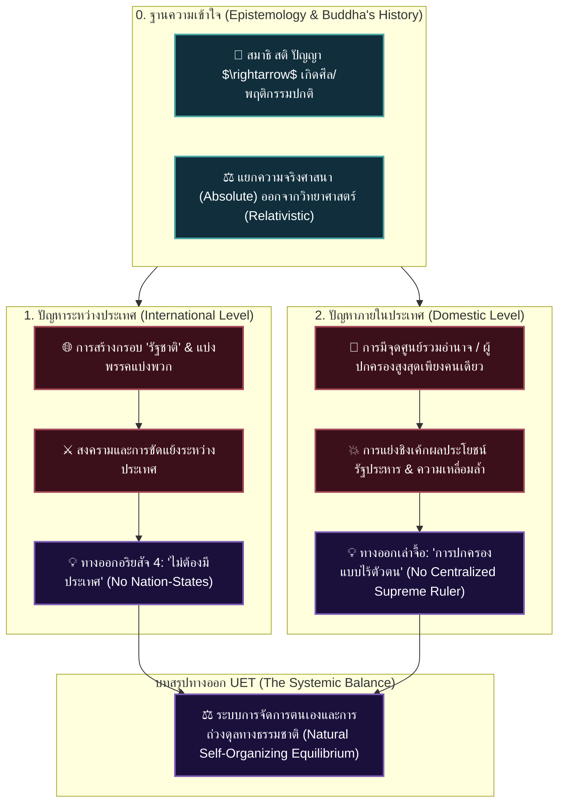

# 📖 โครงร่างหนังสือเล่มที่ 3.3: การถอนรากถอนโคนอำนาจและการปกครองไร้ตัวตน (Reformation of the Mind: No States, No Rulers)

> **ชื่อโครงการ:** reformation_of_the_mind (Section 3: History & Hegemony - Book 3)
> **แก่นความคิดหลัก:** เสนอทางออกจากบทสรุปของเล่ม 3.1 (ประวัติศาสตร์สื่อ/มหาอำนาจ) และเล่ม 3.2 (การเมืองไทย/ยี่ห้ออำนาจนิยม) โดยย้อนกลับไปสืบสอบ **"ประวัติศาสตร์จริงของพระพุทธเจ้า"** (ใช้สมาธิ สติ ปัญญา ในการตรัสรู้ ไม่ได้ยึดข้อบังคับศีลลอยๆ) ผสานกับ **"ปรัชญาการปกครองแบบไร้ตัวตนของเล่าจื้อ (Leaderless Governance)"** เพื่อแก้ปัญหาโครงสร้างทางการเมือง 2 ระดับของมนุษยชาติ:
> 1. **ปัญหาระหว่างประเทศ (International Conflict):** สงครามเกิดจากการสร้างสมมติ "รัฐชาติ" -> **ทางออกอริยสัจ 4 คือ "ไม่ต้องมีประเทศ (No Nation-States)"**
> 2. **ปัญหาภายในประเทศ (Domestic Conflict):** การแย่งอำนาจและรัฐประหารเกิดจากการมีศูนย์รวมอำนาจ -> **ทางออกเล่าจื้อคือ "ไม่ต้องมีผู้ปกครองสูงสุดเพียงคนเดียว (No Centralized Supreme Ruler)"**

---

## 💡 2 ประเด็นหลักที่ต้องเคลียร์ให้ชัดก่อนเข้าสู่เนื้อหาทางการเมือง (Epistemology & History Clarification)

1. **การตรวจสอบผลลัพธ์ย้อนกลับไปยังประวัติศาสตร์จริงของพระพุทธเจ้า (Sati/Panya -> Morality):**
   * ชวนตั้งคำถามว่า ทำไมคนส่วนใหญ่ถึงไปยึดติดที่ข้อบังคับ/ตัวบทศีล โดยไม่เคยสืบสอบประวัติศาสตร์จริงว่าพระพุทธเจ้าตรัสรู้ได้อย่างไร
   * ในประวัติจริง ตอนตรัสรู้ไม่มีการถือนับถือข้อบังคับศีลใดๆ แต่ท่านใช้ **"สมาธิ สติ และปัญญา"**
   * **ศีล (ความปกติ/ศีลธรรม):** ไม่ได้เกิดขึ้นลอยๆ แต่เกิดจาก **"ความตระหนักรู้ (Sati/Panya) ในทุกบริบทที่ตอบสนองต่อโลกของผู้กระทำ"** ศีลคือ *ผลลัพธ์* ทางพฤติกรรมที่งอกมาจากสติปัญญา ไม่ใช่กฎที่ตั้งขึ้นมาป้อนคำสั่งบังคับคน

2. **ทฤษฎีความรู้ (Epistemology) — หยุดเอาวิทยาศาสตร์มาอ้างศาสนาส่งเดช:**
   * **ศาสนา vs วิทยาศาสตร์:** อริยสัจ 4 ถูกอ้างว่าเป็นความจริงสากล (Absolute Truth) แต่วิทยาศาสตร์มองว่าความรู้เป็นสิ่งสัมพัทธ์ (Relativistic & Evolving) พร้อมปรับเปลี่ยนเมื่อพบข้อมูลที่ดีกว่า
   * **ผลเสียของการอ้างฟิสิกส์ค้ำพุทธ:** การเอาทฤษฎีวิทยาศาสตร์ (เช่น ไอน์สไตน์ หรือ ควอนตัม) มาอ้างความจริงพุทธ ทำให้ศาสนาหมดความน่าเชื่อถือ เพราะขนาดทฤษฎีไอน์สไตน์เองปัจจุบันยังเริ่มขัดแย้งกับข้อมูลทดลองใหม่ๆ การนำทฤษฎีที่ยังไม่หยุดนิ่งมาอ้างเป็นความจริงนิรันดร์คือความขัดแย้งเชิงตรรกะ

---

## 🗺️ แผนผังทางออกเชิงโครงสร้าง UET (Structural Resolution)

---

## 📑 รายละเอียดเนื้อหาบทต่อบท (Concise 5-Chapter Architecture)

### 📌 บทที่ 1: การสืบสอบประวัติจริงของพระพุทธเจ้า และการแยกขอบเขตความรู้ (Epistemology & True Buddha History)
* **แก่นประเด็น:**
  1. ชวนคิดย้อนกลับไปดูประวัติการตรัสรู้จริง—พบว่าใช้เพียงสมาธิ สติ ปัญญา ไม่ได้ถือนับถือข้อบังคับศีลลอยๆ ศีลคือผลลัพธ์ทางพฤติกรรมที่เกิดจากความตระหนักรู้ในทุกบริบท
  2. เคลียร์ทฤษฎีความรู้—หยุดเอาทฤษฎีวิทยาศาสตร์สัมพัทธ์ (เช่น ไอน์สไตน์) มาอ้างความจริงนิรันดร์ของพุทธเพื่อไม่ให้ศาสนาหมดความน่าเชื่อถือ

---

### 📌 บทที่ 2: อริยสัจ 4 ในฐานะเครื่องมือแก้ปัญหาจากต้นตอ (Ariyasacca 4 as Root-Cause Solver)
* **แก่นประเด็น:** ใช้อริยสัจ 4 เป็นสมการปัญญาตรงๆ (ทุกข์ -> สมุทัย -> นิโรธ -> มรรค) สืบหาต้นตอของความขัดแย้งระดับโครงสร้าง แล้วถอนรากถอนโคนจากเหตุนั้นโดยตรง

---

### 📌 บทที่ 3: ปัญหาระหว่างประเทศ—ทำลายเส้นขอบฟ้าและ "ไม่ต้องมีประเทศ" (No Nation-States)
* **แก่นประเด็น:** ต้นตอของสงครามข้ามชาติและการล่าอาณานิคม คือกรอบสมมติเรื่อง "รัฐชาติ"
* **ทางออก:** เมื่อใช้อริยสัจ 4 ดับที่ต้นเหตุ ด้วยการถอนความเชื่อเรื่องขอบเขตประเทศ สังคมโลกจะก้าวข้ามการแบ่งพรรคแบ่งพวกได้อย่างแท้จริง

---

### 📌 บทที่ 4: ปัญหาภายในประเทศ—ปรัชญาเล่าจื้อและ "ไม่ต้องมีผู้ปกครองสูงสุด" (No Centralized Supreme Ruler)
* **แก่นประเด็น:** ต้นตอของการแย่งเค้กผลประโยชน์และการทำรัฐประหาร คือการตั้งเก้าอี้อำนาจสูงสุดเพียงตัวเดียว
* **ทางออก:** ประยุกต์ปรัชญาเล่าจื้อ—การปกครองแบบไร้ตัวตน (Leaderless Governance) เมื่อไม่มีศูนย์รวมอำนาจให้ยึด การรัฐประหารและการผูกขาดอำนาจก็หมดความหมาย

---

### 📌 บทที่ 5: บทสรุป Section 3—ดุลยภาพทางธรรมชาติและระเบียบโลกใหม่ (Self-Organizing Equilibrium)
* **แก่นประเด็น:** ระบบและมนุษย์สามารถถ่วงดุลคานอำนาจกันเองตามธรรมชาติโดยไม่ต้องมีผู้นำเบ็ดเสร็จ สรุปการตาสว่างเชิงโครงสร้างจากเล่ม 3.1 -> 3.2 -> 3.3 อย่างสมบูรณ์แบบ
