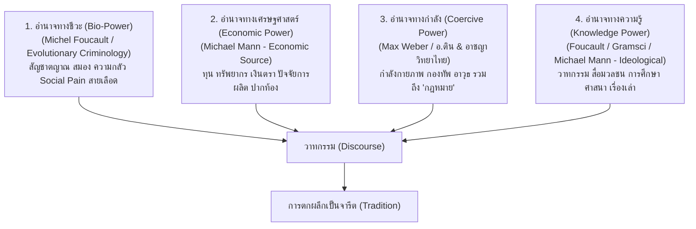
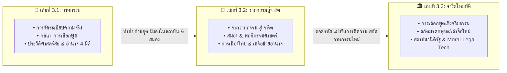

# 📖 พิมพ์เขียวภาพรวมเซกชัน 3: วาทกรรม จารีต และการสถาปนาสังคมใหม่
*(Section 3 Master Blueprint: History, Media, Hegemony & Social Transformation)*

> **ชื่อเซกชัน:** Section 3: History & Hegemony (ชุดไตรภาค 3 เล่ม)
> **ขอบเขตการศึกษารวม:** ประวัติศาสตร์สื่อ วาทกรรม ทฤษฎีอำนาจ 4 มิติ ประสาทวิทยา พฤติกรรมศาสตร์ กายวิภาคการเมือง และสถาปัตยกรรมจารีตใหม่
> **แก่นความคิดร่วม (Master Trilogy Premise):**
>
> $$\text{วาทกรรม (การเลือกพูด)} \xrightarrow{\text{ทำซ้ำ/สมอง/อำนาจ 4 มิติ}} \text{จารีต (ความปกติที่ไร้คำถาม)} \xrightarrow{\text{การเลือกพูดเชิงจริยธรรม}} \text{จารีตใหม่ที่ดี (สถาบันแห่งการปลดปล่อย)}$$

---

## 📐 1. ทฤษฎีอำนาจ 4 มิติและการอ้างอิงทางวิชาการ (The 4-Power Model & Academic Foundations)

วาทกรรมไม่สามารถสร้างหรือเปลี่ยนสังคมได้หากไม่มี **"อำนาจ 4 มิติ"** หนุนหลังและขับเคลื่อน:

*   **อำนาจทางชีวะ (Bio-Power):** สัญชาตญาณการอยู่รอด, กลไกสมอง (*Basal Ganglia, Amygdala, Insula/ACC*), ความกลัวเจ็บปวดจากการถูกกีดกันทางสังคม (*Social Pain*), สายเลือด, พันธุกรรม (อ้างอิง *Bio-power* ของ Michel Foucault และอาชญาวิทยาเชิงวิวัฒนาการ)
*   **อำนาจทางเศรษฐศาสตร์ (Economic Power):** ทุน, ทรัพยากรทางวัตถุ, ปัจจัยการผลิต, เงินตรา, ปากท้อง (อ้างอิงฐานอำนาจทางเศรษฐกิจในโมเดล *IEMP* ของ Michael Mann)
*   **อำนาจทางกำลัง (Coercive Power - รวมกฎหมาย):** กำลังกายภาพ, กองทัพ, ตำรวจ, อาวุธ และ **"กฎหมาย" (Law)** ในฐานะกลไกรัฐในการผูกขาดการใช้กำลัง (อ้างอิง งานผ่าโครงสร้างอำนาจกฎหมายของ อ.ติน/คณาจารย์อาชญาวิทยาไทย และ *State Monopoly of Violence* ของ Max Weber)
*   **อำนาจทางความรู้ (Knowledge Power - รวมสื่อ):** วาทกรรม, สื่อมวลชน, การศึกษา, ศาสนา, เรื่องเล่า, ข้อมูลข่าวสาร (*Framing*) (อ้างอิง *Power/Knowledge* ของ Foucault, *Cultural Hegemony* ของ Gramsci)

---

## 🗺️ 2. สถาปัตยกรรมเชื่อมโยง 3 เล่ม (Inter-Book Architecture)

---

## 📚 3. สรุปขอบเขตหน้าที่ของแต่ละเล่มในไตรภาค

### 📌 เล่มที่ 3.1: วาทกรรม ประวัติศาสตร์สื่อ อำนาจ และการจัดระเบียบความจริง
*   **โฟลเดอร์:** `uet_history/3_publish/books/history_media_power/01_history_media`
*   **หน้าที่:** ปูแกนทฤษฎีวาทกรรม ชี้กลไก **"การเลือกพูด" (Selective Framing)** และผ่าลึก **"ทฤษฎีอำนาจ 4 มิติ"** ผ่านสายธารประวัติศาสตร์สื่อตั้งแต่ายุคโบราณ ยุคกลาง (กูเทนเบิร์ก) สงครามเย็น (Marshall Plan, VOA, CIA) จนถึง Attention Economy ยุคดิจิทัล

### 📌 เล่มที่ 3.2: วาทกรรมกับการเกิดจารีต พฤติกรรมศาสตร์ และเครือข่ายอำนาจนิยม
*   **โฟลเดอร์:** `uet_history/3_publish/books/history_media_power/02_political_psychology`
*   **หน้าที่:** อธิบายกระบวนการที่วาทกรรมถูกอัดฉีดทำซ้ำจนตกผลึกกลายเป็น **"จารีต" (Tradition)** ผ่านกลไกประสาทวิทยา (*Basal Ganglia, Insula/ACC Social Pain*) พฤติกรรมศาสตร์ (*Pluralistic Ignorance*) และตีแผ่กายวิภาคการเมืองไทย (ทฤษฎีหมาเฝ้าซอย) และระบอบอำนาจนิยมสวมยี่ห้อ

### 📌 เล่มที่ 3.3: การสร้างวาทกรรมใหม่เพื่อสร้างจารีตใหม่ที่ดี สถาปัตยกรรมแห่งการปลดปล่อย
*   **โฟลเดอร์:** `uet_history/3_publish/books/history_media_power/03_philosophy_governance`
*   **หน้าที่:** นำกลไกการเลือกพูดมาใช้เชิงจริยธรรม **(Ethical Selective Framing)** สกัดเอาแก่นมรดกทางปัญญา (พุทธ: สมาธิ สติ ปัญญา ไม่เบียดเบียน; เล่าจื้อ: การปกครองแบบไร้ตัวตน) มาสวมกับหลักมนุษยชนและนิติรัฐ เพื่อสถาปนาจารีตใหม่และเทคโนโลยีทางศีลธรรม-กฎหมายที่ปกป้องสังคมอย่างยั่งยืน
