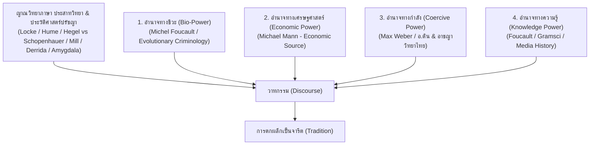
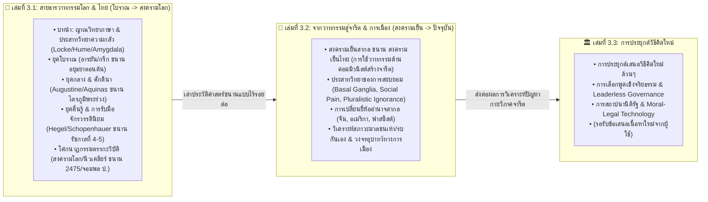

# 📖 พิมพ์เขียวภาพรวมเซกชัน 3: วาทกรรม จารีต และการสถาปนาสังคมใหม่
*(Section 3 Master Blueprint: History, Media, Hegemony & Social Transformation)*

> **ชื่อเซกชัน:** Section 3: History & Hegemony (ชุดไตรภาค 3 เล่ม)  
> **ขอบเขตการศึกษารวม:** ประวัติศาสตร์สื่อ วาทกรรม ญาณวิทยาภาษา ทฤษฎีอำนาจ 4 มิติ ประสาทวิทยา พฤติกรรมศาสตร์ กายวิภาคการเมือง และสถาปัตยกรรมจารีตใหม่  
> 
> **เส้นทางเดินเรื่องขนาน (Parallel Global-Thai Timeline):**
> - **เล่มที่ 1 และ เล่มที่ 2:** เล่าประวัติศาสตร์โลกและประวัติศาสตร์ไทยขนานกันเป็นเส้นตรงเส้นเดียว (ตั้งแต่ยุคโบราณ/อยุธยา $\rightarrow$ ยุคกลาง/ศักดินา $\rightarrow$ ยุคตื่นรู้/รัตนโกสินทร์ $\rightarrow$ สงครามโลก/2475 $\rightarrow$ สงครามเย็น $\rightarrow$ ยุคปัจจุบัน) แล้วจึงวิเคราะห์กลไกสมอง ปรากฏการณ์การสวมยี่ห้ออำนาจ และสภาวะมวลชนเห่า/รบกันเองในช่วงท้าย
> - **เล่มที่ 3:** รับผิดชอบ **"การประยุกต์เสนอวิธีคิดและสถาปัตยกรรมจารีตใหม่ล้วนๆ"** โดยปราศจากเนื้อหาเล่าประวัติศาสตร์ย้อนหลัง

---

## 📐 1. ญาณวิทยาของภาษา ไดอะเลกติก และทฤษฎีอำนาจ 4 มิติ (Epistemology, Dialectics & 4-Power Model)

---

## 🗺️ 2. สถาปัตยกรรมเชื่อมโยง 3 เล่ม (Inter-Book Architecture)

---

## 📚 3. สรุปขอบเขตหน้าที่ของแต่ละเล่มในไตรภาค

### 📌 เล่มที่ 3.1: สายธารวาทกรรมโลกและไทย — จากอดีตโบราณ สู่ จุดระเบิดสงครามโลก
*   **โฟลเดอร์:** `uet_history/3_publish/books/history_media_power/01_history_media`
*   **หน้าที่:** ปูบทนำทฤษฎี (ญาณวิทยาภาษา, Locke, Hume, Amygdala, อำนาจ 4 มิติ) แล้วเล่าประวัติศาสตร์โลกและไทยขนานกันเป็นเส้นตรง: ยุคโบราณอารยัน/กรีกขนานอยุธยาตอนต้น $\rightarrow$ ยุคกลางคาทอลิกขนานอยุธยาตอนกลาง/ไตรภูมิ $\rightarrow$ ยุคตื่นรู้/ลัทธิจักรวรรดินิยมขนานรัชกาลที่ 4-5 $\rightarrow$ โศกนาฏกรรมตรรกะวิบัติสงครามโลก/นิวเคลียร์ขนาน 2475/จอมพล ป.

### 📌 เล่มที่ 3.2: สองเส้นทางหลังสงครามโลก — จากวาทกรรมตกผลึกเป็นจารีต และกายวิภาคการเมือง
*   **โฟลเดอร์:** `uet_history/3_publish/books/history_media_power/02_political_psychology`
*   **หน้าที่:** รับไม้ต่อจากเล่ม 1 ชี้ให้เห็น **สองเส้นทางหลังสงครามโลก**: (A) **ยุโรปที่ถูกบังคับให้สร้างจารีตใหม่จริงๆ** (UN, UDHR, EU, ICC) เพราะสงครามทำลายทุกอย่าง กับ (B) **อเมริกาและประเทศรับอิทธิพลสื่อผูกขาด** ที่นำเทคนิคเดียวกับ Goebbels มาพัฒนาต่อในรูปฮอลลีวูด/VOA/CIA/Social Media Algorithm สร้างจารีตบริโภคนิยมและจารีตแบ่งขั้วที่ยังเป็นปัญหาอยู่ทุกวันนี้ $\rightarrow$ ผ่ากลไกประสาทวิทยา (*Basal Ganglia, Social Pain, Pluralistic Ignorance*) $\rightarrow$ กายวิภาคการเมืองไทยในยุคสงครามเย็น

### 📌 เล่มที่ 3.3: การสร้างวาทกรรมใหม่เพื่อสร้างจารีตใหม่ที่ดี (การประยุกต์เสนอวิธีคิดใหม่ล้วนๆ)
*   **โฟลเดอร์:** `uet_history/3_publish/books/history_media_power/03_philosophy_governance`
*   **หน้าที่:** **การประยุกต์เสนอวิธีคิดและสถาปัตยกรรมจารีตใหม่ล้วนๆ (Pure Forward-Looking Application)** โดยปราศจากการเล่าประวัติศาสตร์ย้อนหลัง (รอรับข้อเสนอและรายละเอียดบทจากผู้ใช้ในขั้นตอนต่อไป)
