# 📖 โครงร่างหนังสือ: The Origin of Wealth (ต้นกำเนิดความมั่งคั่งแห่งประชาชาติ)
> **ผู้เขียน:** สังเคราะห์จากทัศนะและแนวคิดเชิงทฤษฎี UET (Unity Equilibrium Theory)
> **แนวคิดหลัก:** การใช้ประวัติศาสตร์อารยธรรม วิวัฒนาการความรู้ และตรรกะเชิงระบบ เพื่ออธิบายว่าเงินตราเป็นเพียง "ตัวกลางสัดส่วนระหว่าง ปริมาณของในระบบ กับ ปริมาณเงินทั้งหมด" และวิพากษ์ระบบทุนนิยมและการเงินกระแสหลักที่บิดเบือนสัจธรรมข้อนี้จนขัดแย้งกับชีวภาพและธรรมชาติของมนุษย์

---

## 🗺️ แผนผังวิวัฒนาการของ "ไม้บรรทัดแห่งความรู้" (The Evolutionary Tech-Tree)

```mermaid
graph TD
    %% Base Equation & Value Generation
    Crisis["🌍 ภัยพิบัติ / ความจำเป็น<br/>(Necessity)"] -->|กระตุ้นการประมวลผล| Knowledge["🧠 ความรู้ / แรงงาน<br/>(Knowledge)"]
    Knowledge -->|รวมความพร้อมโครงสร้าง| Innovation["🔥 นวัตกรรม / ทรัพยากรใหม่<br/>(Innovation)"]

    %% Hominid & Firewood Phase
    Innovation -->|ต้องการมาตรวัดจัดการคลัง| MathLogics["📐 ตรรกะคณิตศาสตร์ก่อนภาษาพูด<br/>(Math as First Language)"]
    MathLogics -->|วิกฤตภูมิอากาศในแอฟริกา| Firewood["🪵 อุตสาหกรรมฟืน & คลังฟืนในถ้ำ<br/>(First Industry & Logistics)"]

    %% Historical Rulers Phase
    Firewood -->|รังวัดที่ดินหลังน้ำท่วมไนล์| Egypt["📐 เรขาคณิตอียิปต์โบราณ<br/>(Geometry: Physical Ruler)"]
    Egypt -->|ข้อจำกัดเลขโรมันขัดขวางการคำนวณ| Crusade["⚔️ สงครามครูเสด & การแลกเปลี่ยนวัฒนธรรม<br/>(Import of Hindu-Arabic Numerals)"]
    Crusade -->|อินเดียคิดเลขศูนย์จากปรัชญาสุญญตา| India["0️⃣ ศูนย์ และ สุญญตา<br/>(The Origin of Zero)"]

    %% Abstract Rulers Phase
    India -->|ไม้บรรทัดนามธรรมในโลกความคิด| Calculus["📈 แคลคูลัส & ทางลัดค่าลิมิต<br/>(Calculus as Relationship Ruler)"]
    Calculus -->|คำนวณย่านความเร็ว/พลังงานต่ำ| Newton["🍎 ไม้บรรทัดนิวตัน<br/>(Absolute Space & Time)"]

    %% Epistemological Upgrades & Crisis
    Newton -->|ข้อมูลขัดแย้งสะสม + เครื่องมือละเอียด| EinsteinUpgrade["⏳ สังเคราะห์ Riemann + Maxwell + c"]
    EinsteinUpgrade -->|ไม้บรรทัดยืดหยุ่นตามพลังงาน| Einstein["⏳ ไม้บรรทัดไอน์สไตน์<br/>(Spacetime Curvature / E=mc²)"]

    %% Modern Economic Phase
    Einstein -->|ความพยายามผูกมูลค่ากับทองคำ| GoldStandard["🏅 มาตรฐานทองคำ<br/>(The Gold Standard)"]
    GoldStandard -->|ความรู้นำหน้าปริมาณทองคำ เกิดเงินฝืด| GreatDepression["📉 วิกฤตเศรษฐกิจตกต่ำ 1930<br/>(Knowledge Outpaces Gold)"]
    GreatDepression -->|เคนส์เสนอพิมพ์เงินกระดาษแก้เงินฝืด| FiatGlitch["💸 วิกฤตเงิน Fiat 1971<br/>(เงินสร้างหนี้ขโมยอนาคต)"]
    FiatGlitch -->|วงจรอุบาทว์หนี้สินและการดึงพลังงานอนาคต| DebtLoop["🌀 วิกฤตหนี้สินและเอนโทรปีระบบ<br/>(Systemic Entropy)"]
    DebtLoop -->|รื้อถอนสมดุลใหม่ด้วย 4 เสาหลักแห่งอำนาจ| FourPowers["🏛️ สี่เสาหลักแห่งอำนาจ<br/>(กำลัง, เงิน, ชีวภาพ, ความรู้)"]
    FourPowers -->|ปฏิรูประบบเงินด้วยสมการแรกและความรู้| DynamicMoney["🪙 Dynamic Energy Money<br/>(เงินอิงนวัตกรรมฟิสิกส์: ไร้เงินเฟียด)"]

    %% Styling
    classDef hominid fill:#2d3a1a,stroke:#6e8f3d,stroke-width:2px,color:#fff;
    classDef history fill:#3c2d12,stroke:#a67c37,stroke-width:2px,color:#fff;
    classDef abstract fill:#1a103c,stroke:#7d5bb6,stroke-width:2px,color:#fff;
    classDef science fill:#102e3c,stroke:#4a8a9e,stroke-width:2px,color:#fff;
    classDef econ fill:#3c101a,stroke:#a64b58,stroke-width:2px,color:#fff;

    class Crisis,Knowledge,Innovation,MathLogics,Firewood hominid;
    class Egypt,Crusade,India history;
    class Calculus,Newton,EinsteinUpgrade,Einstein science;
    class GoldStandard,GreatDepression,FiatGlitch,DynamicMoney econ;
```

---

## 📑 สารบัญและรายละเอียดเนื้อหารายบท (Chapter-by-Chapter Blueprint)

### 📌 บทนำ: ความย้อนแย้งเชิงระบบและความมั่งคั่งที่แท้จริง
*   **แก่นประเด็น:** การรื้อถอนกรอบคิดของวิชาเศรษฐศาสตร์กระแสหลักที่ประเมินคุณค่าทุกอย่างเป็นตัวเลขสมมติ โดยดึงกระบวนการคิดกลับมาสู่ "ความจริงทางกายภาพและชีววิทยา"
*   **คำถามนำทางเชิงวิพากษ์:**
    *   ทำไมเราจึงยอมรับโครงสร้างที่ "ค่าเดินทางในชีวิตประจำวันสูงเท่ากับค่าอาหารที่หล่อเลี้ยงชีวิต"? (การบิดเบือนมูลค่าพลังงานชีวภาพเพื่อไปทำงานป้อนระบบ)
    *   ทำไมระบบการเงินในปัจจุบันจึงสามารถเพิ่มปริมาณเงินได้อย่างไม่มีขีดจำกัดผ่านการ "สร้างหนี้สิน" ซึ่งเป็นการขโมยแรงงานและเวลาในอนาคตของประชากร?

---

### 📌 บทที่ 1: รากฐานอุณหเศรษฐศาสตร์ - เงินในฐานะตัวกลางสัดส่วนและสมการกำเนิดทรัพยากร (The Root of Value)
> *"เงินไม่ใช่สิ่งของที่มีมูลค่าในตัวเอง แต่เป็นตัวกลางของอัตราส่วน และทรัพยากรจะเกิดขึ้นได้ต้องมีวิกฤตเป็นตัวจุดประกายความรู้"*

*   **1.1 สมการมูลค่าของเงิน (The Value Ratio of Money):**
    *   UET วิเคราะห์สัดส่วนความสัมพันธ์ของ 2 ตัวแปรหลักที่กำหนดมูลค่าของเงิน:
        $$\text{มูลค่าของเงิน} = \frac{\text{ปริมาณของ/ทรัพยากรทั้งหมดในระบบ}}{\text{ปริมาณเงินทั้งหมดในระบบ}}$$
*   **1.2 สมการกำเนิดทรัพยากร (The Knowledge-Resource Engine):**
    *   ทรัพยากร (ตัวตั้งของระบบ) ไม่ได้เกิดขึ้นลอยๆ แต่งอกเงยตามกฎของธรรมชาติและญาณวิทยา:
        $$\text{ความจำเป็น (Necessity)} + \text{ความรู้/การประมวลผล (Knowledge)} + \text{ความพร้อมของโครงสร้าง (Infrastructure)} = \text{นวัตกรรม (Innovation = ทรัพยากรใหม่)}$$
    *   **แรงจูงใจทางอุณหพลศาสตร์ (Thermodynamic Optimization):** เบื้องหลังการเกิดนวัตกรรม แท้จริงคือสัญชาตญาณในการ "ประหยัดพลังงานระดับเซลล์" (ความขี้เกียจทางชีวภาพ) มนุษย์ต้องการหาวิธีที่ดีกว่าเพื่อรักษาพลังงานของตนเองให้อยู่รอดได้นานที่สุด
    *   **การผลักภาระสู่พลังงานภายนอก (Externalizing Energy):** จุดเด่นที่ทำให้มนุษย์ครองโลก ไม่ใช่แค่จินตนาการ แต่คือความสามารถในการนำ "ทรัพยากรภายนอก" (เช่น หิน ฟืน หรือถ่านหิน) มาสวมรอยใช้แทนพลังงานชีวภาพของตนเอง นวัตกรรมจึงเป็นเครื่องมือดึงพลังงานภายนอกเข้ามาให้เราบริหารจัดการ (ซึ่งนำไปสู่จุดเริ่มต้นของการทำลอจิสติกส์ในบทที่ 2)
    *   เมื่อระบบเผชิญวิกฤต มนุษย์ต้องใช้แรงงานและความรู้ (พลังงาน/การประมวลผลข้อมูล) เพื่อสร้างวิธีการใหม่ๆ (Innovation) ซึ่งจะเปิดทางไปดึงเอาพลังงานหรือวัตถุดิบที่ยังไม่เคยใช้เข้ามาเป็น "ทรัพยากรใหม่" ของระบบ ส่งผลให้สัดส่วนของเศรษฐกิจขยายตัวอย่างแท้จริง
*   **1.3 การทดลองเชิงจินตนาการ: ก้อนหินในลูกโป่งพองตัว (The Stone in the Balloon):**
    *   จินตนาการว่าบัญชีเงินเก็บของเราคือ **"ก้อนหิน"** ก้อนหนึ่ง (เช่น เงิน 100 บาท) ซึ่งเก็บอยู่ภายใน **"ลูกโป่งลูกใหญ่"** ที่แทนระบบเศรษฐกิจทั้งหมดซึ่งมีปริมาณเงินและทรัพยากรค้ำประกันอยู่ภายใน
    *   **เงินเฟ้อทำงานอย่างไร:** เมื่อมีการพิมพ์เงินเข้าสู่ระบบ (เหมือนการเติมลมหรือน้ำเข้าไปในลูกโป่ง) โดยที่ไม่มีนวัตกรรมจริงมาค้ำประกัน ลูกโป่งนี้จะขยายใหญ่ขึ้น (พองตัว) ก้อนหินของเรายังคงตัวเท่าเดิม แต่มูลค่าสัมพัทธ์ในลูกโป่งของเราหดเล็กลงครึ่งหนึ่งทันทีเมื่อปริมาณเงินทั้งระบบขยายตัวจาก 100,000 เป็น 200,000
    *   **มายาการรวยขึ้น (The Illusion of Wealth):** ระบบอาจประกาศว่าระบบรวยขึ้นเพราะขนาดลูกโป่งใหญ่ขึ้น แต่หากทรัพยากรจริงในลูกโป่งมีเท่าเดิม ลมที่เติมเข้าไปไม่ได้สร้างความมั่งคั่งจริง มันเป็นเพียงการหั่นมูลค่าก้อนหิน 100 บาทของเราให้เหลือ 50 บาทในทางกายภาพ
    *   **การพิมพ์เงินกับการผลิตจริง (Printing Money vs Real Output):** การพิมพ์เงินหรือสร้างเงินเพิ่มไม่ใช่เรื่องผิด หากเงินที่ถูกสร้างขึ้นนั้นถูกแปลงไปเป็น **"ทรัพยากรหรือผลผลิตจริง"** ทันที เพราะเท่ากับตัวตั้ง ($R$) ขยายตัวตามเงิน ($M$) เงินจึงไม่เฟ้อ
    *   **ทองคำและบิทคอยน์ (Gold, Bitcoin, and Trust):** ทองคำและบิทคอยน์มีมูลค่าเพราะต้องใช้การเผาผลาญพลังงานและแรงงานจริง (ขุดดิน/เผาการ์ดจอ) ในการดึงมันออกมา มันคือสินทรัพย์ (Asset) ที่สะท้อนพลังงาน ไม่ใช่เงินเฟียต (Fiat) ที่เสกตัวเลขขึ้นมาลอยๆ แต่มันไม่สามารถทำหน้าที่เป็น "เงินตรา (Currency)" ที่สมบูรณ์ได้ เพราะอัตราการเกิดของมันไม่แน่นอนและไม่ได้ผูกกับการสร้างผลผลิตใหม่โดยตรง มูลค่าของมันจึงเกิดจาก "ความพ่ายแพ้ของความเชื่อใจในเงินสด (Fiat)" เป็นหลัก
    *   **ทางออกเชิงระบบ - ก้อนหินที่โตตามลูกโป่ง (The Scaling Stone):** ระบบการเงินที่ดี ควรออกแบบให้เมื่อเราฝากมูลค่าไว้ในก้อนหินแล้ว ขนาดของก้อนหินต้องขยายตัวตามสเกลการเติบโตจริงของลูกโป่ง (ซึ่งเติบโตจากนวัตกรรมในสมการ 1.2) ไม่ใช่ปล่อยให้ก้อนหินคงที่ในขณะที่ลูกโป่งขยายตัวลอยๆ จนสัดส่วนของเราเสื่อมค่าลง
    *   **การอพยพมูลค่าสู่สินทรัพย์จริง (Escaping to Intrinsic Assets):** ในระบบเงินกระดาษ (Fiat) เงินไม่สามารถเป็นเครื่องเก็บรักษาความมั่งคั่งได้ มนุษย์จึงต้องดิ้นรนนำเงินไปแลกเป็น "หุ้น" หรือ "ทองคำ" ซึ่งเป็นทรัพย์สินที่มีมูลค่าคู่ขนานและเติบโตขยายสเกลตามขนาดของเศรษฐกิจ (ลูกโป่ง) ได้จริง เพราะมันผูกอยู่กับทรัพยากรและแรงงานจริงที่ประมวลผลแล้ว
    *   **การกู้สองประเภทและการยึดโยงทรัพยากร (The Two Faces of Debt):**
        *   **การกู้แบบมีผลิตภาพ/มีหลักทรัพย์ค้ำประกัน (Secured/Productive Debt):** การกู้ยืมเงินที่แท้จริงไม่ใช่การพิมพ์เงินจากอากาศอย่างไร้ค่าเฉยๆ หากแต่เป็นการนำ **"ทรัพยากรที่มีอยู่จริง (เช่น ที่ดิน บ้าน เครื่องจักร)"** มาค้ำประกัน หรือสัญญาว่าจะใช้ **"ศักยภาพ/แรงงานในอนาคต"** ในการประมวลผลเพื่อสร้างผลผลิตเพิ่ม ($\Delta R$) เข้าสู่ระบบนำมาจ่ายคืนหนี้ หากผู้กู้ทำงานสำเร็จ ผลผลิตจริงในระบบจะเพิ่มขึ้น (ตัวตั้ง $R$ โตทันเงิน $M$) แต่หากทำไม่สำเร็จ สินทรัพย์จริงที่ใช้ค้ำประกันไว้จะถูกยึดไป ซึ่งสินทรัพย์นั้นก็คือทรัพยากรจริงที่มีอยู่แล้วในระบบ ทั้งสองกรณีนี้ มูลค่าของเงินยังคงมีตัวตนทางกายภาพรองรับและสอดคล้องตามสมการมูลค่าเงินของ UET
        *   **สินเชื่อลอยตัวไร้ผลผลิต (Unsecured/Unproductive Credit):** ปัญหาคอขวดที่แท้จริงคือสินเชื่อลอยๆ ที่อาศัยเพียง "ความเชื่อใจ" (Credit) โดยไม่มีทรัพยากรทางกายภาพค้ำประกัน และไม่ได้นำไปขยายกำลังผลิตจริง (เช่น การกู้เงินเพื่อนำมาเก็งกำไรในสินทรัพย์ทางการเงินหรือกระตุ้นการบริโภคเปล่าๆ) ส่งผลให้ปริมาณเงินในระบบ ($M$) พองตัวขึ้นฝ่ายเดียวโดยตัวตั้ง ($R$) ไม่เติบโตตาม ลูกโป่งการเงินจึงขยายตัวและเจือจางความมั่งคั่งของทุกคนอย่างรวดเร็ว
*   **1.4 การประมวลผลคือการมีพฤติกรรม (Behavior & Processing):**
    *   การนำทรัพยากรภายนอกเข้ามาบริหารจัดการ ไม่ใช่เรื่องของนิติกรรมเปล่าๆ แต่คือการนำมาผ่านกระบวนการมี **"พฤติกรรม (Behavior)"** หรือ **"การประมวลผล (Processing)"**
    *   **การบริการคือผลผลิตจริงทางกายภาพ (Services as Real Output):** การบริการไม่ใช่เพียงพฤติกรรมลอยๆ แต่คือผลผลิตจริง (Real Output) แม้จะจับต้องไม่ได้โดยตรง เช่น การนวดแผนไทย (Massage) หรือ โลจิสติกส์ (Logistics) สิ่งเหล่านี้ฟื้นฟูสภาพร่างกาย ลดอัตราการเจ็บป่วย (ลดค่าใช้จ่ายสาธารณสุขของรัฐ) และเพิ่มประสิทธิภาพในการมีชีวิต (Work-Life Balance / Productivity) การบริการจึงแปรสภาพเป็นความมั่นคงของทรัพยากรมนุษย์และของรัฐอย่างเป็นรูปธรรม
    *   **วัตถุผลผลิต (Goods/Products):** คือทรัพยากรที่ถูกนำไปผ่านการมีพฤติกรรมแปรรูปจนเสร็จสิ้นและส่งต่อให้มนุษย์บริโภค (ซึ่งการบริโภคก็คืออีกหนึ่งพฤติกรรมในระบบ)
*   **1.5 เอนโทรปีและระบบปิดซ้อนย่อย (Thermodynamics of Nested Systems):**
    *   **กฎเทอร์โมไดนามิกส์ในเศรษฐศาสตร์:** ในระบบเศรษฐกิจปิด มูลค่าที่มีประโยชน์ (กำลังซื้อสัมพัทธ์ในชีวิตจริง) จะสลายตัวตามเอนโทรปีที่สะสมขึ้น:
        $$\Delta E_{\text{usable}} = - \sum \Delta S_{\text{nested}}$$
    *   **ปัญหาของระบบปิดซ้อนย่อย (Nested Closed Systems):** ทุนนิยมการเงินสร้าง "ระบบปิดย่อย" (เช่น ตลาดหุ้น, กองทุนสะสมเก็งกำไร, หรือสินทรัพย์อนุพันธ์ที่เป็นกระดาษเปล่า) ซ้อนกันหลายชั้นเพื่อกักเก็บพลังงาน (เงินและสภาพคล่อง) ไว้ไม่ให้ไหลออกสู่ระบบเปิด (ภาคการผลิตจริง ชีวิต สังคม ธรรมชาติ) ส่งผลให้เกิดความร้อนเชิงระบบสะสม (ความเหลื่อมล้ำและหนี้ล้น) และระบายเอนโทรปีออกไม่ได้

---

### 📌 บทที่ 2: อุตสาหกรรมแรกและตรรกะแรกของมนุษยชาติ - อุตสาหกรรมฟืน (The Firewood Economy & Logistical Math)
> *"หลักฐานเชิงประจักษ์ชิ้นแรก: วิกฤตภูมิอากาศบีบคั้นให้มนุษย์ใช้ความรู้สร้างนวัตกรรมคลังฟืน"*

*   **2.1 วิกฤตภูมิอากาศในแอฟริกาและการควบคุมไฟ (The Necessity):**
    *   วัฏจักรภูมิอากาศโลก (Milankovitch Cycles) ส่งผลให้แอฟริกาเหนือเปลี่ยนจากป่าชุ่มชื้นเป็นทุ่งหญ้าสะวันนาที่แห้งแล้ง วิกฤตนี้บีบให้โฮโมเซเปียนส์ต้องเผชิญหน้าและประมวลผลข้อมูลเกี่ยวกับไฟป่า เปลี่ยนความกลัวเป็นการควบคุมไฟป่าเพื่อปรุงอาหารและป้องกันตัว
*   **2.2 อุตสาหกรรมฟืน (Pyrotechnology) ในฐานะระบบลอจิสติกส์แรก (The Innovation):**
    *   มนุษย์นำความรู้และแรงงานมาแก้ปัญหาวิกฤต เกิดการแบ่งหน้าที่เป็นระบบ: กลุ่มหาฟืน, กลุ่มเฝ้าไฟ, กลุ่มสำรวจ จัดเก็บฟืนในถ้ำให้แห้งและมีขนาดที่ "สมมาตร" เพื่อให้จัดเก็บง่าย เกิดคลังทรัพยากรและการจัดการลอจิสติกส์แรกขึ้นมา
*   **2.3 ภูมิรัฐศาสตร์คลังฟืนและการทำลายล้างลอจิสติกส์ (Logistical Sabotage):**
    *   คลังฟืนในถ้ำคืออำนาจชี้เป็นชี้ตายของเผ่า สงครามดึกดำบรรพ์จึงไม่ใช่การฆ่าฟันกันตรงๆ แต่คือ "การทำลายคลังฟืนของฝ่ายตรงข้าม" เพื่อบุกทำลายความมั่นคงทางทรัพยากร
*   **2.4 คณิตศาสตร์เป็นภาษาแรกของมนุษยชาติ (The First Ruler):**
    *   ตรรกะคณิตศาสตร์เชิงปริมาณพัฒนาขึ้นมาเป็น "ไม้บรรทัดตัวแรก" ในสมองมนุษย์ เพื่อจัดการการใช้สัดส่วนฟืนในคลังร่วมกันอย่างสมมาตร ตรรกะนี้จึงเกิดขึ้นก่อนภาษาพูดที่ซับซ้อน เพื่อเชื่อมระบบความคิดเข้ากับโลกกายภาพ

---

### 📌 บทที่ 3: กำเนิดไม้บรรทัด - จากเรขาคณิตอียิปต์ถึงอิทธิพลสงครามครูเสดและการเดินทางของเลขศูนย์ (Upgrading the Quantitative Ruler)
> *"วิกฤตธรรมชาติสร้างเครื่องมือวัดใหม่เสมอ และการเดินทางส่งต่อความรู้คือตัวเร่งสมรรถนะระบบ"*

*   **3.1 อียิปต์โบราณกับเรขาคณิตกายภาพ (Geometry):**
    *   แม่น้ำไนล์ท่วมล้างพรมแดนที่ดินทุกปี (Necessity) บีบให้เกิดการรังวัดเพื่อจัดสรรพรมแดนและเก็บภาษีอย่างเป็นธรรม เกิดเรขาคณิต (Geometry) ซึ่งเป็นไม้บรรทัดกายภาพตัวแรกในการระบุพื้นที่ทำกิน
*   **3.2 ทางตันของตัวเลขโรมันและยุคมืดในยุโรป:**
    *   ตัวเลขโรมัน (I, II, V, X) ไม่มีเศษส่วนและเลขศูนย์ ทำให้ไม่สามารถคำนวณทางวิทยาศาสตร์และบัญชีขั้นสูงได้ เป็นอุปสรรคต่อโครงสร้างความรู้และการประมวลผลทางเศรษฐกิจของยุโรป
*   **3.3 เลขศูนย์และการเดินทางผ่านสงครามครูเสด (Epistemological Upgrade):**
    *   อารยธรรมอินเดียคิดค้นเลข "ศูนย์ (0)" จากสุญญตา ปลดล็อกระบบทศนิยม
    *   ในช่วงสงครามครูเสด ยุโรปได้นำเข้าตัวเลขฮินดู-อารบิกและเลขศูนย์ผ่านการแลกเปลี่ยนค้าขาย ปฏิวัติระบบคิดและการคำนวณพาณิชย์ ปลดล็อกระบบบัญชีคู่และวิทยาศาสตร์ระดับสูง (ความรู้อัปเกรดความสามารถในการบริหารและขยายระบบ)

---

### 📌 บทที่ 4: แคลคูลัส - ไม้บรรทัดโลกนามธรรมที่วัดความสัมพันธ์ (Calculus as the Relationship Ruler)
> *"ไม้บรรทัดทางกายภาพยืดหดได้ตามสิ่งแวดล้อม แต่นิวตันได้สร้างแคลคูลัสเป็นไม้บรรทัดโลกความคิดที่มั่นคง"*

*   **4.1 ข้อจำกัดของไม้บรรทัดทางกายภาพ:**
    *   ในโลกจริง วัตถุยืดหดตามอุณหภูมิ วัตถุกายภาพจึงไม่มีเสถียรภาพพอที่จะวัดความสัมพันธ์ที่แปรผันตลอดเวลา
*   **4.2 แคลคูลัสคือไม้บรรทัดในโลกนามธรรม:**
    *   แคลคูลัสทำหน้าที่เป็นมาตรวัดเสถียรในโลกความคิด เพื่อวัดความสัมพันธ์ของสองสิ่งที่เปลี่ยนแปลงแปรผันตามกัน (เช่น มวล แรง ความเร็ว เวลา)
*   **4.3 ลิมิต (Limit) และอินฟินิตี้ (Infinity) ในฐานะทางลัดสามัญสำนึก:**
    *   การคำนวณกราฟโค้งคือการซอยพื้นที่เป็นสี่เหลี่ยมเล็กๆ สมมาตรจำนวนอนันต์ แนวคิด "ลิมิต" และ "อินฟินิตี้" คือทางลัดเชิงตรรกะเพื่อให้เราประมวลผลความเปลี่ยนแปลงที่ละเอียดอ่อนนี้ได้โดยใช้สูตรที่ง่ายที่สุด
*   **4.4 กำเนิดเศรษฐศาสตร์คลาสสิกจากฟิสิกส์แบบนิวตัน (Newtonian Physics & The Birth of Economics):**
    *   แนวคิดการหาจุดสมดุลและกฎการเคลื่อนที่ของนิวตัน ได้กลายมาเป็นแม่แบบทางความคิด (Paradigm) ให้กับ อดัม สมิธ (Adam Smith) ในการก่อตั้งวิชาเศรษฐศาสตร์
    *   **มือที่มองไม่เห็น (The Invisible Hand):** แท้จริงแล้วคือความพยายามของสมิธที่จะอธิบาย "กฎแรงโน้มถ่วงทางเศรษฐศาสตร์" โดยเชื่อว่าตลาดมีกลไกธรรมชาติที่ดึงตัวแปรต่างๆ เข้าสู่จุดสมดุลได้เองเหมือนระบบฟิสิกส์ของดวงดาว
*   **4.5 จากแคลคูลัสสู่กราฟอุปสงค์-อุปทาน (Calculus in Supply & Demand):**
    *   วิชาเศรษฐศาสตร์ได้หยิบยืมเครื่องมือทางแคลคูลัสมาใช้ในการอธิบายความสัมพันธ์ของ 2 ตัวแปรที่แปรผันตามกัน (เช่น ความสัมพันธ์ระหว่าง 'ราคา' และ 'ปริมาณ')
    *   การตัดกันของกราฟอุปสงค์-อุปทาน (Demand & Supply Curve) รวมไปถึงการหาค่าส่วนเพิ่ม (Marginal Concept) ในเศรษฐศาสตร์ ล้วนเป็นการประยุกต์ใช้สมการแคลคูลัสเพื่อหาจุดสมดุลสถิต (Static Equilibrium) และอัตราการเปลี่ยนแปลง (Rate of change) แบบเดียวกับที่ใช้ในฟิสิกส์
    *   **รอยรั่วทางความคิด:** แม้เครื่องมือคณิตศาสตร์จะทรงพลัง แต่การนำไม้บรรทัดฟิสิกส์สถิต (Static) มาใช้วัดพฤติกรรมมนุษย์ที่เป็นชีวภาพพลวัต (Dynamic) ทำให้วิชาเศรษฐศาสตร์ในยุคต่อมาละเลยมิติเรื่อง "เอนโทรปีและความสูญเสียด้านพลังงาน" (ซึ่งจะเป็นชนวนวิกฤตที่ต้องวิพากษ์ในบทที่ 5)

---

### 📌 บทที่ 5: วิพากษ์ทฤษฎีกระแสหลัก - วิกฤตเงินฝืด สู่การลัดวงจรของระบบเงินเฟียด (The Epistemological Upgrades & Critique)
> *"เมื่อความรู้และนวัตกรรมสร้างผลผลิตนำหน้าปริมาณทองคำ ระบบเงินจึงฝืด รัฐจึงหักไม้บรรทัดทองคำทิ้งเพื่อปั๊มหนี้แทนการผูกกับความรู้"*

*   **5.1 แพทเทิร์นของการอัปเกรดทฤษฎี (Epistemological Pattern):**
    *   เมื่อชุดข้อมูลใหม่มีความหนาแน่นสูงจนขัดแย้งกับไม้บรรทัดเดิม (เช่นRiemann + Maxwell ขัดแย้งกับนิวตัน จนไอน์สไตน์ต้องสร้าง E=mc²) ระบบจำต้องรับการอัปเกรด
*   **5.2 วิกฤตมาตรฐานทองคำ: เมื่อความรู้นำหน้าเงิน (The Deflationary Crisis):**
    *   ในระบบมาตรฐานทองคำ (Gold Standard) เงินถูกตรึงไว้กับมวลสารทางกายภาพ (ทองคำ)
    *   ทว่าเมื่อการปฏิวัติอุตสาหกรรมเกิดขึ้น **ความรู้และนวัตกรรมของมนุษย์ก้าวหน้าไปรวดเร็วมากจนสร้างผลผลิตและศักยภาพทรัพยากรใหม่ๆ ออกมาอย่างถล่มทลาย** แต่ปริมาณทองคำบนโลกมีจำกัดและขุดเพิ่มไม่ทัน
    *   เมื่อสัดส่วนทรัพยากรขยายตัว แต่ปริมาณเงิน (ทองคำ) ถูกจำกัด ระบบจึงเข้าสู่ภาวะ **"เงินฝืดรุนแรง" (Deflation)** ของมีมหาศาลแต่มูลค่าตัวเงินที่จะมาแลกเปลี่ยนไม่เพียงพอ นำไปสู่วิกฤตเศรษฐกิจตกต่ำครั้งใหญ่ (Great Depression) ในช่วงทศวรรษ 1930
*   **5.3 วิพากษ์ จอห์น เมนฮาร์ด เคนส์ (John Maynard Keynes) - วงจรอุบาทว์หนี้สินและการคลังบิดเบือน:**
    *   เพื่อแก้ปัญหาเงินฝืด เคนส์เสนอให้รัฐบาลหลุดพ้นจากมาตรฐานทองคำและเข้าสู่ยุค **เงินเฟียด (Fiat Money)** ผ่าน Nixon Shock ในปี 1971 ซึ่งอนุญาตให้รัฐสามารถเสกเงินจากอากาศโดยไม่ต้องอ้างอิงทรัพยากรจริงอีกต่อไป
    *   **กลไกคอขวดพลังงาน (The Fiscal Debt Loop Glitch):** แทนที่เงินจะขยายตัวตามอัตราการเกิดนวัตกรรม (สมการ 1.2) เงินในยุคเฟียดกลับขยายตัวผ่าน "การสร้างหนี้สิน" กลุ่มทุนกู้เงินเปล่าๆ มาซื้อสินทรัพย์ที่มีอยู่จริง (เก็งกำไรสินทรัพย์/ทุนนิยมผูกขาด) เงินเฟ้อที่เกิดขึ้นจึงไม่ใช่การขยายตัวของเศรษฐกิจจริง แต่คือการเติมลมเจือจางมูลค่าเงินของประชากร เป็นการยืมแรงงานในอนาคตมาจ่ายหนี้ที่ไม่มีวันชำระหมด
    *   **ความมั่นคงของรัฐคือความมั่งคั่งของประชาชน (State Security is Citizen Wealth):** แก่นแท้ของระบบคือ รัฐพึ่งพิงกำลังซื้อและผลิตภาพของประชาชนในการเก็บภาษีมาจ่ายหนี้ หากระบบการเงินบีบให้ประชาชนจนลง รัฐก็จะขาดรายได้ที่แท้จริง การที่รัฐกู้เงินเพื่อซ่อมแซมวิกฤต จึงเป็นการ "ดึงความสามารถในการเก็บภาษีในอนาคต"
    *   **กติการะบบกึ่งปิด และกับดักเพดานหนี้ (The Semi-Closed System & Debt-to-GDP Trap):** เมื่อรัฐกู้เงินมาบริหาร แต่ประชาชนไร้กำลังจ่ายภาษี หนี้สินจะพอกพูนจนต้องดันเพดานหนี้สาธารณะ (เช่น ทะลุ 75% หรือ 100% ของ GDP) ซึ่งในระบบเศรษฐกิจที่เป็นระบบกึ่งปิด (คำนวณผลลัพธ์ได้) หากตัวเลขเศรษฐกิจโตแต่ประชาชนไม่รวยขึ้น แปลว่าความมั่งคั่งไหลไปกระจุกอยู่ที่กลุ่มอำนาจหรือนายทุนผูกขาด
    *   **ภาพลวงตาของจีดีพีและการกู้มาแจก (The GDP Illusion & Populist Handouts):** นโยบายแจกเงินหรือคนละครึ่ง ไม่ใช่แค่การสูบ VAT กลับ แต่เป็น "การโกงตัวเลขเศรษฐศาสตร์" เพื่อพยุง GDP ไม่ให้ติดลบ รัฐบาลเลือกวิธีที่มักง่ายที่สุดในการรักษาภาพลักษณ์ แทนที่จะกู้มาลงทุนสร้างโครงสร้างพื้นฐานที่เกิดการจ้างงานจริง เงินกู้เหล่านี้จะไหลผ่านมือประชาชนรายย่อยและวิ่งกลับไปกองที่กลุ่มทุนผูกขาดระดับบนเสมอ เป็นเพียงการซื้อเวลาที่ไม่ได้สร้างความก้าวหน้าทางความรู้หรือเทคโนโลยีใดๆ
    *   **ความย้อนแย้งของการกดค่าแรง (The Wage Paradox):** กลุ่มอำนาจและนายทุนเลือกที่จะกดค่าแรงและใช้วิธีกู้มาแจกแทน เพราะต้องการผูกขาดความมั่งคั่งไว้ในเครือข่ายอุปถัมภ์ ทั้งที่ในความเป็นจริง หากขึ้นค่าแรง ประชาชนจะมีกำลังซื้อ และเงินนั้นก็จะหมุนเวียนกลับมาซื้อสินค้าของนายทุนอยู่ดี การกดค่าแรงจึงไม่ใช่เหตุผลทางเศรษฐศาสตร์ (นายทุนไม่ได้ขาดทุนจากการที่คนมีเงินซื้อของมากขึ้น) แต่เป็นความพยายามรวบอำนาจที่ไร้วิสัยทัศน์
    *   **ทำไมวิชาเศรษฐศาสตร์กระแสหลักไม่สอนเรขาคณิตของเงินเฟ้อ? (Why Mainstream Economics Obscures the Geometry of Inflation):**
        *   วิชาเศรษฐศาสตร์กระแสหลักหลีกเลี่ยงการอธิบายเงินเฟ้อเป็นภาพเรขาคณิตของ "สิทธิ์สัมพัทธ์ในการครอบครองที่โดนหารครึ่ง" เพราะหากอธิบายแบบนี้ ประชากรจะตระหนักทันทีว่าระบบการเงินเป็นเครื่องมือในการโอนย้ายมูลค่าแรงงานแบบเงียบเชียบ (Silent Redistribution of Value)
        *   **การโยนบาปให้ตัวตั้ง (Blame-Shifting to Prices):** ตำราเรียนมุ่งเน้นไปที่นิยามเงินเฟ้อว่า "ราคาของปรับตัวสูงขึ้น" เพื่อโยนความผิดไปให้นายทุนหน้าเลือด พ่อค้าขูดรีด หรือภัยธรรมชาติ แทนที่จะวิพากษ์ตัวหารเชิงระบบ คือปริมาณเงินกระดาษและสินเชื่อเปล่าๆ ($M$) ที่พองตัวขึ้นมา
        *   **ความไม่ผิดของผู้เล่นภายใต้กติกา (Rule-Following Dilution):** ผู้พิมพ์เงิน (เช่น ธนาคารกลางสหรัฐฯ หรือสถาบันการเงินพาณิชย์) รวมถึงผู้กู้ยืมเงิน ไม่ได้ทำการโกงกติกาหรือกระทำความผิดทางกฎหมายใดๆ พวกเขาเพียงดำเนินการภายใต้โครงสร้างกติกาที่เปิดช่องให้ทำเช่นนั้นได้ ปัญหาจึงไม่ได้อยู่ที่คุณธรรมของตัวบุคคลหรือตัวประเทศ แต่คือ **"การออกแบบกติกาเชิงระบบ" (Systemic Incentive Glitch)** ที่ยอมให้มีเสกสินเชื่อลอยๆ มาหารแบ่งสิทธิ์ของทรัพยากรจริงในลูกโป่งได้โดยไม่มีกฎฟิสิกส์กั้นไว้วันยันค่ำ นำไปสู่วงจรการเสื่อมค่าของเงินที่ไม่เกิดจากการสร้างสรรค์ใหม่ แต่เกิดจากการยืมพลังงานจากอนาคตมาปะทะวิกฤตปัจจุบันอย่างไม่มีวันสิ้นสุด
*   **5.4 วิพากษ์ทฤษฎีทุนนิยมกระแสหลัก: วิกฤตการผลิตล้นเกินและเอนโทรปีเชิงพาณิชย์ (Crisis of Overproduction & Commercial Entropy):**
    *   **การลงทุน 2 มิติ (Quantity vs Systemic Quality):** การลงทุนมี 2 ขาคือ แบบที่ 1 (Scale/Quantity) เช่นการลงทุนในเครื่องจักรหรือ AI เพื่อลดต้นทุนต่อหน่วย และ แบบที่ 2 (Quality/Labor) เช่นการขึ้นค่าแรงเพื่อเพิ่มคุณภาพและประสิทธิภาพ เมื่อนายทุนเทน้ำหนักไปที่แบบที่ 1 แต่กดแบบที่ 2 ระบบจะพังทลาย เพราะสินค้าจะล้นตลาดแต่ประชาชนไม่มีอำนาจการซื้อ (Purchasing Power) สุดท้ายนายทุนต้องแก้ปัญหาโดยการผลักประชาชนเข้าสู่ "ระบบหนี้ (Debt Trap)" เพื่อให้มีเงินมาซื้อของตนเอง
    *   **ภาวะขี่หลังเสือและความแข็งทื่อของทุน (Sunk Cost & Capital Rigidity):** เมื่อตัดสินใจลงทุนสเกลใหญ่ไปแล้ว แม้สินค้าจะไม่ดีหรือตลาดเปลี่ยนเทรนด์ ผู้เล่นระดับล่างและกลางก็ไม่สามารถหยุดได้เพราะติดกับดักต้นทุนจม (Sunk Cost) ระบบที่ไร้ตาข่ายรองรับ (Safety Net) จึงบีบให้มนุษย์ต้องฝืนผลิตขยะออกสู่ตลาด
    *   **การวิ่งตามเทรนด์จนสูญเสียสมดุล (The Jack-of-All-Trades Entropy):** ทุนนิยมที่ใช้ "กระแสความสนใจ" เป็นตัววัดมูลค่า จะบีบให้ผู้เชี่ยวชาญทิ้ง "ความชำนาญ (Expertise)" ของตนเอง แล้วแห่ไปทำสิ่งที่ตัวเองไม่รู้จริงเพื่อไล่ล่ากระแสกำไร ส่งผลให้ตลาดเสื่อมโทรมและเต็มไปด้วยความตื้นเขิน
    *   **การชำแหละข้ออ้างทุนนิยม (The Illusion of Compensation & Buybacks):** ข้ออ้างที่ว่า "สวัสดิการโดยรวม" โตทันผลิตภาพ แท้จริงคือการสะท้อนถึงการรีดไถของระบบสาธารณสุขผูกขาดที่สูบพลังงานส่วนเกินมนุษย์ไป ในขณะที่การลดภาษีนิติบุคคลที่อ้างว่าเพื่อกระตุ้นเศรษฐกิจ กลับกลายเป็นการนำไป "ซื้อหุ้นคืน (Stock Buybacks)" เพื่อปั่นมูลค่าลูกโป่ง โดยไม่เพิ่มมวลของก้อนหิน (อำนาจซื้อ) ให้กับประชาชน
*   **5.5 วิพากษ์ อดัม สมิธ (Adam Smith) - สมดุลสถิต:**
    *   การนำฟิสิกส์แคลคูลัสของนิวตันมาใช้หาจุดสมดุลสถิต (Static Equilibrium) และเชื่อใน "มือที่มองไม่เห็น" โดยละเลยทิศทางการไหลเวียนพลังงานและขัดแย้งกับชีวภาพวัยเจริญพันธุ์/การสะสมทุนของมนุษย์
*   **5.6 ทฤษฎีเกมและเศรษฐศาสตร์พฤติกรรม (Game Theory & Behavioral Economics):**
    *   พฤติกรรมไร้เหตุผลของมนุษย์ แท้จริงคือ **ทางลัดประหยัดพลังงานระดับเซลล์ (Thermodynamic Heuristics)** ที่ทุนนิยมใช้ปั่นสัญชาตญาณล่อลวง
    *   UET เสนอการใช้ทฤษฎีเกมเพื่อออกแบบ **"กติกาเชิงความร่วมมือสัมพัทธ์" (Cooperative Equilibrium)** ที่การรักษาระบบร่วมกันมีประสิทธิภาพสูงสุด แทนที่จะสร้างสนามแข่งขันแบบ Zero-sum Game ที่ทุกคนเลือกหนทางเห็นแก่ตัว
*   **5.7 การฆ่าล้างเผ่าพันธุ์ทางอ้อมและวิกฤตทางชีวภาพ (Indirect Genocide & Capitalist Biological Crisis):**
    *   **การฆ่าล้างเผ่าพันธุ์ทางอ้อม (Indirect Genocide):** วิกฤตประชากรหดตัวไม่ใช่เรื่องบังเอิญที่ค่อยๆ เกิดเงียบๆ แต่เป็นผลลัพธ์จากการที่กลุ่มอำนาจนิยมออกแบบโครงสร้างเพื่อดึงทรัพยากรไปเป็นความมั่นคงของตนเอง จนประชาชนสูญเสียอำนาจการตัดสินใจทางเศรษฐกิจและสภาพแวดล้อมกลายเป็นพิษต่อการขยายเผ่าพันธุ์
    *   **การปะทะกันระหว่างการเงินและชีวภาพ:** ทุนนิยมบังคับให้ประชากรวัยรุ่นใช้ช่วงอายุที่พลังงานสมบูรณ์ที่สุด (18-28 ปี) ไปกับการทำงานเพื่อความอยู่รอดทางการเงิน บดขยี้ Social Buffer ของครอบครัวและเปลี่ยนการมีชีวิตใหม่ให้เป็นหนี้สินและภาระส่วนบุคคล
    *   **ความล้มเหลวของความเห็นแก่ตัว (The Failure of Absolute Selfishness):** หากนายทุนและผู้มีอำนาจยังดึงทรัพยากรเข้าตัวจนประชาชน(ซึ่งก็คือลูกค้า) ไม่มีกำลังซื้อ ระบบทุนนิยมจะพังทลายลงด้วยตัวมันเอง เพราะกลไกการไหลเวียนของเงินถูกตัดขาด
*   **5.8 สี่เสาหลักแห่งอำนาจและการวิวัฒน์ของความรู้ (The Four Pillars of Power and the Evolution of Knowledge):**
    *   แจกแจงรูปแบบของอำนาจทั้ง 4: **กำลัง (Physical Force), เงิน (Financial Power), ชีวภาพ (Biological/Family Buffer), และ ความรู้ (Knowledge / Computational Power)**
    *   ในระยะยาว **ความรู้ชนะหมด (Knowledge wins)** เพราะเป็นสิ่งเดียวที่สามารถคิดค้นวิธีการใหม่ในการจัดการทรัพยากร พลังงาน และรีเซ็ตโครงสร้างของอำนาจเงินและกำลังได้ ยืนยันถึงความจำเป็นที่ต้องเชื่อมโยงระบบการเงินเข้ากับความรู้และข้อมูล

---

### 📌 บทที่ 6: Dynamic Energy Money - ไม้บรรทัดการเงินที่สมดุลทางฟิสิกส์ (Thermodynamic Monetary System)
> *"ระบบเงินที่ดีต้องมีสิทธิที่จะฝืดและเฟ้อตามจริงของทรัพยากรและความรู้ เพื่อทำหน้าที่เป็นไม้บรรทัดวัดคุณค่าที่เที่ยงตรง"*

*   **6.1 สภาพการเงินอิงฟิสิกส์และวิวัฒนาการความรู้:**
    *   เราไม่สามารถกลับไปใช้มาตรฐานทองคำได้เพราะขีดจำกัดของปริมาณทอง แต่เราต้องใช้ไม้บรรทัดใหม่ที่ค้ำประกันเงินด้วย **"ทรัพยากรกายภาพทั้งหมดในระบบ ผนวกกับอัตราการเกิดนวัตกรรมจากความรู้"**
*   **6.2 ระบบเงินเครดิต SC และระบบประสาทพฤติกรรม (Systemic Currency & 3 Tiers of SC):**
    *   UET เปลี่ยนบทบาทของเงินจากตัวเลขสมมติเป็น **SC (Systemic Currency / Symbolic Credit)** ที่วัดพฤติกรรมและผลกระทบของมนุษย์ต่อระบบ แบ่งออกเป็น 3 ชั้น:
        1.  **เครดิตพื้นฐาน (Base Credit):** สิทธิ์ขั้นพื้นฐานที่โอนให้ทุกคนเท่ากันในฐานะประชากรโลกเพื่อการดำรงชีวิตขั้นต่ำ
        2.  **เครดิตความสัมพันธ์ (Relational Credit):** เกิดจากการช่วยเหลือเกื้อกูลและสร้างคุณค่าร่วมกันภายในชุมชนย่อย
        3.  **เครดิตผลกระทบเชิงระบบ (Systemic Impact Credit):** ปรับเปลี่ยนตามผลกระทบต่อสิ่งแวดล้อมทางกายภาพจริง (เช่น ฟื้นฟูป่า/แหล่งน้ำจะได้เครดิตบวก ใช้ทรัพยากรสร้างเอนโทรปีส่วนเกินจะถูกเครดิตลบ)
*   **6.3 โครงสร้างกรรมสิทธิ์ร่วมและหุ้นโลก (World Shares & Universal Dividends):**
    *   **การปฏิรูปกรรมสิทธิ์ในโลกจริง:** ยุติการผูกขาดที่ดินและทรัพยากรหลักอย่างถาวรโดยเปลี่ยนสิทธิ์เป็น **"หุ้นโลก 100%"** ซึ่งจัดสรรอย่างสมดุล:
        *   **50% ถือครองโดยกองทุนโลก (Global Commons Fund):** นำเงินปันผลไปจัดสวัสดิการและบริหารสาธารณูปโภคขั้นพื้นฐานของมนุษยชาติ
        *   **50% ถือครองโดยมนุษย์ทุกคนเท่ากัน:** แบ่งย่อยเป็น:
            *   *25% ส่วนที่สามารถซื้อขายได้ (Tradable Shares):* เพื่อความคล่องตัวและการลงทุนเชิงส่วนบุคคล
            *   *25% ส่วนล็อกสิทธิ์ถาวร (Non-tradable Birthright Shares):* ห้ามโอนหรือขายเด็ดขาด เพื่อค้ำประกันว่ามนุษย์ทุกคนจะมีสิทธิ์อาศัยและได้รับปันผลพื้นฐานในการเช่าอยู่บนโลกนี้เสมอ
*   **6.4 โครงข่ายคลังระบบฐานกิลด์โรงเรียน (Guild-based Treasury Nodes & Spatial Stay-time Dividend):**
    *   **กติกาคานอำนาจแบบกระจายศูนย์หลายแกน (Polycentric Governance & Incentive Design):** การกระจายอำนาจการเงิน 7 ชั้น (**ตำบล $\rightarrow$ อำเภอ $\rightarrow$ เทศบาล $\rightarrow$ จังหวัด $\rightarrow$ ประเทศ $\rightarrow$ ทวีป $\rightarrow$ โลก**) โดยออกแบบแรงจูงใจ (Incentive Design) ให้มนุษย์ที่ขับเคลื่อนด้วยความเห็นแก่ตัวถูกบีบให้กระทำในสิ่งที่เป็นประโยชน์ต่อส่วนรวมที่สุด ("ทำดี = ได้ประโยชน์ที่สุด") และมีการคานอำนาจข้ามพิกัด (Cross-Node Audit) เพื่อป้องกันการรวมกลุ่มฮั้วผลประโยชน์ (Collusion)
    *   **กิลด์โรงเรียนเป็นโหนดอำนาจค้ำประกันเงิน (School-as-Guild Node):** ปักหลักเชื่อมโยงทางกายภาพไว้กับ **"โรงเรียนในฐานะกิลด์ (School as Guild)"** ซึ่งทำหน้าที่เป็นศูนย์กลางข้อมูลชุมชน (Local Data Center) และสำนักงานสวัสดิการ (Welfare Office) โครงสร้างนี้ใช้เป็นสถานที่จำลองระบบนิเวศการทำงานจริงขนาด 10,000-30,000 คน (Prototype Simulator) ที่เป็นแกนกลางประมวลผล เคลียร์ธุรกรรม และคุมกระเป๋ากองทุน (Treasury Core) ประจำถิ่นเพื่อคานอำนาจและถ่วงดุลกับส่วนกลางอย่างแท้จริง
    *   **ระบบสภาปกครองไร้ผู้มีอำนาจถาวร (Expert Council System):** การจัดการกองทุนในแต่ละโหนดไม่ใช่การฝากไว้กับข้าราชการหรือผู้คุมกฎที่มีอำนาจตัดสินใจส่วนตัวเด็ดขาด แต่ต้องบริหารผ่าน **"สภาโต๊ะกลมไร้ผู้ปกครองถาวร" (Rulerless Roundtable Council)** ซึ่งขับเคลื่อนด้วย:
        *   *สภาผู้เชี่ยวชาญเฉพาะทาง (Specialist Council):* ที่คัดเลือกจากเยาวชนและปราชญ์ท้องถิ่นที่มีผลงานประจักษ์จริง
        *   *ระบบปัญญาประดิษฐ์ผู้ช่วยคัดกรอง (AI as a Proposal Filter):* ทำหน้าที่ลด Noise จัดระเบียบไอเดีย และตรวจสอบความครบถ้วนของข้อมูลเบื้องต้น แต่ *อำนาจการตัดสินใจชี้ขาดยังคงอยู่ที่สภาผู้เชี่ยวชาญของมนุษย์* เพื่อป้องกัน AI Bias และการตัดสินใจแบบเหมารวม
        *   *สภาประสานงาน (Coordination Council):* ประสานเงื่อนไขการกระจายกองทุนโดยใช้ Smart Contract รองรับระบบหมุนเวียนตำแหน่ง (Random Rotation) แบบโปร่งใส 100% ป้องกันไม่ให้กองทุนกลายเป็นบัญชีส่วนตัว
    *   **ปันผลตามพิกัดเวลาจริง (Spatial Stay-time Dividend):** เงินปันผลท้องถิ่นจะคำนวณจ่ายให้เรียลไทม์ตามจำนวนชั่วโมงและระยะเวลาที่แต่ละคนใช้ชีวิตหรือทำงานประมวลผลอยู่ในพิกัดพื้นที่นั้นๆ จริง โดยมีเซิร์ฟเวอร์กระจายศูนย์ประจำกิลด์โรงเรียนในพิกัดนั้นเป็นตัวประมวลผลตรวจสอบ เพื่อกระจายสภาพคล่องสู่ท้องถิ่นตามธรรมชาติ
*   **6.5 เครื่องยนต์ขุดเหรียญด้วยการคำนวณฟิสิกส์ (Computational Energy Mining):**
    *   **ปฏิรูประบบการตรวจสอบธุรกรรม:** ยกเลิกการสูญเสียพลังงานขุดเหรียญแบบ Bitcoin (Arbitrary Hash Search) แต่เปลี่ยนเป็นการปล่อยเงินใหม่ผ่าน **"การจำลองและการคำนวณทางฟิสิกส์ (Physics Simulation Mining)"** เช่น การคำนวณสมการเทอร์โมไดนามิกส์ สมดุลพลังงาน หรือการทดลองวิทยาศาสตร์ระดับสูง การรันข้อมูลเหล่านี้นอกจากจะเป็นการใช้พลังงานประมวลผลจริงแล้ว ผลลัพธ์จากการแก้สมการยังสร้างนวัตกรรมใหม่ค้ำประกันสัดส่วนทรัพยากร ($R$) ในสมการมูลค่าเงินของระบบโดยตรง
*   **6.6 สัจนิยมเชิงโครงสร้าง ดุลอำนาจ 4 มิติ และการปฏิรูปขอบเขตทางราชการ (Structural Realism, 4D Power & Territory Takeovers):**
    *   **การควบรวมขอบเขตสเกลและการเทคโอเวอร์ (School Territory Takeovers):** ในโลกจริง โรงเรียนมักตั้งกระจุกตัวเบียดเสียดกัน UET เสนอแนวคิดการเทคโอเวอร์หรือการยุบรวมโรงเรียนเพื่อลดความซับซ้อนของระบบบริหารราชการ (คล้ายโมเดลควบรวมเทศบาลของประเทศญี่ปุ่นและเวียดนาม) การควบรวมนี้ช่วยจัดสรรพรมแดนคลังทรัพยากรท้องถิ่นใหม่เพื่อการบริหารจัดการที่มีประสิทธิภาพและเห็นผลตอบรับทางเศรษฐกิจที่ชัดเจน โดยการสร้างหรือขยายสถานศึกษาออกไปในพื้นที่ที่ต้องการและจำเป็นต้องมีโหนดสวัสดิการ
    *   **การถักทอดุลอำนาจ 4 มิติเพื่อความอยู่รอดทางกายภาพ:**
        *   *อำนาจทางเศรษฐกิจ (Economic Power):* ถูกปูพื้นฐานอย่างเป็นรูปธรรมจากการเปิด **กองทุนเฉพาะพิกัดของโรงเรียน** ที่ค้ำประกันด้วยฐานข้อมูลและการวิจัยในพื้นที่
        *   *อำนาจทางความรู้และชีววิทยา (Knowledge & Biological Power):* พัฒนาล้อตามกันผ่านการจัดการงบกองทุนวิจัยระดับรากหญ้า ซึ่งอำนาจชีวภาพที่แท้จริงไม่ใช่เพียงคุณลักษณะความงามภายนอก แต่คือความสามารถของประชากรในการเข้าถึงและคุมระบบสาธารณสุขและสุขภาพกายภาพที่ดีเยี่ยม
        *   *อำนาจทางกำลังและเทคโนโลยี (Physical/Military Power via Tech):* ในสงครามอสมมาตรยุคปัจจุบัน กำลังการต่อสู้วัดกันที่ศักยภาพทางเทคโนโลยี การสนับสนุนการวิจัยความรู้ในกิลด์โรงเรียนที่สปินออฟเป็นนวัตกรรมได้ จึงเป็นการสร้างความพร้อมรบทางอ้อมโดยธรรมชาติ (Indirect Military Readiness)
    *   **สัจนิยมแห่งรัฐและจริยธรรมเชิงโครงสร้าง (State Realism):** การบริหารรัฐไม่ใช่เวทีแห่งการยึดถือศีลธรรมของปัจเจกบุคคลเมื่อต้องรับผิดชอบชีวิตคนเป็นแสนเป็นล้าน ในภาวะภัยคุกคามหรือสงคราม รัฐต้องมีขีดความสามารถพร้อมรบเพื่อรักษาเสถียรภาพชีวิตประชาชน (เปรียบเหมือน Swiss General Model ที่จะแต่งตั้งพลเอกขึ้นมานำเฉพาะยามสงคราม แต่ในยามสงบทุกคนคือพลโทเสมอภาคกัน) เพื่อให้ประชาชนภายใต้โหนด UET สามารถใช้ชีวิตและดำเนินกิจกรรมได้อย่างสะดวกสบายและปลอดภัยที่สุด
*   **6.7 ปฏิรูปโครงสร้างภาษีแบบ Win-Win (The High-Wage / Consumption-Tax Paradigm):**
    *   **ยุทธศาสตร์ภาษีที่สอดคล้องกับอำนาจนิยม:** วิธีที่เรียบง่ายแต่ทรงพลังในการเพิ่มอำนาจการจับจ่ายของประชาชนโดยไม่ทำลายผลประโยชน์ของกลุ่มอำนาจ คือการปรับโครงสร้างแบบย้ายฐานภาษี
    *   **เพิ่มค่าแรงดีกว่าการลดราคาสินค้า:** เมื่อรัฐลดต้นทุนให้นายทุน ผลลัพธ์มี 2 ทางคือ 1) สินค้าราคาถูกลง หรือ 2) ค่าแรงเพิ่มขึ้น UET เสนอให้ใช้กลไกรัฐบังคับให้เลือกทางที่ 2 เพราะการแค่ลดราคาสินค้าไม่ได้ทำให้อำนาจการจับจ่ายในภาพรวมของประชาชนพุ่งสูงจนสร้างรอบหมุนเวียนเศรษฐกิจที่ใหญ่พอ การให้นายทุนนำต้นทุนที่ลดลงไปเพิ่มเป็น "รายได้ประชาชน" โดยตรง จะสร้างความมั่นคงและกระตุ้นยอดขายในตลาดได้มหาศาลกว่ามาก
    *   **หลีกเลี่ยงความวิบัติแบบวัฒนธรรมทิป (The Tipping Culture Failure):** โครงสร้างนี้ต้องป้องกันความล้มเหลวแบบในสหรัฐอเมริกา ที่ทุนใหญ่ลดต้นทุนตัวเองโดยกดค่าแรงพื้นฐาน และผลักภาระไปให้ผู้บริโภคต้องจ่ายทิป (Tip) เสริม 10-20% รัฐต้องควบคุมให้นายทุนรับผิดชอบการจ่ายค่าแรงที่สูงขึ้นจริง แลกกับการที่รัฐลดภาระภาษี/ต้นทุนแฝงให้
    *   **การหมุนเวียนกลับสู่ยอดขาย (Velocity of Consumption):** เมื่อประชาชนมีเงิน ความมั่งคั่งนี้จะถูกนำกลับไปซื้อสินค้าและบริการของนายทุนเหล่านั้นเหมือนเดิม นายทุนไม่ได้สูญเสียกำไร ซ้ำยังมีฐานลูกค้าที่แข็งแกร่งขึ้น
    *   **เก็บภาษีที่ปลายทาง (Consumption Tax):** รัฐค่อยไปเก็บภาษี (เช่น VAT หรือภาษีบริโภค) จากรอบการซื้อขายที่เพิ่มขึ้น โครงสร้างนี้นายทุนใหญ่ยังคงรวยเหมือนเดิม รัฐมีรายได้จากภาษีการบริโภคเพิ่มขึ้นมหาศาล แต่จุดเปลี่ยนสำคัญคือ **"ประชาชนมีความมั่นคงในชีวิตและอำนาจจับจ่าย"** ซึ่งเป็นการหยุดยั้งวิกฤตชีวภาพได้อย่างสมบูรณ์
