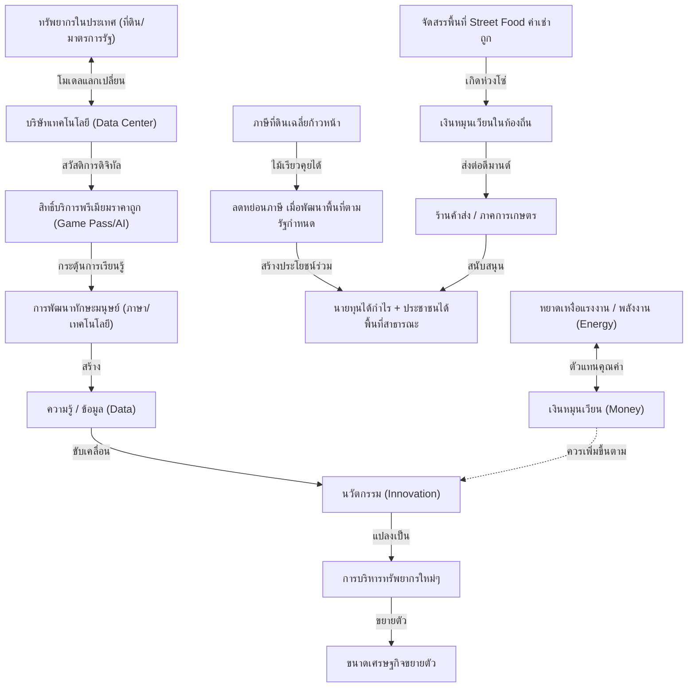

# กรอบคิดเศรษฐศาสตร์ฉบับ UET (UET Economics Framework)

กรอบคิดนี้เป็นการบูรณาการระหว่าง **ฟิสิกส์ (พลังงาน)**, **ทฤษฎีสารสนเทศ (Information Theory)**, **ภูมิรัฐศาสตร์** และ **การวิเคราะห์โครงสร้างสังคม** เพื่อรื้อถอนข้อจำกัดของเศรษฐศาสตร์กระแสหลัก และสร้างโมเดลการบริหารประเทศที่ยั่งยืน โดยแบ่งออกเป็น 4 เสาหลัก ดังนี้:

---

## 🗺️ แผนภาพองค์รวม (System Map)

---

## 1. ⚡ รากเหง้าของความมั่งคั่ง: ข้อมูล พลังงาน และการเงิน (The Origin of Wealth)

*   **อุตสาหกรรมแรกของมนุษยชาติคือ "การทำฟืนและการเผาป่า":** 
    *   ปฏิเสธตำราเดิมที่บอกว่าการล่าสัตว์หรือเกษตรกรรมคืออุตสาหกรรมแรก 
    *   มนุษย์เริ่มต้นจากการควบคุมไฟป่าตามธรรมชาติ ➡️ เลียนแบบการเผาป่าเพื่อเคลียร์หน้าดินและสร้างกองฟืน ➡️ เกิดการจัดสรรแรงงานและการแบ่งงานกันทำ (Logistics & Supply Chain แรกของโลก)
*   **ทฤษฎีข้อมูลและพลังงาน (Thermoeconomics):**
    *   **ความรู้ = จุดเริ่มต้นของเศรษฐกิจ:** เศรษฐกิจไม่ได้เกิดจากการค้าขาย แต่เกิดจากการมีข้อมูล (Data) ที่นำไปสู่การลองผิดลองถูกจนเกิดนวัตกรรม (Innovation)
    *   **เงิน = ตัวแทนของพลังงาน (Money as Energy):** ในระบบซับซ้อน (Complex System) ที่เราไม่สามารถแลกเปลี่ยนแรงงานกันตรงๆ ได้ "เงิน" จึงทำหน้าที่เป็นตัวกลางสะท้อนพลังงานที่มนุษย์ได้ลงแรงไป (ชั่วโมงบินของพฤติกรรมในระบบ)
*   **ข้อผิดพลาดของระบบการเงินปัจจุบัน:**
    *   ในความเป็นจริง เงินควรเพิ่มขึ้นในระบบตามความก้าวหน้าทางความรู้/นวัตกรรมที่สามารถนำทรัพยากรใหม่ๆ มาใช้ได้
    *   แต่ระบบปัจจุบัน เงินเพิ่มขึ้นผ่าน **"การกู้ยืม (หนี้)"** ซึ่งเป็นการยืมพลังงานในอนาคตมาใช้ เมื่อเกิดการปฏิวัติทางเทคโนโลยีครั้งใหญ่ (เช่น ยุค Einstein หรือยุค AI) ปริมาณเงิน in system จึงไม่พอต่อมูลค่าทรัพยากรที่ขยายตัว จนรัฐต้องพิมพ์เงิน Fiat ที่ไร้พลังงานค้ำประกันออกมา นำไปสู่วิกฤตเงินเฟ้อและเงินฝืด
    *   *Bitcoin* ทำหน้าที่เป็นทองคำดิจิทัล (Store of Value) ที่จำกัดตัวมันเองด้วยพลังงาน (Proof of Work) แต่แข็งทื่อเกินไปที่จะเป็นเงินหมุนเวียน (Currency) ที่ต้องยืดหยุ่นตามความรู้ที่เพิ่มขึ้น

---

## 2. 🏡 การปฏิรูปที่ดินและระบบภาษีแบบ "ไม้เรียวเจรจา" (Land Value Tax & Incentive Model)

*   **ปัญหาการผูกขาดที่ดิน:** ที่ดินเป็นทรัพยากรที่มีจำกัดและเป็นโครงสร้างพื้นฐานของทุกกิจกรรมทางเศรษฐกิจ การปล่อยให้เก็งกำไรและผูกขาดทำให้เกิดความเหลื่อมล้ำรุนแรง
*   **ภาษีที่ดินเฉลี่ยขั้นก้าวหน้า (Progressive Average Land Tax):**
    *   คำนวณอัตราภาษีจากปริมาณการถือครองที่ดินเปรียบเทียบกับ "ค่าเฉลี่ยของคนทั้งประเทศ" ใครถือครองมากกว่าค่าเฉลี่ยมากๆ จะต้องเสียภาษีในอัตราก้าวหน้า
*   **กลไก "ไม้เรียวที่คุยกันได้" (Incentive-Based Carrot & Stick):**
    *   เป้าหมายไม่ใช่การยึดทรัพย์สินของนายทุน แต่เป็นการใช้ภาษีเป็นแต้มต่อในการเจรจา (ไม้เรียว)
    *   หากนายทุนมีที่ดินรกร้างขนาดใหญ่และไม่อยากเสียภาษีมหาศาล รัฐจะเสนอ **"มาตรการลดหย่อนภาษี"** แลกกับการที่นายทุนต้องพัฒนาที่ดินนั้นตามผังเมืองหรือทิศทางที่รัฐกำหนด (เช่น เปลี่ยนสวนกล้วยเลี่ยงภาษี ให้กลายเป็นตลาดชุมชน หรือพื้นที่สาธารณะ)
    *   **ผลลัพธ์ Win-Win:** นายทุนยังคงเป็นเจ้าของและได้กำไรจากกิจการนั้น ประชาชนมีพื้นที่ทำกินและพื้นที่สาธารณะใกล้บ้าน และรัฐสามารถจัดสรรทรัพยากรที่ดินให้เกิดประสิทธิภาพสูงสุดได้โดยไม่ต้องใช้กำลังบังคับ

---

## 3. 🤝 โมเดลการแลกเปลี่ยนทรัพยากรเพื่อแลกเทคโนโลยี (Resource-Tech Exchange Model)

*   **วิพากษ์นโยบายแจกเงิน (Handouts vs. Ecosystem):**
    *   นโยบายประเภทแจกเงินสด (เช่น ด็จิทัลวอลเล็ต) หรือการอุดหนุนแบบซื้อสิทธิ์ซอฟต์แวร์ผ่านบริษัทตัวกลาง (เช่น โครงการ TH-AI Passport 1,600 ล้านบาท) เป็นการตำน้ำพริกละลายแม่น้ำ เพราะเงินสุดท้ายจะไหลกลับไปสู่กระเป๋านายทุนใหญ่หรือตัวกลาง โดยไม่เกิดการพัฒนาทักษะหรือโครงสร้างพื้นฐานที่ยั่งยืน
*   **พันธมิตรเชิงยุทธศาสตร์ระดับโลก (Direct Tech Partnership):**
    *   รัฐบาลควรเจรจาโดยตรงกับผู้ให้บริการระดับโลก (เช่น Microsoft, Google, Nvidia) 
    *   **ข้อตกลง:** รัฐเอื้ออำนวยความสะดวกในเรื่องทรัพยากรที่ดิน โครงสร้างพื้นฐาน และพลังงานราคาถูก เพื่อดึงดูดให้เข้ามาตั้ง **Data Center** ในไทย 
    *   **สิ่งที่ประเทศได้รับกลับมา:** แลกเปลี่ยนเป็นสิทธิ์การเข้าถึงซอฟต์แวร์และบริการระดับพรีเมียมในราคาถูกหรือฟรีให้กับประชาชน (สวัสดิการดิจิทัล) เช่น สิทธิ์การใช้งาน AI Premium, Xbox Game Pass เป็นต้น
*   **วงจรการเรียนรู้แบบธรรมชาติ (Natural Learning Cycle):**
    *   เมื่อเด็กไทยสามารถเข้าถึงเกมคุณภาพสูง (เช่น City Skylines ที่ฝึกกระบวนการคิดและวางแผน) ในราคาถูก ➡️ เด็กจะเกิดความต้องการเล่น ➡️ เกมคุณภาพมักเป็นภาษาอังกฤษ ➡️ เด็กจะใช้ AI (ChatGPT/Claude) เป็นตัวช่วยเรียนรู้ภาษาและวิธีเล่นไปโดยปริยาย ➡️ เกิดการพัฒนาทักษะโดยธรรมชาติและสร้างคนรุ่นใหม่ที่มีคุณภาพสูงเพื่อพัฒนาอุตสาหกรรมในประเทศ

---

## 4. 🍜 สวัสดิการและเศรษฐกิจท้องถิ่นตามวัฒนธรรม (Cultural Street-Food Welfare)

*   **สวัสดิการที่สอดคล้องกับวิถีชีวิต:** นโยบายรัฐควรล้อไปกับจุดแข็งทางวัฒนธรรมของประชาชน เช่น วัฒนธรรม Street Food และร้านค้าปลีกรายย่อยริมทาง
*   **โครงสร้างพื้นฐานเพื่อผู้ประกอบการรายย่อย:**
    *   แทนที่จะแจกเงิน ให้รัฐลงทุนใน **"พื้นที่ค้าขายที่ได้มาตรฐาน สะอาด และราคาถูก"** ในทำเลทองที่มีประชากรหนาแน่นแต่ไม่มีที่จอดรถ (เช่น ใกล้สถานศึกษา ตึกร้างที่ไม่ได้ใช้งาน หรือริมทางสาธารณะที่จัดระเบียบใหม่)
*   **กลไกการหมุนเวียนของเงิน (Velocity of Money):**
    *   การเปิดพื้นที่ให้คนทั่วไปเข้ามาค้าขายได้ง่ายในราคาค่าเช่าต่ำ จะสร้างงานและอาชีพที่ยั่งยืน
    *   ผู้ค้ารายย่อยเหล่านี้จะไปซื้อวัตถุดิบจากภาคการเกษตรหรือค้าส่งขนาดใหญ่ (เช่น แม็คโคร/ตลาดสด) เกิดเป็นห่วงโซ่ทางเศรษฐกิจที่แท้จริง เงินจะหมุนเวียนหลายรอบในระบบฐานรากก่อนที่จะไหลกลับสู่ระบบใหญ่ ต่างจากการแจกเงินสดที่เงินจะไหลตรงสู่ทุนใหญ่ทันที
