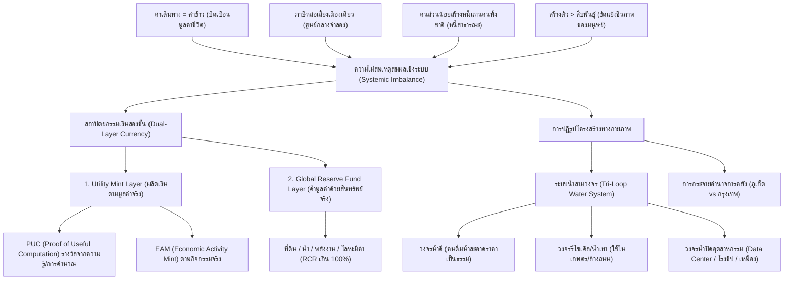

# การสังเคราะห์แนวคิดเศรษฐศาสตร์และระบบไม่สมดุล UET (UET Historical Economic & Systemic Theories Synthesis)

เอกสารฉบับนี้เป็นการรวบรวม วิเคราะห์ และเรียบเรียงแนวคิดเชิงทฤษฎีเศรษฐศาสตร์ ระบบการเงิน และโครงสร้างพื้นฐานจากคลังเอกสารประวัติศาสตร์ใน `uet_history/theory/` (ตั้งแต่เวอร์ชันเก่าที่สุด V0.1 จนถึง V0.6 และเอกสารวิเคราะห์รายหัวข้อ) เพื่อจัดเก็บไว้เป็นแหล่งข้อมูลถาวรในคลังความคิด (`uet_history/documents/Economics/`)

---

## 🗺️ แผนภาพความเชื่อมโยงระบบ (Systemic Integration Map)

---

## 1. ⚠️ วิกฤตความไม่สมเหตุสมผลเชิงระบบ (Systemic Imbalance & The 4 Core Questions)

จากการสืบค้นคลังความคิด พบการตั้งคำถามและวิเคราะห์ปัญหาเชิงลึก 4 ข้อหลัก ซึ่งแสดงถึงความไม่สมเหตุสมผลของระบบเศรษฐกิจและสังคมในปัจจุบันเมื่อเทียบกับชีวภาพและธรรมชาติของชีวิตมนุษย์:

### 🚌 คำถามที่ 1: "ทำไมค่ารถในชีวิตประจำวันถึงเท่ากับค่าข้าว แต่เรายังรู้สึกว่ามันปกติ?"
* **มิติปัญหา:** การบิดเบือนมูลค่าของพลังงานในการหล่อเลี้ยงชีวิต (Biological Input) เทียบกับพลังงานในการรับใช้ระบบ (Mechanical Output)
* **การวิเคราะห์เชิงลึก:** 
  * ในแง่ชีวภาพ "ข้าว" คือสิ่งจำเป็นที่สุดในการประคับประคองชีวิตและเซลล์ร่างกาย แต่ระบบปัจจุบันกลับบีบให้ "ค่าเดินทางเพื่อไปทำงาน" (การเอาแรงงานไปป้อนเข้าระบบทุน) มีราคาสูงเท่ากับหรือมากกว่าอาหาร 1 มื้อ 
  * ระบบกรรโชกพลังงานและเวลาจากมนุษย์มากกว่าการหล่อเลี้ยงตัวตน คนรู้สึกปกติเพราะสภาวะจำยอมทางพฤติกรรม (Normative Conditioning) และโครงสร้างผังเมืองที่แยกแหล่งงานออกจากแหล่งที่อยู่อาศัยอย่างไร้ทิศทาง

### 🏙️ คำถามที่ 2: "ทำไมคนทั้งประเทศจ่ายภาษีเพื่อให้เมืองเดียวเจริญ โดยไม่มีสิทธิเลือก?"
* **มิติปัญหา:** ความเหลื่อมล้ำในการคลังและการกระจายอำนาจ (Centralized Fiscal Model vs Local GPP)
* **การวิเคราะห์เชิงลึก:**
  * รัฐรวมศูนย์ (Unitary State) ดึงทรัพยากรภาษีจากทุกจังหวัดไปพัฒนาส่วนกลาง (กรุงเทพฯ) เพื่อสร้างภาพลักษณ์ความเจริญเชิงสัญลักษณ์ แต่ทำให้ท้องถิ่นขาดแคลนงบประมาณในการสร้างระบบขนส่งและสวัสดิการพื้นฐานของตนเอง 
  * ท้องถิ่นไม่มีสิทธิเลือกว่าจะใช้เงินภาษีของตัวเองพัฒนาอะไร (เช่น ภูเก็ตสร้างรายได้ท่องเที่ยวถึง 500,000 ล้านบาทต่อปี แต่ได้รับงบประมาณท้องถิ่นเพียง 1,000 - 2,000 ล้านบาท)

### 🧑‍⚖️ คำถามที่ 3: "ทำไมคนแค่ไม่กี่ร้อยคนถึงสามารถใช้ภาษีและสร้างหนี้แทนประชาชนทั้งหมดได้?"
* **มิติปัญหา:** ความเหลื่อมล้ำในเจตจำนงและการกู้ยืมในอนาคต (Representative Oligarchy and Public Debt)
* **การวิเคราะห์เชิงลึก:** 
  * ระบบประชาธิปไตยแบบตัวแทน (Representative Democracy) มอบสิทธิ์ขาดให้ผู้ปกครองหรือนักการเมืองเพียงไม่กี่ร้อยคนกู้เงินและสร้างหนี้สาธารณะ (Public Debt) ผูกพันระยะยาวได้ตามใจชอบ โดยที่คนรุ่นถัดไปที่ต้องใช้หนี้ไม่มีสิทธิ์ร่วมตัดสินใจ
  * ถือเป็นการขโมยเครดิตและพลังงานในอนาคตของเยาวชนและสังคมมาบริโภคในปัจจุบันอย่างไร้วินัย

### 🧬 คำถามที่ 4: "ทำไมสังคมถึงให้ความสำคัญกับ 'การสร้างตัว' มากกว่าการดำรงเผ่าพันธุ์ ซึ่งเป็นธรรมชาติของร่างกายเรา?"
* **มิติปัญหา:** ความขัดแย้งเชิงโครงสร้างระหว่างระบบสะสมทุนและชีววิทยาของมนุษย์ (Capitalism vs Biological Reproduction)
* **การวิเคราะห์เชิงลึก:**
  * วัยเจริญพันธุ์ทางชีวภาพของมนุษย์ที่ร่างกายแข็งแรงที่สุดคือช่วงอายุ 18-28 ปี แต่วัยทำงานและการสร้างตัวในระบบทุนนิยมบีบให้ต้องทุ่มเทเวลาและพลังงานทั้งหมดในช่วงอายุ 22-35 ปีเพื่อความอยู่รอดทางการเงิน 
  * ระบบบีบให้มนุษย์เลื่อนการมีบุตรออกไปจนสายเกินควร การมีบุตรกลายเป็น "หนี้สินส่วนบุคคล" (Individual Burden) มากกว่าเป็น "การส่งต่อเผ่าพันธุ์ของสังคม" (Collective Continuation) นำไปสู่วิกฤตสุขภาพจิต ภาวะหมดไฟ (Burnout) และปัญหาสังคมผู้สูงวัยขั้นวิกฤต

---

## 2. 🪙 สถาปัตยกรรมทางการเงินสองชั้น (Dual-Layer Monetary Architecture)

เพื่อแก้ไขปัญหาเงิน Fiat ที่ไร้วินัยและถูกพิมพ์ขึ้นมาอย่างไม่มีสินทรัพย์ค้ำประกันจนเกิดเงินเฟ้อรุนแรง UET เสนอระบบการเงินใหม่ดังนี้:

### 2.1 แยก "กลไกผลิตหน่วยเงิน" ออกจาก "กลไกรักษามูลค่า"
* **การเข้าใช้งาน 2 ทาง (Dual-Path Entry):**
  1. **Compute Path (เส้นทางความรู้):** ได้รับเหรียญเป็นผลตอบแทนจากการขุดด้วย **Proof of Useful Computation (PUC)** (เช่น งานคำนวณจำลองโมเลกุลยา, การเพิ่มประสิทธิภาพระบบโลจิสติกส์, การวิจัย AI) ไม่ใช่การสุ่มบล็อกแบบไร้ประโยชน์
  2. **Market Path (เส้นทางตลาด):** คนทั่วไปได้เงินจากการขายสินค้า บริการ หรือแลกเปลี่ยนตามกลไกตลาดปกติ โดยไม่ต้องขุดเครื่องคอมพิวเตอร์เอง

### 2.2 โครงสร้างสถาปัตยกรรม 2 ชั้น
1. **Utility Mint Layer (ชั้นผลิตหน่วยเงิน):** ผลิตหน่วยเงินตามกิจกรรม 3 ด้าน คือ PUC, กิจกรรมเศรษฐกิจจริง (Economic Activity Mint - EAM), และการออกเงินสำรองของคลัง (Treasury Release) โดยมีกฎปรับลดอัตราการออก (Throttle Rule) อัตโนมัติเมื่อค่าเงินเฟ้อเกินกรอบ
2. **Global Reserve Fund Layer (ชั้นค้ำมูลค่า):** ตั้งกองทุนโลกเพื่อสำรองสินทรัพย์ที่มีมูลค่าจริงทางกายภาพ (Real Assets) เช่น สิทธิการเช่าที่ดินระยะยาว พลังงานสะอาด แหล่งน้ำดิบ และโลหะมีค่า โดยต้องรักษาอัตราส่วนสำรอง (Reserve Coverage Ratio - RCR) ให้สอดคล้องกันเสมอ เพื่อรักษามูลค่าเงินไม่ให้แกว่งผันผวน

---

## 3. 💧 โมเดลระบบน้ำสามวงจรและผังเมืองน้ำ (Tri-Loop Water System & Canal Grid)

UET มองว่าระบบเศรษฐกิจและผังเมืองแบบตะวันตก (เมืองแห้ง คอนกรีต ถนน) ไม่เหมาะสมกับภูมิประเทศของไทยซึ่งเป็น "ดินแดนน้ำ" จึงเสนอโมเดลบริหารทรัพยากรและผังเมืองใหม่:

### 3.1 ระบบน้ำสามวงจร (Tri-Loop Water System)
* **วงจรที่ 1: น้ำดีสำหรับประชาชน (Human Clean Water Loop)** 
  * ท่อน้ำดีคุณภาพสูงสำหรับดื่มและชำระล้าง ส่งถึงประชาชนในราคาที่เป็นธรรมเพื่อคุณภาพชีวิตขั้นพื้นฐาน
* **วงจรที่ 2: น้ำรีไซเคิล / น้ำเทา (Grey & Reclaimed Water Loop)**
  * บำบัดน้ำเสียชุมชนให้อยู่ในเกณฑ์สะอาดพอใช้ แล้วแยกท่อส่งให้เกษตรกรรม ล้างถนน หรือรดน้ำต้นไม้เพื่อลดการใช้น้ำดีโดยเปล่าประโยชน์
* **วงจรที่ 3: น้ำอุตสาหกรรมแบบปิด (Industrial Closed Water Loop)**
  * ออกแบบระบบแยกเฉพาะสำหรับอุตสาหกรรมที่ใช้น้ำมากและมีสารปนเปื้อนสูง (เหมืองแร่, โรงชิป, Data Center) บำบัดและหมุนเวียน 100% ภายในโซนอุตสาหกรรม โดยไม่ปะปนกับแหล่งน้ำธรรมชาติและชุมชน

### 3.2 ผังเมืองคลอง (Canal Grid)
* เปลี่ยนแนวคิดจาก "คลองระบายน้ำเสีย" ให้กลับมาเป็น "โครงสร้างหลักของเมือง" (Canal-Based Urbanism) ใช้เป็นโครงข่ายสัญจรทางเรือ กรองน้ำตามธรรมชาติ และพื้นที่แก้มลิงรับน้ำแบบยืดหยุ่น (Resilient Urbanism) ที่ทำให้เมืองดำเนินกิจกรรมเศรษฐกิจต่อไปได้แม้ในช่วงฤดูน้ำหลาก

---

## 4. 🧠 กรอบคิดด้านปรัชญาและสัจธรรม (Foundational Philosophy & Choice Logic)

จากการสืบค้นโครงร่าง V0.1 - V0.3 พบรากฐานปรัชญาที่เป็นต้นกำเนิดของโครงสร้างเศรษฐกิจสมดุล:

* **การบูรณาการแบบจำลองเอกภาพ (5U/5UF):**
  * `[องค์ประกอบ / Element] → [เงื่อนไข / Condition] → [ปัจจัย / Factor] → [เหตุ / Cause] → [เจตจำนง / Will] → [ผลลัพธ์ / Result]`
  * ทุกการวิเคราะห์ระบบ (เช่น ทุนนิยม) ต้องเริ่มต้นจากการตรวจสอบความสอดคล้องขององค์ประกอบทางกายภาพและเงื่อนไขทางสังคมก่อนเสมอ เพื่อดูว่าเจตจำนงนั้นแท้จริงหรือเป็นเจตจำนงลวงตาที่ถูกระบบบีบให้กระทำ
* **กระบวนการเลือกและค่าเสียโอกาสของเวลา (Necessity-to-Choose Process):**
  * `คุณสมบัติ (Property) → ศักยภาพ (Potential) → ความจำเป็น (Necessity) → ผลลัพธ์ (Outcome) → การเลือก (Selection) → ผลกระทบ (Impact) → ความจำเป็นต่อสิ่งอื่น`
  * ทุกการตัดสินใจในทางเศรษฐกิจคือ "การเลือกที่ระบบบีบให้เลือก" ซึ่งส่งผลกระทบ 2 ด้านเสมอ คือ **คุณค่า (Value)** และ **ความขัดแย้ง (Conflict)**
  * ทุกการเปิด 1 โอกาส คือการปิดโอกาสอื่นอีกนับไม่ถ้วน (Opportunity Cost) และนี่คือกลไกทางฟิสิกส์ข้อมูลที่ผลักดันให้เวลาเคลื่อนที่ไปข้างหน้าโดยไม่สามารถย้อนกลับได้

---

## 5. 🧑‍💻 บทบาทของระบบควบคุม SC (System Core / Santa Claus)

* **นิยาม:** **SC (Software and Network Technology, Artificial Intelligence Center, Unity Server)**
* **บทบาทในระบบเศรษฐกิจ:**
  * ทำหน้าที่เป็นระบบหลังบ้านที่เป็นกลางและโปร่งใสในการประมวลผลข้อมูล บันทึกข้อมูลการเช่าที่ดิน ทรัพยากร และธุรกรรมต่างๆ บนเทคโนโลยีบล็อกเชน
  * ประสานงานระหว่างผู้เชี่ยวชาญเทคโนโลยี (Technocracy) และการมีส่วนร่วมของประชาชน (Public Participation) ในการประเมินความต้องการทรัพยากรของภาคอุตสาหกรรมและสนับสนุนธุรกิจขนาดเล็ก (SMEs) โดยปราศจากการครอบงำของนักการเมืองหรือทุนผูกขาด
