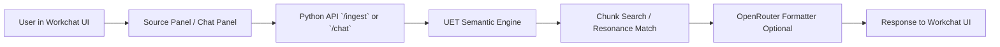
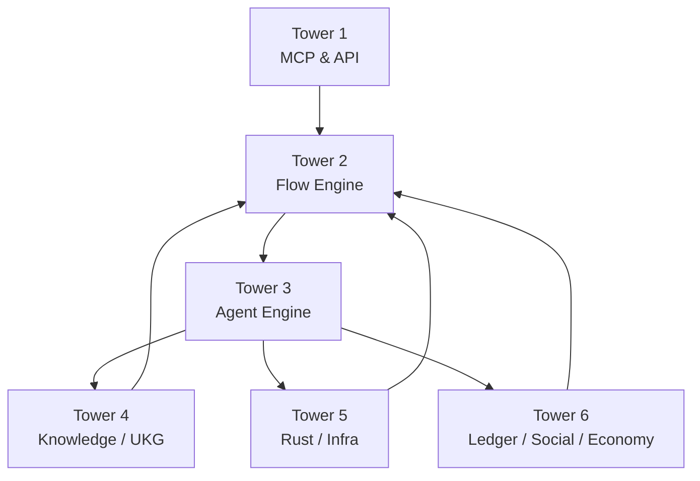
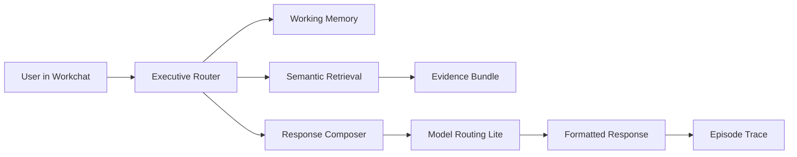

# UET v5.0 — Latest Platform Flow v1

> **Related:** [[03__AGENT_ENGINE_v5.0_SPEC]] · [[04__RAG_ENGINE_v5.0_SPEC]] · [[05__FLOW_AND_EVENT_v5.0_SPINE]] · [[06__MODEL_ROUTING_v5.0_OPTIMIZER]] · [[26__IMPLEMENTATION_GAP_MATRIX_v1]]

This document shows the latest end-to-end platform flow in a human-readable form, bridging the current implementation with the target v5.0 architecture.

---

## 1. Purpose
- Make the latest platform flow understandable without reading old `ruins` documents.
- Show how the 6 Towers interact during a real request.
- Clarify the difference between the **current local path** and the **target v5.0 path**.

---

## 2. Current Local Flow

### Current Characteristics
- Fast to iterate locally.
- Minimal dependency surface.
- Useful for prototype validation.
- Not yet aligned with full v5.0 orchestration, sync, and audit requirements.

---

## 3. Target v5.0 Request Lifecycle

```mermaid
flowchart LR
    A[User / Agent Action] --> B[Flow Control]
    B --> C[Task Classification]
    C --> D[Model Routing]
    D --> E[RAG Retrieval]
    E --> F[Agent Engine]
    F --> G[Tool Execution]
    G --> H[State Sync / Event Bus]
    H --> I[Audit / Ledger]
    I --> J[UI / API Response]
```

### Step Meaning
- **Flow Control**: validates input, permissions, system state, and safety.
- **Task Classification**: chooses fast, deep, creative, or axiomatic depth.
- **Model Routing**: allocates the best model tier for the task.
- **RAG Retrieval**: produces a version-safe `EvidenceSet`.
- **Agent Engine**: plans, executes, reflects, and synthesizes.
- **Tool Execution**: calls `uet_core`, APIs, file tools, or sub-agents.
- **State Sync / Event Bus**: updates caches, versions, and subscribers.
- **Audit / Ledger**: stores traceability and proof-of-useful-work outcomes.

---

## 4. Tower Interaction Map

### Reading the Diagram
- Tower 2 is the system governor.
- Tower 3 is the reasoning core.
- Tower 4 supplies evidence.
- Tower 5 supplies performance and durable services.
- Tower 6 records outcomes and social/economic consequences.

---

## 5. Current vs Target Path

| Layer | Current Local Path | Target v5.0 Path |
|---|---|---|
| Experience | `uet_web` Workchat | `uet_web` + MCP/API surfaces + optional LibreChat shell |
| Flow Control | Minimal UI-side flow | Dedicated Flow Control validation layers |
| Reasoning | Python semantic engine | Planner-Executor-Reflector multi-agent engine |
| Retrieval | Simple chunk overlap / resonance | Version-safe vector + graph evidence retrieval |
| Routing | Fixed OpenRouter formatting call | Explicit model routing engine with tiers and fallback |
| Sync | Local file persistence | Knowledge Sync + Event Bus + registry versioning |
| Audit | Limited local trace | Execution trace + ledger-backed audit |

---

## 6. Recommended Near-Term Flow

### Why This Intermediate Flow
- Preserves the working prototype.
- Adds architecture discipline without building the entire v5.0 stack at once.
- Creates a clean path toward Flow, RAG, and Agent separation.

---

## 7. Implementation Interpretation
- The **current stable local entry point** is still the Python API path.
- The **target production path** should move toward Flow Control -> RAG -> Agent -> Sync/Audit.
- The **next documentation and implementation round** should focus on the intermediate flow shown above.
