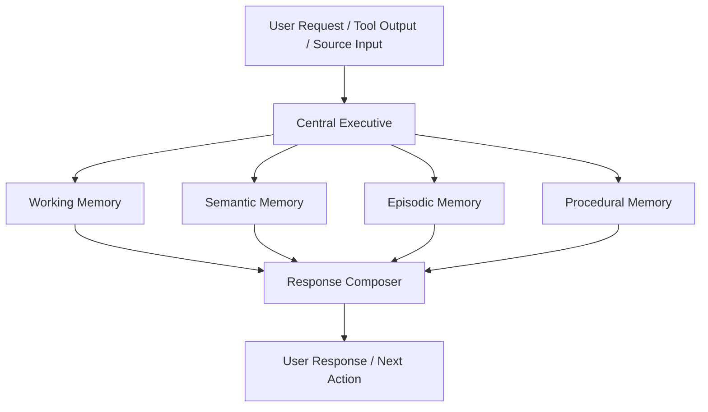
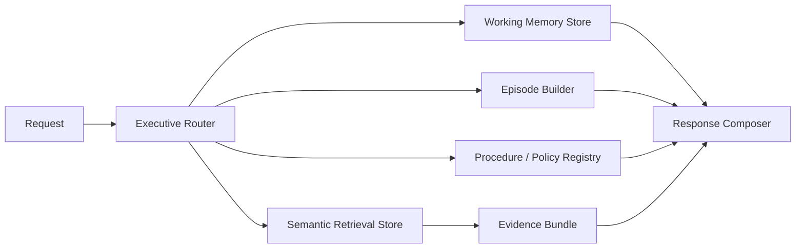

# UET v5.0 — AI Agent Memory Architecture v1

This document defines the practical memory architecture for UET agents by combining the v5.0 platform specs with a cognitively inspired separation of memory responsibilities.

---

## 1. Purpose
- Give the Agent Engine a readable memory model.
- Prevent "one giant context blob" architecture.
- Connect cognitive ideas to actual platform components.
- Create an implementation path that fits current project reality.

---

## 2. Core Principle
The platform should separate memory into **working**, **semantic**, **episodic**, and **procedural** layers, coordinated by a central executive.

---

## 3. The Memory Stack

---

## 4. Memory Types

### 4.1 Central Executive
The control layer that decides:
- what the task is,
- which memory to access,
- which tool or model to invoke,
- when to stop, retry, or escalate.

### 4.2 Working Memory
The active task context.

**Examples**
- recent chat turns,
- current source selection,
- temporary hypotheses,
- current task/subtask state.

**Desired properties**
- small,
- fast,
- aggressively pruned,
- session-scoped.

### 4.3 Semantic Memory
Long-term knowledge used for retrieval.

**Examples**
- UET documents,
- equations,
- research notes,
- structured topic/entity metadata,
- future vector + graph evidence.

**Desired properties**
- versioned,
- searchable,
- provenance-linked,
- scoped by project or domain.

### 4.4 Episodic Memory
Structured memory of what happened.

**Examples**
- session summaries,
- prior agent runs,
- tool call outcomes,
- reasoning checkpoints,
- user-specific task history.

**Desired properties**
- chronological,
- compressible,
- good for continuity,
- separated from semantic facts.

### 4.5 Procedural Memory
Memory of how the platform should operate.

**Examples**
- workflows,
- system contract rules,
- permission policies,
- routing heuristics,
- safe execution patterns.

**Desired properties**
- explicit,
- stable,
- auditable,
- not mixed with user content.

---

## 5. Mapping to v5.0 Components

| Memory Component | Closest v5.0 Engine | Role |
|---|---|---|
| Central Executive | Flow + Agent Engine | routing, planning, guardrails |
| Working Memory | Agent run/session state | active context and scratchpad |
| Semantic Memory | RAG + Knowledge Sync + Data Schema | retrievable knowledge base |
| Episodic Memory | Execution Trace + Ledger + session history | what happened over time |
| Procedural Memory | System Constitution + Coordination Rules + workflows | how the system should behave |

---

## 6. Mapping to Current Implementation

| Target Layer | Current State |
|---|---|
| Central Executive | Not explicit yet |
| Working Memory | Partial in UI state and request-local context |
| Semantic Memory | Partial in `uet_agents/semantic_engine.py` persistent chunks |
| Episodic Memory | Minimal, mostly chat history in UI |
| Procedural Memory | Implicit in docs and code paths, not executable |

---

## 7. Recommended Minimal Implementation

### Minimal Responsibilities
- **Executive Router**: classify task and select path.
- **Working Memory Store**: maintain active state for the request/session.
- **Semantic Retrieval Store**: retrieve domain knowledge.
- **Episode Builder**: create structured summaries after each run.
- **Procedure / Policy Registry**: expose allowed workflows and rules.

---

## 8. Long-Term UET Interpretation
The memory model can later absorb legacy UET concepts:
- **L0-L5 hierarchy** as semantic-memory metadata and retrieval structure.
- **Feedback / Rebalance** as an episodic-memory learning signal.
- **History kernels** as adjustable decay behavior across memory classes.

---

## 9. Design Rules
- Working memory must stay small and temporary.
- Semantic memory must require provenance and version awareness.
- Episodic memory must store outcomes, not raw endless transcripts.
- Procedural memory must be explicit and testable.
- The executive must decide which memory to use instead of dumping all memory into every prompt.

---

## 10. Next Implementation Hook
The next coding step should introduce a lightweight **Executive Router** in the AI backend and formal interfaces for the four memory classes before building a larger multi-agent graph.
