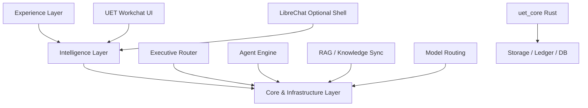
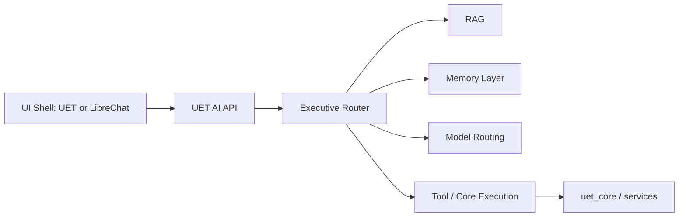

# UET v5.0 — Workchat and LibreChat Boundary v1

This document defines the recommended boundary between the current UET Workchat experience, a possible LibreChat adoption path, and the long-term UET intelligence backend.

---

## 1. Purpose
- Reuse mature open-source chat infrastructure where it saves time.
- Avoid coupling UET intelligence to a single UI shell.
- Clarify what belongs to UET product logic vs reusable chat infrastructure.

---

## 2. Boundary Principle
**LibreChat may be reused as a shell, but UET intelligence should remain a separate backend capability layer.**

---

## 3. The Three-Layer View

---

## 4. Recommended Responsibilities

### 4.1 UET Workchat
Keep UET-specific UX here:
- source panel,
- project context,
- physics-oriented workflows,
- research-studio experience,
- mining / proof-of-work presentation,
- UET-specific dashboard outputs.

### 4.2 LibreChat
Use only if it accelerates delivery for:
- mature chat shell,
- multi-provider model UX,
- agent/tool console,
- MCP-friendly interaction,
- reusable user-facing conversation patterns.

### 4.3 UET Intelligence Backend
Keep platform intelligence here:
- Executive Router,
- Agent Engine,
- RAG retrieval,
- Knowledge Sync,
- memory system,
- model routing policy,
- UET reasoning and proof logic.

---

## 5. Integration Options

| Option | Description | Benefit | Risk | Recommendation |
|---|---|---|---|---|
| A | Keep `uet_web` and borrow ideas only | low disruption | slower to gain mature features | good short-term |
| B | Run LibreChat as an additional shell against UET backend | fast experimentation | dual-UX complexity | best evaluation path |
| C | Replace Workchat with full LibreChat fork | fast feature inheritance | high migration cost and identity loss | not first move |

---

## 6. Recommended Path
**Recommendation: Option B**
- Keep `uet_web` as the active product UI.
- Design the UET AI backend as a clean service boundary.
- Evaluate LibreChat as a parallel shell or integration target.
- Only consider deeper adoption after backend contracts stabilize.

---

## 7. Current State

| Area | Current Reality |
|---|---|
| UET Workchat | implemented prototype |
| Python AI backend | working local semantic path |
| Rust API | partial bridge, still DB-sensitive |
| LibreChat integration | not started |
| Backend contract stability | not yet locked |

---

## 8. Desired Backend Contract Shape

### Service Direction
- UI shells should call stable APIs.
- The backend should own domain decisions.
- The shell should not own UET-specific reasoning rules.

---

## 9. Practical Decision Rule
Use LibreChat when the need is:
- multi-model chat UX,
- agent/tool console reuse,
- rapid interface maturity.

Use UET-native UI when the need is:
- source-to-equation workflows,
- project/lab context,
- UET-specific scientific interaction,
- custom dashboard and economic integration.

---

## 10. Implementation Consequence
The next implementation step should prioritize a **clean UET backend contract** before any large-scale UI migration. This preserves optionality while reducing rework.
