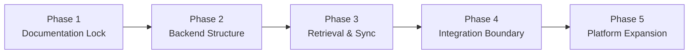

# UET v5.0 — Phased Execution Plan v1

This execution plan stages the next implementation work so the platform can evolve from the current prototype into a clearer v5.0-aligned architecture without unnecessary rework.

---

## 1. Phase Overview

---

## 2. Phase 1 — Documentation Lock
### Goal
Make the latest architecture understandable from `platform_specs` alone.

### Deliverables
- latest platform flow doc,
- AI agent memory architecture doc,
- Workchat / LibreChat boundary doc,
- implementation gap matrix,
- phased execution plan.

### Outcome
- shared vocabulary,
- reduced ambiguity,
- smaller token cost in future discussions.

---

## 3. Phase 2 — Backend Structure
### Goal
Introduce a minimal but explicit intelligence backend architecture.

### Focus
- Executive Router,
- memory interfaces,
- response composition pipeline,
- clearer task routing,
- better separation between retrieval and answer formatting.

### Target Result
The current Python semantic path becomes a cleaner intermediate backend instead of a one-file prototype.

---

## 4. Phase 3 — Retrieval & Knowledge Sync
### Goal
Upgrade ingest/retrieval from text storage to structured evidence management.

### Focus
- deterministic chunking strategy,
- metadata for source and version,
- semantic tagging,
- evidence bundle shaping,
- future graph-aware retrieval compatibility.

### Target Result
The backend can support a true RAG evolution path instead of plain overlap matching.

---

## 5. Phase 4 — Integration Boundary
### Goal
Stabilize system boundaries and reconnect broader services.

### Focus
- decide how LibreChat is used,
- stabilize the Rust reintegration path,
- define service contracts between UI shells and backend,
- prepare MCP-compatible exposure where useful.

### Target Result
UET gains a reusable intelligence service boundary independent of one UI implementation.

---

## 6. Phase 5 — Platform Expansion
### Goal
Move beyond prototype AI into wider platform capabilities.

### Focus
- audit / ledger integration,
- PoUW / PoE flows,
- room/social platform alignment,
- economic signals and dashboards,
- decentralized node scaling.

### Target Result
The AI stack becomes one coherent part of the full UET mega-platform.

---

## 7. Recommended Order of Execution

| Order | Work Item | Reason |
|---|---|---|
| 1 | Documentation lock | removes ambiguity first |
| 2 | Executive + memory layer | highest leverage backend cleanup |
| 3 | Retrieval + ingest upgrade | needed for serious reasoning quality |
| 4 | UI boundary decision | easier after backend contracts exist |
| 5 | Rust/core and platform expansion | safer once intermediate path is stable |

---

## 8. Immediate Next Coding Targets
- introduce an Executive Router in the AI backend,
- formalize memory-layer interfaces,
- refactor semantic engine into clearer responsibilities,
- preserve the currently working Workchat path during refactor.

---

## 9. Stop Conditions
A phase should pause if:
- the boundary between UI and backend becomes unclear,
- documentation and code start using conflicting terminology,
- a new dependency blocks local iteration more than it accelerates delivery.

---

## 10. Definition of Ready for Next Implementation Round
- docs in this folder explain the architecture clearly,
- the current-vs-target gap is explicit,
- the backend boundary is documented,
- the next coding tasks are small enough to implement safely.
